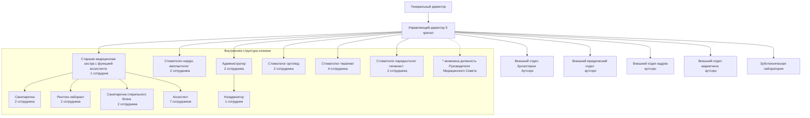

# Содержание:

## 1. Книга 7

### Глава 1. Кто есть директор
* **1.1.** Уровни управления клиникой
* **1.2** Определение
* **1.3.** ЦКП, ЦКР, Цель и задачи директора
* **1.4.** Структура типовой клиники и место директора в ней
* **1.5.** Профиль должности директора клиники

### Глава 2. Как директор работает с каждой из ключевых задач
* **2.1.** Должностная инструкция директора
* **2.2.** Ключевые задачи директора
* **2.3.** Карта рабочих процессов директора на день и на месяц

### Глава 3. Какие стандарты необходимо знать директору
* **3.1.** Что такое стандарты
* **3.2.** Оснащение рабочего места, информационная система управления
* **3.3.** Коммуникативные стандарты сотрудников клиники
* **3.4** Стандарты директора

### Глава 4. Как директор клиники управляет Валовой Выручкой
* **4.1.** Показатели эффективности клиники
* **4.2.** Планирование Валовой Выручки на месяц
* **4.3.** Планирование Валовой Выручки на год
* **4.4.** Инструмент Паук ВВ для выполнения плана по Валовой Выручке клиники
* **4.5.** Что делать при низкой загрузке доктора в рамках Паука ВВ
* **4.6.** Что делать при низком нормочасе доктора в рамках Паука ВВ
* **4.7.** Что делать при низком рабочем времени доктора в рамках Паука ВВ

### Глава 5. Как оценить эффективность директора клиники
* **5.1.** Отчеты директора
* **5.2.** Калькулятор директора

## 2. Книга 8

### Глава 1. Кто есть ассистент
* **1.1.** Определение
* **1.2.** Ценный Конечный Продукт, Цель и задачи ассистента

Глава 2. Как найти, выбрать и оценить кандидата на должность ассистента
2.1. Где искать ассистента
2.2. Профиль должности
2.3. Квалификационные требования

Глава 3. Как подготовить ассистента
3.1. Что должен знать ассистент
3.2. Должностная инструкция медицинской сестры (ассистента)
3.3. С какими документами необходимо ознакомить ассистента
3.4. Задачи ассистента на различных видах приемов

Глава 4. Алгоритмы работы ассистента на различных видах приемов
4.1. Применение средств индивидуальной защиты
4.2. Работа на терапевтическом приеме
4.3. Работа на ортопедическом приеме
4.4. Работа на хирургическом приеме

Глава 5. Какие стандарты необходимо знать ассистенту
5.1. Оснащение рабочего места
5.2. Карта рабочего дня
5.3. Стандарт внешнего вида ассистента
5.4. Стандарт приглашения Пациента на прием
5.5. Стандарт общения и поведения во время приема
5.6. Стандарт поведения после приема

Глава 6. Что делает ассистент помимо работы с доктором на приеме
6.1. Какую медицинскую документацию должен знать и вести ассистент, какие журналы и отчеты необходимо заполнять
6.2. Какие виды уборки проводит ассистент
6.3. Как правильно утилизировать отходы

Глава 7. Как оценить эффективность ассистента
7.1. Показатели эффективности ассистента
7.2. Порядок оценки по разрядам

## 2. Книга 9

Глава 1. Кто есть финансовый менеджер
1.1. Определение
1.2. Цель, ЦКП, ЦКР и задачи финансового менеджера

Глава 2. Как найти, выбрать и оценить кандидата на должность финансового менеджера
2.1. Кто может быть финансовым менеджером
2.2. Где искать финансового менеджера
2.3. Профиль должности

2.4. Инструменты для подбора кандидата на должность финансового менеджера

# Глава 3. Как подготовить финансового менеджера
3.1. Что должен знать финансовый менеджер
3.2. Должностная инструкция финансового менеджера
3.3. 6 правил финансового менеджера

# Глава 4. Глоссарий статистики – все, что нужно знать о статистике стоматологической клиники
4.1. Определения, связанные со статистикой
4.2. Определения, связанные с Пациентами
4.3. Определения, связанные с приемами
4.4. Определения, связанные с доходом
4.5. Определения, связанные с временем
4.6. Определения, связанные с расходной частью
4.7. Определения, связанные с конверсией

# Глава 5. Система сбалансированных показателей стоматологической клиники
5.1. Что есть ССП
5.2. История ССП
5.3. Каковы цель и задачи ССП
5.4. Как ССП работает в клинике

# Глава 6. Отчеты для собственника стоматологической клиники
6.1. Отчет «Финансовая модель статистики_БАЗОВАЯ»
6.2. Отчет «Модель планирования дохода с ССП»
6.3. Отчет «Модель бюджета доходов и расходов» - 3 версии план ПиУ, факт ПиУ, факт ДДС
6.4. Отчет «Бюджет доходов и расходов план-факт»
6.5. Отчет «Платежный календарь»

# Глава 7. Отчеты для директора стоматологической клиник
7.1. Отчет «ВВ в ПиУ и ДДС»
7.2. Отчет «Личные показатели работы врачей»
7.3. Отчет «Количество первичных консультаций»

# Глава 8. Матрица отчетов – карта задач финансового менеджера
8.1. Карта задач финансового менеджера
8.2. Классификатор показателей

# Глава 9. Как оценить эффективности финансового менеджера
9.1. Показатели эффективности
9.2. Калькулятор финансового менеджера

# Глава 1. Кто есть директор

## 1.1. Уровни управления клиникой

**Директор-координатор**
Обеспечивает выполнение плана по валовой выручке от завершенных комплексных планов (бюджет доходов)

**Управляющий-директор**
Определяет и обеспечивает выполнение плана по валовой выручке (бюджет доходов)

**Исполнительный директор**
Обеспечивает выполнение плана по прибыли (бюджет доходов и расходов)

Должность координатора описана в Книге «Координатор клиники: практика внедрения службы персональных менеджеров».
**В рамках данной Книги мы рассматриваем уровень «Управляющий директор».** Он занимается обеспечением выполнения бюджета доходов клиники. Основной показатель результата деятельности – это Валовая Выручка.

Разница между уровнями управления клиникой заключается в разнице ключевых функций.

**Директор-координатор**
**Ф1** Составление расписания и управление персоналом согласно полученному бюджету доходов.
**Ф2** Подписание и ведение планов лечения с ключевыми Пациентами.

**Управляющий-директор**
**Ф1** Составление бюджета доходов.
**Ф2** Планирование и управление человеческим ресурсом для исполнения бюджета.
**Ф3** Планирование и управление клиентским ресурсом для исполнения бюджета.

**Исполнительный директор**
**Ф1** Составление и исполнение бюджета доходов и расходов.
**Ф2** Управление доходами (те же функции, что и у Управляющего).
**Ф3** Управление расходами на материалы, привлечение и удержание Пациентов и административно-хозяйственные расходы.

### 1. 2 Определение – кто есть директор клиники
**Директор клиники –**
это результативный руководитель, который отвечает за планирование и управление с целью создания **прибыльной клиники**, которая выполняет и перевыполняет план по **валовой выручке**, сотрудники которой эффективны, привержены компании и мотивированы на результат, Пациенты которой лояльны и рекомендуют.

### 1. 3 ЦКП, ЦКР, Цель, задачи

**Цель** = то, к чему стремится сотрудник в своей работе.
**Цель директора** – прибыльная клиника, которая выполняет и перевыполняет план по валовой выручке, эффективны, привержены мотивированы на которой лояльны и рекомендуют.

**Ценный Конечный Продукт (ЦКП)** = то, что сотрудник производит единица.
**Ценный конечный директора** – стоматологические услуги, стандарту клиники с экономической выгодой так, чтобы Пациенты рекомендовали, а сотрудники были лояльны.

**Ценный Конечный Результат (ЦКР)** – это показатели в цифрах, по которым оценивается, достигнута ли цель и произведен ли ЦКП.
Для них мы выделили целую главу в Книге.
**Главный показатель Конечного Результата директора** – выполнение плана по Валовой Выручке.

**Задачи для достижения Цели**
1. Создавать условия для выполнения и перевыполнения плана по валовой выручке (*максимальная концентрация на данной задаче*).
2. Укомплектовать штат клиники сотрудниками в нужном количестве. Обучить, стажировать, адаптировать и создать позитивную атмосферу для работы, ориентировать на результат (*заполнить кресла докторами*).

3. Обеспечивать регулярные потоки первичных Пациентов, постоянных Пациентов, Пациентов по рекомендации, а также укреплять лояльность, мотивировать Пациентов согласовывать и завершать планы лечения (*загрузить время докторов Пациентами*).
4. Описать бизнес-процессы, сделать их доступными для сотрудников (например, стандарты), мотивировать сотрудников выполнять стандарты, обеспечить качество лечения и сервиса в клинике.

## Структура типовой клиники и место директора в ней

Рассмотрим типовую клинику.
Мы рекомендуем опираться на наиболее результативную схему – 5:2 (пять кресел : два имплантолога).

Одному имплантологу в среднем нужны: 1 ортопед, 2 терапевта, 1 гигиенист. **Итого: на 5 кресел 10 докторов:** при таком подходе все Ваши кресла будут работать на полную мощность (потенциал кресла – 360 часов в месяц).

На одного администратора в смену должно быть не более 3-5 кресел. Если кресел более 5, то для продуктивной работы регистратуры понадобится второй администратор в смену.

На 5 кресел необходима должность выделенного координатора.
У старшей сестры должно быть не более 100-130 ассистентских часов, и ее задача в течение месяца работать со всеми докторами – чтобы реализовать свою контрольную функцию.



# Глава 2. Как директор работает с каждой из ключевых задач

## 2.1. Должностная инструкция директора

УТВЕРЖДАЮ
Генеральный директор \_\_\_\_\_\_\_\_\_\_\_\_\_\_\_\_\_\_\_\_\_\_\_\_
(наименование организации)

\_\_\_\_\_\_\_\_\_\_\_\_\_\_\_\_\_\_\_ \_\_\_\_\_\_\_\_\_\_\_\_\_\_\_\_\_\_\_
(ФИО) (подпись) М.П. «\_\_\_\_» \_\_\_\_\_\_\_\_\_\_\_\_ 20\_\_ г.

**ДОЛЖНОСТНАЯ ИНСТРУКЦИЯ ДИРЕКТОР КЛИНИКИ**

Должностная инструкция является основным документом, регламентирующим основные функции, права и ответственность директора клиники в ООО «\*\*\*\*\*\*\*\*\*\*\*».

### 1. Общая часть

1) Настоящая должностная инструкция определяет функциональные обязанности, права и ответственность директора клиники.
2) Директор клиники относится к категории руководителей, назначается на должность и освобождается от должности в установленном действующим трудовым законодательством порядке приказом Генерального директора.
3) Директор клиники подчиняется непосредственно Генеральному директору.
4) Директор клиники является материально-ответственным лицом на основании «П-1.7 Договора об индивидуальной материальной ответственности».
5) Директор клиники руководствуется в своей работе:
- действующим законодательством в отношении медицинских организаций;
- уставом организации;
- приказами, постановлениями, решениями, инструкциями и распоряжениями органов здравоохранения;
- правилами внутреннего трудового распорядка;
- приказами директора организации;
- правилами и нормами охраны труда;
- трудовым договором;
- настоящей должностной инструкцией.
6) Во время отсутствия директора клиники его должностные обязанности исполняет в установленном порядке назначаемый заместитель, который несет ответственность за качественное, эффективное и своевременное их выполнение.

### 2. Квалификационные требования

1) На должность директора клиники назначается лицо, имеющее высшее образование, стаж работы на руководящих должностях не менее 3 лет и стаж работы в медицинских учреждениях не менее 1-го года.

2) Директор клиники должен знать:
- Конституцию Российской Федерации;
- законодательные и нормативные правовые акты в сфере здравоохранения, защиты прав потребителей и санитарно-эпидемиологического благополучия населения;
- основы трудового законодательства Российской Федерации;
- постановления, распоряжения и другие документы по организации деятельности стоматологической клиники;
- основы финансового и управленческого учета;
- теорию менеджмента, макро- и микроэкономики, делового администрирования;
- профиль, специализацию и особенности структуры стоматологической клиники;
- медицинскую этику и деонтологию;
- психологию профессионального общения;
- методы ценообразования, стратегию и тактику ценообразования;
- номенклатуру предоставляемых услуг;
- организацию функционирования и управления, задачи и функции ее подразделений, кадровые ресурсы стоматологической клиники;
- организацию оплаты и стимулирования труда в здравоохранении;
- методы обработки информации с использованием современных технических средств коммуникации и связи, компьютера;
- порядок заключения и исполнения хозяйственных и финансовых договоров;
- правила составления и ведения отчетности медицинского учреждения, формы учетных документов;
- правила и нормы охраны труда, техники безопасности, производственной санитарии и противопожарной защиты; – правила внутреннего трудового распорядка; – корпоративные стандарты.

**3. Должностные обязанности**

В ходе своей деятельности директор клиники обязан:

1) Осуществлять организацию, планирование и координацию хозяйственной деятельности.
2) Обеспечивать организацию финансовой деятельности:
- осуществлять планирование бюджета доходов и расходов клиники, расчет плана продаж,
- своевременно формировать и предоставлять отчетность по ключевым финансовым показателям Генеральному директору ежемесячно,
- осуществлять составление прайса (ценообразование), исходя из ключевых показателей спроса и прибыльности ассортиментных позиций,
- контролировать дебиторскую задолженность,
- вести статистику по всем ключевым показателям и своевременно заполнять учетно-отчетные формы,
- контролировать соблюдение кассовой дисциплины.
3) Осуществлять планирование и контроль рационального использования материальных, финансовых и трудовых ресурсов.

4) Осуществлять бизнес-планирование.
5) Осуществлять контроль бизнес-процессов:
- контролировать соблюдение сотрудниками фирменного стиля и корпоративных стандартов,
- обеспечивать и контролировать рациональное использование материальных, финансовых ресурсов клиники, контролировать закуп материалов и инструментов и нормы расхода,
- контролировать ведение базы данных пациентов и коммуникации с пациентами (напоминание о визите, прозвон существующей базы), – отслеживать ключевые показатели производительности и внедрять мероприятия по повышению:
- конверсии из обращения в явку,
- отработки первичных консультаций,

6) Контролировать материальное обеспечение деятельности клиники (потребность в офисном, медицинском, клиническом оборудовании, мебели и инструментах), контролировать их исправность и пригодность для использования. Своевременно обеспечивать ремонт или замену ТМЦ. 7) Контролировать работу с документами (отчеты, договоры, накладные), заключать договоры с поставщиками и партнерами.
8) Осуществлять контроль и анализ расходов, устранение возможных недостатков в работе, которые приводят к увеличению расходов и уменьшению прибыли, проводить мероприятия по сокращению расходов ниже бюджетного уровня.
9) Представлять интересы организации и совершать деятельность от его имени.
10) Поддерживать деловую репутацию организации в соответствии с предоставленными полномочиями и должностными ресурсами.
11) Осуществлять контроль соблюдения и выполнения сотрудниками ПВТР, охраны труда, личной гигиены, санитарных норм, правил противопожарной безопасности и санитарно-эпидемического режима, медицинской этики и деонтологии, корпоративных стандартов работы клиники.

# 4. Права
<u>Директор клиники имеет право:</u>
1) на гарантии, обеспеченные работнику трудовым законодательством РФ:
- работа и отдых, безопасные условия труда;
- разрешение коллективных трудовых конфликтов (споров) в установленном законом порядке;
- материальное обеспечение в порядке социального страхования, а также в случае болезни, полной или частичной потери работоспособности; – обращение в суд для решения трудовых споров, независимо от характера выполняемой работы или занимаемой должности, кроме случаев, предусмотренных законодательством.

2) осуществлять расстановку кадров с целью предоставления высококачественного сервиса и медицинских услуг пациентам; 3) подписывать и визировать документы в пределах своей компетенции; 4) отдавать распоряжения, обязательные для исполнения подчиненными ему сотрудниками;
5) осуществлять поощрение и наложение взысканий на сотрудников организации;
6) вносить на рассмотрение Генерального директора организации предложения по развитию и совершенствованию хозяйственной деятельности;
7) принимать участие в совещаниях, на которых рассматриваются вопросы, связанные с его работой;
8) действовать от имени организации по доверенности;
9) при выполнении всех пунктов настоящего документа получать ежемесячную заработную плату согласно штатному расписанию;
10) на предоставление еженедельных выходных дней, а также оплачиваемых ежегодных отпусков в соответствии с законами РФ.

# 5. Ответственность
Директор клиники несет ответственность за:
1) ненадлежащее выполнение или невыполнение своих должностных обязанностей, предусмотренных данной должностной инструкцией, в пределах, определенных действующим трудовым законодательством РФ; 2) неэффективную, недобросовестную работу своих подчиненных;
3) правонарушения, совершенные в процессе осуществления своей деятельности, в пределах, определенных действующим административным, уголовным и гражданским законодательством РФ;
4) невыполнение поставленных целей, установленных относительно операционных и административных показателей работы;
5) нерациональное и неэффективное использование материальных, финансовых и кадровых ресурсов;
6) некорректное или несвоевременное ведение документации, предусмотренной должностными обязанностями;
7) недостоверное и/или несвоевременное предоставление отчетности;
8) непредоставление статистической и иной информации по своей деятельности в установленном порядке;
9) ущерб (убытки), причиненные организации его действиями (бездействием), связанные с ненадлежащим исполнением служебных обязанностей;
10) несоблюдение правил внутреннего трудового распорядка, противопожарной безопасности и техники безопасности, установленных в организации, в пределах, определенных действующим трудовым законодательством РФ;
11) разглашение конфиденциальной информации.

# 6. Условия работы

1) График работы директора клиники определяется в соответствии с правилами внутреннего трудового распорядка, установленными в организации.

### 7. Другие условия
1) Настоящая должностная инструкция сообщается сотруднику под подпись. Один экземпляр Инструкции хранится в личном деле сотрудника. 2) Настоящая должностная инструкция может быть уточнена согласно изменениям структуры организации и ее задач. 3) Изменения и дополнения в настоящую должностную инструкцию вносятся приказом Генерального директора ООО.

С инструкцией ознакомлен(а), согласен (согласна) и обязуюсь выполнять:
\_______________________ / \_____________________/ «___» \________________ 20__ г.

#### Дополнения и изменения
<table>
  <thead>
    <tr>
        <th>№</th>
        <th></th>
        <th>Какой пункт изменен</th>
        <th></th>
        <th>Новая редакция пункта</th>
        <th></th>
        <th>Дата изменения</th>
        <th></th>
        <th>Подпись</th>
        <th></th>
    </tr>
  </thead>
</table>

### 2.2 Ключевые задачи директора

#### Управление сотрудниками
**Подбирать и адаптировать сотрудников:**
* формулировать требования к должностям и подавать в службу персонала профили позиций и потребность,
* обеспечивать поток кандидатов и формировать резерв,
* оценивать кандидатов – проводить собеседования, использовать рациональную оценку кандидатов (рассматривать портфолио, давать кандидатам задания и т. д.), формировать и стандартизировать программы стажировки и адаптации сотрудников, а также формировать индивидуальные программы адаптации, обеспечивать введение сотрудника в клинику и в должность (экскурсия, знакомство с сотрудниками и стандартами клиники, оснащение рабочего места, предоставление необходимых доступов).

**Обучать и развивать сотрудников:** выявлять личные цели и задачи сотрудника, формулировать для сотрудника понятные, достижимые профессиональные цели и задачи, поддерживать высокий уровень работы по стандартам сотрудников клиники, определять сильные

стороны сотрудника, анализировать слабые зоны сотрудников по технологии «Паук валовой выручки», формировать программы роста и развития сотрудников, обеспечивать сотрудников информацией по стандартам, анализировать знание, понимание и навыки их выполнения сотрудниками.

**Контролировать работу сотрудников:** проводить регулярную аттестацию сотрудников, регулярно оценивать работу сотрудников по чек-листам, организовывать регулярную внешнюю независимую оценку сотрудников.

**Быть финансовым и тайм-менеджером докторов:** организовывать загрузку рабочего времени докторов Пациентами, обеспечивать выполнение планов докторов по ВВ.

**Давать обратную связь и отрабатывать навыки с сотрудниками – устранять ошибки:**
регулярно индивидуально работать с каждым сотрудником по его результатам – что получается, что нет, что сделать, чтобы получилось, проводить коллективные собрания и обсуждать общие результаты клиники – что сделано, что делается, кто что сделал хорошо, как вместе сделать лучше.

**Планировать расписание клиники и графики работы сотрудников:** планировать рабочее время и время отдыха сотрудников, вести табели учета рабочего времени, корректировать графики по необходимости.

**Мотивировать сотрудников:**
давать рекомендации по системе расчета заработной платы сотрудников – за что и сколько, находить мотивирующие факторы для каждого сотрудника, организовывать систему соревнования каждого сотрудника с самим собой и своим результатом.

**Организовывать ведение документооборота по сотрудникам:** вести документооборот – ДИ, приказы, заявления, графики отпусков, проводить инструктажи и оформлять документы по охране труда, технике безопасности, пожарной и электробезопасности, антитеррору.

**Формировать стабильную результативную команду:**
распределять роли – каждый сотрудник должен понимать свою роль и то, как он влияет на общий результат, познакомить всех с ролями - каждый должен знать роли других сотрудников и свой вклад в достижение цели (например, как влияет на показатель

комплексной консультации и комплексного лечения), создавать правила взаимодействия сотрудников в команде – доверие, ответственность перед командой, принцип «выиграл-выиграл-выиграл», мотивировать команду – зажигать, вдохновлять, создавать позитивный настрой, решать конфликтные ситуации между сотрудниками.
**Индивидуально работать с каждым сотрудником над достижением результата:** работать с личными показателями эффективности каждого сотрудника.

# ПРАВИЛА РАБОТЫ С КОМАНДОЙ

**Будьте выдержаны, не говорите резкостей сотрудникам** Особенно в присутствии гостей. Ничто не ценится так дорого и не дается так легко, как ВЕЖЛИВОСТЬ. Руководитель должен уметь работать с коллегами, сохраняя неизменную лояльность, доброжелательность и общую человеческую порядочность. Стройте личностные отношения в клинике на принципах взаимной вежливости и делового этикета. Решайте проблемы, не вынося их на «коридорное» обсуждение, не обсуждайте одних сотрудников с другими. Будьте справедливы к сотрудникам и не заводите любимчиков.

**Будьте всегда в курсе**
Хорошо ориентируйтесь в вопросах, касающихся основной деятельности клиники, старайтесь быть в курсе всего нового, чтобы правильно ответить на любой вопрос Вашего собеседника. Для этого следует постоянно самостоятельно изучать имеющиеся материалы и дополнительную информацию.

**Знайте все о своих сотрудниках**
Задавайте правильные вопросы, обращайте внимание на то, что рассказывает сотрудник и что происходит в его жизни. Это поможет Вам вовремя оказать помощь и поддержку так, чтобы личная жизнь сотрудника не сказывалась на его рабочем процессе, а также заручиться доверием сотрудников.

**Всегда отвечайте сотрудникам**
Будьте на связи в течение всего рабочего времени клиники и помогайте в решении вопросов, которые без Вас не решить.

**Совершайте равноценный обмен**
Если сотрудник нуждается в материалах, оснащении и обучениях для полноценной работы и увеличения эффективности, старайтесь согласовать для него это. Если сотрудник нуждается в материалах,

оснащении и обучениях только для собственного развития и удовольствия, то предлагайте обмен по принципу «выиграл-выиграл» – ставьте достижимое условие, при котором он это получит взамен на то, что получит клиника и Пациент (например, + 3 смены каждый месяц, и мы купим Вам для работы золотые перчатки).

### Ставьте простые и понятные задачи, соответствующие Цели клиники
Каждый должен понимать, что от него требуется и как ему этого достичь. Всегда поясняйте, что Вы хотите получить, ставя задачу, и напоминайте, ради какой цели нужно ее выполнять.

### Управление доходами
1. **Создавать условия для выполнения и перевыполнения плана по ВВ.**
2. **Планировать финансовый результат клиники:**
    - формировать годовой бюджет,
    - планировать доходы клиники ежемесячно (работа с файлом «Время-деньги»),
    - планировать и контролировать расходы клиники.
3. **Планировать и контролировать ключевые показатели доходности по потокам и сотрудникам:**
    - время работы,
    - загрузка,
    - нормочас,
    - валовая выручка.
4. **Создавать и вести/контролировать рабочие формы отчетов и результатов:**
    - отчеты сотрудников клиники,
    - отчеты по доходам.

### Работа с Пациентами
1. **Обеспечивать приток первичных Пациентов в клинику:**
    - формировать запросы по рекламным акциям и уникальным торговым предложениям;
    - создавать и управлять системой рекомендаций в клинику: собирать рекомендации после завершения лечения; записывать Пациентов по рекомендации, контролировать работу сотрудников с ними, давать отчет рекомендателям о том, как все благополучно прошло по его рекомендации, благодарить Пациентов за рекомендации;
    - работать с базой данных Пациентов: возвращать «потеряшек», формировать списки на осмотры и гигиену.
2. **Сохранять Пациентов после первичного приема на лечение:**
    - контролировать процент конверсии первичных Пациентов администраторами и докторами;
    - контролировать работу сотрудников по сохранению Пациентов: направления, очередь, листы осмотра, листы ожидания.

**3. Мотивировать Пациентов завершать комплексные планы лечения:**
*   управлять системой формирования финансовых планов лечения для Пациентов;
*   контролировать работу координатора: подбирать для Пациента максимально комфортный способ оплаты (поэтапно; полностью со скидкой; кредитование; рассрочка), планировать приемы Пациента.

**4. Формировать лояльность Пациентов:**
*   работать с обратной связью от Пациентов: доносить позитивную и негативную обратную связь до сотрудников, вносить корректировки в работу по итогу отзывов, связываться с Пациентами, благодарить за обратную связь и находить решения конфликтов;
*   работать с показателями NPS и Тайными Пациентами.

**5. Контролировать ведение документооборота по Пациентам:**
*   справки, выписки и т. п.

**Контролировать ведение документооборота по Пациентам: справки, выписки и т. п.**

```mermaid
graph LR
    A[Пациенты по рекомендации] --> B
    C[Обеспечивать приток первичных Пациентов в клинику] --> B
    D[Постоянные Пациенты] --> B
    
    B[Сохранять Пациентов после первичного приема на лечение] --> E[Создавать мотивационную среду для докторов и Пациентов к комплексному лечению по заранее подписанным планам]
    E --> F[Контролировать процесс завершения Пациентами комплексных планов лечения]
    
    F --> G[Генерировать рекомендации от Пациентов]
    F --> H[Формировать лояльность Пациентов — работа с собственной базой постоянных Пациентов]
    
    G --> A
    H --> D
    
    style A fill:#FFD700,stroke:#FFD700
    style D fill:#FFD700,stroke:#FFD700
    style B fill:#D3D3D3,stroke:#D3D3D3
    style C fill:#D3D3D3,stroke:#D3D3D3
    style E fill:#D3D3D3,stroke:#D3D3D3
    style F fill:#D3D3D3,stroke:#D3D3D3
    style G fill:#D3D3D3,stroke:#D3D3D3
    style H fill:#D3D3D3,stroke:#D3D3D3
    
    linkStyle 0,1,2,3,4,5,6,7,8,9 stroke:#FFD700,stroke-width:2px
```

## ПРАВИЛА РАБОТЫ С ПАЦИЕНТАМИ

### Всегда старайтесь оказать помощь Пациенту
Предположим, Вы заняты своей обычной работой и вдруг видите, что Пациент либо только что прибывший гость растерян или чем-то расстроен, — поспешите к нему и поинтересуйтесь, чем Вы можете ему помочь. Обязанность каждого сотрудника, независимо от его основной

работы – оказание помощи Пациентам. Помогите, даже если спешите. Помните, что каждый отвечает за общий успех всей клиники.

### Пусть Клиника станет гостеприимным домом для Пациентов
Приветливо и дружелюбно встречайте гостей. Приветствуйте каждого, кого видите в клинике при встрече. Предоставьте им удобные, комфортные условия, куда они могли бы прийти посидеть, выпить чашку кофе или чая или просто отдохнуть. Проявляйте дружелюбие. Так устанавливаются прочные длительные дружеские отношения.

### Придерживайтесь правила «выиграл-выиграл»
При просьбах Пациента о специальных условиях никогда не отказывайте, но и не давайте ничего просто так, иначе ценность действия снижается, и у Пациента могут возникнуть сомнения в Вашей честности. Если Пациент просит скидку – дайте ее, но при условии полной предоплаты или 3-х рекомендаций.

### Соответствуйте стандартам работы с Пациентом
Вы пример для остальных сотрудников клиники. Если Вы придерживаетесь стандарта, то и они его соблюдают и уважают Ваши требования к работе с Пациентом.

### Будьте миротворцем в сложных ситуациях с Пациентом
Ваша задача одновременно защищать и интересы Пациента перед клиникой, и клиники перед Пациентом так, чтобы обе стороны получили наилучшее из возможных решений.

# УПРАВЛЕНИЕ ПРОЦЕССАМИ

**1. Обеспечивать соблюдение операционных стандартов клиники:**
внедрить в работу операционный стандарт клиники; обеспечить знание всеми сотрудниками операционного стандарта клиники; обеспечивать соблюдение операционного стандарта (оформление и содержание точек контакта); внедрить в работу стандарт клининга помещений; проводить оценку операционного состояния клиники (ежедневно); обеспечивать наведение порядка при появлении несовпадений со стандартом; работать с итогами внешней оценки операционного стандарта.

**2. Обеспечивать знание и соблюдение сотрудниками коммуникативных стандартов:**
внедрить в работу администраторов стандарт общения с Пациентом по телефону; внедрить в работу докторов стандарт ведения первичной консультации; внедрить в работу ассистентов стандарт встречи Пациента; внедрить в работу алгоритмы работы с печатной

продукцией, которая выдается Пациенту (листы осмотра, планы лечения, чек-листы, направления, памятки); обучить всех сотрудников стандартам взаимодействия с Пациентом; обучить весь персонал приветствовать Пациентов при встрече с ними; регулярно контролировать соблюдение стандартов каждым сотрудником; работать с итогами внешней оценки коммуникативных стандартов клиники; обсуждать результаты работы по стандартам с каждым сотрудником и мотивировать его на их 100% соблюдение стандартов.

**3. Обеспечивать знание и соблюдение сотрудниками медицинских стандартов:**
внедрить в работу сотрудников медицинские стандарты; регулярно контролировать соблюдение стандартов каждым сотрудником; обсуждать результаты работы по стандартам с каждым сотрудником и мотивировать его на их 100% соблюдение.

# ПРАВИЛА РАБОТЫ С ПРОЦЕССАМИ
**Устраняйте беспорядок**
Независимо от занимаемой должности в обязанность каждого сотрудника входит устранение замеченного беспорядка.

**Безупречная чистота во всем**
Ваша задача – поддерживать безукоризненную чистоту всегда и во всем. Безупречный вид сотрудников. Безупречно чистые помещения. Безупречная чистота каждого рабочего места.

## Карта рабочих процессов директора на день и на месяц
### ЕЖЕМЕСЯЧНО

1. Формировать план по валовой выручке клиники (работа с файлом «Время-деньги»).
2. Заполнять ежемесячные отчеты по клинике и оформлять план мероприятий по повышению эффективности (бюджет клиники, статистика по показателям сотрудников, дебиторская задолженность, завершенные планы лечения, сведение результата ежедневных отчетов, отчет по обратной связи, отчет по итогам оценки соблюдения сервиса сотрудниками).
3. Планировать и проводить собрания с сотрудниками. **ПОЛЕЗНО** – рекомендуем 1 раз в неделю собираться на 30-40 минут и 1 раз в месяц (в начале) на 1-1.5 часа. Внесите резерв для собрания в электронное расписание докторов. Мы рекомендуем использовать время пересменки, можно брать 30 минут до пересменки или после. О том, как проводить собрания мы расскажем Вам в разделе номер 12 о мотивации сотрудников.
4. Контролировать начисление заработной платы сотрудникам.
5. Составлять график работы сотрудников (или контролировать составление), вносить рабочие смены докторов в информационную систему (графики работы докторов), заполнять табель учета

рабочего времени сотрудников. **ПОЛЕЗНО** – рекомендуем составлять расписание докторов на 1-2 месяца вперед для обеспечения оптимальной загрузки.
6. Контролировать формирование и реализацию акций и маркетинговых мероприятий.

### ЕЖЕДНЕВНО

1. Прийти на работу за 15 минут до начала рабочего дня – Вы покажете пример сотрудникам. **ПОЛЕЗНО** – пару раз в месяц приходить на работу за 15 минут до открытия клиники, чтобы оценить готовность сотрудников и кабинетов к приходу Пациентов. Зная, что в любой из дней директор может прийти пораньше и проверить, как все готовы к встрече Пациента, сотрудники будут готовы каждый день.
2. Сделать обход клиники – пройти по пути Вашего Пациента: войти через главный вход, посмотреть, все ли чисто, не скрипит ли дверь, не полная ли урна, нет ли мусора у клиники, чистые ли коврики-накопители, есть ли чистые бахилы в корзине, не слишком ли много использованных бахил, нет ли посторонних промо-материалов и наклеек в регистратуре, есть ли неотвеченные отзывы в книге отзывов, есть ли в туалетной комнате все, что необходимо, и все ли работает, в клинике светло, свежо и так далее. Стоит оценить также внешний вид сотрудников. Такой обход можно делать в любое время, можно обходить клинику 2-3 раза в день.
3. Просмотреть расписание за текущий и предыдущий дни – проанализировать загрузку и корректность записи. **ПОЛЕЗНО** – за предыдущий день выборочно проверить, как доктора заполнили медицинскую документацию по Пациентам (дневники, обследования), выставлены ли направления к смежным специалистам, нет ли долгов у Пациентов, провести контроль ведения кассы.
4. Проверить работу сотрудников с базами для обзвона.
5. Распределить задачи по Пациентам (составление планов лечения, напоминание о приеме, звонки вежливости после сложных операций, подготовка документов по запросам Пациентов и т. д.).
6. Проверить обратную связь от Пациентов во всех источниках (отзовики, мессенджеры, соцсети, сайт клиники, книга отзывов и т. д.). **ПОЛЕЗНО** – настройте оповещения на свою электронную почту со всех отзовиков и сайта, чтобы при появлении нового отзыва Вы оперативно получали письмо с его содержанием и могли быстро ответить Пациенту.
7. Заполнить и проанализировать ежедневные отчеты директора (отчет по валовой выручке, отчет по количеству обращений и консультаций в клинике, отчет по составленным планам лечения, отчет по установленным имплантатам, отчет по продаже средств для домашнего ухода из витрины, отчет по потерянным Пациентам). Эта задача подробно разобрана в главе 5.

8. Скорректировать мероприятия по достижению плана по валовой выручке клиники – об этом подробнее в главе 4.
9. Решить текущие оперативные задачи.
10. Поставить сотрудникам задачи на завтрашний день.
11. Уйти с работы не раньше, чем через 5-15 минут после завершения рабочего дня. **ПОЛЕЗНО** – так же, как и в первом пункте, рекомендуем Вам пару раз в месяц поработать подольше или заглянуть в клинику за 15 минут до закрытия: не ушли ли все сотрудники раньше, не закрылась ли клиника раньше времени, работает ли вывеска, отвечают ли сотрудники на звонки.

Обратите внимание, любое медицинское учреждение обязано работать согласно графику, указанному на входной группе, и должно быть готово оказать первую помощь Пациенту при экстренном обращении. А значит, закрываться раньше запрещено.

# Глава 3. Какие стандарты необходимо знать директору

## 3.1. Что такое стандарты

### Что такое стандарт

**Стандарт** — это зафиксированный, проверенный и утвержденный алгоритм функционирования клиники, который упрощает подготовку новых специалистов и систематизирует работу команды с целью увеличения результативности сотрудников и клиники в целом.

### Матрица стандартов

1. **Стандарт внешнего вида** - одежда, обувь, макияж, маникюр, прическа, запах.
2. **Коммуникативный стандарт** – комплекс алгоритмов и скриптов взаимодействия с Пациентом.
3. **Медицинский стандарт оказания услуги** – порядок оказания услуги, расхода материалов, работы с оборудованием.
4. **Операционный стандарт** – комплекс алгоритмов и чек-листов оформления точек контакта с Пациентом.
5. **Стандрт продаж** – описание алгоритмов и процессов связанных с продажами – воронки, правила.
6. **Стандарт процессов** – обучение, прием на работу и т.п

7. Стандрт бренда (гайдлайн) – основа для оформления всех indoor и outdoor рекламных материалов.
8. Комплексный стандрт – сочетание всех видов стандартов для одной услуги.

Обратите внимание - менеджер по сервису не обязательно сам создает стандарты, вместе с тем в его щадачах обеспечить наличие базовых стандартов в клинике и контролировать их актуальность.

## 3.2 Оснащение рабочего места, информационная система управления

Кабинет директора должен быть:
* светлым, с хорошим освещением, желательно с окном,
* удобным для ведения переговоров – ровный чистый стол без потертостей и сколов, минимум 2 дополнительных удобных кресла, помимо кресла директора.

Идеально, когда в кабинете оборудована переговорная зона с небольшим круглым столом и парой удобных кресел. Все сидячие места должны быть одной высоты. Недопустимо, чтобы кто-то сидел выше другого.

Воздух в кабинете должен быть свежим. На столе должен быть идеальный порядок – никаких бумаг, заявлений, претензий, карт Пациентов (все это хранится в шкафчике, тумбочке, сейфе и т. п.).

В кабинете может находиться телевизионный экран, чтобы демонстрировать сотрудникам полезную информацию, либо в клинике необходим зал для проведения собраний и планерок.

На рабочем компьютере директора должны быть установлены:
1. пакет программ Microsoft Office,
2. все доступные мессенджеры с рабочим аккаунтом,
3. информационная система управления Global Dent или любая другая ИСУ (если в Вашу ИСУ не встроена CRM-система, то необходим также доступ к CRM (amoCRM, битрикс)),
4. доступ в интернет через современный браузер (Google Chrome, Yandex) с возможностью входа во все соцсети, рабочий почтовый ящик,
5. проигрыватель для просмотра видео и колонки,
6. Zoom и Skype для проведения конференций, веб-камера с хорошим качеством картинки и шумоподавляющая гарнитура,
7. программа для просмотра камер и прослушивания звонков должна быть установлена как на телефоне директора, так и на рабочем компьютере.

У директора должна быть возможность удаленного подключения к рабочему компьютеру из дома.

Вход в компьютер директора должен осуществляться только через введение пароля.

Хорошо, если у директора в кабинете есть бизнес-книги, настольные книги с инструментами, полезными для работы.

При этом обратите внимание, что название книг не должно пугать или смущать сотрудников (книга «Как выжить среди м*даков» не лучший выбор для хранения на рабочем столе директора).
Кабинет директора оснащен сейфом.

**Что дает ИСУ с правильно выстроенными процессами?**
1. Контроль расписания докторов - загрузка, оптимизация, эффективность работы.
2. Возможность управления финансовыми потоками (прибыли, убытки и движение денежных средств).
3. Статистика и работа по системе сбалансированных показателей, позволяющая держать руку на пульсе, быстро реагировать на сигналы приборной панели и принимать обоснованные и результативные управленческие решения. А также возможность каждого сотрудника контролировать свои собственные показатели и влиять на них в течение отчетного периода.
4. Телефония и контроль работы с обращениями Пациентов – каждое поступившее обращение зафиксировано, имеет источник, обработано, и максимум обращений переведен в запись и явку Пациента.
5. Сохранение Пациентов и работа с собственной базой – каждый Пациент после приема записан на следующий визит или поставлен в «очередь» на исходящий обзвон с приглашением на плановый прием.
6. Внедрение искусственного интеллекта, ускорение и простота работы сотрудников с формированием обследований, планов лечения, рекомендаций.
Сеть клиник «СТОМПРАКТИКА.РФ» работает на нашей собственной ИСУ «Global Dent» на платформе 1С.

**ИНФОРМАЦИОННАЯ СИСТЕМА УПРАВЛЕНИЯ GLOBAL DENT НА ПЛАТФОРМЕ 1С –**
это медицинское программное обеспечение, которое позволяет сотрудникам соблюдать стандарты и выполнять алгоритмы благодаря автоматизации типовых процессов и искусственному интеллекту, а также содержит в себе систему сбалансированных показателей для эффективного управления и развития стоматологической клиники.

### 3.3. Коммуникативные стандарты сотрудников клиники

Руководителю положено знать стандарты его сотрудников, чтобы понимать, как выстроена их работа и что с

них спрашивать, а также чтобы показывать пример. Помните, мы с Вами в самом начале говорили, что директор должен сам соблюдать стандарты – только так он сможет мотивировать сотрудников на их выполнение.

### Стандарты работы администратора и оператора
1. Стандарты телефонных переговоров (входящие и исходящие обращения).
2. Стандарт напоминания о приеме.
3. Стандарт работы с Пациентом внутри клиники.
4. Стандарт обработки онлайн-обращений (jivosite и заявка с сайта).
5. Стандарт решения конфликтных ситуаций.
6. Стандарт превышения ожиданий.

### Стандарты работы координатора
1. Стандарт составления финансового плана лечения на 3-х системах.
2. Стандарт презентации плана.
3. Стандарт корпоративного письма.
4. Стандарт переговоров координатора.
5. Стандарт отработки возражений.

### Стандарты работы доктора
1. Золотой стандарт консультации и диагностики.
2. Стандарт работы с Пациентом на консультации.
3. Стандарт назначения Пациенту профилактических средств.

### Стандарты работы ассистента
1. Стандарт встречи Пациента.
2. Стандарт работы с Пациентом на приеме.
3. Стандарт проведения уборок.

### Стандарты работы директора клиники
1. Стандарт проведения собеседований.
2. Стандарт адаптации сотрудников.
3. Стандарт обучения и проведения аттестации сотрудников.
4. Стандарт проведения собраний.
5. Стандарт работы с обратной связью Пациентов.
6. Стандарт генерации рекомендаций.
7. Операционный стандарт клиники

### ЗОЛОТОЕ ПРАВИЛО
Все стандарты взаимосвязаны, примерно одинаковы по структуре. Каждый новый стандарт не отменяет предыдущих, не противоречит им, не мешает их соблюдать, а дополняет и усиливает.

### ОТКУДА БЕРУТСЯ СТАНДАРТЫ
**Вариант 1:** формируются руководителем и действующими сотрудниками клиники.

1. Формируем проектную группу по созданию стандарта.
2. Берем любой процесс, на который нам необходим стандарт. Например, первичная консультация имплантолога. Проходим полный Путь Пациента – от обращения до выхода с консультации и обратной дороги домой. С кем и когда мы контактируем? Какие документы нам выдают? Кто и что говорит? Что видим?
3. Определяем цель стандарта и задачи.
4. Затем то же самое делаем по клиникам-конкурентам (можно отправить Тайного Пациента и получить от него артефакты).
5. Собираем все сведения и пишем идеальный процесс – как бы нам хотелось, чтобы нам отвечали, что хотим услышать на консультации, что хотим получить на руки и так далее.
6. Моделируем идеальный процесс и записываем алгоритмы и речевые модули.
7. Перепроверяем, вычищаем текст, согласовываем в проектной группе.
8. Тестируем, что получилось. Записываем тест на видео, аудио, чтобы потом отсмотреть и проанализировать.
9. Переписываем то, что не работает, что непонятно.
10. Обучаем сотрудников.
11. Определяем тестовый период и внедряем стандарт на короткий срок с четким замером результатов до внедрения и во время. Здесь нужно будет определить, какие показатели эффективности станут нашими маркерами результата (это зависит от цели).
12. По итогам тестового периода собираем обратную связь сотрудников, Пациентов, сверяем ожидаемые и реальные результаты, показатели. На этапе тестирования нельзя штрафовать и наказывать. Будьте готовы к ошибкам.
13. Вносим коррективы и исправляем все барьеры, которые выявили по итогу тестового периода.

**Вариант 2:** покупаются готовые стандарты у кого-то из коллег, кто уже прошел путь написания.

Здесь важно не просто приобрести стандарт и аккуратно уложить на полку в качестве талисмана, а внедрить его в работу.
Для этого точно так же, как в варианте 1, собирается проектная группа, стандарт тестируется, дорабатывается. Все то же самое, только без этапа написания.

*Наши Книги, одну из которых Вы сейчас читаете, как раз являются теми готовыми стандартами, на базе которых Вы можете создать свои.*

### 3.4. Стандарты директора клиники

**АЛГОРИТМ ПРОВЕДЕНИЯ СОБЕСЕДОВАНИЯ**

### Место проведения собеседования
Собеседование проводится в хорошо освещенном и хорошо проветренном кабинете. Между собеседниками не должно быть преград – стола, тумбы и другой мебели. Место, куда усаживается кандидат, должно быть чистым и комфортным. В кабинете должен быть порядок, окна чистые, мебель чистая, стены ровные, без сколов и трещин. На рабочих столах сотрудников порядок, бумаги собраны, отсутствует посуда и мусор. Во время собеседования в кабинете находятся только те сотрудники, которые принимают участие в собеседовании. Они полностью отрываются от рабочего процесса и все свое внимание обращают на кандидата.

### Задачи руководителя на собеседовании
1. Создать благоприятное впечатление о клинике у кандидата.
2. Собрать максимально детальную информацию о кандидате, чтобы принять решение, подходит он для работы в Вашей команде или нет.
3. Проинформировать кандидата о предстоящей работе, условиях, требованиях.

### Порядок проведения собеседования
1. Встречаем кандидата стоя. Знаем, как его зовут. Изучили резюме и анкету.
2. Представляемся и рассказываем о своей должности, а также представляем всех присутствующих и озвучиваем их должности.
3. Ориентируем кандидата в пространстве – показываем, куда ему присесть, куда поставить вещи.
4. Проговариваем, на какую должность мы проводим собеседование, и ориентируем, как оно будет проходить.
5. Задаем кандидату вопросы доброжелательно, внимательно слушаем ответы. В этой части собеседования Вы можете применять любые известные методики. Можете продумать для кандидата специальные задания или провести деловую игру. В Книге №2 мы подробно рассказываем о нашей модели приема на работу администраторов «Приемная комиссия».
6. Обязательно рассказываем кандидату о клинике – история, какие услуги оказываем, количество сотрудников и кресел, о коллективе, о том, почему появилась вакансия, что он получит, работая у нас, в чем будет заключаться его работа, из чего складывается заработная плата.
7. Даже если Вы с порога понимаете, что кандидат Вам не подходит, собеседование проведите в полном объеме. Единственное, чтобы сэкономить время, Вы можете задать меньше вопросов кандидату.
8. Если у кандидата есть вопросы – обязательно отвечаем на них открыто и подробно.
9. Рассказываем кандидату, как и когда он может узнать о результатах собеседования. Мы рекомендуем связываться даже при отрицательном решении и корректно объяснять причину.

10. Провожаем кандидата и прощаемся.

Если Ваша задача – заполучить кандидата в команду, то на собеседовании у Вас должен быть ароматный кофе и заварной чай на выбор (уже готовые или поданные сразу по приходу кандидата), свежие и полезные угощения (орехи, сухофрукты, печенье, хороший шоколад). В конце собеседования Вы можете провести экскурсию по клинике, показать рабочее место. Если у Вас есть брендированная промо-продукция, которую Вы можете вручить кандидату на прощание в благодарность за визит и знакомство – это тоже будет отличным аргументом в Вашу пользу.

### АЛГОРИТМ ПРОВЕДЕНИЯ СОБРАНИЙ
Собрания необходимо проводить регулярно. Критический минимум – 1 раз в месяц, оптимально 1 раз в неделю.
Каждое собрание должно иметь цель и задачи. Необходимо, чтобы сотрудники чувствовали ценность собраний и пользу своего присутствия. По итогу каждого собрания должен быть сформирован план дальнейших действий, поставлены задачи сотрудникам и обозначены графики их исполнения.
Руководителю важно доносить информацию конструктивно. Правило конструктива = похвалить $\rightarrow$ поругать $\rightarrow$ похвалить, то есть любую негативную информацию закрываем позитивной. По итогу собрания сотрудники должны быть мотивированы на работу и результат, а не наоборот.
Каждое собрание директор или назначенный им секретарь собрания ведет протокол, где фиксирует участников собрания, цели и задачи, а также те решения, которые приняты по итогу обсуждения задач, ответственные за их исполнение и сроки.
Каждое новое собрание начинается с подведения итогов или промежуточных результатов по выполнению задач, поставленных на прошлом собрании.

**Круглая модель для работы в группах интенсивной деловой жизни**
Группа интенсивной деловой жизни – это группа, в которой каждый участник стремится включиться в другого, в материал и в группу, что позволяет наилучшим образом присвоить/освоить этот материал.

**Как работает круглая модель?**
Модель хорошо описана в книге "Круглая методика" Юлии Чемеринской.

**В основе модели лежат 10 правил Круга:**
1. Равенство и важность – нет более или менее важных, вне зависимости от социального статуса, возраста, образования или других отличительных признаков.

2. Одна тема – обсуждение единственной темы, без сопутствующих размышлений по другим вопросам.
3. Важность высказывания – каждый добавляет свое уникальное мнение, являющееся неотъемлемой частью общего взгляда.
4. Слушать и слышать – слово берется по очереди, каждый вслушивается в речь говорящего, пытаясь не только уловить мысль, но и понять его.
5. Отсутствие споров, критики и оценок – ответ предыдущего оратора дополняется следующим, обтекая противоречия и оценочные суждения.
6. Отсутствие диалогов и вопросов друг другу – все вопросы и суждения выносятся в центр круга, то есть всем участникам обсуждения сразу.
7. Подъем над отторжением и раздражением – нивелирование негативных эмоций по отношению к участникам обсуждения во имя общей цели.
8. Никаких клише и общих фраз – ответ каждого должен быть искренним и индивидуальным.
9. Коллективное решение – соединение личных взглядов на один предмет обсуждения выводит решение, основанное на постулате о непротиворечии кажущегося противоречивым.
10. Большая, возвышенная цель – воплощение крайне важного общего дела благодаря объединению.

Смысл модели в том, что при взаимодействии мы движемся по кругу, передавая слово Участнику, который находится рядом (или условно рядом, в случае с онлайн-взаимодействием).

**Зачем?**

Представьте себе, что каждый Участник группы кладет в центр круга что-то ценное и каждый Участник может забрать все, что положено. Таким образом, Вы получаете в 5, 10, 15 раз больше обычного. Представляете, насколько это выгодно?
Вместе с тем это работает только тогда, когда соблюдаются правила круглой методики и вся информация становится достоянием всех Участников.
Важно иметь свою собственную позицию по любому возникающему вопросу и смело доносить свою позицию.

Начало работы сопровождается обменом состояниями. В это время, когда все Участники группы озвучили свое состояние, группа как бы подтягивается, выравнивается, и мы выходим в состояние «ноль». Именно в таком состоянии мы способны усваивать информацию наилучшим образом. Потому как мы приходим на группу наполненные разными задачами, делами, переживаниями, которые испытали в течение дня, чтобы сосредоточиться и освободить место для информации – перейти в состояние «ноль» необходимо.

В группе всегда есть те, кто в данный момент находится в подъеме и те, кто в падении. Ценно, что с помощью обмена состояниями и плотной работы в группе мы можем «приподнять» тех, кто находится в падении, а тех, кто находится в активном подъеме чуть-чуть «приопустить» – и мы снова выходим в состояние «ноль», увеличивая тем самым продуктивность группы.

Для экологии группы важно форматирование – сообщение всем Участникам о необходимости в какой-то момент покинуть группу и объяснение причины. Форматироваться полезно в самом начале работы или до начала.

Аудит клиники – это комплексный анализ работы команды, который мы формируем благодаря тому, что проводим оценки работы администраторов, операторов, координаторов, докторов, ассистентов по эффективным методикам:
*   анализ скорости реакции на обращения «Суперскорость»,
*   анализ звонка «Запишите меня»,
*   анализ консультации «Тайный Пациент»,
*   анализ соблюдения операционного стандарта.
После сбора данных мы анализируем результаты этих оценок, находим барьеры в работе клиники и подбираем инструменты для их устранения. Таким образом мы получаем понимание того, как нам повышать результативность работы сотрудников.

**Как рассказать сотрудникам об итогах аудита**
Важно, чтобы просмотр результатов аудита заряжал сотрудников желанием выполнять работу лучше, качественнее, быстрее, комфортнее для самого сотрудника и для Пациента. Мы искренне убеждены, что соблюдение стандартов повышает результативность каждого отдельного сотрудника и всей команды. А результативная команда приносит бо՛льшую валовую выручку, получает больше рекомендаций и позитивных отзывов; такая команда более мотивированная, сплоченная и комфортная в управлении.
Чтобы все было именно так радужно, как мы рассказываем, **важно создать аудитору правильный образ.** И это вовсе не строгий, дотошный, принципиальный человек в белых перчатках, который стремится найти максимум несовершенств в работе и срочно ткнуть в них носом каждого несовершенного.
Напротив – это внимательный к сотрудникам, аккуратный и точный к анализу и заполнению анкет, с предельной честностью и прозрачностью доносящий информацию, обращающий внимание на ситуацию, способный находиться одновременно и на стороне Пациента, и на стороне сотрудника коллега, который присылает полезные и понятные отчеты и начисляет ценные баллы.

**Правила аудита:**
*   исключить негативные формулировки: «сняты баллы», «недочеты и ошибки», «оценка», «проверка» и так далее, все, что связано с недостачами,
*   продумать систему начисления баллов за соблюдение стандарта и систему поощрения за эти баллы. Важно: именно начисление баллов за выполнение, а не снятие баллов за невыполнение – это принципиально разный подход. Должно сложиться ощущение, что если сотрудники не сделали, то и не заработали балл, сделали – соответственно, заработали.

**Алгоритм действий руководителя при работе с каждым сотрудником (принцип "похвалить+поругать+похвалить")**
1.  Выяснить, понимает ли сотрудник, как проходит аудит и что анализируется. Обсудить аудит с точки зрения выгод сотрудника от него.
2.  Показать все анкеты и артефакты, заполненные конкретно по итогу аудита данного сотрудника.
3.  Похвалить сотрудника за работу, рассказать о тех его показателях, которые хороши в отчетном периоде.
4.  Сделать акцент на тех моментах, на которые стоит обратить внимание, разобрать каждый пункт в конкретной ситуации – вместе послушать записи, обсудить, что конкретно не сделано, выяснить, почему не сделано и почему стоило это сделать (пусть сотрудник сам попробует защитить стандарт и объяснит необходимость его выполнения).
5.  Обсудить, как нужно было поступить в данной ситуации, что сказать и сделать.
6.  Разыграть/смоделировать с сотрудником эту ситуацию, чтобы он проработал моменты, которые сейчас западают или остаются без внимания.
7.  Похвалить сотрудника за то, что по итогам аудита он сделал хорошо.
8.  Составить план по исправлению ситуации, наметить график индивидуальных встреч и обучений, если это необходимо для закрепления результата.
9.  Подытожить результат и похвалить сотрудника за сегодняшнюю работу.

**Что делать, если сотрудник не согласен с результатами аудита (все, что вызывает несогласие, обсуждаем лично)**

1.  Встаем на сторону сотрудника, присоединяемся, обозначаем, что мы понимаем его и во всем разберемся (мы не спорим, мы договариваемся).

2. Вместе анализируем артефакты. Если доказательств промаха недостаточно или доказательства спорные/субъективные, то балл сотруднику присваивается при условии, что повторная аналогичная ошибка в следующем аудите повлечет за собой минус этого количества баллов из общего результата. Если доказательства неоспоримы, то важно достичь согласия и принятия.
3. Еще раз подробно рассказываем важность данного пункта и каким образом он должен выполняться в данной конкретной ситуации – что нужно было сказать и что сделать. Можем смоделировать несколько примеров и показать, как это работает в разных ситуациях, или показать живой пример, как это работает у другого сотрудника (только мягко, у нас нет задачи спровоцировать конфликт между ними и создать ощущение, что в команде есть любимчики).
4. Хвалим сотрудника за внимательность, за то, что он неравнодушен и старается разобраться, говорим, как нам ценно, что он озвучивает свое непонимание, и как важно сейчас прийти к общему пониманию и согласию.
5. Договариваемся, что следующий аудит обязательно подробно вместе разберем и обсудим тоже.

# Глава 4. Как директор клиники управляет Валовой Выручкой

## 4.1. Показатели эффективности клиники
**Валовая выручка (ВВ)** – ключевой показатель – сумма денежных средств от реализации услуг, которые оказаны Пациенту в отчетный период (за вычетом скидок и бонусов).

*Ответственный за ВВ клиники – директор. Ответственный за ВВ доктора – доктор.*
$$ВВ = Кзаг * НЧ * tр$$

Норма ВВ типовой клиники ~ от 1.2-1.5 млн. рублей с кресла.

**ТРИ ВАЖНЫХ ПОКАЗАТЕЛЯ, которые влияют на ВВ клиники:**
1. **Коэффициент загрузки рабочего времени (Кзаг)** = время, заполненное Пациентами / время, выставленное в расписании * 100%
*Ответственные за Кзаг – директор, администратор и доктор.*
- Норма = Кзаг ~ 80-85%

2. **Нормочас доктора (НЧ)** = ВВ доктора / количество часов, заполненных Пациентами (или на Количество часов * Загрузку).
*Ответственные за НЧ по каждому доктору – директор и доктор.*
* НЧ терапевта ~ 6 500 – 9 000₽
* НЧ гигиениста ~ 5 500 – 7 500₽
* НЧ имплантолога ~ 15 000 – 25 000₽
* НЧ ортопеда ~ 13 000-21 000₽

3. **Рабочее время клиники (tр)** = время, выставленное в расписании.
*Ответственный за tр – директор и доктор.*
* Норма = tр ~ 150-160 часов.

*Детально показатели эффективности мы разбираем в книге «Финансовый Менеджер». В рамках данной книги наша задача разобрать показатели, с которыми работает директор клиники и которые встречаются в его отчетах.*

### ГЛОССАРИЙ ДИРЕКТОРА
**Статистический код** –
это инструмент формирования автоматического сбора статистики через информационную систему управления клиники, который маркирует определенные действия и события и позволяет быстро получить необходимый суммарный показатель за интересующий период.

**Целевые показатели** –
это показатели, которые мы формируем в ноябре действующего года на следующий год. Это стратегическая работа, ее выполняет финансовый менеджер и генеральный директор.

**Плановые показатели** –
это показатели, которые мы формируем до 25 числа текущего месяца на следующий месяц. Они являются корректировкой целевых показателей на основании текущей ситуации. Это тактическая работа, ее выполняет исполнительный директор и директор клиники.
Допустимое отклонение не более 10%. Если отклонение более 10% в минус, значит, нам необходим срочный план работ по повышению результатов. Если отклонение более 10% в плюс, то это сигнал для собственника, что стоит проанализировать, не слишком ли оптимистично настроен директор клиники и есть ли у него в действительности ресурсы для достижения таких результатов. Если ресурса и плана действий нет, то следующим этапом такого планирования будет разочарование и команды и собственника и самого директора, даже при достижении целевых показателей.

**Фактические показатели** –

это показатели, которые собираются по факту выполненной работы до 5 числа месяца, следующего за отчетным, на основании данных из информационной системы управления.

**Первичный Пациент в клинике** –
впервые обратившийся Пациент и Пациент, который не был в клинике 6 месяцев (третичные Пациенты). При регистрации учитываются как ВОК (впервые обратившийся клиент) с отметкой рекламного источника, либо Постоянный пациент.

**Повторный Пациент** –
Пациент, назначенный на повторное лечение (является в клинику в рамках шести месяцев между визитами).

**Обращение** –
контакт Пациента с клиникой по любому каналу коммуникации (звонок, заявка на сайте, сообщение в чате на сайте или в мессенджере, приход ногами в регистратуру клиники).

**Первичное обращение в клинику (лид)** – обращение Первичного Пациента по любому информационному каналу.

**Первичная консультация в клинику** –
Первичный Пациент явился в клинику, и ему провели первичную консультацию (первый прием, который включает осмотр и диагностику, формирование карты здоровья и информирование Пациента о состоянии всей полости рта).

**Коэффициент Комплексной Консультации (ККК)** –
коэффициент, который показывает среднее количество консультаций (включая смежные) на одного первичного Пациента.
Идеально, если будет равен количеству потоков в стоматологии.
В чем польза данного показателя – он отражает ситуацию с направлениями от смежных специалистов – насколько Ваши доктора направляют друг к другу Пациентов.

**Консультация смежного специалиста** –
Это консультации доктора по направлению коллеги с другого потока (например, ортопед принимает Пациента по направлению терапевта).

**Потоки** –
терапия, хирургия, ортопедия, ортодонтия, пародонтология, детство, рентген.

**Доход на доктора** –
это средняя Валовая Выручка на каждого доктора в отчетный период. Чаще всего считается, как отношение всей ВВ к количеству докторов. Здесь важно, что существует показатель ВВ доктора – это фактическая Валовая Выручка за оказанные услуги конкретным доктором за период. А в показателе Доход на доктора мы говорим об усредненной цифре.

**Доход на первичную консультацию (ВВ1конс)** –

в стоматологии заменяет показатель «Средний чек» и считается как отношение всей Валовой Выручки в отчетный период к количеству первичных консультаций.

**Стоимость визита** –
средняя стоимость визита вычисляется как отношение валовой выручки доктора к количеству приемов, которые он провел.

**ПиУ (Прибыли и Убытки)** – это валовая выручка по оказанным услугам без гарантий и скидок.

**ДДС (Движение Денежных Средств)** –
это поступившие в клинику наличные и безналичные денежные средства, включая оплаты приемов всеми способами, авансы.

**Потенциальное время клиники (t<sub>потенц</sub>)** –
время, которое может работать клиника, исходя из производственных ресурсов.
Потенциальное время зависит от графика работы клиники в часах и в днях (стандартно 12 часов без перерывов и выходных), а также от количества кресел в клинике.

**Рабочее время (t<sub>раб</sub>)** – время по расписанию, когда доктор находится в клинике.
Норма на одного доктора ~150-160 часов при условии, что клиника работает с 8:00 до 21:00 без перерывов и выходных.
Это ставка доктора. К<sub>став</sub> = 150.

**Время заполненное Пациентами (t<sub>заг</sub>)** –
время, загруженное Пациентами по расписанию (клеточки в расписании, в которые назначены Пациенты).

**Фактическое время приема (t<sub>факт</sub>)** –
это время из информационной системы управления от галки, что Пациент в клинике, до галки, что прием завершен.

**Конверсия из обращения в консультацию (ОТ<sub>адм</sub>)** –
это отработка администраторами и операторами call-центра первичных обращений, перевод обращения в явку Пациента на прием.
Обратите внимание: здесь можно считать конверсию на всех этапах воронки: из обращения в запись, из записи в явку из явки в составленный план лечения из составленного плана в презентацию плана

**Конверсия из консультации в лечение (ОТ<sub>док</sub>)** –
это отработка докторами первичных консультаций, перевод консультации в начало лечения.

**Коэффициент загрузки (К<sub>заг</sub>)** –
отношение времени, загруженного Пациентами (t<sub>заг</sub>) по расписанию (клеточки в расписании, в которые назначены Пациенты), ко времени рабочему, которое выставлено доктору на месяц по плану (t<sub>раб</sub>).
Этот показатель характеризует работу службы маркетинга, контакт-центра, администраторов и координаторов по наполнению

расписания, а также является третьим ключевым показателем результативности доктора вместе с рабочим временем и нормочасом. Нормочас (НЧ) – один из ключевых показателей эффективности работы доктора, считается как отношение Валовой Выручки теоретической ко времени, загруженному Пациентами. НЧ – это показатель квалификации доктора (благодаря высоким навыкам и обладанию технологиями доктор может его повышать). Показатель зависит от потока, на котором работает доктор. Если доктор ведет смешанный прием – присваиваем доктору базовый поток, и все его услуги считаем по данному потоку, чтобы упростить себе сбор статистики.

## 4.2. Планирование Валовой Выручки клиники на месяц

### Отчетная форма «ВРЕМЯ-ДЕНЬГИ»
Мы с Вами выяснили, что валовая выручка клиники зависит от трех показателей: нормочас, коэффициент загрузки и рабочее время. При планировании ВВ клиники мы предлагаем опираться именно на эти показатели по каждому доктору. Наиболее удобный способ планирования – таблица «Время-деньги».

<table>
  <tbody>
    <tr>
        <td>Клиника</td>
        <td>кресла</td>
        <td>Потенциальное количество часов в клинике</td>
        <td>Плановое количество часов максимальное</td>
        <td>Плановое количество часов на текущий год</td>
        <td>Загрузка клиники на текущий год</td>
        <td>Загрузка клиники норма</td>
        <td>ВВ целевые</td>
        <td>ВВ бюджет</td>
        <td>ВВ отклонение от целевых</td>
        <td></td>
    </tr>
    <tr>
        <th>Филиал 1</th>
        <th>7</th>
        <th>2 520</th>
        <th>2 825</th>
        <th>2 263</th>
        <th>90%</th>
        <th>83%</th>
        <th>7 000</th>
        <th>8 742</th>
        <th>25%</th>
        <th></th>
    </tr>
    <tr>
        <th>Филиал 2</th>
        <th>12</th>
        <th>4 320</th>
        <th>3 110</th>
        <th>2 971</th>
        <th>69%</th>
        <th>83%</th>
        <th>13 200</th>
        <th>10 219</th>
        <th>-23%</th>
        <th></th>
    </tr>
    <tr>
        <th>Филиал 3</th>
        <th>5</th>
        <th>1 800</th>
        <th>1 499</th>
        <th>1 001</th>
        <th>56%</th>
        <th>67%</th>
        <th>7 500</th>
        <th>7 825</th>
        <th>4%</th>
        <th></th>
    </tr>
    <tr>
        <th>Группа</th>
        <th>24</th>
        <th>8 640</th>
        <th>7 434</th>
        <th>6 235</th>
        <th>72%</th>
        <th>78%</th>
        <th>27 700</th>
        <th>26 786</th>
        <th>-3%</th>
        <th></th>
    </tr>
    <tr>
        <td></td>
        <td colspan="5"></td>
        <td>4</td>
        <td>Незаполнено ставок</td>
        <td colspan="3"></td>
    </tr>
  </tbody>
</table>
<table>
  <tbody>
    <tr>
        <td>№</td>
        <td>СТОЛБЕЦ 2</td>
        <td>СТОЛБЕЦ 3 поток</td>
        <td>СТОЛБЕЦ 4 вал мах</td>
        <td>СТОЛБЕЦ 5 рабочее время макс.</td>
        <td>СТОЛБЕЦ 6 план ВВ</td>
        <td>СТОЛБЕЦ 7 рабочее время план/мес</td>
        <td>СТОЛБЕЦ 8 средний нормочас</td>
        <td>СТОЛБЕЦ 9 Требуемый нормочас в мес</td>
        <td>СТОЛБЕЦ 10 Средняя загрузка</td>
        <td>СТОЛБЕЦ 11 Требуемая загрузка</td>
        <td></td>
    </tr>
    <tr>
        <th>Филиал 3</th>
        <th colspan="3"></th>
        <th>83%</th>
        <th></th>
        <th>56%</th>
        <th colspan="4"></th>
        <th></th>
    </tr>
    <tr>
        <td></td>
        <td>1 800</td>
        <td></td>
        <td>11 800</td>
        <td>1 499</td>
        <td>7 825</td>
        <td>1 001</td>
        <td colspan="4"></td>
        <td></td>
    </tr>
    <tr>
        <td></td>
        <td colspan="2"></td>
        <td>2 500</td>
        <td colspan="8"></td>
    </tr>
    <tr>
        <td>1</td>
        <td>Доктор 1</td>
        <td>ортопедия</td>
        <td></td>
        <td>160</td>
        <td>1 816</td>
        <td>170</td>
        <td>13 370</td>
        <td>12 000</td>
        <td>89</td>
        <td>89%</td>
        <td></td>
    </tr>
    <tr>
        <td>2</td>
        <td>Доктор 2</td>
        <td>пародонтология</td>
        <td>100</td>
        <td>52</td>
        <td>180</td>
        <td>62</td>
        <td>4593</td>
        <td>4600</td>
        <td>63</td>
        <td>63%</td>
        <td></td>
    </tr>
    <tr>
        <td>3</td>
        <td>Доктор 3</td>
        <td>пародонтология</td>
        <td>350</td>
        <td>165</td>
        <td>320</td>
        <td>150</td>
        <td>3381</td>
        <td>3500</td>
        <td>59</td>
        <td>61%</td>
        <td></td>
    </tr>
    <tr>
        <td>4</td>
        <td>Доктор 4</td>
        <td>пародонтология</td>
        <td>100</td>
        <td>52</td>
        <td>103</td>
        <td>48</td>
        <td>4627</td>
        <td>4700</td>
        <td>45</td>
        <td>46%</td>
        <td></td>
    </tr>
    <tr>
        <td>5</td>
        <td>Доктор 5</td>
        <td>терапия</td>
        <td>700</td>
        <td>150</td>
        <td>625</td>
        <td>160</td>
        <td>6199</td>
        <td>6200</td>
        <td>61</td>
        <td>63%</td>
        <td></td>
    </tr>
    <tr>
        <td>6</td>
        <td>Доктор 6</td>
        <td>терапия</td>
        <td>500</td>
        <td>150</td>
        <td>295</td>
        <td>82</td>
        <td>4515</td>
        <td>4600</td>
        <td>78</td>
        <td>78%</td>
        <td></td>
    </tr>
  </tbody>
</table>

<table>
  <tbody>
    <tr>
        <td>7</td>
        <td>Доктор 7</td>
        <td>терапия</td>
        <td>600</td>
        <td>150</td>
        <td>531</td>
        <td>150</td>
        <td>5946</td>
        <td>5900</td>
        <td>59</td>
        <td>60%</td>
    </tr>
    <tr>
        <td>8</td>
        <td>Доктор 8</td>
        <td>терапия</td>
        <td>450</td>
        <td>150</td>
        <td>-</td>
        <td></td>
        <td></td>
        <td></td>
        <td></td>
        <td></td>
    </tr>
    <tr>
        <td></td>
        <td></td>
        <td></td>
        <td>3 500</td>
        <td></td>
        <td></td>
        <td></td>
        <td></td>
        <td></td>
        <td></td>
        <td></td>
    </tr>
    <tr>
        <td>9</td>
        <td>Доктор 9</td>
        <td>хирургия</td>
        <td></td>
        <td>170</td>
        <td>3 956</td>
        <td>179</td>
        <td>27 545</td>
        <td>26000</td>
        <td>84</td>
        <td>85%</td>
    </tr>
    <tr>
        <td>10</td>
        <td>Доктор 10</td>
        <td>хирургия</td>
        <td>1 500</td>
        <td>150</td>
        <td></td>
        <td></td>
        <td></td>
        <td></td>
        <td></td>
        <td></td>
    </tr>
    <tr>
        <td>11</td>
        <td>Доктор 11</td>
        <td>ортопедия</td>
        <td>1 500</td>
        <td>150</td>
        <td colspan="6"></td>
    </tr>
  </tbody>
</table>

# Как работать с файлом «Время-деньги» (простая ежемесячная форма)?
Таблица формируется до 20 числа текущего месяца на следующий. В таблице «Время-деньги» несколько блоков.
Рассмотрим самый верхний блок.
В нем автоматически собираются данные на основании заполнения нижних блоков. Ваша задача в данном блоке на Зеленом поле проставить Ваше количество кресел.

<table>
  <thead>
    <tr>
        <th>Клиника</th>
        <th>кресла</th>
        <th>Потенци-альное количество часов в клинике</th>
        <th>Плано-вое количество часов максимальное</th>
        <th>Плано-вое количество часов на текущий год</th>
        <th>Загрузка клиники на текущий год</th>
        <th>Загрузка клиники норма</th>
        <th>ВВ целевые</th>
        <th>ВВ бюджет</th>
        <th>ВВ отклонение от целевых</th>
    </tr>
  </thead>
  <tbody>
    <tr>
        <td>1 Филиал 1</td>
        <td>7</td>
        <td>2 520</td>
        <td>2 825</td>
        <td>2 263</td>
        <td>90%</td>
        <td>83%</td>
        <td>7 000</td>
        <td>8 742</td>
        <td>25%</td>
    </tr>
    <tr>
        <td>2 Филиал 2</td>
        <td>12</td>
        <td>4 320</td>
        <td>3 110</td>
        <td>2 971</td>
        <td>69%</td>
        <td>83%</td>
        <td>13 200</td>
        <td>10 219</td>
        <td>-23%</td>
    </tr>
    <tr>
        <td>3 Филиал 3</td>
        <td>5</td>
        <td>1 800</td>
        <td>1 499</td>
        <td>1 001</td>
        <td>56%</td>
        <td>67%</td>
        <td>7 500</td>
        <td>7 825</td>
        <td>4%</td>
    </tr>
    <tr>
        <td>Группа</td>
        <td>24</td>
        <td>8 640</td>
        <td>7 434</td>
        <td>6 235</td>
        <td>72%</td>
        <td>78%</td>
        <td>27 700</td>
        <td>26 786</td>
        <td>-3%</td>
    </tr>
    <tr>
        <td></td>
        <td></td>
        <td></td>
        <td></td>
        <td></td>
        <td></td>
        <td>4</td>
        <td>Незаполнено ставок</td>
        <td colspan="2"></td>
    </tr>
  </tbody>
</table>

Теперь блок непосредственного планирования – нижняя таблица:

<table>
  <thead>
    <tr>
        <th>№</th>
        <th>СТОЛБЕЦ 2</th>
        <th>СТОЛБЕЦ 3 поток</th>
        <th>СТОЛБЕЦ 4 вал мах</th>
        <th>СТОЛБЕЦ 5 рабочее время макс.</th>
        <th>СТОЛБЕЦ 6 план ВВ</th>
        <th>СТОЛБЕЦ 7 рабочее время план</th>
        <th>СТОЛБЕЦ 8 средний нормочас</th>
        <th>СТОЛБЕЦ 9 Требуемый нормочас</th>
        <th>СТОЛБЕЦ 10 Средняя загрузка</th>
        <th>СТОЛБЕЦ 11 Требуемая загрузка</th>
    </tr>
  </thead>
  <tbody>
    <tr>
        <td>-</td>
        <td>Филиал 3</td>
        <td></td>
        <td></td>
        <td>83%</td>
        <td></td>
        <td>56%</td>
        <td></td>
        <td></td>
        <td></td>
        <td></td>
    </tr>
    <tr>
        <td></td>
        <td>1 800</td>
        <td></td>
        <td>11 800</td>
        <td>1 499</td>
        <td>7 825</td>
        <td>1 001</td>
        <td></td>
        <td></td>
        <td></td>
        <td></td>
    </tr>
    <tr>
        <td>1</td>
        <td>Доктор 1</td>
        <td>ортопедия</td>
        <td>2 500</td>
        <td>160</td>
        <td>1 816</td>
        <td>170</td>
        <td>13 370</td>
        <td>12 000</td>
        <td>89</td>
        <td>89%</td>
    </tr>
    <tr>
        <td>2</td>
        <td>Доктор 2</td>
        <td>пародонтология</td>
        <td>100</td>
        <td>52</td>
        <td>180</td>
        <td>62</td>
        <td>4593</td>
        <td>4600</td>
        <td>63</td>
        <td>63%</td>
    </tr>
    <tr>
        <td>3</td>
        <td>Доктор 3</td>
        <td>пародонтология</td>
        <td>350</td>
        <td>165</td>
        <td>320</td>
        <td>150</td>
        <td>3381</td>
        <td>3500</td>
        <td>59</td>
        <td>61%</td>
    </tr>
    <tr>
        <td>4</td>
        <td>Доктор 4</td>
        <td>пародонтология</td>
        <td>100</td>
        <td>52</td>
        <td>103</td>
        <td>48</td>
        <td>4627</td>
        <td>4700</td>
        <td>45</td>
        <td>46%</td>
    </tr>
    <tr>
        <td>5</td>
        <td>Доктор 5</td>
        <td>терапия</td>
        <td>700</td>
        <td>150</td>
        <td>625</td>
        <td>160</td>
        <td>6199</td>
        <td>6200</td>
        <td>61</td>
        <td>63%</td>
    </tr>
    <tr>
        <td>6</td>
        <td>Доктор 6</td>
        <td>терапия</td>
        <td>500</td>
        <td>150</td>
        <td>295</td>
        <td>82</td>
        <td>4515</td>
        <td>4600</td>
        <td>78</td>
        <td>78%</td>
    </tr>
    <tr>
        <td>7</td>
        <td>Доктор 7</td>
        <td>терапия</td>
        <td>600</td>
        <td>150</td>
        <td>531</td>
        <td>150</td>
        <td>5946</td>
        <td>5900</td>
        <td>59</td>
        <td>60%</td>
    </tr>
    <tr>
        <td>8</td>
        <td>Доктор 8</td>
        <td>терапия</td>
        <td>450</td>
        <td>150</td>
        <td>-</td>
        <td></td>
        <td></td>
        <td></td>
        <td></td>
        <td></td>
    </tr>
    <tr>
        <td></td>
        <td></td>
        <td></td>
        <td>3 500</td>
        <td></td>
        <td></td>
        <td></td>
        <td></td>
        <td></td>
        <td></td>
        <td></td>
    </tr>
    <tr>
        <td>9</td>
        <td>Доктор 9</td>
        <td>хирургия</td>
        <td></td>
        <td>170</td>
        <td>3 956</td>
        <td>179</td>
        <td>27 545</td>
        <td>26000</td>
        <td>84</td>
        <td>85%</td>
    </tr>
  </tbody>
</table>

<table>
  <tbody>
    <tr>
        <td>10</td>
        <td>Доктор 10</td>
        <td>хирургия</td>
        <td>1 500</td>
        <td>150</td>
        <td></td>
        <td></td>
        <td></td>
        <td></td>
    </tr>
    <tr>
        <td>11</td>
        <td>Доктор 11</td>
        <td>ортопедия</td>
        <td>1 500</td>
        <td>150</td>
        <td colspan="4"></td>
    </tr>
  </tbody>
</table>

В этом блоке Вам необходимо:
Прописать докторов в **СТОЛБЕЦ 1**. Обратите внимание: в файле мы смоделировали ситуацию, что у нас есть вакантные места для новых докторов, которых нужно нанять – в списке они отмечены красным.
Проставить для докторов потоки в **СТОЛБЕЦ 2**.
**В СТОЛБЕЦ 3** уже внесены показатели по нормальной валовой выручке для этого потока.
**В СТОЛБЕЦ 4** уже внесено рабочее время из расчета 150 часов.
**СТОЛБЕЦ 5** считается автоматически – в нем зашита формула. Будьте аккуратны, не сбивайте ее!
---
**Основная работа по планированию будет производиться на зеленых полях.**
**СТОЛБЕЦ 6** рабочее время план – это количество часов, которые Вы ставите в отчетном месяце доктору в расписание.
Впишите количество часов в соответствующие ячейки.

**СТОЛБЕЦ 7** средний нормочас – средний показатель доктора за 3 последних месяца, считается по формуле:
(НЧ за прошлый месяц + НЧ за позапрошлый месяц + НЧ за позапозапрошлый месяц) / 3.
Посчитайте средние нормочасы по докторам за прошедшие 3 месяца.

**СТОЛБЕЦ 8** требуемый нормочас – это показатель, который Вы с доктором планируете достичь.

Не рекомендуем делать его выше среднего более чем на 15-30% (психологически тяжело), равно как и не стоит данный показатель занижать. Запланируйте требуемые нормочасы, исходя из правила, что мы не добавляем больше 15-30% к имеющемуся среднему результату.
**СТОЛБЕЦ 9** средняя загрузка – средний показатель доктора за 3 последних месяца. Считается по тому же принципу, что и средний НЧ – сумма коэффициентов загрузки за последние 3 месяца делится на 3.
Посчитайте средние загрузки по докторам за прошедшие 3 месяца.
**СТОЛБЕЦ 10** требуемая загрузка – насколько Вы планируете загрузить доктора.

Запланируйте требуемые загрузки, исходя из правила, что мы не добавляем больше 15-30% к имеющемуся среднему результату.
Когда Вы заполнили таблицу – у Вас автоматически сформируется столбец СТОЛБЕЦ 5 план ВВ.

Если Вам кажется, что сумма не в норме, то с помощью увеличения требуемых НЧ и Кзаг, а также рабочего времени Вы сможете скорректировать план максимально объективно.

### 4.3. Планирование Валовой Выручки клиники на год
### Отчетная форма «ГОДОВОЙ БЮДЖЕТ»

Откуда берутся данные:
при планировании Вы можете опираться на наши средние результаты по потокам, либо проанализировать собственную статистику за прошлый период и скорректировать, исходя из Ваших ожиданий по ВВ клиники (учитывайте новые приобретения по сотрудникам и оборудованию).


<table>
    <thead>
    <tr>
        <th></th>
        <th></th>
        <th colspan="15">Годовой Бюджет</th>
    </tr>
    </thead>
    <tr>
        <td>Код
<br/>
группы</td>
        <td>Наименование
<br/>
группы</td>
        <td>Код статьи</td>
        <td>Название статьи</td>
        <td>январь</td>
        <td>февраль</td>
        <td>март</td>
        <td>апрель</td>
        <td>май</td>
        <td>июнь</td>
        <td>июль</td>
        <td>август</td>
        <td>сентябрь</td>
        <td>октябрь</td>
        <td>ноябрь</td>
        <td>декабрь</td>
        <td>Итого</td>
    </tr>
    <tr>
        <td rowspan="8">А</td>
        <td rowspan="8">Выручка
<br/>
стоматологии</td>
        <td>А</td>
        <td>Итого потоки А1-А6</td>
        <td>6 352.5</td>
        <td>6 405.0</td>
        <td>6 405.0</td>
        <td>6 405.0</td>
        <td>6 405.0</td>
        <td>6 405.0</td>
        <td>6 405.0</td>
        <td>6 667.5</td>
        <td>6 300.0</td>
        <td>6 405.0</td>
        <td>6 405.0</td>
        <td>6 510.0</td>
        <td>77 070.0</td>
    </tr>
    <tr>
        <td>А1</td>
        <td>Терапия</td>
        <td>1 656.0</td>
        <td>1 680.0</td>
        <td>1 680.0</td>
        <td>1 680.0</td>
        <td>1 680.0</td>
        <td>1 680.0</td>
        <td>1 680.0</td>
        <td>1 800.0</td>
        <td>1 632.0</td>
        <td>1 680.0</td>
        <td>1 680.0</td>
        <td>1 728.0</td>
        <td>20 256.0</td>
    </tr>
    <tr>
        <td>А2</td>
        <td>Терапия детская</td>
        <td>0.0</td>
        <td>0.0</td>
        <td>0.0</td>
        <td>0.0</td>
        <td>0.0</td>
        <td>0.0</td>
        <td>0.0</td>
        <td>0.0</td>
        <td>0.0</td>
        <td>0.0</td>
        <td>0.0</td>
        <td>0.0</td>
        <td>0.0</td>
    </tr>
    <tr>
        <td>А3</td>
        <td>Ортопедия</td>
        <td>1 966.5</td>
        <td>1 995.0</td>
        <td>1 995.0</td>
        <td>1 995.0</td>
        <td>1 995.0</td>
        <td>1 995.0</td>
        <td>1 995.0</td>
        <td>2 137.5</td>
        <td>1 938.0</td>
        <td>1 995.0</td>
        <td>1 995.0</td>
        <td>2 052.0</td>
        <td>24 054.0</td>
    </tr>
    <tr>
        <td>А4</td>
        <td>Пародонтология</td>
        <td>735.0</td>
        <td>735.0</td>
        <td>735.0</td>
        <td>735.0</td>
        <td>735.0</td>
        <td>735.0</td>
        <td>735.0</td>
        <td>735.0</td>
        <td>735.0</td>
        <td>735.0</td>
        <td>735.0</td>
        <td>735.0</td>
        <td>8 820.0</td>
    </tr>
    <tr>
        <td>А5</td>
        <td>Хирургия</td>
        <td>1 995.0</td>
        <td>1 995.0</td>
        <td>1 995.0</td>
        <td>1 995.0</td>
        <td>1 995.0</td>
        <td>1 995.0</td>
        <td>1 995.0</td>
        <td>1 995.0</td>
        <td>1 995.0</td>
        <td>1 995.0</td>
        <td>1 995.0</td>
        <td>1 995.0</td>
        <td>23 940.0</td>
    </tr>
    <tr>
        <td>А6</td>
        <td>Ортодонтия</td>
        <td>0.0</td>
        <td>0.0</td>
        <td>0.0</td>
        <td>0.0</td>
        <td>0.0</td>
        <td>0.0</td>
        <td>0.0</td>
        <td>0.0</td>
        <td>0.0</td>
        <td>0.0</td>
        <td>0.0</td>
        <td>0.0</td>
        <td>0.0</td>
    </tr>
    <tr>
        <td>А7</td>
        <td>Рентгенология</td>
        <td></td>
        <td></td>
        <td></td>
        <td></td>
        <td></td>
        <td></td>
        <td></td>
        <td></td>
        <td></td>
        <td></td>
        <td></td>
        <td></td>
        <td>0.0</td>
    </tr>
    <tr>
        <td colspan="4">ВСЕГО стоматология</td>
        <td>6 352.5</td>
        <td>6 405.0</td>
        <td>6 405.0</td>
        <td>6 405.0</td>
        <td>6 405.0</td>
        <td>6 405.0</td>
        <td>6 405.0</td>
        <td>6 667.5</td>
        <td>6 300.0</td>
        <td>6 405.0</td>
        <td>6 405.0</td>
        <td>6 510.0</td>
        <td>77 070.0</td>
    </tr>
    <tr>
        <td>Б</td>
        <td colspan="3">Выручка от продажи профил. Ср-в</td>
        <td>60.00</td>
        <td>60.00</td>
        <td>60.00</td>
        <td>60.00</td>
        <td>60.00</td>
        <td>60.00</td>
        <td>60.00</td>
        <td>60.00</td>
        <td>60.00</td>
        <td>60.00</td>
        <td>60.00</td>
        <td>60.00</td>
        <td>720.0</td>
    </tr>
    <tr>
        <td></td>
        <td colspan="3">ИТОГО ДОХОДЫ, тыс руб</td>
        <td>6 412.5</td>
        <td>6 465.0</td>
        <td>6 465.0</td>
        <td>6 465.0</td>
        <td>6 465.0</td>
        <td>6 465.0</td>
        <td>6 465.0</td>
        <td>6 727.5</td>
        <td>6 360.0</td>
        <td>6 465.0</td>
        <td>6 465.0</td>
        <td>6 570.0</td>
        <td>77 790.0</td>
    </tr>
    <tr>
        <td colspan="9">План производства по объему работ (часы)</td>
        <td></td>
        <td></td>
        <td></td>
        <td></td>
        <td></td>
        <td></td>
        <td></td>
        <td></td>
    </tr>
    <tr>
        <td></td>
        <td></td>
        <td></td>
        <td>Название статьи</td>
        <td>январь</td>
        <td>февраль</td>
        <td>март</td>
        <td>апрель</td>
        <td>май</td>
        <td>июнь</td>
        <td>июль</td>
        <td>август</td>
        <td>сентябрь</td>
        <td>октябрь</td>
        <td>ноябрь</td>
        <td>декабрь</td>
        <td>Итого</td>
    </tr>
    <tr>
        <td></td>
        <td></td>
        <td></td>
        <td></td>
        <td>1 500</td>
        <td>1 500</td>
        <td>1 500</td>
        <td>1 500</td>
        <td>1 500</td>
        <td>1 500</td>
        <td>1 500</td>
        <td>1 500</td>
        <td>1 500</td>
        <td>1 500</td>
        <td>1 500</td>
        <td>1 500</td>
        <td>18 000</td>
    </tr>
    <tr>
        <td></td>
        <td></td>
        <td></td>
        <td>Терапия</td>
        <td>600</td>
        <td>600</td>
        <td>600</td>
        <td>600</td>
        <td>600</td>
        <td>600</td>
        <td>600</td>
        <td>600</td>
        <td>600</td>
        <td>600</td>
        <td>600</td>
        <td>600</td>
        <td>7 200</td>
    </tr>
    <tr>
        <td></td>
        <td></td>
        <td></td>
        <td>Терапия детская</td>
        <td>0</td>
        <td>0</td>
        <td>0</td>
        <td>0</td>
        <td>0</td>
        <td>0</td>
        <td>0</td>
        <td>0</td>
        <td>0</td>
        <td>0</td>
        <td>0</td>
        <td>0</td>
        <td></td>
    </tr>
    <tr>
        <td></td>
        <td></td>
        <td></td>
        <td>Ортопедия</td>
        <td>300</td>
        <td>300</td>
        <td>300</td>
        <td>300</td>
        <td>300</td>
        <td>300</td>
        <td>300</td>
        <td>300</td>
        <td>300</td>
        <td>300</td>
        <td>300</td>
        <td>300</td>
        <td>3 600</td>
    </tr>
    <tr>
        <td></td>
        <td></td>
        <td></td>
        <td>Пародонтология</td>
        <td>300</td>
        <td>300</td>
        <td>300</td>
        <td>300</td>
        <td>300</td>
        <td>300</td>
        <td>300</td>
        <td>300</td>
        <td>300</td>
        <td>300</td>
        <td>300</td>
        <td>300</td>
        <td>3 600</td>
    </tr>
    <tr>
        <td></td>
        <td></td>
        <td></td>
        <td>Хирургия</td>
        <td>300</td>
        <td>300</td>
        <td>300</td>
        <td>300</td>
        <td>300</td>
        <td>300</td>
        <td>300</td>
        <td>300</td>
        <td>300</td>
        <td>300</td>
        <td>300</td>
        <td>300</td>
        <td>3 600</td>
    </tr>
    <tr>
        <td></td>
        <td></td>
        <td></td>
        <td>Ортодонтия</td>
        <td>0</td>
        <td>0</td>
        <td>0</td>
        <td>0</td>
        <td>0</td>
        <td>0</td>
        <td>0</td>
        <td>0</td>
        <td>0</td>
        <td>0</td>
        <td>0</td>
        <td>0</td>
        <td></td>
    </tr>
    <tr>
        <td colspan="9">Стоимость Нормочаса (Нормочас), руб.</td>
        <td></td>
        <td></td>
        <td></td>
        <td></td>
        <td></td>
        <td></td>
        <td></td>
        <td></td>
    </tr>
    <tr>
        <td></td>
        <td></td>
        <td></td>
        <td>Название статьи</td>
        <td>январь</td>
        <td>февраль</td>
        <td>март</td>
        <td>апрель</td>
        <td>май</td>
        <td>июнь</td>
        <td>июль</td>
        <td>август</td>
        <td>сентябрь</td>
        <td>октябрь</td>
        <td>ноябрь</td>
        <td>декабрь</td>
        <td>Итого</td>
    </tr>
    <tr>
        <td></td>
        <td></td>
        <td></td>
        <td></td>
        <td>6 102</td>
        <td>6 100</td>
        <td>6 100</td>
        <td>6 100</td>
        <td>6 100</td>
        <td>6 100</td>
        <td>6 100</td>
        <td>6 089</td>
        <td>6 105</td>
        <td>6 100</td>
        <td>6 100</td>
        <td>6 096</td>
        <td>6 099</td>
    </tr>
    <tr>
        <td></td>
        <td></td>
        <td></td>
        <td>Терапия</td>
        <td>4 000</td>
        <td>4 000</td>
        <td>4 000</td>
        <td>4 000</td>
        <td>4 000</td>
        <td>4 000</td>
        <td>4 000</td>
        <td>4 000</td>
        <td>4 000</td>
        <td>4 000</td>
        <td>4 000</td>
        <td>4 000</td>
        <td>4 000</td>
    </tr>
    <tr>
        <td></td>
        <td></td>
        <td></td>
        <td>Терапия детская</td>
        <td>4 000</td>
        <td>4 000</td>
        <td>4 000</td>
        <td>4 000</td>
        <td>4 000</td>
        <td>4 000</td>
        <td>4 000</td>
        <td>4 000</td>
        <td>4 000</td>
        <td>4 000</td>
        <td>4 000</td>
        <td>4 000</td>
        <td></td>
    </tr>
    <tr>
        <td></td>
        <td></td>
        <td></td>
        <td>Ортопедия</td>
        <td>9 500</td>
        <td>9 500</td>
        <td>9 500</td>
        <td>9 500</td>
        <td>9 500</td>
        <td>9 500</td>
        <td>9 500</td>
        <td>9 500</td>
        <td>9 500</td>
        <td>9 500</td>
        <td>9 500</td>
        <td>9 500</td>
        <td>9 500</td>
    </tr>
    <tr>
        <td></td>
        <td></td>
        <td></td>
        <td>Пародонтология</td>
        <td>3 500</td>
        <td>3 500</td>
        <td>3 500</td>
        <td>3 500</td>
        <td>3 500</td>
        <td>3 500</td>
        <td>3 500</td>
        <td>3 500</td>
        <td>3 500</td>
        <td>3 500</td>
        <td>3 500</td>
        <td>3 500</td>
        <td>3 500</td>
    </tr>
    <tr>
        <td></td>
        <td></td>
        <td></td>
        <td>Хирургия</td>
        <td>9 500</td>
        <td>9 500</td>
        <td>9 500</td>
        <td>9 500</td>
        <td>9 500</td>
        <td>9 500</td>
        <td>9 500</td>
        <td>9 500</td>
        <td>9 500</td>
        <td>9 500</td>
        <td>9 500</td>
        <td>9 500</td>
        <td>9 500</td>
    </tr>
    <tr>
        <td></td>
        <td></td>
        <td></td>
        <td>Ортодонтия</td>
        <td>5 000</td>
        <td>5 000</td>
        <td>5 000</td>
        <td>5 000</td>
        <td>5 000</td>
        <td>5 000</td>
        <td>5 000</td>
        <td>5 000</td>
        <td>5 000</td>
        <td>5 000</td>
        <td>5 000</td>
        <td>5 000</td>
        <td></td>
    </tr>
    <tr>
        <td colspan="9">Плановая загрузка, %</td>
        <td></td>
        <td></td>
        <td></td>
        <td></td>
        <td></td>
        <td></td>
        <td></td>
        <td></td>
    </tr>
    <tr>
        <td></td>
        <td></td>
        <td></td>
        <td>Название статьи</td>
        <td>январь</td>
        <td>февраль</td>
        <td>март</td>
        <td>апрель</td>
        <td>май</td>
        <td>июнь</td>
        <td>июль</td>
        <td>август</td>
        <td>сентябрь</td>
        <td>октябрь</td>
        <td>ноябрь</td>
        <td>декабрь</td>
        <td>Итого</td>
    </tr>
    <tr>
        <td></td>
        <td></td>
        <td></td>
        <td></td>
        <td>69%</td>
        <td>70%</td>
        <td>70%</td>
        <td>70%</td>
        <td>70%</td>
        <td>70%</td>
        <td>70%</td>
        <td>73%</td>
        <td>69%</td>
        <td>70%</td>
        <td>70%</td>
        <td>71%</td>
        <td>70%</td>
    </tr>
    <tr>
        <td></td>
        <td></td>
        <td></td>
        <td>Терапия</td>
        <td>69%</td>
        <td>70%</td>
        <td>70%</td>
        <td>70%</td>
        <td>70%</td>
        <td>70%</td>
        <td>70%</td>
        <td>75%</td>
        <td>68%</td>
        <td>70%</td>
        <td>70%</td>
        <td>72%</td>
        <td>70%</td>
    </tr>
    <tr>
        <td></td>
        <td></td>
        <td></td>
        <td>Терапия детская</td>
        <td>0%</td>
        <td>0%</td>
        <td>0%</td>
        <td>0%</td>
        <td>0%</td>
        <td>0%</td>
        <td>0%</td>
        <td>0%</td>
        <td>0%</td>
        <td>0%</td>
        <td>0%</td>
        <td>0%</td>
        <td></td>
    </tr>
    <tr>
        <td></td>
        <td></td>
        <td></td>
        <td>Ортопедия</td>
        <td>69%</td>
        <td>70%</td>
        <td>70%</td>
        <td>70%</td>
        <td>70%</td>
        <td>70%</td>
        <td>70%</td>
        <td>75%</td>
        <td>68%</td>
        <td>70%</td>
        <td>70%</td>
        <td>72%</td>
        <td>70%</td>
    </tr>
    <tr>
        <td></td>
        <td></td>
        <td></td>
        <td>Пародонтология</td>
        <td>70%</td>
        <td>70%</td>
        <td>70%</td>
        <td>70%</td>
        <td>70%</td>
        <td>70%</td>
        <td>70%</td>
        <td>70%</td>
        <td>70%</td>
        <td>70%</td>
        <td>70%</td>
        <td>70%</td>
        <td>70%</td>
    </tr>
    <tr>
        <td></td>
        <td></td>
        <td></td>
        <td>Хирургия</td>
        <td>70%</td>
        <td>70%</td>
        <td>70%</td>
        <td>70%</td>
        <td>70%</td>
        <td>70%</td>
        <td>70%</td>
        <td>70%</td>
        <td>70%</td>
        <td>70%</td>
        <td>70%</td>
        <td>70%</td>
        <td>70%</td>
    </tr>
    <tr>
        <td></td>
        <td></td>
        <td></td>
        <td>Ортодонтия</td>
        <td>0%</td>
        <td>0%</td>
        <td>0%</td>
        <td>0%</td>
        <td>0%</td>
        <td>0%</td>
        <td>0%</td>
        <td>0%</td>
        <td>0%</td>
        <td>0%</td>
        <td>0%</td>
        <td>0%</td>
        <td></td>
    </tr>
</table>


**Как формируется годовой бюджет:**
1. Проставляем помесячную плановую загрузку докторов по потокам (самая нижняя таблица на листе).
2. Также формируем плановый нормочас по каждому потоку по месяцам (вторая снизу таблица на листе).
3. Делаем то же самое с плановым рабочим временем (третья снизу таблица).
Затем с помощью формулы $$ВВ = Кзаг * НЧ * tраб$$ заполняется верхняя таблица по месяцам по потокам.

# Годовой Бюджет

<table>
  <thead>
    <tr>
        <th>Код группы</th>
        <th></th>
        <th>Наименование группы</th>
        <th></th>
        <th>Код статьи</th>
        <th></th>
        <th>Название статьи</th>
        <th></th>
        <th>январь</th>
        <th></th>
        <th>февраль</th>
        <th></th>
        <th>март</th>
        <th></th>
        <th>апрель</th>
        <th></th>
        <th>май</th>
        <th></th>
        <th>июнь</th>
        <th></th>
        <th>июль</th>
        <th></th>
        <th>август</th>
        <th></th>
        <th>сентябрь</th>
        <th></th>
        <th>октябрь</th>
        <th></th>
        <th>ноябрь</th>
        <th></th>
        <th>декабрь</th>
        <th></th>
        <th>Итого</th>
        <th></th>
    </tr>
  </thead>
  <tbody>
    <tr>
        <td rowspan="8">А</td>
        <td rowspan="8">Выручка стоматологии</td>
        <td>А</td>
        <td>Итого потоки А1-А6</td>
        <td>6 352.5</td>
        <td>6 405.0</td>
        <td>6 405.0</td>
        <td>6 405.0</td>
        <td>6 405.0</td>
        <td>6 405.0</td>
        <td>6 405.0</td>
        <td>6 667.5</td>
        <td>6 300.0</td>
        <td>6 405.0</td>
        <td>6 405.0</td>
        <td>6 510.0</td>
        <td>77 070.0</td>
        <td colspan="17"></td>
    </tr>
    <tr>
        <td>А1</td>
        <td>Терапия</td>
        <td>1 656.0</td>
        <td>1 680.0</td>
        <td>1 680.0</td>
        <td>1 680.0</td>
        <td>1 680.0</td>
        <td>1 680.0</td>
        <td>1 680.0</td>
        <td>1 800.0</td>
        <td>1 632.0</td>
        <td>1 680.0</td>
        <td>1 680.0</td>
        <td>1 728.0</td>
        <td>20 256.0</td>
        <td colspan="17"></td>
    </tr>
    <tr>
        <td>А2</td>
        <td>Терапия детская</td>
        <td>0.0</td>
        <td>0.0</td>
        <td>0.0</td>
        <td>0.0</td>
        <td>0.0</td>
        <td>0.0</td>
        <td>0.0</td>
        <td>0.0</td>
        <td>0.0</td>
        <td>0.0</td>
        <td>0.0</td>
        <td>0.0</td>
        <td>0.0</td>
        <td colspan="17"></td>
    </tr>
    <tr>
        <td>А3</td>
        <td>Ортопедия</td>
        <td>1 966.5</td>
        <td>1 995.0</td>
        <td>1 995.0</td>
        <td>1 995.0</td>
        <td>1 995.0</td>
        <td>1 995.0</td>
        <td>1 995.0</td>
        <td>2 137.5</td>
        <td>1 938.0</td>
        <td>1 995.0</td>
        <td>1 995.0</td>
        <td>2 052.0</td>
        <td>24 054.0</td>
        <td colspan="17"></td>
    </tr>
    <tr>
        <td>А4</td>
        <td>Пародонтология</td>
        <td>735.0</td>
        <td>735.0</td>
        <td>735.0</td>
        <td>735.0</td>
        <td>735.0</td>
        <td>735.0</td>
        <td>735.0</td>
        <td>735.0</td>
        <td>735.0</td>
        <td>735.0</td>
        <td>735.0</td>
        <td>735.0</td>
        <td>8 820.0</td>
        <td colspan="17"></td>
    </tr>
    <tr>
        <td>А5</td>
        <td>Хирургия</td>
        <td>1 995.0</td>
        <td>1 995.0</td>
        <td>1 995.0</td>
        <td>1 995.0</td>
        <td>1 995.0</td>
        <td>1 995.0</td>
        <td>1 995.0</td>
        <td>1 995.0</td>
        <td>1 995.0</td>
        <td>1 995.0</td>
        <td>1 995.0</td>
        <td>1 995.0</td>
        <td>23 940.0</td>
        <td colspan="17"></td>
    </tr>
    <tr>
        <td>А6</td>
        <td>Ортодонтия</td>
        <td>0.0</td>
        <td>0.0</td>
        <td>0.0</td>
        <td>0.0</td>
        <td>0.0</td>
        <td>0.0</td>
        <td>0.0</td>
        <td>0.0</td>
        <td>0.0</td>
        <td>0.0</td>
        <td>0.0</td>
        <td>0.0</td>
        <td>0.0</td>
        <td colspan="17"></td>
    </tr>
    <tr>
        <td>А7</td>
        <td>Рентгенология</td>
        <td></td>
        <td></td>
        <td></td>
        <td></td>
        <td></td>
        <td></td>
        <td></td>
        <td></td>
        <td></td>
        <td></td>
        <td></td>
        <td></td>
        <td>0.0</td>
        <td colspan="17"></td>
    </tr>
    <tr>
        <td colspan="4">ВСЕГО стоматология</td>
        <td>6 352.5</td>
        <td>6 405.0</td>
        <td>6 405.0</td>
        <td>6 405.0</td>
        <td>6 405.0</td>
        <td>6 405.0</td>
        <td>6 405.0</td>
        <td>6 667.5</td>
        <td>6 300.0</td>
        <td>6 405.0</td>
        <td>6 405.0</td>
        <td>6 510.0</td>
        <td>77 070.0</td>
        <td colspan="17"></td>
    </tr>
    <tr>
        <td>Б</td>
        <td colspan="3">Выручка от продажи профил. Ср-в</td>
        <td>60.00</td>
        <td>60.00</td>
        <td>60.00</td>
        <td>60.00</td>
        <td>60.00</td>
        <td>60.00</td>
        <td>60.00</td>
        <td>60.00</td>
        <td>60.00</td>
        <td>60.00</td>
        <td>60.00</td>
        <td>60.00</td>
        <td>720.0</td>
        <td colspan="17"></td>
    </tr>
    <tr>
        <td colspan="4">ИТОГО ДОХОДЫ, тыс руб</td>
        <td>6 412.5</td>
        <td>6 465.0</td>
        <td>6 465.0</td>
        <td>6 465.0</td>
        <td>6 465.0</td>
        <td>6 465.0</td>
        <td>6 465.0</td>
        <td>6 727.5</td>
        <td>6 360.0</td>
        <td>6 465.0</td>
        <td>6 465.0</td>
        <td>6 570.0</td>
        <td>77 790.0</td>
        <td colspan="17"></td>
    </tr>
  </tbody>
</table>

## План производства по объему работ (часы)

<table>
  <thead>
    <tr>
        <th colspan="2"></th>
        <th>Название статьи</th>
        <th></th>
        <th>январь</th>
        <th></th>
        <th>февраль</th>
        <th></th>
        <th>март</th>
        <th></th>
        <th>апрель</th>
        <th></th>
        <th>май</th>
        <th></th>
        <th>июнь</th>
        <th></th>
        <th>июль</th>
        <th></th>
        <th>август</th>
        <th></th>
        <th>сентябрь</th>
        <th></th>
        <th>октябрь</th>
        <th></th>
        <th>ноябрь</th>
        <th></th>
        <th>декабрь</th>
        <th></th>
        <th>Итого</th>
        <th></th>
    </tr>
  </thead>
  <tbody>
    <tr>
        <td></td>
        <td></td>
        <td></td>
        <td>1 500</td>
        <td>1 500</td>
        <td>1 500</td>
        <td>1 500</td>
        <td>1 500</td>
        <td>1 500</td>
        <td>1 500</td>
        <td>1 500</td>
        <td>1 500</td>
        <td>1 500</td>
        <td>1 500</td>
        <td>1 500</td>
        <td>18 000</td>
        <td colspan="14"></td>
    </tr>
    <tr>
        <td></td>
        <td></td>
        <td>Терапия</td>
        <td>600</td>
        <td>600</td>
        <td>600</td>
        <td>600</td>
        <td>600</td>
        <td>600</td>
        <td>600</td>
        <td>600</td>
        <td>600</td>
        <td>600</td>
        <td>600</td>
        <td>600</td>
        <td>7 200</td>
        <td colspan="14"></td>
    </tr>
    <tr>
        <td></td>
        <td></td>
        <td>Терапия детская</td>
        <td>0</td>
        <td>0</td>
        <td>0</td>
        <td>0</td>
        <td>0</td>
        <td>0</td>
        <td>0</td>
        <td>0</td>
        <td>0</td>
        <td>0</td>
        <td>0</td>
        <td>0</td>
        <td></td>
        <td colspan="14"></td>
    </tr>
    <tr>
        <td></td>
        <td></td>
        <td>Ортопедия</td>
        <td>300</td>
        <td>300</td>
        <td>300</td>
        <td>300</td>
        <td>300</td>
        <td>300</td>
        <td>300</td>
        <td>300</td>
        <td>300</td>
        <td>300</td>
        <td>300</td>
        <td>300</td>
        <td>3 600</td>
        <td colspan="14"></td>
    </tr>
    <tr>
        <td></td>
        <td></td>
        <td>Пародонтология</td>
        <td>300</td>
        <td>300</td>
        <td>300</td>
        <td>300</td>
        <td>300</td>
        <td>300</td>
        <td>300</td>
        <td>300</td>
        <td>300</td>
        <td>300</td>
        <td>300</td>
        <td>300</td>
        <td>3 600</td>
        <td colspan="14"></td>
    </tr>
    <tr>
        <td></td>
        <td></td>
        <td>Хирургия</td>
        <td>300</td>
        <td>300</td>
        <td>300</td>
        <td>300</td>
        <td>300</td>
        <td>300</td>
        <td>300</td>
        <td>300</td>
        <td>300</td>
        <td>300</td>
        <td>300</td>
        <td>300</td>
        <td>3 600</td>
        <td colspan="14"></td>
    </tr>
    <tr>
        <td></td>
        <td></td>
        <td>Ортодонтия</td>
        <td>0</td>
        <td>0</td>
        <td>0</td>
        <td>0</td>
        <td>0</td>
        <td>0</td>
        <td>0</td>
        <td>0</td>
        <td>0</td>
        <td>0</td>
        <td>0</td>
        <td>0</td>
        <td colspan="15"></td>
    </tr>
  </tbody>
</table>

## Стоимость Нормочаса (Нормочас), руб.

<table>
  <thead>
    <tr>
        <th colspan="2"></th>
        <th>Название статьи</th>
        <th></th>
        <th>январь</th>
        <th></th>
        <th>февраль</th>
        <th></th>
        <th>март</th>
        <th></th>
        <th>апрель</th>
        <th></th>
        <th>май</th>
        <th></th>
        <th>июнь</th>
        <th></th>
        <th>июль</th>
        <th></th>
        <th>август</th>
        <th></th>
        <th>сентябрь</th>
        <th></th>
        <th>октябрь</th>
        <th></th>
        <th>ноябрь</th>
        <th></th>
        <th>декабрь</th>
        <th></th>
        <th>Итого</th>
        <th></th>
    </tr>
  </thead>
  <tbody>
    <tr>
        <td></td>
        <td></td>
        <td></td>
        <td>6 102</td>
        <td>6 100</td>
        <td>6 100</td>
        <td>6 100</td>
        <td>6 100</td>
        <td>6 100</td>
        <td>6 100</td>
        <td>6 089</td>
        <td>6 105</td>
        <td>6 100</td>
        <td>6 100</td>
        <td>6 096</td>
        <td>6 099</td>
        <td colspan="14"></td>
    </tr>
    <tr>
        <td></td>
        <td></td>
        <td>Терапия</td>
        <td>4 000</td>
        <td>4 000</td>
        <td>4 000</td>
        <td>4 000</td>
        <td>4 000</td>
        <td>4 000</td>
        <td>4 000</td>
        <td>4 000</td>
        <td>4 000</td>
        <td>4 000</td>
        <td>4 000</td>
        <td>4 000</td>
        <td>4 000</td>
        <td colspan="14"></td>
    </tr>
    <tr>
        <td></td>
        <td></td>
        <td>Терапия детская</td>
        <td>4 000</td>
        <td>4 000</td>
        <td>4 000</td>
        <td>4 000</td>
        <td>4 000</td>
        <td>4 000</td>
        <td>4 000</td>
        <td>4 000</td>
        <td>4 000</td>
        <td>4 000</td>
        <td>4 000</td>
        <td>4 000</td>
        <td></td>
        <td colspan="14"></td>
    </tr>
    <tr>
        <td></td>
        <td></td>
        <td>Ортопедия</td>
        <td>9 500</td>
        <td>9 500</td>
        <td>9 500</td>
        <td>9 500</td>
        <td>9 500</td>
        <td>9 500</td>
        <td>9 500</td>
        <td>9 500</td>
        <td>9 500</td>
        <td>9 500</td>
        <td>9 500</td>
        <td>9 500</td>
        <td>9 500</td>
        <td colspan="14"></td>
    </tr>
    <tr>
        <td></td>
        <td></td>
        <td>Пародонтология</td>
        <td>3 500</td>
        <td>3 500</td>
        <td>3 500</td>
        <td>3 500</td>
        <td>3 500</td>
        <td>3 500</td>
        <td>3 500</td>
        <td>3 500</td>
        <td>3 500</td>
        <td>3 500</td>
        <td>3 500</td>
        <td>3 500</td>
        <td>3 500</td>
        <td colspan="14"></td>
    </tr>
  </tbody>
</table>

<table>
  <tbody>
    <tr>
        <td colspan="3"></td>
        <td>Хирургия</td>
        <td>9 500</td>
        <td>9 500</td>
        <td>9 500</td>
        <td>9 500</td>
        <td>9 500</td>
        <td>9 500</td>
        <td>9 500</td>
        <td>9 500</td>
        <td>9 500</td>
        <td>9 500</td>
        <td>9 500</td>
        <td>9 500</td>
        <td>9 500</td>
    </tr>
    <tr>
        <td colspan="3"></td>
        <td>Ортодонтия</td>
        <td>5 000</td>
        <td>5 000</td>
        <td>5 000</td>
        <td>5 000</td>
        <td>5 000</td>
        <td>5 000</td>
        <td>5 000</td>
        <td>5 000</td>
        <td>5 000</td>
        <td>5 000</td>
        <td>5 000</td>
        <td>5 000</td>
        <td></td>
    </tr>
    <tr>
        <td colspan="16">Плановая загрузка, %</td>
        <td></td>
    </tr>
    <tr>
        <th></th>
        <th colspan="3">Название статьи</th>
        <th>январь</th>
        <th>февраль</th>
        <th>март</th>
        <th>апрель</th>
        <th>май</th>
        <th>июнь</th>
        <th>июль</th>
        <th>август</th>
        <th>сентябрь</th>
        <th>октябрь</th>
        <th>ноябрь</th>
        <th>декабрь</th>
        <th>Итого</th>
    </tr>
    <tr>
        <td colspan="3"></td>
        <td>69%</td>
        <td>70%</td>
        <td>70%</td>
        <td>70%</td>
        <td>70%</td>
        <td>70%</td>
        <td>70%</td>
        <td>73%</td>
        <td>69%</td>
        <td>70%</td>
        <td>70%</td>
        <td>71%</td>
        <td>70%</td>
        <td></td>
    </tr>
    <tr>
        <td colspan="3">Терапия</td>
        <td>69%</td>
        <td>70%</td>
        <td>70%</td>
        <td>70%</td>
        <td>70%</td>
        <td>70%</td>
        <td>70%</td>
        <td>75%</td>
        <td>68%</td>
        <td>70%</td>
        <td>70%</td>
        <td>72%</td>
        <td>70%</td>
        <td></td>
    </tr>
    <tr>
        <td colspan="3">Терапия детская</td>
        <td>0%</td>
        <td>0%</td>
        <td>0%</td>
        <td>0%</td>
        <td>0%</td>
        <td>0%</td>
        <td>0%</td>
        <td>0%</td>
        <td>0%</td>
        <td>0%</td>
        <td>0%</td>
        <td>0%</td>
        <td></td>
        <td></td>
    </tr>
    <tr>
        <td colspan="3">Ортопедия</td>
        <td>69%</td>
        <td>70%</td>
        <td>70%</td>
        <td>70%</td>
        <td>70%</td>
        <td>70%</td>
        <td>70%</td>
        <td>75%</td>
        <td>68%</td>
        <td>70%</td>
        <td>70%</td>
        <td>72%</td>
        <td>70%</td>
        <td></td>
    </tr>
    <tr>
        <td colspan="3">Пародонтология</td>
        <td>70%</td>
        <td>70%</td>
        <td>70%</td>
        <td>70%</td>
        <td>70%</td>
        <td>70%</td>
        <td>70%</td>
        <td>70%</td>
        <td>70%</td>
        <td>70%</td>
        <td>70%</td>
        <td>70%</td>
        <td>70%</td>
        <td></td>
    </tr>
    <tr>
        <td colspan="3">Хирургия</td>
        <td>70%</td>
        <td>70%</td>
        <td>70%</td>
        <td>70%</td>
        <td>70%</td>
        <td>70%</td>
        <td>70%</td>
        <td>70%</td>
        <td>70%</td>
        <td>70%</td>
        <td>70%</td>
        <td>70%</td>
        <td>70%</td>
        <td></td>
    </tr>
    <tr>
        <td colspan="3">Ортодонтия</td>
        <td>0%</td>
        <td>0%</td>
        <td>0%</td>
        <td>0%</td>
        <td>0%</td>
        <td>0%</td>
        <td>0%</td>
        <td>0%</td>
        <td>0%</td>
        <td>0%</td>
        <td>0%</td>
        <td>0%</td>
        <td colspan="2"></td>
    </tr>
  </tbody>
</table>

## 4.4. Инструмент Паук ВВ для выполнения плана по Валовой Выручке клиники

### Что за название такое?
Существует методика решения поставленной задачи или анализа корневых причин, которая называется «Диаграмма Исикавы». Придумал ее профессор Каору Исикава. Она помогает сформировать и проанализировать причинно-следственные связи. Внешне она похожа на скелет рыбы.

Мы часто используем ее в работе, а Вы, наверняка, встречали «рыбу» в наших прибыльных решениях. В рамках работы с валовой выручкой мы выяснили, что удобнее нам рисовать не рыбу, а карту памяти (Паука).

### Как это работает?
Мы ставим себе задачу – увеличить валовую выручку доктора. Затем задаем себе вопрос – почему она может быть низкой?

Потому что у доктора мало рабочего времени – ему некогда зарабатывать больше. Потому что у него низкий нормо-час. Потому что у него низкая загрузка. Мы выявили первую причинно-следственную связь.

Теперь продолжаем цепочки. Почему у доктора, например, низкая загрузка? Потому что мы неправильно спланировали расписание. А что мы могли сделать неправильно? Мы выставили длинные смены, и доктор у нас работает по 12 часов – его производительность снижается. Или выставили смены не в те часы – детский прием утром в понедельник.

Ищем причины и рисуем наши связи.

### Как выглядят интеллект-карты «Паук ВВ»
Модель расположена на трех листах (так удобнее работать), каждая глобальная причина низкой ВВ – нормочас, загрузка, рабочее время – располагается на отдельном листе.

Каждый раз, когда мы сталкиваемся с задачей увеличить ВВ, мы начинаем анализировать, а как есть сейчас. Верно? Находим причины, почему ВВ не может на данный момент быть выше, и зоны роста – что нужно сделать, чтобы смогла быть. Как правило, самый крупный вклад в ВВ вносит доктор своей работой – и это совершенно логично. Поэтому мы в своем анализе обычно сталкиваемся с тем, что нам нужно что-то отработать с доктором.

И «изобретаем велосипед» – как мы это будем отрабатывать. Затем другой доктор и, соответственно, другой «велосипед».
Мы решили сразу создать чертеж «велосипеда» и написать алгоритм, как его изобрести.

**Тем самым сократить время директора на решение стандартной типовой задачи, которую придется решать регулярно.**

#### Как работать с этим инструментом

1. Распечатываем карты Паука ВВ по количеству докторов (лучше сделать это в типографии, так как карты крупного формата).
2. Готовим три маркера: зеленый, красный и желтый.
3. Выбираем доктора, которого будем раскладывать по Пауку. Пишем ФИО доктора в верхнем правом углу карты.
4. Начинаем вести от желтого круга ВВ по причинам. Если причина касается доктора, то пунктир до нее и контур причины обводим красным маркером. Если причина вызывает сомнения, то ее аккуратно обводим желтым. Остальные причины, которые не относятся к доктору, выделяем зеленым.
5. Как только Вы доходите до конца цепочки, последнее звено на сером поле – это варианты решения. Можете смело применять их для увеличения ВВ доктора.

Повторяем такую работу по каждому доктору и формируем для себя план действий.
Далее в Книге мы разберем причины низкой ВВ доктора и инструменты, которые позволят их устранить.

#### 4.5. Что делать при низкой загрузке доктора в рамках Паука ВВ

Чем чревата низкая загрузка для доктора и для клиники?
Каждый час, каждая минута работы должны быть оплачены и должны приближать нас к финансовому благополучию. Если доктор

простаивает даже 30 минут за 6-часовую смену (что встречается довольно часто), потери, казалось бы, небольшие – от 2 000 рублей. Но давайте посмотрим потери в масштабе года работы доктора. И получается: за день – 2 000 рублей, за 264 рабочие смены в году – 528 000 рублей ВВ клиники, что в зарплате даже при 17% равняется 90 000 рублей. Это месячная зарплата большинства докторов.

**Таким образом, при минимальных простоях среднестатистический доктор за год теряет месячную зарплату (назовем ее 13-й). А клиника теряет полмиллиона рублей в год на одном докторе, который простаивает всего 30 минут в смену.**
Таким образом, бездействуя при возникновении простоев, каждый директор наказывает себя, свою клинику и своих докторов материально.

На следующих страницах мы рассмотрим причины низкой загрузки и варианты решения.

### НЗ. Низкая загрузка.

#### НЗ.1. у доктора мало повторных Пациентов.

**НЗ.1.1.** не соблюдает стандарт мотивации на полную санацию.
**НЗ.1.1.1.** стандарта нет.
ВАРИАНТЫ РЕШЕНИЯ:
1) создать стандарт мотивации на полную санацию,
2) найти коллег, которые уже написали стандарт, купить, адаптировать и работать по нему,
3) нанять эксперта или агентство, которые могут помочь создать стандарт.

**НЗ.1.1.2.** доктор не знает стандарт.
**А.** сразу делает больно и дорого, не проводит показательное лечение.
ВАРИАНТЫ РЕШЕНИЯ:
1) научить доктора выявлять потребности Пациента и ожидания от приема, правильно расставлять приоритеты при большом объеме работы,
2) написать алгоритм – в каких ситуациях что рекомендовано лечить в первую очередь.

**В.** лечит только то, с чем пришел Пациент, не может мотивировать на большее.
ВАРИАНТЫ РЕШЕНИЯ:
1) научить доктора мотивировать Пациентов – презентовать себя и свои услуги, объяснять выгоды Пациента, всегда планировать с Пациентом следующий визит.

**НЗ.1.1.3.** доктор не умеет мотивировать на санацию.
**А.** низкие коммуникативные навыки.
ВАРИАНТЫ РЕШЕНИЯ:

1) к доктору в команду добавить сотрудника с хорошей коммуникацией – ассистент, координатор, администратор,
2) отправить доктора на обучение и прокачать его коммуникативные навыки.

**B. знание в умение не перешло, и применить его не получается.**
ВАРИАНТЫ РЕШЕНИЯ:
1) нужно инициировать применение стандарта, доктору нужно попробовать сделать это минимум 3 раза – смоделировать ситуации и побыть Пациентом, посадить других сотрудников Пациентами,
2) записать работу доктора на видео и вместе с ним проанализировать.

**НЗ.1.1.4. доктор не хочет соблюдать стандарт.**
ВАРИАНТЫ РЕШЕНИЯ:
1) если мотивировать Пациента доктор умеет хорошо, то нужно убедиться, что он понимает, зачем это нужно делать, и посчитать вместе с ним, что хорошего получится, если доктор будет каждого Пациента мотивировать на полную санацию,
2) мотивировать доктора с помощью соревнований (например, вывешивать в столовой графики с результатами оценок соблюдения стандарта, завести наградные значки, специальные золотые бейджи или таблички на кабинет) – помним, что эффективнее всего соревнование с самим собой,
3) добавить бонус или понижающий показатель к заработной плате.

**НЗ.1.2. потеря Пациентов.**

**НЗ.1.2.1. нет записей из очереди.**

**А. нет очереди.**
$\rightarrow$ доктор только начал врачебную практику и собственной базы у него нет.
ВАРИАНТЫ РЕШЕНИЯ:
1) здесь больше работа над привлечением первичного потока к доктору, чтобы он формировал свою базу, можно сделать это с помощью смежных специалистов,
2) можно взять на вооружение базу потерянных Пациентов, которые более 1-1.5 лет не были в клинике, и пригласить их познакомиться с доктором,
3) или взять базу доктора, который завершил работу в вашей клинике, и передать новому специалисту,
как крайний вариант, можно запустить акцию.
$\rightarrow$ доктор только начал работать в вашей клинике, а база осталась на прошлом месте работы.
ВАРИАНТЫ РЕШЕНИЯ:

1) варианты те же, что и в пункте про молодого доктора.
+ опытного специалиста можно попросить составить базу своих постоянных Пациентов, оповестить их о новом месте и пригласить к Вам.

$\rightarrow$ не работает система вызова Пациентов на контрольные осмотры (дети через 3 месяца, взрослые через 6 месяцев, если иное не предусмотрено индивидуальной профилактической программой).

ВАРИАНТЫ РЕШЕНИЯ:
1) создать систему долгосрочного планирования приемов (очередь, лист ожидания) – нужен модуль в информационной системе управления или дополнительно использовать CRM. Выделить сотрудников для работы со списками таких Пациентов (операторы call-центра на исходящие звонки, администраторам добавить в функционал, привлечь операторов на аутсорсинг),
2) взять на контроль постановку в очередь и ежедневно проверять, все ли, кого нужно будет пригласить, поставлены. Сделать постановку в очередь в стандартных ситуациях автоматической (ИСУ Global Dent).

$\rightarrow$ доктор не формирует свою очередь.

ВАРИАНТЫ РЕШЕНИЯ:
1) выдать доктору инструменты для сохранения Пациентов – карты здоровья, памятки, рекомендации,
2) сформировать в Вашей информационной системе алгоритмы сохранения Пациентов - очередь, лист ожидания.

**B. нет результата от отработки очереди.**

$\rightarrow$ не успели отработать.

ВАРИАНТЫ РЕШЕНИЯ:
1) проанализировать ресурсы сотрудников, которые должны загружать доктора – возможно, Вам необходимы еще сотрудники,
2) спланировать рабочее время администраторов/операторов так, чтобы у них было четкое выделенное время для работы с собственной базой,
3) поставить план и зашить работу с очередью в мотивацию сотрудников,
4) дать доктору самому обзвонить собственную базу,
5) как временная мера – выделить отдельного сотрудника на обзвон,
6) нанять call-центр на аутсорсинг и выдать им базу для обзвона.

$\rightarrow$ очередь непонятна, неудобна.

ВАРИАНТЫ РЕШЕНИЯ:
1) проанализировать очередь и сделать максимально удобную форму,
2) научить доктора писать комментарии,

3) наладить коммуникацию между доктором и администратором/оператором, чтобы быстро можно было уточнить, что с Пациентом делать.

$\rightarrow$ Пациенты не мотивированы на запись.
ВАРИАНТЫ РЕШЕНИЯ:
1) сформировать для администраторов/операторов эффективный скрипт исходящего звонка,
2) взять готовый скрипт, адаптировать и использовать.

**НЗ.1.2.2. отсутствует работа по подписанным планам.**
ВАРИАНТЫ РЕШЕНИЯ:
1) ввести должность координатора лечения,
2) добавить функцию координатора (это может делать директор клиники).

**НЗ.1.2.3. Пациенту не предложили записаться сразу после приема.**
ВАРИАНТЫ РЕШЕНИЯ:
1) сформировать администраторам четкий скрипт и алгоритм действий с Пациентом после приема (правило 3-х состояний: Пациент после приема либо записан, либо поставлен в очередь, либо отказался от всякого взаимодействия),
2) прописать отработку возражений и постановку в очередь при отказе.

**НЗ.1.3. низкий уровень диагностики и/или клинического мышления.**
ВАРИАНТЫ РЕШЕНИЯ:
1) научить доктора работать с программой диагностики на основе искусственного интеллекта Diagnocat,
2) прикрепить к доктору наставника, который будет помогать с диагностикой и тренировать навык,
3) отправить доктора на несколько обучений для прокачки.

### Инструменты для решения задачи
### НЗ.1. у доктора мало повторных Пациентов

1. Программа диагностики на основе искусственного интеллекта Diagnocat.
2. Очередь в информационной системе управления (ИСУ Global Dent).
3. Карта здоровья с чек-листом.
4. Стандарт исходящего звонка с приглашением Пациента на плановый прием из очереди.
5. Правила работы с первичными Пациентами для мотивации на полную санацию.
6. Подписание с Пациентом индивидуального годового курса «Счастлива Улыбка».

**ИНСТРУМЕНТ 1**

# Программа диагностики на основе искусственного интеллекта Diagnocat

**Diagnocat** – анализ состояния всей полости рта по 3D, ОПТГ или RVG снимкам. Используется всеми докторами.
Данный инструмент позволяет решить задачи, связанные с диагностикой.

**Как работает:**
1. Пациент делает в клинике панорамный снимок (RVG и 3D также допустимы).
2. Оператор Diagnocat загружает снимок в личный кабинет Diagnocat через ссылку в ИСУ Global Dent.
3. Программа анализирует снимки с помощью искусственного интеллекта, формирует описание и диагнозы с повышенной тревожностью и создает протокол обследования.
4. Отчет подгружается в электронную карту Пациента в ИСУ Global Dent, диагнозы из отчета подтверждаются доктором во время осмотра и автоматически заполняют зубную формулу.
5. После приема Пациент получает протокол обследования искусственным интеллектом на руки.

## ИНСТРУМЕНТ 2
### очередь в ИСУ Global Dent

Данный инструмент позволяет решить задачи, связанные с повторными визитами Пациентов на продолжение лечения или плановые осмотры.

**Как работает:**
1. Пациент после любого приема либо записывается на следующий визит, либо доктор ставит его в очередь на запланированную дату и услугу. Проговаривает Пациенту, что его помощник-оператор будет звонить и согласовывать время. Также в очередь Пациента ставит администратор при отмене визита.
2. Оператор call-центра звонит Пациенту за несколько дней до назначенной даты и подбирает время для приема, либо договаривается на перезвон.
3. Каждый доктор может проанализировать свою очередь и добавить в нее Пациентов, если ему нужно увеличить загрузку.
4. Директор клиники еженедельно анализирует отработку очереди и также может добавить списки Пациентов на обзвон, если понимает, что очереди для загрузки недостаточно.

## ИНСТРУМЕНТ 3
### Карта здоровья с чек-листом

Данный инструмент позволяет решить сразу несколько задач:
1. мотивировать Пациента на начало лечения и увеличить тем самым загрузку.

2. сохранить у Пациента и у клиники единую информацию о рекомендациях, которые выдал доктор.
3. мотивировать доктора соблюдать стандарт консультации и диагностики, благодаря чек-листу с обратной стороны.

**Как работает:**
1. Администратор перед началом первичной консультации выдает Пациенту незаполненную карту здоровья.
2. Пациент в кабинете передает карту здоровья доктору для заполнения.
3. Доктор по итогу консультации заполняет карту здоровья.
4. Вместе с Пациентом на обратной стороне они проставляют галочки рядом с этапами, которые сегодня пройдены.
5. Скан карты здоровья остается в клинике и прикрепляется к электронной карте Пациента в ИСУ Global Dent.

### ИНСТРУМЕНТ 4
**Стандарт исходящего звонка с приглашением Пациента на плановый прием из очереди**
*Готовый стандарт работы с входящими и исходящими звонками есть в нашей книге «Оператор контакт-центра».*
Данный инструмент позволяет решить задачу с организацией работы контакт-центра на входящем и исходящем потоках.

**Что Вы получите:**
Отработанную систему результативной работы контакт-центра от подбора правильных кадров до контроля и мотивации.
+какие направления работы должны быть у контакт-центра, чтобы он приносил максимум прибыли,
+диалоги с фишками – как записать Пациента, даже если он сказал, что сам перезвонит,
+сколько платить операторам и как оценивать их эффективность.

### ИНСТРУМЕНТ 5
**Правила работы с первичными Пациентами для мотивации на полную санацию**
Данный инструмент позволяет решить задачу с мотивацией Пациента на повторные приемы с целью продолжения лечения.

**1. На первичной консультации мотивировать Пациента на лечение конкретного зуба**
**ЗОЛОТОЕ ПРАВИЛО**
На первичном приеме в первую очередь начинаем лечение с того зуба, по поводу которого к нам обратился Пациент. Если Пациент не озвучивает своих «хотелок», и у него нет экстренной задачи, то лечим

самое простое и экономически выгодное для Пациента. И только потом переходим к сложным дорогостоящим лечениям.

Не стоит на первичной консультации мотивировать Пациента на полную санацию по нескольким причинам:
* он к этому пока еще не готов, потому что не оценил Вас как профессионала,
* для него пока не актуальна такая задача, потому что его беспокоит конкретная проблема, с которой он и обратился,
* ему некомфортно, поэтому он может не «услышать» то, что Вы хотите до него донести,
* он насторожен и бдителен,
* скорее всего, он рассчитывает на более низкую стоимость лечения, чем Вы хотите ему предложить,
* он боится.

Для начала на первичной консультации нужно одержать маленькую победу, расположив к себе человека, дав ему понять, что все манипуляции безболезненны, успокоить его, рассказать о методах решения его проблемы, рассказать о достоинствах нашего оборудования и инструментов, которыми мы работаем и т. д.

### 2. На первичной консультации НЕ мотивировать Пациента на ортопедическую санацию
Желательно, даже если Пациент сам спросит про ортопедическое лечение, корректно уйти от обсуждения этой темы, ведь наша задача – не напугать Пациента, в том числе и ценами. Скорее всего, Вы интуитивно будете рекомендовать более дешевые услуги, боясь потерять Пациента. Так зачем это делать?

### 3. Показывать фантомы. Рисовать. Показывать фотографии «живых» работ
Нечасто к нам на лечение приходят коллеги-стоматологи, а простой Пациент не всегда отличит коронку от корня. Вы будете объяснять, а он будет кивать в ответ, как будто что-то понимает, но все это будет впустую – Пациент Вас не слышит, будьте в этом уверены.
Обязательное условие – объяснять, используя всю наглядную агитацию, которая у Вас имеется. Никогда не ошибетесь, показывая фотографии «живых» работ – ведь это делали мы. К наглядной агитации также можно (и даже нужно) отнести снимки, особенно используя дополнительные функции – окрашивание, измерение длины и т. д. Каждый профессиональный опытный доктор, а особенно пластические хирурги и стоматологи, гордятся своими достижениями и имеют портфолио своих работ.

### 4. Приглашать на консультацию второго доктора
Бывают случаи, когда Вы не можете понять, убедили Вы Пациента или нет. Возможно, Пациент еще немного сомневается, принять или не принять Ваши доводы. Возможно, именно сегодня у Вас пропал дар красноречия. Воспользуйтесь помощью товарища, предварительно в

двух словах объяснив ему ситуацию. Порой именно мнение второго специалиста приводит к желаемому результату. Представьте коллегу и покажите командную работу и комплексный подход.

**5. Ориентировать по отдельным позициям прайса. Ориентировать не на максимальную стоимость лечения**

Цель ориентирования Пациента по отдельным позициям прайса – не ошибиться в подсчетах. Вы почти никогда не сможете точно сказать, во сколько обойдется лечение конкретного зуба, сколько Вам потребуется анестезии, сколько Вам потребуется С-постов – два или три, будете Вы восстанавливать поддесневую стенку или нет и т. д. Поэтому так прямо и объясняйте Пациенту: точная стоимость будет зависеть от того, от того и от того, но я точно знаю минимальную и максимальную стоимость, и могу обосновать необходимость каждой позиции.

Ориентировать на максимальную стоимость лечения на первичной консультации противопоказано. Это у Пациента на данный момент цель – вылечить больной зуб. А наша цель – полная санация Пациента. Так зачем его пугать?

Вы зададите весьма разумный вопрос: «А как я должен соблюсти стандарты первичной консультации – провести полную диагностику, рентген-обследование, заполнить индивидуальную карту здоровья со всеми диагнозами и нуждаемостью в консультации смежных специалистов, при этом не мотивировать на консультацию к ортопеду и на полную санацию?». В этом и есть секрет успеха – всему свое время. Вы объясняете, что в компании существует «Золотой стандарт» консультации стоматолога, и проводите весь комплекс процедур. Вы заполняете информацию в карте и даже можете сделать направления в компьютерной программе, но не спешите ставить в известность об этом Пациента. Сконцентрируйте свое внимание на его первоначальной проблеме. Проявите заинтересованность в решении конкретной маленькой проблемы Пациента, договоритесь на следующий визит.

**ПОЛЕЗНО - изучите нашу Книгу №1. В ней есть подробные алгоритмы поведения на консультации и примеры скриптов для общения с Пациентом.**

**6. Показательное лечение**

Первичное лечение проводите максимально показательно: покажите Пациенту изначальную ситуацию крупно, при помощи зеркала, интраоральной видеокамеры и/или на рентгеновском снимке, используйте кариес-детектор. Заручитесь поддержкой искусственного интеллекта.

Используйте раббердам – это важно, в других средних клиниках этого не делают. Объясните пользу и комфорт изоляции. Объясните Пациенту, для чего мы используем раббердам («для изоляции от слюны и выдыхаемой влаги», «композитные материалы очень чувствительны к наличию влаги»). Делайте акцент на том, что Вы соблюдаете

технологию работы с композитными материалами, а значит, можете гарантировать качество лечения. То же самое с эндодонтией и постами. Препарируйте зуб и дайте Пациенту зеркало еще раз, покажите участки кариеса. Если под композитной пломбой была цементная прокладка, то объясните, что она нарушала герметичность пломбы, поэтому и развился рецидив кариеса. При проведении первичного лечения Вы не должны работать молча. Это очень важно! Только не перестарайтесь. Говорите по делу. Вам необходимо показать себя профессионалом, мастером своего дела. Только после действительно показательного лечения Пациент начинает доверять доктору, а значит, захочет лечиться дальше.

### 7. Показать результат работы, заостряя внимание на состоянии других зубов
Обязательно сами покажите конечный результат. Расскажите про состояние эмали, про важность восстановления бугров и т. д. Дайте время на то, чтобы Пациент рассмотрел реставрацию и задал вопросы. Возможно, он сам спросит про лечение других зубов. Если же Пациент не спросил об этом, то Вам нужно показать состояние других зубов в зеркало и порекомендовать лечение.

### 8. Использовать фотопротоколы и снимки с микроскопа как аргумент
Иногда Пациенту сложно разглядеть кариес с язычной поверхности или кариес на молярах верхней челюсти, поэтому можно сфотографировать зуб цифровым фотоаппаратом, используя окклюзионное зеркало, или микроскопом показать зуб на мониторе компьютера при большом увеличении. Тогда Пациенты, как правило, соглашаются на лечение.

Когда Вы объясняете, показываете и лечите Пациента не просто не больно, а еще и приятно и интересно, Вы действуете на все органы чувств, а, следовательно, информация, которую Вы хотите донести (необходимость санировать полость рта), усвоится лучше.

### 9. Принцип максимальной санации. За одно посещение (исключение – первичное показательное лечение) лечить не менее двух зубов, иначе это нерационально
Полость рта делится на шесть сегментов: боковые верхние левые, передние верхние, боковые верхние правые, нижние боковые правые, нижние передние, нижние боковые левые. При лечении сразу четырех соседних зубов Вы тратите гораздо меньше времени, т. к. один раз накладываете раббердам, один раз проводите обезболивание, Вам удобнее устанавливать матрицы. Следовательно, повышается стоимость часа Вашей работы, и, соответственно, Валовая Выручка. Пациенты, как правило, воспринимают это очень хорошо, т. к. они экономят время и деньги (используется меньше анестетиков и раббердамов), только расскажите им о том, что лечиться два часа подряд выгоднее экономически.

Показывая область в зеркало, можно объяснить Пациенту, что на контактной поверхности соседнего зуба тоже находится кариозная полость, и если мы не вылечим соседний зуб сразу, то закроем доступ к полости.

**ИНСТРУМЕНТ 6**
**Подписание с Пациентом индивидуального годового курса «Счастливая Улыбка»**
**Персональный годовой курс «Счастливая Улыбка»** – это комплекс мероприятий, направленный на сохранение стоматологического здоровья, состоящий из клинических и домашних диагностических и лечебных процедур по стандарту «ИРНК» (идентификация – рекомендации – нейтрализация – контроль), предупреждение возникновения факторов риска, в том числе биопленки, а также из образовательных материалов и событий, обучающих Пациента знаниям и навыкам высокой культуры заботы о своей улыбке, выраженных в уроках персональной гигиены, профессиональной гигиене полости рта и реминерализующих процедурах.
**Правильно выстроенное отделение гигиены является причиной, а не следствием высокой загрузки клиники**
Ключевой доход и самые большие планы лечения у Пациентов, которые доверяют нам больше всего. Это постоянные Пациенты (не прошедшие тотальную реабилитацию) и Пациенты по рекомендации. Их количество в клинике зависит от гигиенистов. Пациент склонен рекомендовать своему близкому окружению Вас активно в среднем в течение трех дней после визита. И чем чаще он ходит к гигиенисту, тем больше Вы получаете рекомендаций. Правильно выстроенная коммуникация с Пациентом, которого хвалят за его прилежное отношение к гигиене, хвалят специалистов, которые помогли достичь такого эстетического результата, приводит к желанию этим поделится. Если тотальная реабилитация еще впереди, гигиенист ускоряет принятие решения, визуализируя существующие проблемы, а иногда и динамику ухудшений. Рецепт может показаться парадоксальным: «Хотите ставить больше имплантатов – делайте больше профессиональных гигиен».
**Только гигиенический прием создает вокруг клиники Лояльное Сообщество**

Каждая специальность направлена на излечение заболевания Пациента. И в идеале при решении задачи Пациент не возвращается в клинику никогда. Только гигиенические процедуры рассчитаны на регулярные визиты в течение всей жизни. Если создать полную систему удержания Пациентов, запустить систему лояльности клиники и индивидуальный курс лечебных мероприятий, то возможно создать свое Сообщество здоровых и счастливых людей, приверженное Вашей клинике на долгие годы.

**НЗ.2. некорректная работа с расписанием.**

**НЗ.2.1. неправильное выставление расписания – «кривые» смены.**
**НЗ 2.1.1.** доктор работает не в те часы (например, детский прием только по понедельникам, утром, без выходных), Пациенты не могут попасть на прием.
ВАРИАНТЫ РЕШЕНИЯ:
1) проанализировать расписание доктора и его коллег – аналогичных и смежных специалистов. Выявить, какие смены или часы наиболее эффективны и спланировать расписание так, чтобы у доктора были смены в продуктивное время. ВАЖНО: в выходные дни и в вечернее время после 18:00 Ваша клиника должна работать в обычном режиме. Как правило, Ваша целевая аудитория в будни работает, и вечером или в выходные им удобнее заниматься здоровьем,
2) корректировать уже спланированное расписание, если в этом есть необходимость.

**НЗ 2.1.2.** неправильная продолжительность смен: длинные смены и мало дней – доктор за 12ч принимает меньше, чем за 2 дня по 6ч.
ВАРИАНТЫ РЕШЕНИЯ:
1) распределить часы доктора так, чтобы у него было минимальное количество длинных смен, которые не расписываются Пациентами.

**НЗ.2.2. неправильное планирование расписания – «кривые окна».** В расписании доктора остаются промежутки времени, которых недостаточно ни для лечения, ни для консультации.
ВАРИАНТЫ РЕШЕНИЯ:
1) научить администраторов работать с расписанием, рассказать, как его можно и нужно оптимизировать,
2) контролировать оптимальную работу с расписанием ежедневно, а также научить доктора ее контролировать.

### Инструменты для решения задачи
### НЗ.2. некорректная работа с расписанием

1. Алгоритм формирования графика.
2. Расчет потенциального рабочего времени.
3. Алгоритм оптимизации расписания для доктора и администратора.

**ИНСТРУМЕНТ 1**
**Алгоритм формирования графика**
Данный инструмент позволяет решить задачи, связанные с диагностикой.

**Как обычно мы формируем график:**
1. Создаем себе удобную форму (можно распечатывать форму из ИСУ Global Dent).
2. Заранее пишем докторам те смены, которые Вам важны и должны быть перекрыты. Можно даже составить предварительный график. **ПОЛЕЗНО:** Ваши доктора обязательно должны знать свою норму рабочего времени (150-160 часов) и вырабатывать ее за месяц (в идеале Вам необходимо мотивировать их на большее количество часов).
3. Отдаем докторам на корректировку Ваш предварительный график.
4. Сводим график в удобную для анализа форму и проверяем, нет ли непродуктивных дней.

**ПОЛЕЗНО:** мы рекомендуем Вам при планировании расписания докторов на следующий месяц использовать форму графика, удобную для анализа. Важно, чтобы Вам было видно, в какие дни какие кабинеты и как загружены. Тогда у Вас будет возможность скорректировать график еще на этапе его формирования.

### ИНСТРУМЕНТ 2
**Расчет потенциального рабочего времени**
Давайте посчитаем максимальное потенциальное количество рабочих часов в вашей клинике.
Предположим, что клиника работает стандартно – с 8:00 до 21:00, без перерывов и выходных дней –
это в среднем **360 часов в месяц.**
В клинике **5 кресел.**
Максимальная загрузка клиники докторами - **83%.**
**Потенциальное рабочее время в месяц =**
**360 часов в месяц * 5 кресел * 83% = 1 494 часа.**
Это время, на которое Вам необходимо стремиться выставить докторам расписание (при условии полной штатной комплектации клиники).

### ИНСТРУМЕНТ 3
**Алгоритм оптимизации расписания для доктора и администратора**
Что может сделать администратор для оптимизации расписания:
*   Связаться с Пациентами и скорректировать время приема, если образовалось странное окно в 10-15 минут. Нужно позвонить Пациенту, записанному после окна, и пригласить прийти пораньше. Или, если это целесообразнее, связаться с Пациентом до окна и попросить прийти на 15 минут позже.
*   Если Пациент отменился экстренно, то можно «поднять» следующего. Иногда у следующего Пациента бывает возможность подъехать раньше на лечение, просто он даже не подозревает, что у его любимого доктора освободилось время. Администратор может позвонить следующему Пациенту и предложить освободившееся время.

* Также можно вызвать на освободившееся время Пациента из списка «горящей очереди». Для этого нужно иметь список «горящей очереди» и пользоваться им при необходимости – это позволяет сделать информационная система управления.
* Перенести прием Пациента, назначенного на другой день. Вызвонить Пациентов, назначенных на следующие дни. Эти Пациенты могут находиться в «горящей очереди» с пометкой «хотят прийти раньше».

Что может сделать доктор для оптимизации расписания:
* Не отпускать Пациента до прихода следующего.
* Если простой возник внезапно, и Пациент отменился непосредственно перед приемом, следует предложить предыдущему Пациенту продолжить лечение дальше, на сколько это возможно (у Пациентов должны быть планы лечения и планирование на 2-3 визита вперед).

**НЗ.3. мало первичных Пациентов у доктора.**
**НЗ.3.1. мало первичных консультаций.**
**НЗ.3.1.1. низкая маркетинговая активность.**
ВАРИАНТЫ РЕШЕНИЯ:
1) оптимизация медиаплана (анализ источников обращения, расчет расходов на одну первичную консультацию, принятие решения об изменение суммы бюджета или изменение направлений по источникам),
2) как крайняя мера, если первичных консультаций в клинике совсем нет, можно запустить акцию и привлечь поток первичных Пациентов.

**НЗ.3.1.2. неравномерное распределение потоков первички в клинике.**
**А.** доктор очень плотно загружен постоянными Пациентами, нет места для первичных консультаций – в итоге пара недель активности, и дальше доктор сидит «пустой».
ВАРИАНТЫ РЕШЕНИЯ:
1) при наличии такой ситуации планировать расписание доктора так, чтобы у него было время для консультаций; распределение консультаций администраторами по нормативу,
2) добавлять консультационные часы для первички и выделять их отдельными резервами в расписании.

**В.** требование доктора – не брать некоторые работы или Пациентов определенного возраста.
ВАРИАНТЫ РЕШЕНИЯ:
у таких требований всегда есть причина, и необходимо выяснить ее:
1) если доктор не умеет работать с какими-то группами Пациентов, то можно провести ему обучение,
2) если доктор не чувствует собственной выгоды в таких приемах, то можно поработать над его мотивацией.

**С.** администраторы пишут первичных Пациентов не тем докторам (не по специальности).
ВАРИАНТЫ РЕШЕНИЯ:

1) приглашать администраторов на собрания докторов для четкого понимания ими специализаций и особенностей приема,
2) сформировать «райдеры» докторов, где описаны все услуги, которые может оказать доктор, все технологии и методики, с которыми он предпочитает работать,
3) мотивировать сотрудников получать услуги в Вашей клинике – создать специальные условия для своих, для формирования доверия и внутренних взаимосвязей.

**D. субъективное отношение к доктору оператора/администратора** (с одним доктором отношения у сотрудников хорошие, с другим – обычные, поэтому записывают к любимчику).

ВАРИАНТЫ РЕШЕНИЯ:
1) создать норматив и стандарт распределения первичных консультаций по докторам,
2) работать над командообразованием, дать сотрудникам совместное задание, чтобы они узнали друг друга лучше,
3) создать ситуацию, в которой «нелюбимчик» может быть чем-то полезен, может помочь администраторам/операторам, научить их чему-то.

**НЗ 3.1.3. мало Пациентов по рекомендации.**

ВАРИАНТЫ РЕШЕНИЯ:
1) научить сотрудников собирать рекомендации от Пациентов,
2) создать для них стандарт работы с рекомендациями и написать скрипты,
3) взять готовый алгоритм работы с рекомендациями и внедрить – есть в нашей Книге №6 «Менеджер по сервису»,
4) разработать и выдать сотрудникам инструменты для инициации рекомендаций (визитки «Знакомый стоматолог», рекомендательные карты, чековые книжки, промокоды для друзей).

**НЗ.3.1.4. нет направлений к смежным специалистам.**

ВАРИАНТЫ РЕШЕНИЯ:
1) научить всех докторов презентовать своих коллег Пациентам,
2) выдать докторам инструменты для направления Пациента к смежным специалистам,
3) сформировать в Вашей информационной системе технологию направления к смежным специалистам так, чтобы направленные Пациенты не терялись, а были записаны по направлению,
4) использовать ИСУ Global Dent для автоматического формирования направлений.

**НЗ.3.2. низкая конверсия консультаций в лечение (отработка докторов).**

**НЗ.3.2.1. не исполняется стандарт первичной консультации по специальности.**

**А. нет стандарта.**
ВАРИАНТЫ РЕШЕНИЯ:
1) разработать стандарт, проверить его на Тайном Пациенте, провести внедрение,
2) взять уже готовый стандарт и адаптировать под свою клинику – есть в Книге №1 «Комплексный стандарт».

**В. доктор не знает стандарта.**
ВАРИАНТЫ РЕШЕНИЯ:
1) ознакомить со стандартом, отыграть стандарт на сотрудниках клиники 3 раза и проверить Тайным Пациентом 3 раза, провести аттестацию,
2) записать работу доктора на видео и вместе с ним проанализировать.

**С. доктор не хочет выполнять стандарт (низкие коммуникативные навыки, мало времени).**
ВАРИАНТЫ РЕШЕНИЯ:
1) сделать бизнес-процесс таким, чтобы он самоисполнялся (чек-лист в карте здоровья),
2) мотивировать доктора,
3) наказать доктора,
4) вывести доктору в помощь координатора.

**НЗ.3.2.2. неправильная организация процесса.**

**А. на консультацию отводится слишком мало или много времени.**
ВАРИАНТЫ РЕШЕНИЯ:
1) откорректировать тайминг в стандарте,
2) поручить контроль за таймингом директору, доктору, ассистенту или координатору.

**В. отсутствует демонстрационный материал, помогающий доктору объяснять и мотивировать Пациента.**
ВАРИАНТЫ РЕШЕНИЯ:
1) разработать презентации, буклеты, модели,
2) собрать портфолио с работами доктора и выдать ему для демонстрации.

**С. обстановка не соответствует требованиям для ведения результативных переговоров с Пациентом.**
ВАРИАНТЫ РЕШЕНИЯ:
1) организовать комфортную зону для консультаций.

**НЗ.3.2.3. ошибки в ценообразовании.**
ВАРИАНТЫ РЕШЕНИЯ:
1) разработать и внедрить эффективный прайс по методике «Волшебных цен» (три цены на услугу по принципу «характеристика – свойство – выгода»).

1. Нормирование количества первичных консультаций.
2. Золотая формула презентации доктора.
3. Райдер докторов.
4. Направления в информационной системе (ИСУ Global Dent).
5. Направления с возвратом и пугающими картинками.
6. Визитки доктора «Знакомый стоматолог».
7. Прайс по методике «Волшебных цен».
8. Алгоритм генерации рекомендаций и работы с обратной связью Пациентов.

### ИНСТРУМЕНТ 1
**Нормирование количества первичных консультаций**
**Идеальная норма на одного доктора – 30 первичных консультаций в месяц.**
Почему 30?
Доктор ведет прием ~144 часа (150ч минус обработки кабинета). За это время нужно провести первичные консультации по 30 минут, лечения первичные и повторные в среднем по 1.5 часа и контрольные осмотры своих постоянных Пациентов по 20-30 минут.
Если у доктора 30 консультаций * 0,5 ч = 15 часов.
При отработке консультаций 80% мы имеем:
24 первичных лечения * 1ч = 24 часа в первый визит вылечили по 1 диагнозу.
Осталось вылечить еще 4 у каждого Пациента, итого 45 мин * 4 * 24 = 72 часа.
В итоге Вы получаете: часов в работе 15 + 24 + 72 = 111 часов, плюс к этому необходимо провести 30 контрольных осмотров - это еще 15 часов.
Таким образом, получается оптимальная загрузка по времени – 88% – занято 126 часов из 144.
Оставшееся рабочее время доктор может использовать для планирования ведения Пациентов, анализа своей базы данных и составления списков Пациентов для вызова на контрольные осмотры, профилактические лечения, а также Пациентов, не закончивших лечения, потерянных после первичной консультации и не дошедших до смежных специалистов.

### ИНСТРУМЕНТ 2
**Золотая формула презентации доктора**

**Имя, отчество, фамилия доктора**
Называя доктора, начните с имени-отчества, а не с фамилии – это не так привычно, но звучит более уважительно к доктору и дает Пациенту возможность сразу запомнить не только фамилию, но и имя доктора и воспринимать его уже как кого-то знакомого.
*«Иван Иванович, предлагаю Вам консультацию хирурга Петра Петровича Петрова...»*

**Опыт (годы, цифры)**
Опыт доктора мы обычно озвучиваем по формулировке «более 3, 5, 10 лет». Так любой опыт работы, даже самый небольшой, звучит весомо.
*...мы с Петром Петровичем работаем в команде уже более 5 лет...*

**Профессиональная специализация**
Когда Вы говорите о специализации, укажите основную (например, имплантолог/ортопед...). А если у Пациента был какой-то более узкий запрос (например, ему важен доктор, который хорошо лечит пульпит), то проговорите, что именно на этой услуге специализируется доктор – чтобы Пациент был уверен, что его записали к нужному специалисту.
*...он специализируется на эстетической цифровой ортопедии...*

**Эмоции**
Призван «очеловечить» специалиста, которого мы описали Пациенту. Эта характеристика будет особенно важна, когда Пациент ждет от доктора определенных умений или черт, помимо безупречной работы руками (например, доктора чуткого, доброго, умеющего успокоить, умеющего подробно и понятно объяснить или наоборот неразговорчивого).
*...к каждой задаче Пациента всегда подходит с особым вниманием. Пациенты отмечают, что коронку после установки не отличить от своего зуба».*

**ИНСТРУМЕНТ 3**
**Райдер докторов**

**ИНСТРУМЕНТ 4**
**Направления в информационной системе (ИСУ Global Dent)**

**Как работает:**
1. Доктор после приема формирует Пациенту направление к своему коллеге.
2. Администратор видит направление и предлагает Пациенту время у этого смежного специалиста.
3. Если Пациент отказывается, то администратор договаривается на день и время для приглашения Пациента, и ставит в очередь.

<u>**Задача директора**</u> – проверить, формируют ли доктора направления к смежным специалистам, записывают ли администраторы по этим направлениям Пациентов на прием и ставят ли в очередь при отказе.

**ИНСТРУМЕНТ 5**
**Направления с возвратом и пугающими картинками**
**Как работает:**
1. Доктор после первичной консультации выдает Пациенту направление на посещение смежного специалиста. Заполняет в

нем разделы НАПРАВЛЕНИЕ (первую страницу) и ОСМОТР (левую колонку на второй странице).
2. Пациент приносит смежному специалисту направление для получения допуска к лечению/имплантации.
3. Смежный специалист заполняет раздел ЗАКЛЮЧЕНИЕ (правую часть второй страницы).
4. Заполненное направление Пациент возвращает своему лечащему доктору.

**ИНСТРУМЕНТ 6**
**Визитки доктора «Знакомый стоматолог»**
Для генерации рекомендаций есть большое количество инструментов и алгоритмов. Они подробно описаны в книге №6 «Менеджер по сервису»
Мы приводим для Вас наиболее популярную методику работы доктора над сбором рекомендаций.

**ИНСТРУМЕНТ 7**
**Прайс по методике «Волшебных цен»**

Автор методики: Игорь Качалов.

**Суть методики:** Для формирования цен Вам необходимо выявить «правильные» цифры. Выявление происходит с помощью анализа конкурентов и/или опроса Пациентов. Затем формируются ценовые кривые (графики), вычисляются диапазоны для сегментации цен и ценовые пики. На основании анализа формируются волшебные цены, которые Пациент легко считывает.
Зачем это нужно? Пациенты часто интуитивно чувствуют правильные цены. Это выражается в том, что по одним ценам продажи товаров и услуг буквально взлетают вверх. А по другим ценам продажи встают намертво, несмотря на все усилия продавцов и рекламы. В итоге часто оказывается, что стоит сдвинуть цену – и продажи начинают стремительно расти. В большинстве случаев существует 10-12 доминирующих цен, по которым покупается половина и более услуг. А также есть слепые пятна, в которых покупатели не понимают, что за услуга: то ли качественная, то ли не очень.

**Четыре классических сегмента ценовой кривой:**
дешевый (бюджет) $\rightarrow$ средний (стандарт) $\rightarrow$ дорогой (премиальный) $\rightarrow$ люкс

**ИНСТРУМЕНТ 8**
* **Алгоритм генерации рекомендаций и работы с обратной связью Пациентов**
*Готовый стандарт работы с входящими и исходящими звонками есть в книге №3 «Оператор контакт-центра»*

Данный инструмент помогает решить задачу с организацией процесса по работе с рекомендациями и отзывами.
**Что Вы получите:**
1. Уникальную пошаговую систему работы с обратной связью так, чтобы недовольные становились лояльными рекомендателями, а счастливые не разочаровывались.
Уникальную пошаговую систему генерации рекомендаций – как получить вместе с одним Пациентом еще +3 его знакомых.
**НЗ.4. простои по вине администраторов.**

**НЗ.4.1. Пациенты записываются и не доходят (время занято, но приемы не совершаются).**
**НЗ.4.1.1. не напомнили о визите.**
ВАРИАНТЫ РЕШЕНИЯ:
1) выдать администраторам алгоритм напоминания о визите и мотивировать его на соблюдение,
2) контролировать обзвон с напоминанием с помощью информационной системы и телефонии,
3) сделать напоминание технологичным и минимально зависимым от человеческого фактора – например, в информационной системе смс-оповещение с возможностью подтверждения приема.
**НЗ.4.1.2. при записи не создали мотивации на явку.**
ВАРИАНТЫ РЕШЕНИЯ:
1) пересмотреть скрипты администраторов; если их нет – написать, протестировать и внедрить,
2) взять готовые скрипты – есть в Книге №2 «Администратор клиники»,
3) проверить эффективность и целевую аудиторию Вашей рекламной кампании.
**НЗ.4.2. нет работы с освободившимся временем при отмене приема, не уплотняется расписание.**
ВАРИАНТЫ РЕШЕНИЯ:
1) формировать «горящую очередь» и вызывать Пациентов на освободившееся время (в идеале должна быть данная опция в информационной системе (ИСУ Global Dent)),
2) выдать алгоритмы для администраторов по уплотнению расписания – перенос Пациентов с более дальних назначений, работа с «горящей очередью»,
3) размещать на сайте «горящее время»,
4) предупреждать доктора об отмене визита, чтобы он мог продлить время текущего лечения и вылечить больше.

**4.6. Что делать при низком нормочасе доктора в рамках Паука ВВ**

**НЧ. Низкий нормочас.**

**НЧ.1. доктор не полностью использует время лечения.**

**НЧ.1.1.** отводит на лечение много времени.
**НЧ.1.1.1.** неопытный (боится, перестраховывается).
ВАРИАНТЫ РЕШЕНИЯ:
1) прикрепить наставника,
2) иногда может помочь опытный ассистент.
**НЧ.1.1.2.** «лентяй».
ВАРИАНТЫ РЕШЕНИЯ:
1) поработать над мотивацией и строго контролировать время в расписании (особенно начало и конец смены).
**НЧ.1.2.** не планирует лечение заранее.
**НЧ.1.2.1.** не мотивирует на визит заранее, нет дополнительных лечений на остаток времени.
ВАРИАНТЫ РЕШЕНИЯ:
1) выдать доктору инструменты мотивации (карта здоровья, протокол Diagnocat) и обучить ими пользоваться,
2) научить доктора формировать поэтапные планы лечения в информационной системе и обращаться к ним перед приемом (ИСУ Global Dent).

**НЧ.1.2.2.** не умеет планировать лечение в одном квадрате или несколько лечений за один визит.
ВАРИАНТЫ РЕШЕНИЯ:
1) отправить доктора на обучение,
2) научить доктора формировать в конце смены отчет по Пациентам на завтрашний день и поставить эту задачу на контроль главному врачу.

**НЧ.2. доктор медленно работает, тратит время на переделки, гарантии, коррекции.**
**НЧ.2.1.** плохо работает оборудование или его недостаточно.
ВАРИАНТЫ РЕШЕНИЯ:
1) докупить / заменить оборудование,
2) закупить резервное оборудование.
**НЧ.2.2.** низкая квалификация доктора.
ВАРИАНТЫ РЕШЕНИЯ:
1) обучить, поставить на контроль,
2) прикрепить к доктору наставника,
3) отправить на обучающие курсы, мастер-классы по теме.
**НЧ.2.3.** не соблюдает временные и / или медицинские стандарты.
**НЧ.2.3.1.** нет стандартов.
ВАРИАНТЫ РЕШЕНИЯ:
1) создать стандарты,
2) найти коллег, которые уже написали стандарты, купить, адаптировать и работать по ним,
3) нанять эксперта или агентство, которые могут помочь создать стандарт.

**НЧ.2.3.2.** не знает стандарт.
ВАРИАНТЫ РЕШЕНИЯ:
1) обучить,
2) создать тестовую группу из 3-х Пациентов (можно кого-то из своих), чтобы потренироваться,
записывать приемы на видео и анализировать вместе с доктором.

**НЧ.2.3.3.** не хочет соблюдать стандарт.
ВАРИАНТЫ РЕШЕНИЯ:
1) мотивировать,
2) наказать.

**НЧ.2.4.** низкая квалификация ассистента.
ВАРИАНТЫ РЕШЕНИЯ:
1) обучить,
2) заменить,
3) поменять ассистентов местами (иногда тот, с кем некомфортно одному доктору, может быть очень полезен другому).

**НЧ.2.5.** не владеет методиками ускорения оказания помощи (методики одномоментной имплантации, цифровые технологии).
ВАРИАНТЫ РЕШЕНИЯ:
1) отправить на обучение по технологиям.

**НЧ.2.6.** плохая связь со смежными специалистами (например: имплантолог-ортопед, техник-ортопед).
ВАРИАНТЫ РЕШЕНИЯ:
1) разработать и внедрить междисциплинарные стандарты,
2) найти коллег, которые уже написали стандарты, купить, адаптировать и работать по ним,
3) проводить междисциплинарные совещания по клиникам, по командам для обсуждения тактики планов лечения.

**НЧ.2.7.** переделывает за других и не ставит рекламации.
ВАРИАНТЫ РЕШЕНИЯ:
1) разработать и внедрить в клинике стандарты ВКО (внепланового контрольного осмотра), научить докторов заполнять протоколы и выставлять рекламации.

**Инструменты для решения задач**
**НЧ.1. доктор не полностью использует время приема и**
**НЧ.2. доктор медленно работает, тратит время на переделки, гарантии, коррекции**
1. Алгоритм планирования приема.
2. Гарантийные обязательства.
3. Протокол ВКО (внепланового контрольного осмотра).

**ИНСТРУМЕНТ 1**

# Алгоритм планирования приема

СКРЫТЫЕ ПРОСТОИ – результат неправильного планирования лечения.

Рекомендации для доктора: заведите себе тетрадь или дневник, где Вы будете планировать, что будете лечить только что ушедшему Пациенту в следующий визит.

Накануне перед приемом просматривайте свои записи, чтобы в голове сложилась ясная картина, что и кому Вы будете делать завтра.

Все наши неудачи или «запарки» на приеме возникают из-за того, что мы не готовы к ситуации, из-за того, что у нас нет четкого плана действий. Мы мечемся: тут подлечили, тут подделали – это не рационально и не эффективно. Поэтому чем подробнее будут записи, тем легче будет на приеме. Также в дневнике надо планировать сумму, которую Вы сдадите завтра. Для удобства возможно заполнение специальной таблицы:

<table>
  <tbody>
    <tr>
        <td>Дата</td>
        <td>ФИО пациента</td>
        <td>Планируемое время</td>
        <td>Планируемый объем работы</td>
        <td>Планируемый оборот</td>
        <td>Фактический оборот</td>
    </tr>
    <tr>
        <th></th>
        <th></th>
        <th></th>
        <th></th>
        <th></th>
        <th></th>
    </tr>
  </tbody>
</table>

Всегда имейте запасные краткосрочные манипуляции для каждого Пациента, если у Вас остается менее 30 минут, и Вы боитесь не уложиться по времени с большой реставрацией.

Например, если остается мало времени на реставрацию, обязательно надо мотивировать Пациента на фторирование или герметизацию фиссур.

**ИНСТРУМЕНТ 2**
**гарантийные обязательства**

**ИНСТРУМЕНТ 3**
**протокол ВКО**
**НЧ.3. доктор работает «дешево».**
**НЧ.3.1.** не выполняет стандарт продаж, продает, что удобно, что привычно.

**НЧ.3.1.1.** нет стандарта.
ВАРИАНТЫ РЕШЕНИЯ:
1) разработать и внедрить междисциплинарные стандарты,
2) найти коллег, которые уже написали стандарты, купить, адаптировать и работать по ним.

**НЧ.3.1.2.** не знает стандарта продаж.
ВАРИАНТЫ РЕШЕНИЯ:
1) провести обучение и аттестацию,
2) выдать алгоритмы.

**НЧ.3.1.3.** не умеет работать по стандарту.

ВАРИАНТЫ РЕШЕНИЯ:
1) инициировать применение стандарта, доктору нужно попробовать сделать это минимум 3 раза - смоделировать ситуации и побыть Пациентом, посадить других коллег в качестве Пациентов,
2) записать работу доктора на видео и вместе с ним проанализировать.

**НЧ.3.1.4. не хочет.**

**А. барьер к высокой цене.**
ВАРИАНТЫ РЕШЕНИЯ:
1) вывести координатора,
2) помочь справиться с барьером, посчитать вместе, сколько теряет клиника из-за невыполнения стандарта.

**В. не мотивирован.**
ВАРИАНТЫ РЕШЕНИЯ:
1) мотивировать доктора с помощью соревнований (например, вывешивать в столовые графики с результатами оценок соблюдения стандарта, завести наградные значки, специальные золотые бейджи или таблички на кабинет),
2) добавить бонус или понижающий показатель к заработной плате.

**НЧ.3.2. большое количество Пациентов с бонусами и скидками, лечит своих.**
ВАРИАНТЫ РЕШЕНИЯ:
1) ввести ограничение в день на таких Пациентов (1-2, не больше),
2) ввести ограничение на время записи таких Пациентов (непопулярное время утром или поздно вечером).

**НЧ.3.3. не работает с дорогими технологиями.**
**НЧ.3.3.1. не владеет дорогими методиками.**

**А. мы не научили.**
ВАРИАНТЫ РЕШЕНИЯ:
1) найти для доктора обучающий курс и отправить на обучение,
2) прикрепить наставника.

**В. не мотивирован.**
ВАРИАНТЫ РЕШЕНИЯ:
1) составить программу личного развития, показать личные выгоды на примере других докторов,
2) ввести мотивирующие показатели в систему оплаты труда.

**НЧ 3.3.2. не продает, не знает позиционирование, характеристики/свойства/выгоды.**
ВАРИАНТЫ РЕШЕНИЯ:
1) сделать прайс-каталог Ваших услуг с позиционированием,

2) создать понятные подробные промо-материалы (буклеты, презентации),
3) провести докторам обучение и назначить ответственных за аттестацию, затем запустить Тайных Пациентов, чтобы проверить результат обучений.

**НЧ 3.3.3. не хочет осваивать дорогие методики.**
ВАРИАНТЫ РЕШЕНИЯ:
1) составить план личного развития, мотивировать,
2) заменить,
3) смириться – подходит, когда речь о ценных для клиники возрастных докторах.

**НЧ.3.3.4. нет оснащения в клинике.**
ВАРИАНТЫ РЕШЕНИЯ:
1) рассчитать окупаемость и дооснастить клинику.

**НЧ.3.3.5. жалеет Пациентов.**
ВАРИАНТЫ РЕШЕНИЯ:
1) разобраться в причинах, посчитать вместе потери для клиники, мотивировать,
2) перевести на индивидуальный прайс, в котором у доктора нет возможности сделать дешевле.

**НЧ.3.4. выполняет работы не по функционалу (ортопед лечит кариес, терапевт делает гигиену) или не соответствующие квалификации («звезда» работает по акции).**

**НЧ.3.4.1. хочет заработать, все делает сам.**
ВАРИАНТЫ РЕШЕНИЯ:
1) пересмотреть систему мотивации доктора, чтобы ему было невыгодно работать не по функционалу,
2) запретить работу не по функционалу, вообще ее не оплачивать,
3) ввести индивидуальный прайс на эти позиции с соответствием нормочасу основной специализации.

**НЧ.3.4.2. не доверяет коллегам**
ВАРИАНТЫ РЕШЕНИЯ:
1) создать бригаду – командообразование,
2) делать его наставником, чтобы он мог научить коллег, как надо.

**НЧ.3.4.3. смежники загружены.**
ВАРИАНТЫ РЕШЕНИЯ:
1) сделать балансировку потоков.

**НЧ.3.4.4. администраторы и смежники нарушают стандарт назначений (не те Пациенты).**

**А. стандарта нет.**
ВАРИАНТЫ РЕШЕНИЯ:
1) написать стандарт,
2) взять готовый у коллег и использовать.

**В. стандарт не знают.**
ВАРИАНТЫ РЕШЕНИЯ:

1) обучить,
2) контролировать выполнение стандарта назначений – директор ежедневно проверяет расписание.

### Инструменты для решения задачи
### НЧ.3. доктор работает "дешево"
1. Должность или функция координатора.
2. Промоматериалы и план лечения.
3. Комплексный стандарт коммуникации с Пациентом для всех должностей.

### ИНСТРУМЕНТ 1
### Должность или функция координатора
*Готовый алгоритм формирования службы персональных менеджеров есть в книге №4 «Координатор лечения»*
**Координатор** – это персональный менеджер доктора и Пациента, который формирует и согласовывает финансовый план лечения, составляет удобный график приемов, *с целью завершения как можно большего количества комплексных планов лечения.*

**Что координатор делает для завершения плана в срок?**
* Составляет финансовый план на основании собранных ожиданий Пациента и медицинского плана доктора,
* Презентует план, отрабатывает возражения Пациента, поддерживает его в выборе,
* Подбирает максимально комфортный вариант оплаты,
* Согласует план и подбирает удобное время приемов по плану,
* Контролирует явки Пациента на приемы по плану.

**Что координатор делает для загрузки доктора?**
(у нас координаторы чаще всего отвечают за расписание имплантологов и ортопедов)
* Подбирает Пациенту время после каждой встречи на следующий визит,
* Анализирует расписание доктора и оптимизирует его, чтобы не было «кривых» окон,
* Держит связь с Пациентами, которые ушли думать, «догоняет» задумавшихся,
* Можно также обратиться к смежным специалистам за направлениями, взять базу Пациентов с удаленными не «восьмерками» и не молочными зубами и пригласить на консультацию.

**Что координатор делает для генерации рекомендаций?**
* Отвечает на вопросы Пациента, поддерживает с ним связь с первого дня знакомства, оперативно реагирует на запросы Пациента, связанные с лечением,

*   В день завершения плана поздравляет Пациента и инициирует рекомендации,
*   Формирует доверительные отношения с Пациентом.

### ИНСТРУМЕНТ 2
### План лечения
Задняя сторона предварительного плана лечения может быть в виде информационной таблицы для Пациента по системам имплантации, где подробно указаны название, гарантии, сроки приживления, преимущества, характеристики.

---

### 4.7. Что делать при небольшом рабочем времени доктора в рамках Паука ВВ

**НВР. небольшое время работы.**
**НВР.1.** в клинике нет возможности использовать полностью потенциальное время.
(360 часов на 1 рабочую установку в месяц)
**НВР.1.1.** не хватает докторов.
ВАРИАНТЫ РЕШЕНИЯ:
1) доукомплектовать согласно штатному расписанию, вне зависимости от загрузки и мнения других докторов,
2) обучить докторов смежным специальностям.
**НВР.1.2.** не хватает вспомогательного персонала – нет ассистентов.
ВАРИАНТЫ РЕШЕНИЯ:
1) доукомплектовать,
2) наладить работу с одним ассистентом на два кресла,
3) вести поток гигиены без ассистента.
**НВР.1.3.** неправильно сбалансированная клиника – количество установок не соответствует правильному распределению потоков.
ВАРИАНТЫ РЕШЕНИЯ:
1) добавить рабочие места,
2) увеличить время работы клиники (с 8 до 21ч, включая в выходные – 362 дня в году),
3) организовать совмещение разных потоков в одном кабинете,
4) обучить докторов смежным специальностям.

**НВР.1.4.** не работает, ломается оборудование или его недостаточно.
ВАРИАНТЫ РЕШЕНИЯ:
1) доукомплектовать клинку стандартным и резервным оборудованием.
**НВР.2.** доктор не может работать 150ч и более.
**НВР.2.1.** объективные причины.
**НВР.2.1.1.** личного характера (например, ребенок или здоровье).

ВАРИАНТЫ РЕШЕНИЯ:
1) зависит от причины и решается индивидуально – Вы можете, например, посоветовать хорошую няню.

**НВР.2.1.2.** совмещает.
**А.** с другой клиникой.
ВАРИАНТЫ РЕШЕНИЯ:
1) если Вы понимаете, что сможете загрузить доктора и было бы гораздо эффективнее ему работать только у Вас, проведите беседу – что удерживает его от перехода к Вам на полную ставку, что нужно, чего бы хотелось,
2) обязательно используйте принцип «выиграл-выиграл» и соглашайтесь только на те условия, которые выгодны обоим.

введите в СОТ показатель отработанных часов (например, возможность увеличения % при увеличении часов для докторов с высоким нормочасом).
**В.** с другой задачей в вашей клинике – главный врач, заведующий и т. д.
ВАРИАНТЫ РЕШЕНИЯ:
1) необходимо очень четко взвесить объем работы доктора по другой задаче и точно ли все это необходимо делать именно ему,
2) часть технической работы можно перераспределить и делегировать – это освободит время доктора и даст ему возможность взять еще 3-4 смены.

**НВР.2.2.** необъективные причины (= не хочет).
ВАРИАНТЫ РЕШЕНИЯ:
1) найдите правильную мотивацию для доктора. Это вызов Вам как руководителю, задача которого – мотивировать сотрудников достигать наилучших результатов – найдите мотивирующие сотрудника факторы и поработайте с ними, посчитайте с сотрудником, сколько он теряет, если его мотивация – деньги,
2) введите показатель количества отработанных часов в систему оплаты труда,
3) если мотивация время с близкими, сделайте ему специальные условия на отпуск или договоритесь на конкретные дни, в которые он всегда отдыхает,
4) если мотивация саморазвитие, то помогите ему с этим и отправьте в благодарность за нужное количество часов на учебу или помогите с развитием его соцсетей,
5) если мотивация комфорт в работе, найдите для его рабочего места что-то более комфортное: современный инструмент, удобное кресло в обмен на время и т. д.

**НВР.3.** доктор снимает / сокращает смены.
**НВР.3.1.** объективные причины.

**НВР.3.1.1.** часто болеет.
ВАРИАНТЫ РЕШЕНИЯ:
1) помочь в восстановлении здоровья и в профилактике.

**НВР.3.1.2.** семейные проблемы.
ВАРИАНТЫ РЕШЕНИЯ:
1) выяснить, попробовать решить совместно.

**НВР.3.2.** необъективные причины ( = нарушение трудового распорядка).
ВАРИАНТЫ РЕШЕНИЯ:
1) запретить менять расписание самостоятельно – убрать у докторов в программе доступ к редактированию расписания, делать это только через руководителя,
2) штрафовать,
3) назначать принудительно Пациентов на начало и конец смены.

# Глава 5. Как оценить эффективность директора клиники.

## 5.1. Отчеты директора клиники

Детальный ежемесячный отчет с планом действий и выводами
**Что включает в себя отчетная форма**
Динамический результат по ключевым показателям:
* валовая выручка клиники,
* рабочее время докторов,
* количество первичных консультаций,
* конверсия из первичного обращения в явку (отработка: администраторы, операторы),
* конверсия из первичной консультации в лечение (отработка докторов),
* нормочас докторов,
* загрузка докторов,
* соблюдение стандарта (администраторы, операторы),
* доходы от продажи средств для домашнего ухода.

Визуализацию показателей с помощью графиков.

Информацию от директора, с чем связано текущее состояние показателей и какие меры планируется предпринимать для улучшения отстающих показателей.

**Как работать с данной формой**

Собираем в него данные в три таблицы:
- [ ] факт предыдущего года,
- [ ] план текущего года,
- [ ] факт текущего года.

Верхняя таблица с результатами и отклонениями собирается автоматически.

Ниже под таблицами автоматически собираются динамические графики по ключевым показателям.
После того, как все данные собраны, переносим их в удобную для просмотра презентацию для собственника.
Графики раскладываем на слайды, рядом с графиками пишем выводы и план действий.

**Отчет «ВВ в ПиУ и ДДС»**

**Назначение:**
Позволяет получить актуальную своевременную финансовую информацию, на основании которой директор в ежедневном режиме контролирует выполнение плана по ВВ и предпринимает необходимые действия для достижения результата.

**Частота сбора данных в отчет:**
Ежедневно до 10:00.
**Кто смотрит:**
* Собственник
* Генеральный директор
* Финансовый директор
* Исполнительный директор
* Директор клиники

**Стандарт работы с отчетом:**
Форма разделена на 2 крупных блока:
**ПиУ (Прибыли и Убытки)** – это валовая выручка по оказанным услугам без гарантий и скидок.
**ДДС (Движение Денежных Средств)** – это поступившие в клинику наличные и безналичные денежные средства, включая оплаты приемов всеми способами, авансы.
В каждом их двух этих блоков на верхнем поле есть строки:
**целевые** – это запланированный Вами показатель, который формируется в ноябре текущего года на следующий (из формы Модель бюджета доходов и расходов),
**план** – это запланированный Вами показатель, который формируется в текущем месяце на следующий (из формы Время-деньги, которую заполняет директор клиники).

В блоке ПиУ мы видим информацию о ВВ по потокам, а также отдельно выведена колонка со средствами домашнего ухода (щетки-пасты в витрине).
В блоке ДДС колонки разделены:
"Денежные средства Касса" – это наличные средства,
"Денежные средства Платежная система" – это безналичные средства,
"СК б/н" – это средства, полученные от страховых компаний и прочие безналичные оплаты (например, оплата от организации по счету).
В клетке «День месяца» ставим, какой день сегодня по счету (25 числа месяца день по счету 25).
На основании этой цифры рассчитывается % выполнения плана на текущий момент.
Затем ежедневно (утром текущего дня за предыдущий) вносим данные об оказанных услугах по ПиУ по потокам (колонки «Итого по потокам» и «Итого клиника» считаются автоматически).
А также ежедневно (утром текущего дня за предыдущий) вносим данные о поступивших денежных средствах (колонка «Итого денежные средства») считается автоматически.

На оранжевом поле данные рассчитываются автоматически.
Итого – это общее количество.
% вып. тек. – это выполнение плана на текущий момент, исходя из дня месяца по счету.
Недобор по выручке – это сумма средств, которой накопительным эффектом не достает до выполнения плана на текущий момент.

### Отчет «Личные показатели работы врачей»

**Назначение:**
Отчетная форма, которая позволяет получить актуальную своевременную информацию об эффективности работы докторов по специалистам и по потокам, на основании которой директор формирует план работ по повышению результатов каждого отдельного доктора, а также планирует результаты на следующие периоды.

**Частота сбора данных в отчет:**
Ежемесячно до 3 числа месяца, следующего за отчетным.

**Кто смотрит:**
*   Собственник
*   Генеральный директор
*   Финансовый директор
*   Исполнительный директор
*   Директор клиники

**Стандарт работы с отчетом:**

Форма включает в себя фактические показатели по итогу месяца. С большинством показателей мы с Вами уже познакомились в главе Глоссарий, а также разобрались как их считать при заполнении предыдущих отчетов.
Так как это ежемесячный стандартный отчет, мы рекомендуем именно в такой форме зашить его в Вашей информационной системе управления и как мы регулярно снимать его из ИСУ.
Чтобы зашить отчет в Вашу ИСУ, важно понимать алгоритмы сбора этих данных в отчет. Детально рассмотрим те показатели, с которыми мы не встречались в предыдущих главах и отчетах.

**Количество пришедших по направлению от смежного специалиста (Nсмежконс)** –
количество Пациентов, которых данный доктор принял по направлению от смежных специалистов.
Мы считаем в этот показатель выставленные доктором смежные консультации (через статистический код смежной консультации) в промежутке 180 дней от первичной консультации.

**Количество пролеченных диагнозов** –
какое количество диагнозов пролечено доктором в текущем периоде. У нас в ИСУ есть набор кодов лечения, при постановке которых мы считаем, что диагноз пролечен.

Как только данный код выставляет доктор, к нему в статистику падает пролеченный диагноз.

**Количество установленных имплантатов** –
разумеется, собирается только по имплантологам, вместе с тем так как это ключевое направление, важно, чтобы оно всегда было в зоне внимания.

**Сумма гарантий** – стоимость услуг, оказанных по гарантии.
**Количество гарантий** – количество приемов по гарантии.

**Пациентов по рекомендации** –
количество Пациентов с источником обращения «По рекомендации к доктору» или «По рекомендации в клинику».
При создании карты Пациента мы фиксируем источник обращения и затем по данному источнику собираем информацию в статистику доктора
Это касается только первичных Пациентов, остальным автоматически проставляется источник обращения Постоянный Пациент.

**КГ** –
количество проведенных доктором профессиональных гигиен.
Во-первых, это также услуга в фокусе внимания. Во-вторых, мы стремимся к тому, чтобы профессиональную гигиену делали только

гигиенисты, и данный отчет позволит нам увидеть, есть ли еще кто-то из докторов, кто кроме гигиенистов делает профессиональную гигиену.

Правая часть таблицы – расчетная. Здесь важно правильно заложить формулы для расчета.

**Отработка первичных консультаций** –
конверсия из консультации в начало лечения.
$$ОТ_{док} = N_{1леч} / N_{1конс} \times 100\%$$

**Среднее количество визитов** –
отношение всех лечений к количеству первичных лечений.
$$N_{ср.леч} = N_{леч} / N_{1леч}$$

**Продолжительность посещения (любого в минутах)** –
отношение количества лечений к фактическому времени приема.
$$t_{посещ} = N_{леч} / t_{факт}$$

**Стоимость курса** –
отношение всей валовой выручки к количеству первичных лечений. Условно это «стоимость рта».
$$ВВ_{1леч} = ВВ_{теор} / N_{1леч}$$

**Стоимость визита** –
средняя стоимость визита вычисляется как отношение валовой выручки теоретической доктора к количеству приемов, которые он провел.
$$ВВ_{виз} = ВВ_{теор} / N_{леч}$$

**Нормочас**
$$НЧ = ВВ_{теор} / t_{заг}$$

**ККК (коэффициент комплексной консультации)** –
среднее количество консультаций (включая смежные) на одного первичного Пациента.
$$ККК = N_{смежконс} / N_{1конс}$$

**Стоимость часа по расписанию** –
отношение ВВ теоретической к рабочему времени доктора
$$ВВ_{1час} = ВВ_{теор} / t_{раб}$$

**Загрузка врача**
$$К_{заг} = t_{заг} / t_{раб} \times 100\%$$

**Эффективность работы врача** –
это эффективность использования рабочего времени.
$$Э_{док} = t_{раб} / t_{факт} \times 100\%$$

**Отчет**
**«Количество первичных консультаций»**
**Назначение:**

актуальная своевременная информация о потоке первичных Пациентов в клинику, благодаря которой директор принимает решения, куда направить усилия в работе с первичкой.

**Частота сбора данных в отчет:**
Ежедневно до 10:00 мск
**Кто смотрит:**
*   Собственник
*   Генеральный директор
*   Исполнительный директор
*   Директора клиник
*   Директор по маркетингу
*   Руководитель контакт-центра
*   Старший администратор
*   **Стандарт работы с отчетом:**
*   **В колонку «Обращения»** ежедневно утром текущего дня вносим данные обо всех первичных обращениях во все филиалы за предыдущий день. У нас данные собираются в нашей ИСУ Global Dent автоматически (есть связка телефонии и ИСУ). Если обращение не зафиксировано, а назначение есть, то автоматически формируется обращение.
*   **В колонку «Назначения»** вносим данные из информационной системы управления о количестве назначенных Пациентов. Данные собираются автоматически в ИСУ по признаку – Пациент со статусом «первичный» (статус при записи присваивается автоматически) имеет запланированную дату приема.
*   **В блок «Количество первичных консультаций»** по колонкам вносятся данные по консультациям в каждом Вашем филиале:
*   колонка «первичных» – это первичные консультации
*   Данные собираются автоматически в ИСУ по признаку – код первичной консультации в приеме,
*   колонка «всего (с КС)» – общее количество консультаций, включая смежные
*   Данные собираются автоматически в ИСУ по признаку – код первичной консультации и коды консультаций смежных специалистов по потокам.
*   колонки «конс по импл» и «конс по брекетам»
*   Данные собираются автоматически в ИСУ по признаку – код консультации по имплантации или по брекетам.
*   Колонки в «Группа клиник» считаются автоматически как сумма по филиалам (в нашем случае 2 филиала – «Клиника 1» и «Клиника 2» в шапке таблицы).
*   Оранжевое поле с конверсиями считается автоматически после заполнения значений в таблице.

**На что обратить внимание:**

если количество первичных обращений в пределах нормы, а конверсия в назначения низкая, то необходимо проверить:
- ◽◽◽◽◽◽◽◽◽ ◽◽◽◽◽ – ◽◽◽◽◽◽◽◽◽◽◽◽ ◽◽ ◽◽◽◽◽◽◽◽◽◽◽◽◽◽, ◽◽◽◽ ◽◽ о них сотрудники клиники,
- [ ] выполнение администраторами стандарта телефонных переговоров,
- [ ] наличие в расписании на ближайшее время окон для записи Пациентов.

если первичные обращения и назначения в норме, а конверсия в явку на консультацию низкая, то необходимо проверить:
- [ ] снова наличие времени, на которое есть возможность записать Пациентов (при разрыве между обращением и датой явки более 3-х дней конверсия существенно снижается – это не всегда касается звездных докторов с высокой загрузкой, для встречи с ними Пациенты обычно готовы подождать),
- [ ] звонят ли администраторы Пациентам с подтверждением и напоминанием за сутки до приема.

если все в норме, кроме первичных обращений, значит необходимо предпринимать усилия по увеличению потока обращений (активизировать работу с рекомендателями, запускать рекламу, возвращать потеряшек).

### 5.2. Калькулятор заработной платы

**1. Определяем сумму окладной части и сумму бонусной части для директора.**
Мы рекомендуем соотношение 30% окладной к 70% бонусной. Важно, чтобы директору не было комфортно получать оклад, и он стремился к достижению результатов.
Например, клиника «Суперзуб» приняла решение, что готова платить ◽◽◽◽◽◽◽◽◽ **65 000** рублей.
Окладная часть **20 000** рублей при отработке нормы часов по производственному календарю.
И бонусная **45 000** рублей при условии, что в клинике 5 кресел.
В калькуляторе заполняем верхнюю часть таблицы:

**КАЛЬКУЛЯТОР РАСЧЕТА ЗП ДИРЕКТОРА - ЦИФРЫ ДЛЯ ПРИМЕРА**

<table>
  <thead>
    <tr>
        <th rowspan="2"></th>
        <th rowspan="2">ПОКАЗА-ТЕЛЬ</th>
        <th>янв. 23</th>
        <th>фев. 23</th>
        <th>мар. 23</th>
        <th>апр. 23</th>
        <th>май. 23</th>
        <th>июн. 23</th>
        <th>июл. 23</th>
        <th>авг. 23</th>
        <th>сен. 23</th>
        <th>окт. 23</th>
        <th>ноя. 23</th>
        <th>дек. 23</th>
        <th colspan="2"></th>
    </tr>
  </thead>
  <tbody>
    <tr>
        <td rowspan="3">БАЗЫ</td>
        <td>Кол-во кресел всего</td>
        <td>5</td>
        <td>5</td>
        <td>5</td>
        <td>5</td>
        <td>5</td>
        <td>9</td>
        <td>9</td>
        <td>9</td>
        <td>9</td>
        <td>9</td>
        <td>9</td>
        <td>9</td>
    </tr>
    <tr>
        <td></td>
        <td>БАЗА ПОСТОЯН-НАЯ</td>
        <td>20 000</td>
        <td>20 000</td>
        <td>20 000</td>
        <td>20 000</td>
        <td>20 000</td>
        <td>20 000</td>
        <td>20 000</td>
        <td>20 000</td>
        <td>20 000</td>
        <td>20 000</td>
        <td>20 000</td>
        <td>20 000</td>
        <td></td>
    </tr>
    <tr>
        <td></td>
        <td>БАЗА ДЛЯ ПРЕМИИ</td>
        <td>45 000</td>
        <td>45 000</td>
        <td>45 000</td>
        <td>45 000</td>
        <td>45 000</td>
        <td>60 000</td>
        <td>60 000</td>
        <td>60 000</td>
        <td>60 000</td>
        <td>60 000</td>
        <td>60 000</td>
        <td>60 000</td>
        <td></td>
    </tr>
  </tbody>
</table>

<table>
  <thead>
    <tr>
        <th></th>
        <th>ВСЕГО ПЛАН</th>
        <th>65 000</th>
        <th>65 000</th>
        <th>65 000</th>
        <th>65 000</th>
        <th>65 000</th>
        <th>80 000</th>
        <th>80 000</th>
        <th>80 000</th>
        <th>80 000</th>
        <th>80 000</th>
        <th>80 000</th>
        <th>80 000</th>
    </tr>
    <tr>
        <th></th>
        <th>ЧАСЫ ПЛАН</th>
        <th>136</th>
        <th>152</th>
        <th>168</th>
        <th>168</th>
        <th>168</th>
        <th>168</th>
        <th>168</th>
        <th>168</th>
        <th>168</th>
        <th>168</th>
        <th>168</th>
        <th>168</th>
    </tr>
    <tr>
        <th></th>
        <th>ЧАСЫ ФАКТ</th>
        <th>136</th>
        <th>152</th>
        <th>168</th>
        <th>168</th>
        <th>168</th>
        <th>168</th>
        <th>168</th>
        <th>168</th>
        <th>168</th>
        <th>168</th>
        <th>168</th>
        <th>168</th>
    </tr>
  </thead>
</table>

. Выбираем три ключевых показателя.
В нашем случае это :
- выполнение плана валовой выручки клиники,
- план по MML (must minimal list) – это позиции, обязательные для продажи (в примере мы берем наркоз),
- и отношение рабочего времени докторов к плановому рабочему времени клиники.

3. Исходя из того, какой показатель для Вас наиболее ценен, присваиваем весовые категории каждому показателю – какую долю от общего объема бонусной части будет занимать этот показатель.
Например, в клинике «Суперзуб» решили, что ВВ для них ценнее всего, и выделили для этого показателя **50%** бонусной части. Оставшиеся 50% разделили поровну между оставшимися показателями.
. Формируем таблицу и фиксируем в ней по возможности факт прошлого периода и план по текущему. Не желательно, чтобы план превышал 30-50% к факту предыдущего периода, иначе он будет психологически давить на человека.
В строке БОНУС ПЛАН считается максимальная сумма бонуса за данный показатель.
Исходя из наших предыдущих расчетов, на бонусную часть у «Суперзуба» выделено 45 000 рублей, а выполнение плана по ВВ по завершенным планам – это 50% бонусной части.
45 000 * 50% = **22 500** рублей.

<table>
  <thead>
    <tr>
        <th colspan="13">Выполнение плана валовой выручки клиники 50%</th>
        <th></th>
    </tr>
  </thead>
  <tbody>
    <tr>
        <td rowspan="8">БОНУСНАЯ ЧАСТЬ</td>
        <td>БОНУС ПЛАН</td>
        <td>22 500</td>
        <td>22 500</td>
        <td>22 500</td>
        <td>22 500</td>
        <td>22 500</td>
        <td>30 000</td>
        <td>30 000</td>
        <td>30 000</td>
        <td>30 000</td>
        <td>30 000</td>
        <td>30 000</td>
        <td>30 000</td>
    </tr>
    <tr>
        <td>План 2022, тыс руб.</td>
        <td>5 000</td>
        <td>5 000</td>
        <td>5 000</td>
        <td>5 000</td>
        <td>5 000</td>
        <td>5 000</td>
        <td>5 000</td>
        <td>5 000</td>
        <td>5 000</td>
        <td>5 000</td>
        <td>5 000</td>
        <td>5 000</td>
    </tr>
    <tr>
        <td>Факт 2022, тыс руб.</td>
        <td>5 000</td>
        <td>5 000</td>
        <td>5 000</td>
        <td>5 000</td>
        <td>5 000</td>
        <td>5 000</td>
        <td>5 000</td>
        <td>5 000</td>
        <td>5 000</td>
        <td>5 000</td>
        <td>5 000</td>
        <td>5 000</td>
    </tr>
    <tr>
        <td>План 2023, тыс руб.</td>
        <td>5 500</td>
        <td>5 500</td>
        <td>5 500</td>
        <td>5 500</td>
        <td>5 500</td>
        <td>5 500</td>
        <td>5 500</td>
        <td>5 500</td>
        <td>5 500</td>
        <td>5 500</td>
        <td>5 500</td>
        <td>5 500</td>
    </tr>
    <tr>
        <td>Факт 2023, тыс руб.</td>
        <td>5 500</td>
        <td>5 500</td>
        <td>5 500</td>
        <td>5 500</td>
        <td>5 500</td>
        <td>5 500</td>
        <td>5 500</td>
        <td>5 500</td>
        <td>5 300</td>
        <td>6 700</td>
        <td>5 500</td>
        <td>5 500</td>
    </tr>
    <tr>
        <td>% выполнения плана</td>
        <td>100%</td>
        <td>100%</td>
        <td>100%</td>
        <td>100%</td>
        <td>100%</td>
        <td>100%</td>
        <td>100%</td>
        <td>100%</td>
        <td>96%</td>
        <td>122%</td>
        <td>100%</td>
        <td>100%</td>
    </tr>
    <tr>
        <td>Результативность</td>
        <td>1,00</td>
        <td>1,00</td>
        <td>1,00</td>
        <td>1,00</td>
        <td>1,00</td>
        <td>1,00</td>
        <td>1,00</td>
        <td>1,00</td>
        <td>0,80</td>
        <td>1,20</td>
        <td>1,00</td>
        <td>1,00</td>
    </tr>
    <tr>
        <td>БОНУС ФАКТ</td>
        <td>22 500</td>
        <td>22 500</td>
        <td>22 500</td>
        <td>22 500</td>
        <td>22 500</td>
        <td>30 000</td>
        <td>30 000</td>
        <td>30 000</td>
        <td>24 000</td>
        <td>36 000</td>
        <td>30 000</td>
        <td>30 000</td>
    </tr>
    <tr>
        <td colspan="13">Выполнение плана mml - наркоз 25%</td>
        <td></td>
    </tr>
    <tr>
        <td></td>
        <td>БОНУС ПЛАН</td>
        <td>11 250</td>
        <td>11 250</td>
        <td>11 250</td>
        <td>11 250</td>
        <td>11 250</td>
        <td>15 000</td>
        <td>15 000</td>
        <td>15 000</td>
        <td>15 000</td>
        <td>15 000</td>
        <td>15 000</td>
        <td>15 000</td>
    </tr>
    <tr>
        <td></td>
        <td>Факт 2022, шт.</td>
        <td>60</td>
        <td>57</td>
        <td>74</td>
        <td>76</td>
        <td>60</td>
        <td>60</td>
        <td>58</td>
        <td>78</td>
        <td>61</td>
        <td>60</td>
        <td>60</td>
        <td>66</td>
    </tr>
    <tr>
        <td></td>
        <td>План 2023, шт.</td>
        <td>70</td>
        <td>70</td>
        <td>70</td>
        <td>70</td>
        <td>70</td>
        <td>70</td>
        <td>70</td>
        <td>70</td>
        <td>70</td>
        <td>70</td>
        <td>70</td>
        <td>70</td>
    </tr>
    <tr>
        <td></td>
        <td>Факт 2023, шт.</td>
        <td>44</td>
        <td>50</td>
        <td>54</td>
        <td>33</td>
        <td>82</td>
        <td>102</td>
        <td>70</td>
        <td>70</td>
        <td>70</td>
        <td>70</td>
        <td>70</td>
        <td>70</td>
    </tr>
    <tr>
        <td></td>
        <td>% выполнения</td>
        <td>63%</td>
        <td>71%</td>
        <td>77%</td>
        <td>47%</td>
        <td>117%</td>
        <td>146%</td>
        <td>100%</td>
        <td>100%</td>
        <td>100%</td>
        <td>100%</td>
        <td>100%</td>
        <td>100%</td>
    </tr>
    <tr>
        <td></td>
        <td>Результативность</td>
        <td>0,4</td>
        <td>0,6</td>
        <td>0,6</td>
        <td>0,0</td>
        <td>1,2</td>
        <td>1,2</td>
        <td>1,0</td>
        <td>1,0</td>
        <td>1,0</td>
        <td>1,0</td>
        <td>1,0</td>
        <td>1,0</td>
    </tr>
  </tbody>
</table>

<table>
  <tbody>
    <tr>
        <td>БОНУС ФАКТ</td>
        <td>4 500</td>
        <td>6 750</td>
        <td>6 750</td>
        <td>0</td>
        <td>13 500</td>
        <td>18 000</td>
        <td>15 000</td>
        <td>15 000</td>
        <td>15 000</td>
        <td>15 000</td>
        <td>15 000</td>
        <td>15 000</td>
    </tr>
    <tr>
        <td colspan="13">Рабочее время врачей/плановое рабочее время - 25%</td>
    </tr>
    <tr>
        <td>БОНУС ПЛАН</td>
        <td>11 250</td>
        <td>11 250</td>
        <td>11 250</td>
        <td>11 250</td>
        <td>11 250</td>
        <td>15 000</td>
        <td>15 000</td>
        <td>15 000</td>
        <td>15 000</td>
        <td>15 000</td>
        <td>15 000</td>
        <td>15 000</td>
    </tr>
    <tr>
        <td>План 2022, тыс руб.</td>
        <td>2740</td>
        <td>2660</td>
        <td>2785</td>
        <td>2870</td>
        <td>2820</td>
        <td>2705</td>
        <td>2505</td>
        <td>2670</td>
        <td>2750</td>
        <td>2795</td>
        <td>2865</td>
        <td>3010</td>
    </tr>
    <tr>
        <td>Факт 2022, тыс руб.</td>
        <td>2750</td>
        <td>2690</td>
        <td>2996</td>
        <td>2971</td>
        <td>2777</td>
        <td>2567</td>
        <td>2592</td>
        <td>3032</td>
        <td>2661</td>
        <td>2874</td>
        <td>3013</td>
        <td>3006</td>
    </tr>
    <tr>
        <td>План 2023, тыс руб.</td>
        <td>3720</td>
        <td>3720</td>
        <td>3720</td>
        <td>3720</td>
        <td>3720</td>
        <td>3600</td>
        <td>3348</td>
        <td>3348</td>
        <td>3240</td>
        <td>3348</td>
        <td>3240</td>
        <td>3348</td>
    </tr>
    <tr>
        <td>Факт 2023, тыс руб.</td>
        <td>2911</td>
        <td>2922</td>
        <td>2889</td>
        <td>2349</td>
        <td>2907</td>
        <td>2949</td>
        <td>2949</td>
        <td>2949</td>
        <td>2949</td>
        <td>2949</td>
        <td>2949</td>
        <td>2949</td>
    </tr>
    <tr>
        <td>% выполнения плана</td>
        <td>78%</td>
        <td>79%</td>
        <td>78%</td>
        <td>63%</td>
        <td>78%</td>
        <td>82%</td>
        <td>88%</td>
        <td>88%</td>
        <td>91%</td>
        <td>88%</td>
        <td>91%</td>
        <td>88%</td>
    </tr>
    <tr>
        <td>Результативность</td>
        <td>1,10</td>
        <td>1,10</td>
        <td>1,10</td>
        <td>0,60</td>
        <td>1,10</td>
        <td>1,10</td>
        <td>1,20</td>
        <td>1,20</td>
        <td>1,20</td>
        <td>1,20</td>
        <td>1,20</td>
        <td>1,20</td>
    </tr>
    <tr>
        <td>БОНУС ФАКТ</td>
        <td>12 375</td>
        <td>12 375</td>
        <td>12 375</td>
        <td>6 750</td>
        <td>12 375</td>
        <td>16 500</td>
        <td>18 000</td>
        <td>18 000</td>
        <td>18 000</td>
        <td>18 000</td>
        <td>18 000</td>
        <td>18 000</td>
    </tr>
  </tbody>
</table>

5. Теперь формируем диапазоны (или, как их еще называют, коридоры) – каков минимальный порог, чтобы получить минимальный бонус и будет ли счастье, если перевыполнить план.
«Суперзуб» готов увеличить бонус, если план по ВВ будет выполнен на **120%**. В этом случае бонус за данный показатель будет умножен на повышающий коэффициент 1,2. Если же план будет выполнен лишь на **70%**, то бонус за данный показатель директор не получит. И аналогично остальные показатели.
6. В электронной версии калькулятора заработной платы, которая идет в комплекте с Вашей Книгой, формулы уже заполнены. Остается только внести Ваши фактические данные, и зарплата будет рассчитана.

**книга 8 издание 3 АССИСТЕНТ СТОМАТОЛОГА как эффективная медицинская сестра увеличивает выручку клиники**

**Что Вы узнаете:**

<table>
  <tbody>
    <tr>
        <td colspan="3">Глава 1. Кто есть ассистент</td>
    </tr>
    <tr>
        <td>1.1.</td>
        <td>Определение</td>
        <td></td>
    </tr>
    <tr>
        <td>1.2.</td>
        <td>Ценный Конечный Продукт, Цель и задачи ассистента</td>
        <td></td>
    </tr>
    <tr>
        <td colspan="3">Глава 2. Как найти, выбрать и оценить кандидата на должность ассистента</td>
    </tr>
    <tr>
        <td>2.1.</td>
        <td>Где искать ассистента</td>
        <td></td>
    </tr>
  </tbody>
</table>

<table>
  <tbody>
    <tr>
        <td>2.2.</td>
        <td>Профиль должности</td>
        <td></td>
    </tr>
    <tr>
        <td>2.3.</td>
        <td>Квалификационные требования</td>
        <td></td>
    </tr>
    <tr>
        <td colspan="3">**Глава 3. Как подготовить ассистента**</td>
    </tr>
    <tr>
        <td>3.1.</td>
        <td>Что должен знать ассистент</td>
        <td></td>
    </tr>
    <tr>
        <td>3.2.</td>
        <td>Должностная инструкция медицинской сестры<br/>(☒☒☒☒☒☒☒☒☒☒)</td>
        <td></td>
    </tr>
    <tr>
        <td>3.3.</td>
        <td>С какими документами необходимо ознакомить ассистента</td>
        <td></td>
    </tr>
    <tr>
        <td>3.4.</td>
        <td>Задачи ассистента на различных видах приемов</td>
        <td></td>
    </tr>
    <tr>
        <td colspan="3">**Глава 4. Алгоритмы работы ассистента на различных видах приемов**</td>
    </tr>
    <tr>
        <td>4.1.</td>
        <td>Применение средств индивидуальной защиты</td>
        <td></td>
    </tr>
    <tr>
        <td>4.2.</td>
        <td>Работа на терапевтическом приеме</td>
        <td></td>
    </tr>
    <tr>
        <td>4.3.</td>
        <td>Работа на ортопедическом приеме</td>
        <td></td>
    </tr>
    <tr>
        <td>4.4.</td>
        <td>Работа на хирургическом приеме</td>
        <td></td>
    </tr>
    <tr>
        <td colspan="3">**Глава 5. Какие стандарты необходимо знать ассистенту**</td>
    </tr>
    <tr>
        <td>5.1.</td>
        <td>Оснащение рабочего места</td>
        <td></td>
    </tr>
    <tr>
        <td>5.2.</td>
        <td>Карта рабочего дня</td>
        <td></td>
    </tr>
    <tr>
        <td>5.3.</td>
        <td>Стандарт внешнего вида ассистента</td>
        <td></td>
    </tr>
    <tr>
        <td>5.4.</td>
        <td>Стандарт приглашения Пациента на прием</td>
        <td></td>
    </tr>
    <tr>
        <td>5.5.</td>
        <td>Стандарт общения и поведения во время приема</td>
        <td></td>
    </tr>
    <tr>
        <td>5.6.</td>
        <td>Стандарт поведения после приема</td>
        <td></td>
    </tr>
  </tbody>
</table>

<table>
  <thead>
    <tr>
        <th>Глава 6. Что делает ассистент помимо работы с доктором на приеме</th>
        <th colspan="2"></th>
    </tr>
  </thead>
  <tbody>
    <tr>
        <td>6.1.</td>
        <td>Какую медицинскую документацию должен знать и вести ассистент, какие журналы и отчеты необходимо заполнять</td>
        <td></td>
    </tr>
    <tr>
        <td>6.2.</td>
        <td>Какие виды уборки проводит ассистент</td>
        <td></td>
    </tr>
    <tr>
        <td>6.3.</td>
        <td>Как правильно утилизировать отходы</td>
        <td></td>
    </tr>
    <tr>
        <th>Глава 7. Как оценить эффективность ассистента</th>
        <th colspan="2"></th>
    </tr>
    <tr>
        <td>7.1.</td>
        <td>Показатели эффективности ассистента</td>
        <td></td>
    </tr>
    <tr>
        <td>7.2.</td>
        <td>Порядок оценки по разрядам</td>
        <td></td>
    </tr>
  </tbody>
</table>

# Глава 1. Кто есть Ассистент

### 1.1. Определение – кто есть ассистент стоматолога

Ценность времени для Пациентов сейчас очень велика, как и желание получить услугу в комфорте. Современные технологии и материалы позволяют оказывать качественную квалифицированную профессиональную стоматологическую помощь. Вместе с тем только при наличии опытного, надежного, профессионального ассистента получится достичь максимального комфорта и сократить время приема на 30-50%.

Официально должность звучит как **«медицинская сестра» (или «брат»)**. В Книге мы будем использовать формулировку **«ассистент стоматолога»** или просто **«ассистент»**.

**Ассистент стоматолога** – это медицинская сестра, которая обеспечивает комфортную работу доктора во время приема и заботится об удобстве Пациента при медицинских манипуляциях с целью увеличения нормочаса доктора, как следствие, увеличения валовой выручки клиники.

### 1.2. Цель, ЦКП, ЦКР, задачи ассистента

**Ценный Конечный Продукт (ЦКП)** = то, что сотрудник производит как рабочая единица.

**Ценный конечный продукт ассистента** – подготовленное и чистое рабочее место доктора, на котором легко и удобно оказывать качественную помощь Пациенту.

**Цель** = то, к чему стремится сотрудник в своей работе.

**Цель ассистента** – увеличение нормочаса доктора и валовой выручки клиники благодаря подготовке кабинета и эффективному использованию рабочего времени во время приема.

**Ценный Конечный Результат (ЦКР)** – это показатели в цифрах, по которым оценивается, достигнута ли цель и произведен ли ЦКП.
Для них мы выделили целую главу в Книге.

Главный показатель Ценного Конечного Результата ассистента – нормочас доктора в районе 10000 и выше для поста, на котором он работает.

**Задачи для достижения Цели**
1. Содержать кабинет в порядке по стандартам клиники и готовить его к приему.
2. Работать с доктором в 4 руки.
3. Подхватывать задачи доктора в процессе приема и увеличивать тем самым скорость его работы.

# Глава 2. Как найти, выбрать и оценить кандидата на должность ассистента

## 2.1. Где искать ассистента

**Вузы и колледжи**

Многие студенты готовы начать работу, чтобы набраться опыта и в будущем стать успешным доктором.
Таким кандидатам можно предложить доктора-наставника, гарантируя рост и обучение на любой вкус и желание.

### Другие клиники (хэдхантинг)

Мы не сторонники таких методов. Вместе с тем, бывают ситуации, в которых это один из наилучших выходов. Там находятся кандидаты, уже имеющие опыт работы. Особо актуально при переходе доктора от конкурентов к Вам захватить его ассистента.

Что можно предложить таким кандидатам: рост, обучение, развитие, коллектив, принадлежность к команде профессионалов, престиж клиники, комфортную красивую форму, продолжение работы с любимым доктором, но уже в новой клинике.

### Рекомендации действующих сотрудников

У всех ассистентов есть коллеги – можно смело разместить вакансию в общий рабочий чат и попросить коллег помочь с поиском.
Помните только, что нужно будет всех за помощь поблагодарить.

### Размещение вакансии на сайте клиники и на кадровых порталах (hh.ru, зарплата.ру и тому подобные)

Самый распространенный метод подбора - поиск кандидатов, как правило, уже находящихся в поиске новой работы. Минусы – отсюда чаще всего приходят кандидаты, требующие вложения наибольшего объема усилий от клиники и длительного обучения.

### Как происходит подбор ассистентов

**ПОЯВЛЕНИЕ ПОТРЕБНОСТИ**
При открытии вакансии старшая медицинская сестра отправляет заявку в Службу персонала.

**ПОДБОР КАНДИДАТОВ**
Менеджер по персоналу получает заявку и принимает в работу: 1) рассматривает кандидатов из действующих сотрудников, 2) размещает вакансию на всех действующих агрегаторах вакансий (hh.ru, зарплата.ру и т.п.), а также проводит мониторинг размещенных
Резюме (рассматриваются только резюме с фотографиями)

### ТЕЛЕФОННЫЙ РАЗГОВОР С КАНДИДАТОМ
Менеджер по персоналу связывается с кандидатами, резюме которых отвечает требованиям вакансии, и общается по телефону, задает несколько общих вопросов, затем приглашает:
1) на первое собеседование в отдел персонала – **новички**,
2) на собеседование к руководителю службы старших медсестер – главные медсестры – **потенциальные сотрудники**.

### ПЕРВОЕ СОБЕСЕДОВАНИЕ
Менеджер по персоналу проводит первый этап собеседования, анализирует базовые характеристики кандидата, его соответствие должности и знакомит кандидата с компанией (дает общую информацию).

### ТЕСТИРОВАНИЕ
При первой встрече менеджер по персоналу дает кандидату заполнить Оксфордский тест с целью определения текущего эмоционального и психологического состояния кандидата.
При положительном решении по итогам собеседования и теста кандидат приглашается на второе собеседование.

### ВТОРОЕ СОБЕСЕДОВАНИЕ
Руководитель филиала и старшая медицинская сестра проводят второй этап собеседования, анализируют психологическую совместимость соискателя и коллектива, комфортно ли им будет работать, а также знакомят непосредственно с задачами. В случае положительного решения кандидату выдается тестовое задание, по итогу сдачи которого он приглашается на обучение.

**Профиль должности ассистента** – это документ, который содержит перечень стандартных характеристик, необходимых кандидату для того, чтобы работать в вашей клинике, а также типовые характеристики конкретной должности, благодаря которым сотрудник на этой должности достигнет высоких результатов. Его можно использовать как чек-лист во время собеседования и деловой игры.

**Мы рекомендуем включать в профиль должности обязательные блоки – то, что относится к любому сотруднику вашей клиники:**
* внешний вид,
* речь,
* навыки,
* впечатления/ощущения от кандидата,
* цели и ценности,
* отношение к работе,
* воспитание,
* готовность к изменениям

**и дополнительные блоки, характеризующие именно ассистента:**
* качества,
* знания,
* наличие специальных лицензий, дипломов.

<table>
  <thead>
    <tr>
        <th>Профиль должности ассистента</th>
        <th colspan="4"></th>
    </tr>
    <tr>
        <th>Параметры</th>
        <th colspan="2"></th>
        <th>Балл за параметр 0-10, где 0 совсем не так, а 10 полностью так</th>
        <th>Комментарий</th>
    </tr>
  </thead>
  <tbody>
    <tr>
        <td rowspan="4">внешний вид</td>
        <td>1</td>
        <td>аккуратный гигиенический маникюр, ногти короткие, допустимо нюдовое покрытие без декоративных элементов, кожа рук гладкая</td>
        <td></td>
        <td></td>
    </tr>
    <tr>
        <td>2</td>
        <td>волосы чистые, уложены аккуратно, без отросших корней, цвет волос естественный</td>
        <td></td>
        <td></td>
    </tr>
    <tr>
        <td>3</td>
        <td>кожа лица чистая, ухоженная, ровная, на кожу нанесен тон, на теле нет высыпаний (красных, белых пятен), нет бугров</td>
        <td></td>
        <td></td>
    </tr>
    <tr>
        <td>4</td>
        <td>макияж присутствует, макияж дневной, брови</td>
        <td colspan="2"></td>
    </tr>
  </tbody>
</table>

<table>
  <thead>
    <tr>
        <th></th>
        <th>ухожены, если ресницы наращены, то максимальный объем – 2D</th>
        <th></th>
        <th></th>
    </tr>
  </thead>
  <tbody>
    <tr>
        <td>5</td>
        <td>лицо приветливое, открытое</td>
        <td></td>
        <td></td>
    </tr>
    <tr>
        <td>6</td>
        <td>кандидат улыбается, зубы светлые, улыбка ровная либо есть план исправить прикус</td>
        <td></td>
        <td></td>
    </tr>
    <tr>
        <td>7</td>
        <td>нет ничего «слишком» (губы, грудь)</td>
        <td></td>
        <td></td>
    </tr>
    <tr>
        <td>8</td>
        <td>фигура стройная, одежда опрятная, чистая, свежая, соответствует дресс-коду, обувь чистая</td>
        <td></td>
        <td></td>
    </tr>
    <tr>
        <td>9</td>
        <td>у кандидата приятная понятная мимика, спокойная жестикуляция, ничего в поведении кандидата не вызывает отторжения</td>
        <td></td>
        <td></td>
    </tr>
    <tr>
        <td>10</td>
        <td>кандидат приятно пахнет, нет кричащих запахов, нет неприятных несвежих запахов, нет запаха изо рта</td>
        <td></td>
        <td></td>
    </tr>
    <tr>
        <td>11</td>
        <td>у кандидата отсутствуют татуировки и пирсинг<br/>[ ] [ ] [ ] [ ] [ ] [ ] [ ] [ ] [ ] [ ] [ ] [ ] [ ] [ ] [ ] [ ] [ ] [ ] [ ] [ ] [ ] [ ] [ ]</td>
        <td></td>
        <td></td>
    </tr>
    <tr>
        <td rowspan="3">речь</td>
        <td>12</td>
        <td>кандидат должен быть приятным и открытым к общению</td>
        <td></td>
    </tr>
    <tr>
        <td>13</td>
        <td>грамотная устная и письменная речь</td>
        <td></td>
    </tr>
    <tr>
        <td>14</td>
        <td>тембр голоса с правильной модуляцией как по высоким, так и по низким тонам, голос не грубый, не писклявый</td>
        <td></td>
    </tr>
  </tbody>
</table>
<table>
  <tbody>
    <tr>
        <td>15</td>
        <td>голос умеренный – не тихий и не громкий</td>
        <td></td>
    </tr>
    <tr>
        <td>16</td>
        <td>говорит уверенно, без стеснения</td>
        <td></td>
    </tr>
    <tr>
        <td>17</td>
        <td>быстро подбирает слова</td>
        <td></td>
    </tr>
    <tr>
        <td>18</td>
        <td>отсутствуют слова-паразиты, «эээ-кания», жаргонизмы</td>
        <td></td>
    </tr>
    <tr>
        <td>19</td>
        <td>четко выговаривает Р Л Ш Щ З Ж (допустима легкая очаровательная картавость)</td>
        <td></td>
    </tr>
    <tr>
        <td>20</td>
        <td>при общении в речи кандидата и поведении нет ничего резкого, негармоничного, странного или раздражающего, кандидата хочется слушать, с ним хочется вести беседу в любом настроении</td>
        <td></td>
    </tr>
  </tbody>
</table>

<table>
  <thead>
    <tr>
        <th></th>
        <th rowspan="7">настрой</th>
        <th>21</th>
        <th>хочет работать у нас – знает о компании, понимает суть должности, обратил внимание на то, как аналогичные сотрудники работают сейчас</th>
        <th></th>
    </tr>
    <tr>
        <th></th>
        <th>22</th>
        <th>готов потерять в условиях (например, на испытательном сроке получать зарплату меньше той, на которую претендует)</th>
        <th></th>
    </tr>
    <tr>
        <th></th>
        <th>23</th>
        <th>готов выполнять наши условия – домашние задания, обучение по нашему графику, покупка формы для работы</th>
        <th></th>
    </tr>
    <tr>
        <th></th>
        <th>24</th>
        <th>не планирует совмещать работу у нас с работой в других организациях, с собственным бизнесом</th>
        <th></th>
    </tr>
    <tr>
        <th></th>
        <th>25</th>
        <th>нет личных проблем и планов, способных отвлечь от основной деятельности (нет невыполненных затянутых финансовых обязательств, планов по переезду, очного обучения, планов по срочной организации собственного бизнеса, планов отдыхать на рабочем месте)</th>
        <th></th>
    </tr>
    <tr>
        <th></th>
        <th>26</th>
        <th>готов приступить к работе в необходимый для нас срок</th>
        <th></th>
    </tr>
    <tr>
        <th></th>
        <th>27</th>
        <th>готов пожертвовать временем</th>
        <th></th>
    </tr>
  </thead>
</table>

<br/>

<table>
  <thead>
    <tr>
        <th></th>
        <th>28</th>
        <th>отсутствует опыт, мешающий воспринимать новое и работать по нашим стандартам и правилам, нет сильной эмоциональной привязки к прошлому месту работы, не зацикливается на прошлом</th>
        <th></th>
    </tr>
    <tr>
        <th></th>
        <th>29</th>
        <th>с кандидатом приятно общаться, хочется вести диалог, возникает удовольствие от общения, интерес, на него приятно смотреть и приятно слушать, рядом с кандидатом хочется находиться</th>
        <th></th>
    </tr>
    <tr>
        <th></th>
        <th>30</th>
        <th>дает энергию: после общения с кандидатом нет ощущения усталости, тоски, тлена, напротив – присутствует внутренняя гармония и подъем сил</th>
        <th></th>
    </tr>
    <tr>
        <th></th>
        <th>31</th>
        <th>энергичный, деятельный, активный, проявляет инициативу</th>
        <th></th>
    </tr>
    <tr>
        <th></th>
        <th>32</th>
        <th>оптимистичный: смотрит на жизнь и происходящие</th>
        <th></th>
    </tr>
  </thead>
</table>

<table>
  <thead>
    <tr>
        <th>впечатления/ощущения</th>
        <th rowspan="3">33</th>
        <th>события позитивно, уверен в лучшем будущем, уверен, что из любой ситуации есть выход и все люди, в общем, хорошие</th>
        <th colspan="2"></th>
        <th></th>
    </tr>
    <tr>
        <th></th>
        <th>порядочный: относится к окружающим, как к самому себе, отстаивает справедливость, даже если это не совпадает с его личными интересами, в ситуации выбора всегда поступает по совести</th>
        <th colspan="2"></th>
        <th></th>
    </tr>
    <tr>
        <th></th>
        <th>34</th>
        <th>радостный: положительно настроенный, с чувством внутреннего удовлетворения, удовольствия и счастья</th>
        <th colspan="2"></th>
    </tr>
    <tr>
        <th rowspan="2">цели и ценности</th>
        <th>35</th>
        <th>цели и ценности кандидата совпадают с целями и ценностями компании (кандидат заботится о своем здоровье и здоровье ближних, готов к партнерским взаимоотношениям, живет по принципу выиграл-выиграл-выиграл, ценит знания)</th>
        <th colspan="2"></th>
        <th></th>
    </tr>
    <tr>
        <th>36</th>
        <th>я-ответственность: видит причины успеха и недостижения результата в себе, умеет признавать ошибки, не придумывает оправданий, не винит других людей, внешние факторы и обстоятельства, говорит о том, как можно сделать, а не о том, как нельзя и почему нельзя (не использует выражений «это он дурак», «это он не прав»...)</th>
        <th colspan="2"></th>
        <th></th>
    </tr>
  </thead>
</table>

<br/>

<table>
  <thead>
    <tr>
        <th></th>
        <th>37</th>
        <th>нацелен на результат: при возникновении препятствий неоднократно повторяет попытки достичь поставленной цели, находит новые способы достижения цели, если используемый им метод не приводит к желаемому эффекту; настойчивый, а не упертый *(быть настойчивым – делать все для получения результата, быть упертым – делать все, чтобы доказать свою правоту)*</th>
        <th colspan="2"></th>
    </tr>
    <tr>
        <th></th>
        <th>38</th>
        <th>стремится к сверхрезультату: постоянно улучшает свой результат, видит в своей работе недоработки, всегда стремится перевыполнить план, готов делать больше, чем просят, когда что-то делает, думает, будет ли удобно тому, для кого делает, не готов делать «тяп-ляп», даже если руководителя устроит такая работа</th>
        <th colspan="2"></th>
    </tr>
  </thead>
</table>

<table>
  <thead>
    <tr>
        <th>отношение к работе</th>
        <th>39</th>
        <th>видит свою роль в компании, понимает, чем может быть полезен</th>
        <th colspan="2"></th>
        <th></th>
    </tr>
    <tr>
        <th rowspan="4">отношение к работе</th>
        <th>40</th>
        <th>готов работать по стандарту: готовность принять действующие в компании стандарты, умение адаптировать стандарты под ситуацию и формулировать по стандартному алгоритму, понимание стандартов и понимание, для чего они нужны</th>
        <th colspan="2"></th>
        <th></th>
    </tr>
    <tr>
        <th>отношение к работе</th>
        <th>41</th>
        <th>готов к дресс-коду: готовность, принятие и понимание необходимости дресс-кода, согласие с принятыми в компании нормами внешнего вида, отсутствие желания самовыражаться с помощью броской одежды<br/>[x] [x][x][x][x][x][x][x][x][x][x][x]</th>
        <th colspan="2"></th>
    </tr>
    <tr>
        <th>отношение к работе</th>
        <th>42</th>
        <th>готов к увеличению рабочего времени, к дополнительным сменам</th>
        <th colspan="2"></th>
    </tr>
    <tr>
        <th>отношение к работе</th>
        <th>43</th>
        <th>готов работать в команде: если я нахожусь внутри команды, то принимаю, что любые результаты – наш общий результат (мы сделали вместе – это наш результат, я сделала – это наш результат, ты сделала – это наш результат, потому что мы команда)</th>
        <th colspan="2"></th>
    </tr>
  </thead>
</table>
<table>
  <thead>
    <tr>
        <th rowspan="2">качества</th>
        <th>44</th>
        <th>стрессоустойчивый: при возникновении стрессовой или негативной ситуации сохраняет спокойствие, взвешенность суждений и адекватность поведения, способен выполнять работу в некомфортных условиях (когда рядом шумно, когда плачет малыш), при этом не безразличен и не апатичен, а остается в равновесии, не заражается и не распространяет негатив, контролирует проявление своих эмоций, демонстрирует окружающим позитивный настрой</th>
        <th colspan="2"></th>
        <th></th>
    </tr>
    <tr>
        <th>качества</th>
        <th>45</th>
        <th>способен держать лицо, не переходит в агрессию, в апатию</th>
        <th colspan="2"></th>
    </tr>
  </thead>
</table>

<table>
  <thead>
    <tr>
        <th></th>
        <th></th>
        <th></th>
        <th></th>
        <th></th>
    </tr>
  </thead>
  <tbody>
    <tr>
        <td rowspan="6">таланты</td>
        <td>46</td>
        <td>многозадачность: способность и готовность удерживать во внимании несколько задач, решать задачи параллельно без существенной потери качества, запоминать большой объем разноплановой информации как технического, так и гуманитарного характера, способность принять новую задачу, находясь в процессе выполнения другой работы</td>
        <td></td>
        <td></td>
    </tr>
    <tr>
        <td>47</td>
        <td>исполнительность: выполняет поставленные задачи без напоминания, доделывает до конца, не сопротивляется задачам</td>
        <td></td>
        <td></td>
    </tr>
    <tr>
        <td>48</td>
        <td>обязательность (сказал-сделал): способность сделать то, что пообещал другому человеку, несмотря на возможные преграды и неблагоприятные обстоятельства, верен данному слову</td>
        <td></td>
        <td></td>
    </tr>
    <tr>
        <td>49</td>
        <td>ответственность: готовность взять ответственность за себя на себя, за других на себя, может взять на себя ответственность за работу коллеги, за работу компании, за ситуацию</td>
        <td></td>
        <td></td>
    </tr>
    <tr>
        <td>50</td>
        <td>эмпатичен: умеет откликаться на чувства и состояния своего собеседника и соотносить свои поступки с его эмоциями: «я вижу и понимаю, что сейчас чувствует другой человек, и понимаю, как мне вести себя с ним, что ему сейчас нужно и что я могу для него сделать»</td>
        <td></td>
        <td></td>
    </tr>
    <tr>
        <td>51</td>
        <td>готов служить и помогать: считает служение важной и ценной задачей, при этом адекватен в служении и различает служение и прислуживание, готов помогать, быстро реагирует в ситуациях, в которых человеку нужна помощь</td>
        <td colspan="2"></td>
    </tr>
  </tbody>
</table>
<table>
  <thead>
    <tr>
        <th></th>
        <th></th>
        <th></th>
        <th></th>
        <th></th>
    </tr>
  </thead>
  <tbody>
    <tr>
        <td rowspan="3">воспитание</td>
        <td>52</td>
        <td>обладает чувством вкуса: в одежде, в пространстве, в том, что и как делает</td>
        <td></td>
        <td></td>
    </tr>
    <tr>
        <td>53</td>
        <td>чистоплотность, аккуратность, небезразличие: бережное отношение к вещам и предметам, способность заметить беспорядок и организовать его устранение, проявление инициативы для создания чистоты и красоты вокруг себя</td>
        <td></td>
        <td></td>
    </tr>
    <tr>
        <td>54</td>
        <td>создание атмосферы: умение поддерживать вокруг себя</td>
        <td colspan="2"></td>
    </tr>
  </tbody>
</table>

<table>
  <thead>
    <tr>
        <th></th>
        <th colspan="2"></th>
        <th>позитивные отношения, создавать уют и комфорт для себя и других людей, гостеприимство. К такому человеку должно быть приятно прийти «в гости»</th>
        <th></th>
    </tr>
  </thead>
  <tbody>
    <tr>
        <td rowspan="4">готовность к изменениям</td>
        <td>55</td>
        <td>открыт для новых знаний, не считает, что уже знает все</td>
        <td></td>
        <td></td>
    </tr>
    <tr>
        <td>56</td>
        <td>мотивирован на получение новых знаний и навыков</td>
        <td></td>
        <td></td>
    </tr>
    <tr>
        <td>57</td>
        <td>принимает и допускает иную точку зрения, не спорит, умеет услышать мнение другого человека и понять его, позитивно реагирует на высказывание другого мнения</td>
        <td></td>
        <td></td>
    </tr>
    <tr>
        <td>58</td>
        <td>позитивно реагирует на обратную связь, воспринимает ее как зону для роста</td>
        <td colspan="2"></td>
    </tr>
  </tbody>
</table>

**ВОЗРАСТ АССИСТЕНТА:**

**от 20 до 28 лет**
**Плюсы:** легко обучаемы, из таких кандидатов можно «вырастить» профессиональных сотрудников, работающих по вашим стандартам.
**Минусы:** могут быстро уйти в декретный отпуск, частая смена работы, так как не определились со специализацией, переезд в другой город, страну.

**от 29 до 38 лет**
**Плюсы:** опытные сотрудники, знающие свою работу, кандидаты такого возраста внимательны и старательны, поэтому с такими сотрудниками будет легко работать. **Минусы:** необходимо платить зарплату выше средней по рынку и предоставлять интересный мотивационный пакет, чтобы привлечь и удержать такого специалиста.

**от 39 до 50 лет**
**П**
**л**
**ю**
**с**
**ы**
**:**
**о**
**п**
**ы**
**т**
**н**
**ы**
**е**
**и**
**д**
**и**
**с**
**ц**
**и**
**п**
**л**

инированные сотрудники, знающие свою работу.
**Минусы:** сложности в адаптации, в управлении, в переобучении, навязывание компании своих условий, стандартизированное мышление, привычка работать «по старинке», отсутствие стремления к новым знаниям и навыкам, отказ использовать современные методики и технологии.

40%

40%

20%

## 2.3. Квалификационные требования

**МИНИСТЕРСТВО ЗДРАВООХРАНЕНИЯ РОССИЙСКОЙ ФЕДЕРАЦИИ ПРИКАЗ от 10 февраля 2016 г. N 83н**

**ОБ УТВЕРЖДЕНИИ КВАЛИФИКАЦИОННЫХ ТРЕБОВАНИЙ К МЕДИЦИНСКИМ И ФАРМАЦЕВТИЧЕСКИМ РАБОТНИКАМ СО СРЕДНИМ МЕДИЦИНСКИМ И ФАРМАЦЕВТИЧЕСКИМ ОБРАЗОВАНИЕМ**

В соответствии с пунктом 5.2.2 Положения о Министерстве здравоохранения Российской Федерации, утвержденного постановлением Правительства Российской Федерации от 19 июня 2012 г. N 608 (Собрание законодательства Российской Федерации, 2012, N 26, ст. 3526; 2013, N 16, ст. 1970; N 20, ст. 2477; N 22, ст. 2812; N 33, ст. 4386; N 45, ст. 5822; 2014, N 12, ст. 1296; N 26, ст. 3577; N 30, ст. 4307; N 37, ст. 4969; 2015, N 2, ст. 491; N 12, ст. 1763; N 23, ст. 3333; 2016, N 2, ст. 325),

приказываю:

Утвердить Квалификационные требования к медицинским и фармацевтическим работникам со средним медицинским и фармацевтическим образованием согласно приложению
*Министр В.И.СКВОРЦОВА*

**Приложение к приказу Министерства здравоохранения Российской Федерации от 10 февраля 2016 г. N 83н**

**КВАЛИФИКАЦИОННЫЕ ТРЕБОВАНИЯ К МЕДИЦИНСКИМ И ФАРМАЦЕВТИЧЕСКИМ РАБОТНИКАМ СО СРЕДНИМ МЕДИЦИНСКИМ И ФАРМАЦЕВТИЧЕСКИМ ОБРАЗОВАНИЕМ**

На должность медицинской сестры в стоматологии принимают: **Специальность "Сестринское дело"**
Уровень профессионального образования:
Среднее профессиональное образование по одной из специальностей: "Лечебное дело"
"Акушерское дело"
"Сестринское дело"

Дополнительное профессиональное образование:
Профессиональная переподготовка по специальности "Сестринское дело" при наличии среднего профессионального образования по одной из специальностей:
"Лечебное дело"
"Акушерское дело"
Повышение квалификации работников проводится не реже одного раза в 5 лет в течение всей трудовой деятельности (Приказ Министерства здравоохранения Российской Федерации от 3 августа 2012 г. № 66н).

Должности:
Медицинская сестра
Старшая медицинская сестра
Медицинская сестра палатная (постовая)
Медицинская сестра процедурной, медицинская сестра перевязочной Медицинская сестра участковая, медицинская сестра приемного отделения Медицинская сестра патронажная
Медицинская сестра по приему вызовов скорой медицинской помощи и передаче их выездным бригадам скорой медицинской помощи
Медицинская сестра стерилизационной
Заведующий фельдшерско-акушерским пунктом - медицинская сестра Заведующий здравпунктом - медицинская сестра
Заведующий кабинетом медицинской профилактики - медицинская сестра

**На должности ассистента могут работать студенты медицинских ВУЗов.**

ПРИКАЗ Минздрава России от 01.11.2022 г. №715н «Порядок допуска лиц, не завершивших освоение образовательных программ высшего медицинского или высшего фармацевтического образования в российских или иностранных организациях, осуществляющих образовательную деятельность, а также лиц с высшим медицинским или высшим фармацевтическим образованием, полученным в российских или иностранных организациях, осуществляющих образовательную деятельность, к осуществлению медицин...

деятельности или фармацевтической деятельности на должностях специалистов со средним медицинским или средним фармацевтическим образованием»

Пункт 2. Допуск лиц, не завершивших освоение образовательных программ высшего медицинского или высшего фармацевтического образования в российских или иностранных организациях, осуществляющих образовательную деятельность, к осуществлению медицинской деятельности или фармацевтической деятельности на должностях специалистов со средним медицинским или средним фармацевтическим образованием (далее - лица, не завершившие освоение образовательных программ) осуществляется при наличии справки об обучении или о периоде обучения в объеме и по специальности (направлению подготовки), соответствующим требованиям к образованию, установленным пунктами 30-36 Порядка, а также положительного результата сдачи экзамена по допуску к осуществлению медицинской деятельности или фармацевтической деятельности на должностях специалистов со средним медицинским или средним фармацевтическим образованием (далее - экзамен), подтвержденного выпиской из протокола сдачи экзамена.

Именно этот документ (выписка из протокола) и дает студенту право работать медсестрой или медбратом.

**Выписка из протокола сдачи экзамена действует в течение 5-ти лет с момента выдачи.** Потом необходимо снова сдавать экзамен, в противном случае право на работу медсестрой по прошествии более 5-ти лет теряется.

Через 5 лет важно получить у такого работника подтверждение пересдачи экзамена либо освободить его от занимаемой должности медсестры.

**Выписка из протокола сдачи экзамена свидетельствует о достижении его обладателем уровня теоретических знаний, практических навыков и умений, достаточных для самостоятельной профессиональной медицинской деятельности.**

Медицинская сестра со средним медицинским образованием 1 раз в 5 лет проходит **обязательную аккредитацию**

специалиста, подтверждением которого будет выписка о наличии данных в единой государственной информационной системе в сфере здравоохранения (ЕГИСЗ). Выписку можно заказать на Госуслугах.

# Глава 3. Как подготовить ассистента

## 3.1. Что должен знать ассистент

### Принципы работы клиники
* Структура и место подразделения в структуре клиники.
* Стратегия и стратегически важные процессы клиники.
* Медицинские и управленческие потоки, междисциплинарное взаимодействие всех служб организации.
* Путь Пациента в клинике.
* Правила, нормы, приказы клиники.
* Ключевые услуги.
* История компании.
* Миссия, ценности.
* Внутренний и внешний сервис (Программа приверженности для сотрудников, Программа Привилегий для Пациентов).

### Вводная часть
* Кто такой ассистент стоматолога и чем он полезен клинике.
* Коммуникативный стандарт взаимодействия - как общается с доктором, как встречает Пациента.
* Как распределяются задачи ассистента.
* Каковы требования к должности ассистента.
* Какова должностная инструкция ассистента.

* Какие приказы, СанПины и СОПы должен знать ассистент.
* Какую медицинскую документацию должен знать и вести ассистент, какие журналы и отчеты необходимо заполнять.
* Как оснащены стоматологические кабинеты.
* Как ассистент готовит кабинеты под разные виды приемов.
* Какие виды уборок необходимо проводить ассистенту.
* Как правильно собирать, хранить и утилизировать отходы.

### Оснащение кабинетов и протоколы лечения в 4 руки
* Стерилизационный блок (дезинфекция и стерилизация, упаковка и хранение ИМН).
* Терапия и лечение с применением микроскопа (паспорт услуг - лечение кариеса, лечение с применением микроскопа), материалы, особенности приемов).
* Хирургия и имплантация (поэтапный порядок проведения имплантации, паспорт услуги – имплантация), особенности приемов.
* Ортопедический прием (съемные и несъемные конструкции; характеристики материалов для протезирования; паспорт услуги – протезирование зуба коронкой), особенности приемов.
* Ортодонтия (съемные и несъемные ортодонтические конструкции; виды брекет-систем; паспорт услуги – брекеты), особенности приемов.
* Пародонтология, гигиена и отбеливание (особенности пародонтологического приема; виды комплексов профессиональной гигиены, отбеливание).
* Детский прием (специфика работы с маленькими Пациентами; особенности приема; виды услуг).
* Операционная (лечение с комфортом).
* Рентген (современные виды диагностики).

### Отработка стандартов на приеме
* Работа с доктором.

* Работа с Пациентом.

## 3.2. Должностная инструкция медицинской сестры (ассистента)

### ДОЛЖНОСТНАЯ ИНСТРУКЦИЯ МЕДИЦИНСКОЙ СЕСТРЫ (АССИСТЕНТА) СТОМАТОЛОГА

Настоящая должностная инструкция разработана и утверждена в соответствии с положениями Трудового кодекса Российской Федерации и иных нормативных актов, регулирующих трудовые правоотношения в Российской Федерации.

### 1. ОБЩИЕ ПОЛОЖЕНИЯ

1.1. Медицинская сестра (ассистент врача-стоматолога) (далее - "Работник") относится к специалистам.

1.2. Настоящая должностная инструкция определяет функциональные обязанности, права, ответственность, условия работы, взаимоотношения (связи по должности) Работника, критерии оценки его деловых качеств и результатов работы при выполнении работ по специальности и непосредственно на рабочем месте в "________" (далее - "Работодатель").

1.3. Работник назначается на должность и освобождается от должности приказом Работодателя в установленном действующим трудовым законодательством порядке.

1.4. Работник подчиняется непосредственно врачу-стоматологу.

1.5. Работник должен знать:

- Конституцию Российской Федерации,
- законы и иные нормативные правовые акты Российской Федерации в сфере здравоохранения, защиты прав потребителей и санитарно-эпидемиологического благополучия населения,
- теоретические основы сестринского дела,
- теоретические основы по избранной специальности,
- основы организации лечебно-профилактической помощи в больницах и амбулаторно-поликлинических учреждениях,
- основную симптоматику наиболее часто встречающихся стоматологических заболеваний и принципы их лечения,
- технические характеристики и правила обслуживания стоматологического оборудования,
- медицинские препараты и материалы стоматологии,
- основы медико-социальной экспертизы,

- правила действий при обнаружении больного с признаками особо опасных инфекций, ВИЧ-инфекции,
- основы функционирования бюджетно-страховой медицины и добровольного медицинского страхования, основы санитарно-профилактической помощи населению,
- медицинскую этику,
- психологию профессионального общения,
- основы трудового законодательства,
- правила внутреннего трудового распорядка,
- правила по охране труда и пожарной безопасности.

1.6. Работник должен соответствовать квалификационным требованиям к специальности "Сестринское дело", установленным приказом Минздрава России от 10.02.2016 N 83н "Об утверждении Квалификационных требований к медицинским и фармацевтическим работникам со средним медицинским и фармацевтическим образованием".

Дополнительно Работник должен пройти курс повышения квалификации по программе "Сестринское дело в стоматологии".

## 2. ФУНКЦИОНАЛЬНЫЕ ОБЯЗАННОСТИ РАБОТНИКА

2.1. Строгое соблюдение санитарно-гигиенического и противоэпидемического режима.
Соблюдение асептики и антисептики при проведении лечебно-диагностических процедур (использование стерильного медицинского инструментария, перевязочного материала).
Применение эффективных мер обеззараживания рук медицинского персонала.
Содержание всех помещений, оборудования, инвентаря должно быть в идеальной чистоте
Подготовка кабинета к работе (разведение дезинфицирующих растворов, проведение влажной уборки кабинета, контроль за включением и выключением бактерицидного облучателя, подготовка оборудования, оснащения в кабинете).
В течение всей смены после каждого пациента - проведение текущей влажной уборки кабинета дезинфицирующими средствами.
По окончании работы кабинета - проведение заключительной влажной уборки кабинета с использованием дезинфицирующих средств.
Проведение генеральной уборки кабинета с мытьем стен, потолков и других поверхностей по **алгоритму** один раз в месяц. В кабинетах с асептическим режимом - еженедельно (в хирургическом, стерилизационном и пародонтологическом кабинетах).

Проведение утилизации отходов согласно их классу.
Проведение дезинфекции инструментов в кабинете.
2.2. Ведение учета и расхода медикаментов, бланков специального учета.
2.3. Осуществление контроля за сохранностью и исправностью медицинской аппаратуры и оборудования, своевременным вызовом инженера для их ремонта и списания и соблюдение техники безопасности при работе с ним.
2.4. Ведение медицинской документации, исчисление основных показателей работы стоматологического кабинета, заполнении журналов (текущих и генеральных уборок, учета разведения растворов, регистрации и контроля работы бактерицидной установки, передачи смены, учета медикаментов в аптечке «неотложных состояний» и укладки профилактики парентеральных инфекций, учета аварийных ситуаций, учета показаний гигрометра, учета температурного режима холодильника).
Выписывание направлений на анализы, гистологические исследование, рентгенограмму, физиотерапевтическое лечение и направления к другим специалистам.
2.5. В случае необходимости четкое и правильное оказание неотложной доврачебной помощи по алгоритму.
2.6. Ассистирование врачу в процессе оказания помощи.
2.7. Обеспечение кабинета необходимыми материалами и медикаментами, соблюдение правила и сроков их хранения, контроль укомплектованности укладки профилактики парентеральных инфекций и аптечки неотложных состояний.
2.8. Соблюдение правила этики и деонтологии в общении с пациентами и коллегами.
2.9. Ассистирование стоматологу во время приема пациента:
* встреча и сопровождение пациента в кабинет,
* обеспечение комфортного положения в кресле,
* заполнение зубной формулы в амбулаторной карте под диктовку врача,
* обеспечение неспецифической профилактики инфекционного заражения пациента, врача и себя лично (использование одноразовых или стерильных инструментов, средств индивидуальной защиты (маска, шапка, перчатки, очки/защитный экран)),
* подача необходимого инструмента,
* контроль общего состояния пациента во время стоматологического приема,
* помощь врачу в заполнении дневника лечения пациента в амбулаторной карте.
2.10. Проведение санитарно-просветительной работы, направленной на гигиеническое воспитание населения,

пропаганду здорового образа жизни, профилактику стоматологических заболеваний.

# 3. ПРАВА РАБОТНИКА
3.1. Работник имеет право на:
- самостоятельную санитарно-просветительскую работу среди населения,
- предоставление ему работы, обусловленной трудовым договором,
- рабочее место, соответствующее государственным нормативным требованиям охраны труда и условиям, предусмотренным коллективным договором,
- своевременную и в полном объеме выплату заработной платы в соответствии со своей квалификацией, сложностью труда, количеством и качеством выполненной работы,
- отдых, обеспечиваемый установлением нормальной продолжительности рабочего времени, сокращенного рабочего времени для отдельных профессий и категорий работников, предоставлением еженедельных выходных дней, нерабочих праздничных дней, оплачиваемых ежегодных отпусков,
- полную достоверную информацию об условиях труда и требованиях охраны труда на рабочем месте,
- профессиональную подготовку, переподготовку и повышение своей квалификации в порядке, установленном Трудовым кодексом Российской Федерации и иными федеральными законами,
- объединение, включая право на создание профессиональных союзов и вступление в них для защиты своих трудовых прав, свобод и законных интересов,
- участие в управлении организацией в предусмотренных Трудовым кодексом Российской Федерации, иными федеральными законами и коллективным договором формах,
- ведение коллективных переговоров и заключение коллективных договоров и соглашений через своих представителей, а также на информацию о выполнении коллективного договора, соглашений,
- защиту своих трудовых прав, свобод и законных интересов всеми незапрещенными законом способами,
- разрешение индивидуальных и коллективных трудовых споров, включая право на забастовку, в порядке, установленном Трудовым кодексом Российской Федерации, иными федеральными законами,
- возмещение вреда, причиненного ему в связи с исполнением трудовых обязанностей, и компенсацию морального вреда в порядке, установленном Трудовым кодексом Российской Федерации, иными федеральными законами,
- обязательное социальное страхование в случаях, предусмотренных федеральными законами,

- получение материалов и документов, относящихся к своей деятельности,
- взаимодействие с другими подразделениями Работодателя для решения оперативных вопросов своей профессиональной деятельности.

# 4. ОБЯЗАННОСТИ РАБОТНИКА
4.1. Работник обязан:
- добросовестно исполнять свои трудовые обязанности, возложенные на него трудовым договором и настоящей должностной инструкцией,
- соблюдать правила внутреннего трудового распорядка, установленные Работодателем,
- соблюдать трудовую дисциплину,
- выполнять установленные нормы труда,
- соблюдать требования по охране труда и обеспечению безопасности труда,
- бережно относиться к имуществу Работодателя (в том числе к имуществу третьих лиц, находящемуся у Работодателя, если Работодатель несет ответственность за сохранность этого имущества) и других работников,
- незамедлительно сообщать Работодателю либо непосредственному руководителю о возникновении ситуации, представляющей угрозу жизни и здоровью людей, сохранности имущества Работодателя (в том числе имущества третьих лиц, находящегося у Работодателя, если Работодатель несет ответственность за сохранность этого имущества).

# 5. ОТВЕТСТВЕННОСТЬ РАБОТНИКА
5.1. Работник несет ответственность за:
- невыполнение своих обязанностей,
- недостоверную информацию о состоянии выполнения работы,
- невыполнение приказов, распоряжений и поручений Работодателя,
- нарушение правил техники безопасности и инструкции по охране труда, непринятие мер по пресечению выявленных нарушений правил техники безопасности, противопожарных и других правил, создающих угрозу деятельности Работодателя и его работникам,
- несоблюдение трудовой дисциплины.

# 6. УСЛОВИЯ РАБОТЫ
6.1. Режим работы Работника определяется в соответствии с ПРАВИЛАМИ внутреннего трудового распорядка, установленными у Работодателя.

# 8. ОЦЕНКА ДЕЛОВЫХ КАЧЕСТВ РАБОТНИКА И РЕЗУЛЬТАТОВ ЕГО РАБОТЫ

8.1. Критериями оценки деловых качеств Работника являются:
- квалификация,
- стаж работы по специальности,
- профессиональная компетентность, выразившаяся в лучшем качестве выполняемых работ,
- уровень трудовой дисциплины,
- способность адаптироваться к новой ситуации и применять новые подходы к решению возникающих проблем,
- умение работать с документами,
- способность в установленные сроки осваивать новые медикаментозные и технические средства, повышающие производительность труда и качество работы,
- производственная этика, стиль общения,
- способность к адекватной самооценке,
- проявление инициативы в работе,
- рационализаторские предложения,
- практическая помощь вновь принятым Работникам без закрепления наставничества соответствующим приказом,
- высокая культура труда на конкретном рабочем месте.

8.2. Результаты работы и своевременность ее выполнения оцениваются по следующим критериям:
- результаты, достигнутые Работником при исполнении обязанностей, предусмотренных должностной инструкцией и трудовым договором,
- качество выполненной работы,
- своевременность выполнения должностных обязанностей.

### 3.3. С какими документами необходимо ознакомить ассистента

**Деятельность клиники осуществляется в соответствии с:**
1) Федеральными Законами,
2) Санитарными Правилами и Нормами (СанПиН),
3) Санитарными Правилами (СП) и Руководствами,
4) Приказами Министерства здравоохранения,
5) Приказами Федеральной службы по надзору в сфере здравоохранения (Росздравнадзор),
6) Приказами Федеральной службы по надзору в сфере защиты прав потребителей и благополучия человека (Роспотребнадзор),
7) Приказами Министерства здравоохранения и социального развития России (Минздравсоцразвития),
8) Постановлениями Правительства Российской Федерации,
9) методическими указаниями и инструкциями,

10) методическими рекомендациями,
11) Письмами Министерства здравоохранения.

## 3.4. Задачи ассистента на различных видах приемов

### Задачи ассистента на терапевтическом приеме
* Подготовка кабинета к приёму Пациентов и к рабочему процессу.
* Подготовка рабочего места врача-стоматолога.
* Контроль наличия необходимых инструментов, материалов, инвентаря, документов.
* Контроль исправности установки.
* Контроль исправного состояния электромеханического оборудования (в случае обнаружения неисправности аппаратура отключается от сети, о случившемся необходимо проинформировать руководство).
* Содержание рабочего места врача-стоматолога в надлежащем состоянии.
* Обеспечение комфорта Пациента.
* Помощь врачу на приеме в проведении лечебных манипуляций (изоляция рабочего поля, отведение губ и щек, и др.), а также в подготовке материала для пломб, точное исполнение указаний врача.
* Соблюдение правил и техники эксплуатации стоматологического оборудования и инструментов.
* Соблюдение нормативов расходования материалов, лекарственных препаратов.
* Оформление требований на лекарства, перевязочные материалы.
* Получение медикаментов и расходных материалов у старшей медицинской сестры.
* Контроль сроков годности материалов и медикаментов.
* Регулярное повышение квалификации (чтение профильной литературы, участие в семинарах, симпозиумах, конференциях и других видах образовательной деятельности).

### Задачи ассистента на ортопедическом приеме

* Подготовка кабинета к приёму Пациентов и к рабочему процессу.
* Подготовка рабочего места врача-стоматолога.
* Контроль наличия необходимых инструментов, материалов, инвентаря, документов.
* Контроль исправности стоматологической установки.
* Контроль исправного состояния электромеханического оборудования (в случае обнаружения неисправности аппаратура отключается от сети, о случившемся необходимо проинформировать руководство).
* Содержание рабочего места врача-стоматолога в надлежащем состоянии.
* Обеспечение комфорта Пациента.
* Помощь врачу на приеме:
    - в проведении лечебных манипуляций (изоляция рабочего поля, отведение губ и щек, и др.),
    - в подготовке материала для снятия оттисков,
    - при изготовлении временных конструкций,
    - при фиксации временных и постоянных конструкций,
    - точное исполнение указаний врача.
* Соблюдение правил и техники эксплуатации стоматологического оборудования и инструментов.
* Соблюдение нормативов расходования материалов, лекарственных препаратов.
* Оформление требований на лекарства, перевязочные материалы.
* Получение медикаментов и расходных материалов у старшей медицинской сестры.
* Контроль сроков годности материалов и медикаментов.

Регулярное повышение квалификации (чтение профильной литературы, участие в семинарах, симпозиумах, конференциях и других видах образовательной деятельности).

### Задачи ассистента на хирургическом приеме
* Подготовка кабинета к приёму Пациентов и к рабочему процессу.
* Подготовка рабочего места врача-стоматолога.

* Контроль наличия необходимых инструментов, материалов, инвентаря, документов.
* Контроль исправности стоматологической установки.
* Контроль исправного состояния электромеханического оборудования (в случае обнаружения неисправности аппаратура отключается от сети, о случившемся необходимо проинформировать руководство).
* Содержание рабочего места врача-стоматолога в надлежащем состоянии.
* Обеспечение комфорта Пациента.
* Помощь врачу на приеме:
    - в проведении лечебных манипуляций (изоляция рабочего поля, отведение губ и щек, и др.),
    - подача медицинского инструментария, марлевых салфеток, дренажей, лекарственных препаратов, необходимых в процессе работы,
    - высушивание операционного поля в процессе работы с помощью слюноотсосов, марлевых салфеток для создания оптимальных условий работы доктора,
    - фиксация губ Пациента, слизисто-надкостничного лоскута в нужном положении при проведении операций, а также при коррекции уздечек и удалении новообразований,
    - заправление нити в иглу при необходимости наложения швов на операционную рану,
    - точное исполнение указаний врача.
* Соблюдение правил и техники эксплуатации стоматологического оборудования и инструментов.
* Соблюдение нормативов расходования материалов, лекарственных препаратов.
* Оформление требований на лекарства, перевязочные материалы.
* Получение медикаментов и расходных материалов у старшей медицинской сестры.
* Контроль сроков годности материалов и медикаментов.

Регулярное повышение квалификации (чтение профильной литературы, участие в семинарах, симпозиумах, конференциях и других видах образовательной деятельности).

# Глава 4. Алгоритмы работы ассистента на различных видах приемов

## 4.1. Применение средств индивидуальной защиты
**Правила применения средств индивидуальной защиты (СИЗ)**
* Меняйте СИЗ при переходе от одной медицинской процедуры к другой.
* Снимайте защитные халаты, фартуки, перчатки до выхода из помещения, где проводится медицинская процедура.
* Избегайте любого соприкосновения загрязненных СИЗ (например, перчаток, медицинского халата) с какой-либо частью лица (например, глазами, носом или ртом) или с поврежденными участками кожи.
* Не используйте одноразовые СИЗ повторно.
* Обрабатывайте руки мылом и кожным антисептиком после снятия СИЗ.
* Медицинскую шапочку и маску следует носить постоянно при работе в лечебном кабинете, стерилизационном кабинете, операционном блоке, в период эпидемий воздушно-капельных инфекций.
* Медицинский халат (костюм) менять ежедневно при работе в асептических зонах, в том числе в стерилизационном и хирургическом, операционном кабинетах, и незамедлительно по мере загрязнения.
* В лечебных кабинетах ассистентам смену спецодежды проводить каждые 3 дня и по мере загрязнения незамедлительно.
* Ассистенту, проводящему уборку в кабинете, иметь отдельный халат или костюм для уборки, или одноразовый халат.
* Стирать халаты самостоятельно дома категорически запрещается.
* При выполнении профессиональной гигиены надевать непромокаемый фартук для защиты от загрязнений халата, костюма.

* Маска меняется по мере увлажнения и загрязнения, но не реже, чем через каждые 2 часа.
* Маски нельзя вешать на шею или убирать в карман, сохраняя для последующего использования.
* ~~В случае, если маска намокла или стала влажной, ее надо через 2 часа сменить~~ или использовать одноразовую.
* **Как надевать СИЗ**
* **Шапочка**
* Чистую шапочку надеть на голову, убрав под неё все волосы.
* **Маска**
* Надеть маску таким образом, чтобы она полностью закрывала нос и подбородок, зафиксировать маску на переносице.
* **Защитные очки и экраны**
* Убедиться, что очки и экран плотно прилегают к лицу и не образуют зазоров.
* **Халат**
* Убедиться, что халат полностью закрывает туловище (в том числе спину). Завязать халат на спине и шее.
* **Перчатки**
* Перчатки должны полностью закрывать манжеты защитного халата.

### 4.2. Работа на терапевтическом приеме
#### Алгоритм работы при консультации
1. Ассистент стоматолога провожает Пациента в кабинет и помогает ему удобно расположиться в кресле. В дальнейшем при необходимости ассистент везде сопровождает Пациента по клинике.
2. После получения информации о Пациенте доктор начинает внешний осмотр ротовой полости.
3. Ассистент накрывает грудь Пациента салфеткой, предлагает надеть Пациенту защитные очки (от яркого света).
4. Ассистент подает доктору перчатки (после того, как врач провел гигиеническую обработку рук).
5. Ассистент вскрывает крафт-пакет со «смотровым набором» (зеркало, зонд) в зоне видимости Пациента. Освободив инструменты, подает их в руки доктору.
6. Фиксирует зубную формулу в медицинскую карту Пациента под диктовку доктора. Делает это в Информационной Системе Управления (у нас ИСУ Global Dent), ~~параллельно~~ делает подтверждение диагнозов в Diagnocat.

9. После приема доктор провожает Пациента в регистратуру, а ассистент в это время относит используемый инструмент в стерилизационный блок и проводит текущую уборку кабинета.

**Для проведения консультации необходимо приготовить:**
1) СИЗ (маска, шапочка, перчатки, очки),
2) аспиратор,
3) стакан с антисептиком,
4) салфетка на Пациента,
5) инструменты: зонд, терапевтическое зеркало, пинцет,
6) материалы: спрей холодовая проба, ватные палочки, бумага артикуляционная.

**Алгоритм работы при лечении кариеса**
**Накрытия терапевтического стола**
*Обратите внимание: мы приводим ту комплектацию, которая является необходимой для работы на момент написания книги. Вы можете взять наш алгоритм за основу и сформировать свой под ваши материалы и инструменты.*
* Перед приёмом на столе – тумбе врача не должно ничего лежать (СанПин 3.3686-21 пункт 4016).
* Средства индивидуальной защиты для врача и ассистента готовим в верхнем ящике, чтоб быстро достать (перчатки, маска, шапочка, очки или щиток).
* Салфетка для Пациента, защитные очки для Пациента, стаканчик с антисептиком для полоскания рта.
* Антисептик для рук, мыло гигиеническое.
* Инструменты:
    - стакан со стерильными шариками, ватными валиками,
    - боры, полиры, щетки,
    - турбинный наконечник,
    - угловой наконечник,
    - повышающий угловой наконечник,
    - слюноотсос, пылесос,
    - терапевтический лоток (зеркало смотровое, зонд, гладилка, шпатель, 2 пинцета),
    - Палетка,
    - шприц карпульный,
    - коффердам (рамка + щипцы для коффердама), листы, клампы,
    - гладилки терапевтические.
* Материалы:
    - аппликационная анестезия,

* анестезия, игла (короткая, длинная),
* ☒☒☒☒☒☒☒☒☒ ☒☒☒☒☒,
* микробраши средние (малые или большие),
* ☒☒☒☒☒☒ ☒☒☒☒☒☒,
* гель для травления эмали,
* адгезивная система,
* моделировочная смола,
* расцветка (цветовой индикатор),
* жидкотекучий пломбировочный материал,
* артикуляционная бумага 40мкр,
* паста полировочная,
* штрипсы крупные/средние,
* диски шлифовальные,
* щетки, полиры, дискодержатель, резинки,
* ☒☒☒☒☒.
* Оборудование: полимеризационная лампа.

### Этапы лечения кариеса
* Антисептическая обработка полости рта.
* Анестезия.
* Изоляция от слюны (коффердам).
* Снятие мягкого зубного налета.
* Препарирование кариозной полости (по соответствующему классу) с использованием методик контроля качества некрэктомии.
* Антисептическая обработка полости.
* Кондиционирование (техника тотального травления).
* Нанесение адгезивной системы.
* Наложение подкладки.
* Пломбирование.
* Шлифовка, полировка пломбы по прикусу.

### Алгоритм работы при лечении пульпита (1 посещение)
#### Накрытие терапевтического стола
*Обратите внимание: мы приводим ту комплектацию, которая является необходимой для работы на момент написания книги. Вы можете взять наш алгоритм за основу и сформировать свой под ваши материалы и инструменты.*

* Перед приёмом на столе – тумбе врача не должно ничего лежать (СанПин 3.3686-21 пункт 4016). Можно приготовить необходимое в верхнем ящике стола, чтобы ускорить процесс.
* Средства индивидуальной защиты для доктора и ассистента (перчатки, маска, шапочка, очки или щиток).

- Салфетка для Пациента, очки для Пациента, стаканчик с антисептиком для полоскания рта.
- Антисептик для рук, мыло гигиеническое.
- Стакан со стерильными марлевыми шариками, ватными валиками.
- Инструменты:
    - турбинный наконечник,
    - угловой наконечник,
    - боры, полиры, щетки,
    - эндобокс (с К-файлами и Н-файлами),
    - протейперы машинные,
    - пульпоэкстракторы (длинные и короткие),
    - эндодонтический набор:
        - эндодонтическая линейка,
        - КЛИН-СТЕНД подставка для инструментов (К и Н файлов, протейперов),
        - загубник для апекслокатора,
        - губка или КЛИН СТЕП,
    - слюноотсос, пылесос,
    - терапевтический лоток (зонд, гладилка, шпатель, 2 пинцета),
    - микроскопное зеркало,
    - плагер ручной (серый, красный, желтый),
    - прикусной блок (лягушка),
    - шприц карпульный,
    - коффердам (рамка + щипцы для коффердама), клампы.
- Оборудование:
    - апекслокатор,
    - эндомотор,
    - беспроводная система для вертикальной конденсации гуттаперчи и трехмерной обтурации,
    - эндоактиватор + насадки,
    - ультразвук, наконечник, насадка на ультразвук, ключ.

*Проверить перед приёмом!*
- Материалы:
    - поверхностный анестетик (гель),
    - анестезия 1:100000 или 1:200000,
    - раствор хлоргексидина 2%,
    - раствор перекиси водорода 3%,
    - паста полировочная без фтора,
    - гипохлорит натрия 3%,
    - шприц эндодонтический 3,0 - 2шт.,
    - жидкость для расширения каналов,

- штифты бумажные конус 06 №15-40 и 04 №15-40,
- гуттаперчевые штифты №15-40 (06 и 04 конусности по требованию врача),
- палетки (большая и средняя),
- жидкость для сушки и обезжиривания корневых каналов 13 мл,
- AH+ для пломбирования корневых каналов,
- все остальные материалы, как для лечения кариеса.

### Этапы лечения пульпита
- Накрываем Пациента нагрудной салфеткой.
- В аспиратор вставляем одноразовый слюноотсос и пылесос узкий (для эндодонтии).
- Вскрываем терапевтический лоток в зоне видимости Пациента.
- Вскрываем пинцет для доктора.
- Вскрываем зеркало для микроскопа.
- На палетку выдавливаем поверхностный анестетик (гель).
- Заряжаем карпульный шприц анестезией.
- Смачиваем сухой марлевый шарик раствором хлоргексидина.
- На палетку (блокнот) выдавливаем пасту - медикаментозная обработка зуба и операционного поля.
- Вставляем на панель управления наконечники (турбинный и угловой).
- В угловой наконечник вставляем полировальную щетку (узкую или широкую).
- Вскрываем упакованные эндоинструменты и эндобокс.
- Изоляция зуба коффердамом:
    - вскрываем набор «коффердам» (рамка и щипцы),
    - уточняем, какой зуб изолируем, и пробиваем лист коффердама,
    - помогаем доктору зафиксировать кламп и лист, придерживаем лист.
- Вскрытие полости зуба. Иссечение крыши пульпарной камеры:
    - подготавливаем боры,
    - собираем и убираем воду с листа коффердама,
    - высушиваем воздухом из пустера микроскопное зеркало (для лучшей видимости).
- Экстирпация пульпы. Промывание пульпарной камеры раствором антисептика:
    - подготавливаем пульпоэкстракторы,

*   подготавливаем эндодонтический шприц и заполняем раствором гипохлорита натрия 3%,
*   ~~ррр рррр р ррр рррр р р рррррр рр ррррррр~~,
*   контролируем ротовую жидкость под коффердамом (аспирация слюны слюноотсосом).
*   Определение рабочей длины каналов:
    *   подготавливаем апекслокатор, закрепляем загубник, помогаем установить в ротовой полости.
*   Рентгенография:
    *   сопровождаем Пациента на прицельный рентгеновский снимок с инструментами.
*   Инструментальная и медикаментозная обработка корневого канала (ручная и машинная):
    *   подготавливаем ультразвук, надеваем наконечник, насадку на наконечник надевает и закручивает доктор (только доктор имеет право закручивать насадки!),
    *   подготавливаем эндоактиватор,
    *   подготавливаем эндошприцы с жидкостью для расширения каналов и раствором хлоргексидина.
*   Высушивание:
    *   приготовить и подать бумажные штифты требуемой конусности.
*   Рентгенография с припасовкой гуттаперчевых штифтов.
*   Пломбирование корневых каналов методом вертикальной или латеральной конденсации гуттаперчи:
    *   подать и замешать 1:1 AH+ для пломбирования корневых каналов,
    *   гуттаперчевые штифты требуемой конусности,
    *   разогреть и подать плагер,
    *   приготовить плагер ручной (серый, красный, желтый).
*   Рентгенография.
*   Приготовить и подать на микробраше жидкость для сушки и обезжиривания корневых каналов 13 мл.
*   Жидкий композит.
*   Наложение постоянной пломбы.

### Алгоритм работы при лечении периодонтита (2 посещения)
#### Накрытие терапевтического стола
*Обратите внимание: мы приводим ту комплектацию, которая является необходимой для работы на момент написания книги. Вы можете взять наш алгоритм за основу и сформировать свой под ваши материалы и инструменты.*

*   Перед приёмом на столе – тумбе врача не должно ничего лежать (СанПин 3.3686-21 пункт 4016). Можно приготовить всё

необходимое в верхнем ящике стола, чтобы ускорить процесс.
*   Средства индивидуальной защиты для доктора и ассистента (перчатки, маска, шапочка, очки или щиток).
*   Салфетка на Пациента, очки для Пациента, стаканчик с антисептиком для полоскания рта.
*   Антисептик для рук, мыло гигиеническое.
*   Стакан со стерильными марлевыми шариками, ватными валиками.
*   Инструменты и оборудование:
    - те же самые, что и при пульпите.
*   Материалы:
    - поверхностный анестетик (гель),
    - анестезия 1:100000 или 1:200000,
    - раствор хлоргексидина 2%,
    - паста полировочная без фтора,
    - гипохлорит натрия 3% (разведение дистиллированной водой 1:2),
    - раствор перекиси водорода 3%,
    - шприц эндодонтический 3,0 – 2 шт.,
    - жидкость для расширения каналов,
    - штифты бумажные конус 06 №15-40 и 04 №15-40,
    - гуттаперчевые штифты №15-40 (06 и 04 конусности по требованию врача),
    - палетки (большая и средняя),
    - стерильная кальцийсодержащая паста,
    - тефлоновая лента,
    - состав для временных реставраций,
    - жидкость для сушки и обезжиривания корневых каналов 13 мл,
    - AH+ для пломбирования корневых каналов,
    - остальные материалы, как для пломбирования кариеса.

## Этапы лечения периодонтита
### Первое посещение
- Накрываем Пациента нагрудной салфеткой.
- В аспиратор вставляем одноразовый слюноотсос и пылесос узкий (для эндодонтии).
- Вскрываем терапевтический лоток в зоне видимости Пациента.
- Вскрываем пинцет для доктора.
- Вскрываем зеркало для микроскопа.

* На палетку выдавливаем поверхностный анестетик (гель).
* Заряжаем карпульный шприц анестезией.
* Смачиваем сухой марлевый шарик раствором хлоргексидина 2%.
* На палетку (блокнот) выдавливаем пасту - медикаментозная обработка зуба и операционного поля.
* Подаем доктору наконечники (турбинный и угловой).
* В угловой наконечник вставляем полировальную щетку (узкую или широкую).
* Вскрываем упакованные эндоинструменты и эндобокс.
* Изоляция зуба коффердамом:
    - вскрываем набор «коффердам» (рамка и щипцы),
    - Уточняем, какой зуб изолируем, и пробиваем лист коффердама,
    - помогаем доктору зафиксировать кламп и лист, придерживаем лист.
* Вскрытие полости зуба. Иссечение крыши пульпарной камеры:
    - подготавливаем боры,
    - собираем и убираем воду с листа коффердама,
    - высушиваем воздухом из пустера микроскопное зеркало (для лучшей видимости).
* Экстирпация пульпы. Промывание пульпарной камеры раствором антисептика:
    - подготавливаем пульпоэкстракторы,
    - подготавливаем эндодонтический шприц и заполняем раствором гипохлорита натрия 3%,
    - всё время убираем жидкость пылесосом,
    - контролируем ротовую жидкость под коффердамом (аспирация слюны слюноотсосом).
* Определение рабочей длины каналов:
    - подготавливаем апекслокатор, закрепляем загубник, помогаем установить в ротовой полости.
* Рентгенография (первый снимок):
    - сопровождаем Пациента на прицельный рентгеновский снимок с инструментами.
* Инструментальная и медикаментозная обработка корневого канала (ручная и машинная):
    - подготавливаем ультразвук, надеваем наконечник, насадку на наконечник надевает и закручивает доктор (только доктор имеет право закручивать насадки!),
    - подготавливаем эндоактиватор,

- подготавливаем эндошприцы с жидкостью для расширения каналов и раствором хлоргексидина.
- Высушивание:
    - приготовить и подать бумажные штифты требуемой конусности.
- Временная обтурация корневых каналов.
- Наложение временной пломбы.

**Второе посещение**
- Анестезия.
- Очистка и медикаментозная обработка коронки зуба.
- Коффердам (обязательно).
- Удаление временной пломбы.
- Повторная механическая обработка и ирригация корневого канала.
- Высушивание.
- Рентгенография с припасовкой гуттаперчевых штифтов.
- Пломбирование корневых каналов методом вертикальной или латеральной конденсации гуттаперчи.
- Рентгенография.
- Изоляция устьев корневых каналов.
- Наложение постоянной пломбы.

### 4.3. Работа на ортопедическом приеме
**Алгоритм работы при препарировании зуба под коронку, установке временной коронки**

**Накрытие ортопедического стола**
*Обратите внимание: мы приводим ту комплектацию, которая является необходимой для работы на момент написания книги. Вы можете взять наш алгоритм за основу и сформировать свой под ваши материалы и инструменты.*

- Салфетка для Пациента, очки для Пациента, стакан с антисептиком для полоскания рта.
- Антисептик для рук, мыло гигиеническое.
- Стерильные изделия выкладываются на стоматологический столик врача (на стерильный лоток или стерильную салфетку) непосредственно перед манипуляциями у конкретного Пациента (СанПин 3.3686-21 пункт 4018).
- Под рабочей поверхностью стола (на полке, в ящике) допускается размещать приборы и аппараты для проведения различных стоматологических манипуляций, пломбировочные материалы.
- Инструменты:

*   стакан металлический для стерильного материала на каждого Пациента,
*   набор боров, фрезы, полиры, щетки,
*   турбинный наконечник, наконечник угловой понижающий, повышающий угловой наконечник, прямой наконечник,
*   слюноотсос, пылесос средний и широкий,
*   лоток ортопедический: зеркало, зонд, шпатель для замешивания цемента, пинцет, ортопедическая гладилка,
*   шприц карпульный,
*   гладилка серповидная, пакер,
*   коффердам (щипцы, клампы),
*   дозирующие пистолеты для силикона,
*   ложки оттискные для верхней и нижней челюсти разных размеров,
*   лицевая дуга + вилка к лицевой дуге.

*   Материалы:
    *   поверхностный анестетик (гель),
    *   анестезия 1:100000 или 1:200000,
    *   раствор хлоргексидина 2%,
    *   палетки (большая и средняя),
    *   стерильные марлевые шарики, ватные валики,
    *   ☐☐☐☐☐☐☐☐☐ R ☐☐☐ S,
    *   микробраши средние (малые или большие),
    *   жидкотекучий композит,
    *   тефлоновая лента,
    *   ретракционная нить,
    *   препарат для остановки капиллярного кровотечения,
    *   расцветка палета,
    *   слепочный материал:
        - классический прецизионный пластичный материал с пониженной конечной твердостью для первого слоя на основе А-силикона (база) + корригирующий материал на основе А-силикона в шприце,
        - слепочный материал на основе адгезивных силиконов, быстрозастывающий (база) + корригирующий оттискный материал в шприце,
        - полисилоксановая слепочная масса (база) + активатор и корригирующий материал,

* материал для регистрации прикуса,
* состав для сушки и обезжиривание полостей,
* материал для изготовления временной коронки,
* временный цемент.

### Этапы препарирования зуба под коронку, установка временной коронки
* Накрываем Пациента нагрудной салфеткой.
* В аспирационную систему устанавливаем одноразовый слюноотсос и пылесос средний.
* Вскрываем ортопедический лоток в зоне видимости Пациента.
* Вскрываем пинцет для доктора.
* На палетку выкладываем поверхностный анестетик (гель).
* Заряжаем карпульный шприц анестезией.
* Устанавливаем на панель управления наконечники.
* Вскрываем оттискную ложку.
* Готовим слепочную массу для «ключа», замешиваем.
* Подаем нужный размер ретрактора или устанавливаем коффердам (лист + рамка).
* Препарирование под коронку зуба: высушиваем полость рта от жидкости.
* Ретракция десны нитью (готовим нить нужного размера).
* При необходимости готовим препарат для остановки капиллярного кровотечения.
* Регистрация прикуса.
* Лицевая дуга – по требованию доктора.
* Определение цвета.
* Изготовление временной пластмассовой коронки прямым методом.
* Фиксация временной коронки на временный цемент.
* Коррекция по прикусу (готовим окклюзионную бумагу - копирку).
* Полировка (готовим полировочные инструменты, наконечники).

### Алгоритм работы при снятии оттисков силиконовой массой
### Накрытие ортопедического стола
*Обратите внимание: мы приводим ту комплектацию, которая является необходимой для работы на момент написания книги. Вы можете взять наш алгоритм за основу и сформировать свой под Ваши материалы и инструменты.*

- Салфетка для Пациента, очки для Пациента, стакан с антисептиком (для полоскания рта).
- Антисептик для рук, мыло гигиеническое.
- Стерильные изделия выкладываются на стоматологический столик врача (на стерильный лоток или стерильную салфетку) непосредственно перед манипуляциями у конкретного Пациента (СанПин 3.3686-21 пункт 4018).
- Под рабочей поверхностью стола (на полке, в ящике) допускается размещать приборы и аппараты для проведения различных стоматологических манипуляций, пломбировочные материалы.
- Материалы:
    - поверхностный анестетик (гель),
    - анестезия 1:100000 или 1:200000,
    - раствор хлоргексидина 2%,
    - палетки (большая и средняя),
    - стерильные марлевые шарики, ватные валики,
    - 🅟🅡🅞🅣🅔🅜🅟 4 R 🅐🅝🅓 S,
    - микробраши средние (малые или большие),
    - жидкотекучий композит,
    - тефлоновая лента,
    - ретракционная нить,
    - препарат для остановки капиллярного кровотечения,
    - расцветка палета,
    - слепочный материал:
        - классический прецизионный пластичный материал с пониженной конечной твердостью для первого слоя на основе А-силикона (база) + корригирующий материал на основе А-силикона в шприце,
        - слепочный материал на основе адгезивных силиконов, быстрозастывающий (база) + корригирующий оттискный материал в шприце,
        - полисилоксановая слепочная масса (база) + активатор и корригирующий материал,
- материал для регистрации прикуса,
- состав для сушки и обезжиривание полостей,
- материал для изготовления временной коронки,
- временный цемент.

### Этапы снятия оттисков силиконовой массой
- Накрываем Пациента нагрудной салфеткой.
- В аспирационную систему устанавливаем одноразовый слюноотсос и пылесос средний.

*   Вскрываем ортопедический лоток в зоне видимости Пациента.
*   Вскрываем пинцет для доктора.
*   На палетку выкладываем поверхностный анестетик (гель).
*   Заряжаем карпульный шприц анестезией.
*   Устанавливаем на панель управления наконечники.
*   Готовим (вскрываем) боры.
*   Ретракция десны вокруг зубов.
*   Одонтопрепарирование зубов под коронки.
*   Вскрываем оттискные ложки (на верхнюю и на нижнюю челюсть).
*   Готовим слепочную массу, замешиваем.
*   Определяем прикус.
*   Очищаем временные коронки.
*   Фиксация временной коронки на временный цемент, замешиваем.
*   Коррекция по прикусу (бумага окклюзионная).

### Алгоритм работы при снятии оттисков цифровым сканированием
#### Накрытие ортопедического стола
*Обратите внимание: мы приводим ту комплектацию, которая является необходимой для работы на момент написания книги. Вы можете взять наш алгоритм за основу и сформировать свой под Ваши материалы и инструменты.*

*   Салфетка для Пациента, очки для Пациента, стакан с антисептиком для полоскания рта.
*   Антисептик для рук, мыло гигиеническое.
*   Стерильные изделия выкладываются на стоматологический столик врача (на стерильный лоток или стерильную салфетку) непосредственно перед манипуляциями у конкретного Пациента (СанПин 3.3686-21 пункт 4018).
*   Под рабочей поверхностью стола (на полке, в ящике) допускается размещать приборы и аппараты для проведения различных стоматологических манипуляций, пломбировочные материалы.
*   Материалы:
    - поверхностный анестетик (гель),
    - анестезия 1:100000 или 1:200000,
    - раствор хлоргексидина 2%,
    - палетки (большая и средняя),
    - стерильные марлевые шарики, ватные валики,
    - ☒☒☒☒☒☒☒☒☒ R ☒☒☒ S,

* микробраши средние (малые или большие),
* жидкотекучий композит,
* тефлоновая лента,
* ретракционная нить,
* препарат для остановки капиллярного кровотечения,
* расцветка палета.
* Инструменты:
    - стакан металлический для стерильного материала для каждого Пациента,
    - набор боров, полиры, турбинный наконечник, наконечник угловой понижающий, повышающий угловой наконечник, прямой наконечник,
    - слюноотсос, пылесос средний и широкий,
    - смотровой набор: зеркало, зонд,
    - пинцет терапевтический,
    - формирователи десны при необходимости,
    - отвёртка ортопедическая, динамометрический ключ при необходимости,
    - при сканировании на имплантатах приготовить скан маркера в зависимости от вида имплантатов (посмотреть в истории болезни или уточнить у стоматолога-ортопеда).

### Этапы снятия оттисков цифровым методом
* Накрываем Пациента нагрудной салфеткой.
* В аспирационную систему устанавливаем одноразовый слюноотсос и пылесос средний.
* Вскрываем ортопедический лоток в зоне видимости Пациента.
* Вскрываем пинцет для доктора.
* Готовим цифровой сканер (включаем).
* Надеваем чистый наконечник для сканера.
* Подаем отвёртку ортопедическую, динамометрический ключ при необходимости.
* Подаем и устанавливаем наконечник стоматологический – турбину или угловой повышающий.
* Готовим боры, полиры.
* При сканировании на имплантатах приготовить скан маркера в зависимости от вида имплантатов (посмотреть в истории болезни или уточнить у стоматолога-ортопеда).
* Подаем ретрактор.
* Сканируем.

### Алгоритм работы при фиксации постоянной конструкции

# Накрытие ортопедического стола

*Обратите внимание: мы приводим ту комплектацию, которая является необходимой для работы на момент написания книги. Вы можете взять наш алгоритм за основу и сформировать свой под Ваши материалы и инструменты.*

* Салфетка для Пациента, очки для Пациента, стакан с антисептиком для полоскания рта.
* Антисептик для рук, мыло гигиеническое.
* Стерильные изделия выкладываются на стоматологический столик врача (на стерильный лоток или стерильную салфетку) непосредственно перед манипуляциями у конкретного Пациента (СанПиН 3.3686-21 пункт 4018).
* Под рабочей поверхностью стола (на полке, в ящике) допускается размещать приборы и аппараты для проведения различных стоматологических манипуляций, пломбировочные материалы.
* Материалы:
    - поверхностный анестетик (гель),
    - анестезия 1:100000 или 1:200000,
    - раствор хлоргексидина 2%,
    - палетки (большая и средняя),
    - стерильные марлевые шарики, ватные валики,
    - Retraction R and S,
    - микробраши средние (малые или большие),
    - протравочный гель,
    - композитный цемент двойного отверждения для фиксации,
    - самопротравливающий, самоадгезивный композитный цемент для непрямых реставраций,
    - адгезивная фиксирующая система со стабильным цветом для постоянной фиксации керамических и композитных реставраций (виниры),
    - тефлоновая лента.
* Инструменты:
    - стакан металлический для стерильного материала для каждого Пациента,
    - набор боров, полиры, турбинный наконечник, наконечник угловой понижающий, повышающий угловой наконечник, прямой наконечник,
    - слюноотсос, пылесос средний и широкий,
    - лоток ортопедический: зеркало, зонд, шпатель для замешивания цемента, пинцет, ортопедическая гладилка,

- шприц карпульный,
- коффердам (щипцы, клампы).
- Оборудование:
    - лампа полимеризационная.

### Этапы фиксации постоянной конструкции
- Накрываем Пациента нагрудной салфеткой.
- В аспирационную систему устанавливаем одноразовый слюноотсос и пылесос средний.
- Вскрываем ортопедический лоток в зоне видимости Пациента.
- Вскрываем пинцет для доктора.
- На палетку выкладываем поверхностный анестетик (гель).
- Заряжаем карпульный шприц анестезией.
- Устанавливаем на панель управления наконечники.
- Подаем нужный размер ретрактора или коффердам (щипцы, рамка) + клампы.
- Снятие временных конструкций доктором.
- Ретракция десны нитью (приготовить нить нужного размера).
- При необходимости подготовить препарат для остановки капиллярного кровотечения.
- Обработка культи зуба и коронки (гель для травления + адгезивная система).
- Фиксация на композитный цемент.
- Коррекция по прикусу (подготовить окклюзионную бумагу).

### Алгоритм работы при изготовлении, примерке, коррекции съемных протезов
#### Накрытие ортопедического стола
*Обратите внимание: мы приводим ту комплектацию, которая является необходимой для работы на момент написания книги. Вы можете взять наш алгоритм за основу и сформировать свой под Ваши материалы и инструменты.*

- Салфетка для Пациента, очки для Пациента, стакан с антисептиком для полоскания рта.
- Антисептик для рук, мыло гигиеническое.
- Стерильные изделия выкладываются на стоматологический столик врача (на стерильный лоток или стерильную салфетку) непосредственно перед манипуляциями у конкретного Пациента (СанПин 3.3686-21 пункт 4018).
- Под рабочей поверхностью стола (на полке, в ящике) допускается размещать приборы и аппараты для проведения

различных стоматологических манипуляций, пломбировочные материалы.
* Материалы:
    * поверхностный анестетик (гель),
    * анестезия 1:100000 или 1:200000,
    * раствор хлоргексидина 2%,
    * палетки (большая и средняя),
    * стерильные марлевые шарики, ватные валики,
    * 🅁🄴🅃🅁🄰🅇🄴🅂🅃 R 🄰🄽🄳 S,
    * расцветка палета,
    * слепочный материал:
        * классический прецизионный пластичный материал с пониженной конечной твердостью для первого слоя на основе А-силикона (база) + корригирующий материал на основе А-силикона в шприце,
        * слепочный материал на основе адгезивных силиконов, быстрозастывающий (база) + корригирующий оттискный материал в шприце,
        * полисилоксановая слепочная масса (база) + активатор и корригирующий материал,
    * материал для регистрации прикуса,
    * воск базисный, Инструменты:
    * стакан металлический для стерильного материала для каждого Пациента,
    * набор боров, фрезы, полиры,
    * турбинный наконечник, наконечник угловой понижающий, повышающий угловой наконечник, прямой наконечник,
    * слюноотсос, пылесос средний и широкий,
    * лоток ортопедический: зеркало, зонд, шпатель для замешивания цемента, пинцет, ортопедическая гладилка,
    * спиртовка (или горелка),
    * нож-шпатель зуботехнический для воска.

## 4.4. Работа на хирургическом приеме

### Алгоритм работы при удалении зуба

#### Накрытие хирургического стола
*Обратите внимание: мы приводим ту комплектацию, которая является необходимой для работы на момент написания книги.*

*Вы можете взять наш алгоритм за основу и сформировать свой под ваши материалы и инструменты.*

*   Салфетка для Пациента, очки для Пациента, стакан с антисептиком для полоскания рта.
*   Антисептик для рук, мыло гигиеническое.
*   Стерильные изделия выкладываются на стоматологический столик врача (на стерильный лоток или стерильную салфетку) непосредственно перед манипуляциями у конкретного Пациента (СанПин 3.3686-21 пункт 4018).
*   Под рабочей поверхностью стола (на полке, в ящике) допускается размещать приборы и аппараты для проведения различных стоматологических манипуляций, пломбировочные материалы.
*   Инструменты:
    *   стакан металлический для стерильного материала на каждого Пациента,
    *   набор хирургических боров,
    *   турбинный наконечник, повышающий угловой наконечник,
    *   слюноотсос, пылесос средний или широкий,
    *   хирургический набор: лоток почкообразный, зеркало терапевтическое, зонд, шпатель широкий, пинцет, гладилка серповидная,
    *   шприц карпульный,
    *   щипцы для удаления (на верхнюю или нижнюю челюсти),
    *   элеватор или люксатор по размерам (2 или 3,4),
    *   кюретажная ложка (прямая или угловая),
    *   распатор,
    *   ножницы,
    *   Иглодержатель.

Материалы:
*   поверхностный анестетик (гель),
*   анестезия 1:100000 или 1:200000,
*   раствор хлоргексидина 2%,
*   палетки (большая и средняя),
*   стерильные марлевые шарики, ватные валики,
*   ☐☐☐☐☐☐☐☐☐ R ☐☐☐ S,
*   шприц 5,0 или 10,0,
*   Губки,
*   шовный материал.
*   **Этапы удаления зуба**

- Накрываем Пациента нагрудной салфеткой.
- В аспирационную систему устанавливаем одноразовый слюноотсос и пылесос средний.
- Вскрываем лоток в зоне видимости Пациента.
- Вскрываем пинцет для ассистента.
- На палетку выкладываем поверхностный анестетик (гель).
- Заряжаем карпульный шприц анестезией.
- Устанавливаем на панель управления наконечники.
- Подаем нужный размер ретрактора или коффердам (щипцы, рамка) + клампы.
- Устанавливаем на панель управления наконечник + бор.
- Вскрываем упаковку со щипцами, ложку кюретажную, элеватор или люксатор, распатор.
- При необходимости готовим ножницы, иглодержатель, шовный материал.

### Алгоритм работы при имплантации
*Обратите внимание: мы приводим ту комплектацию, которая является необходимой для работы на момент написания книги. Вы можете взять наш алгоритм за основу и сформировать свой под Ваши материалы и инструменты*

#### Подготовка
В день операции обязательно проверить работоспособность всей аппаратуры (аспиратор, физиодиспенсер, аппарат пьезон хирургический, стоматологическую установку).

Перед операцией уточняем у врача объем операции и имплантационную систему.

Накрытие операционного стола стерильным инструментом, хирургическими наборами производится тогда, когда Пациент уже пришел и окончательно подтвердил свое согласие на операцию.

#### Оборудование
- Аппарат физиодиспенсер + наконечник.
- Аппарат Пьезон хирургический.
- Аспирационная система.
- Стоматологическая установка.

#### Инструменты:
- хирургический набор,
- имплантационный набор:
    - ☒☒☒☒☒,
    - серповидная гладилка,
    - пинцет терапевтический,

* пинцет хирургический,
* распатор (широкий, узкий).
* карпульный шприц,
* ручка для скальпеля,
* ножницы,
* иглодержатель,
* терапевтическое зеркало,
* терапевтическая гладилка,
* зонд,
* кюретажная ложка (прямая, изогнутая),
* пинцет анатомический по требованию,
* крючок Фарабефа,
* пылесос и слюноотсос,
* наконечник для физиодиспенсера,
* чашка Петри.

### Материалы:
* антисептический раствор для полоскания,
* стерильные халаты, перчатки, шапочки, маски,
* стерильная простынь для накрытия хирургического стола,
* стерильная салфетка для Пациента,
* стерильный чехол для физиодиспенсера,
* поверхностный анестетик (гель),
* анестезия 1:100000 или 1:200000,
* иглы карпульные - длинная 31 мм и короткая 21 мм,
* скальпель 15С, 15, 12,
* шовный материал,
* натрия хлорид 0,9% 250 мл или 500 мл (охлажденный),
* имплантаты R или S,
* заглушки,
* шланг для физиодиспенсера,
* салфетки спиртовые.
* раствор хлоргексидина 0,2%.

### Этапы работы ассистента при имплантации
* Проводим текущую обработку кабинета.
* Готовим необходимый инструмент для операции.
* Готовим расходный материал.
* Готовим аппаратуру: физиодиспенсер (Пьезон хирургический по требованию).
* Проводим обеззараживание воздуха кабинета бактерицидным облучателем (открытого типа) - 12 мин.
* Проводим гигиеническую обработку рук.

* Перед операцией первый хирургический-стерильный ассистент надевает СИЗ (маску, шапочку).
* Проводит хирургическую обработку рук.
* При помощи второго ассистента-помощника надевает стерильный халат и перчатки.
* Далее накрывает первый ассистент при помощи второго ассистента-помощника стерильный стол.

Затем первый ассистент помогает надеть доктору стерильные халат, перчатки.

* Второй ассистент приглашает Пациента в кабинет, усаживает в кресло, надевает Пациенту защитный фартук, стерильную салфетку, подает очки.
* Перед операцией обязательно подписываем согласие на хирургическое лечение (имплантацию) и при необходимости на удаление.
* Второй ассистент обрабатывает губы Пациента вазелином.
* На протяжении всего времени операции второй ассистент будет вскрывать упаковку стерильного инструмента, упаковку имплантата, выполнять мелкие текущие поручения от доктора, работа за компьютером со снимками, с картой Пациента и другие поручения. Первый ассистент будет находиться рядом с Пациентом, его зона ответственности - полость рта: удержание лоскута, аспирация жидкости в полости рта при помощи аспирационной системы.
* Первый ассистент накладывает Пациенту OptraGate необходимого размера.
* Доктор проводит анестезию.
* В области отсутствующего зуба (определение зоны при помощи хирургического индивидуального шаблона) доктор проводит разрез.
* При помощи распатора выкраивает и отслаивает слизисто-надкостичный лоскут.
* Первый ассистент при помощи крючка удерживает лоскут.
* Доктор формирует ложе под будущий имплантат при помощи инструментов из хирургического набора.
* Доктор устанавливает дентальный имплантат необходимого, заранее подобранного, размера. Второй ассистент показывает доктору размер имплантата на коробке и вскрывает коробку до стерильной упаковки имплантата. Далее выкладывает имплантат на стерильный стол, не касаясь поверхности стола.

* Устанавливает формирователь десны необходимого размера или заглушку для имплантата.
* Доктор мобилизирует лоскут на место: первый ассистент отпускает лоскут, при необходимости перехватывает щеку или губу Пациента.
* Доктор накладывает швы: первому ассистенту необходимо подавать нитки, ножницы, прямой пинцет, иглодержатель по правилам работы в 4 руки.
* При необходимости второй ассистент подает доктору мазь для наложения лечебной повязки в области швов.
* Второй ассистент снимает ретрактор, защитный фартук, салфетку с Пациента.
* После проведения операции по имплантации ассистенты убирают кабинет по алгоритму, проводят дезинфекцию аспирационной системы, включая дезинфекцию шлангов, обеззараживают воздух и поверхности при помощи передвижного облучателя открытого типа и заполняют необходимую документацию.

# Глава 5. Какие стандарты необходимо знать ассистенту

## 5.1. Оснащение рабочего места
Ассистенту необходимо знать, каким образом должен быть оснащен кабинет, что, где и как хранится, как кабинет готовится к приему.
Для этого подойдут чек-листы.
Если ассистент помогает доктору заполнять зубную формулу, дневник, выставлять позиции прайса в лечении, то он должен быть знаком с вашей Информационной Системой Управления и владеть теми же знаниями, что и доктор.
Данные по оснащению кабинетов мы основываем на Приложении № 3 к Порядку оказания медицинской помощи взрослому населению при стоматологических заболеваниях, утвержденному приказом Министерства здравоохранения РФ № 786н от 31 июля 2020 года, №910Н от 13.11.2012; №1317н от 11.12.2020.

## 5.2. Карта рабочего дня ассистента

**Подготовка рабочего места (за полчаса до начала рабочей смены).**
* Заходим в кабинет, проверяем, чтобы кабинет был тщательно вымыт и подготовлен к работе,
* Включаем установку, компьютер,
    - Проверяем исправность медицинской техники, наличие медикаментов, воды в резервуаре установки,
* Устанавливаем кресло в самое низкое положение, поднимаем спинку,
    - Проводим гигиеническую обработку рук, надеваем шапочку, маску, перчатки, очки.

**Проводим предварительную уборку кабинета.**

**Подготовка к приему Пациента.**
Смотрим в Информационной Системе Управления (у нас ИСУ Global Dent на базе 1С) расписание назначенных Пациентов, берем из регистратуры карточки Пациентов.
Готовим необходимую документацию (согласия, бланки).
Оформляем всю необходимую документацию (журналы кабинета).
Оснащаем кабинет: инструментами, перевязочным материалом из стерилизационного кабинета согласно стандарту и планируемому лечению Пациента.
После каждого Пациента проводится **текущая уборка кабинета.**

**Конец рабочего дня.**
В конце рабочего дня кабинета проводится **заключительная уборка кабинета.**

## 5.3. Стандарты внешнего вида ассистента
Профессия медицинского работника относится к разряду публичных, обязывающих к постоянному общению. Поэтому стиль и имидж должны максимально способствовать тому, чтобы вызывать доверие Пациентов.
У Пациента нет возможности оценить опыт, умения доктора, поэтому он судит о них по своему впечатлению.
Требования к внешнему виду медицинского работника строго регламентированы СанПиН 3.3686-21 «Санитарно-

эпидемиологические требования по профилактике инфекционных болезней» и внутренними правилами организации.

### Одежда

Цвет костюма – в соответствии с регламентом клиники.

Нижнее белье – белое/бежевое/в цвет костюма, без ярких рисунков и декоративных элементов.
Носки белого цвета.

Смена одежды 2 раза в неделю обязательна, а также по мере загрязнения. Одежда отутюженная, опрятная, без пятен, износов.
Наличие бейджа с правой стороны обязательно.
Рабочая обувь ассистента должна быть из нетканого материала с закрытым носком, доступная для дезинфекции. Цвет обуви белый либо в цвет костюма.

### Прическа

Распущенные волосы допустимы при длине до плеч. Волосы, имеющие длину ниже плеч, должны быть заплетены в косу или уложены в аккуратный пучок. Во время любых медицинских манипуляций на ассистенте и враче должны быть надеты медицинские шапочки (полностью покрывающие волосы). Волосы должны быть чистыми.
Недопустимо окрашивание волос в яркие кислотные цвета: салатовый, синий, розовый и т.д.
Если сотрудник постоянно окрашивает волосы, то длина отросших корней волос, цвет которых более чем на два тона отличается от основного цвета, не должна превышать 1,5 см.

### Ароматы

Обязательно применение дезодоранта с нейтральным ароматом на чистое тело.
Приветствуется отсутствие духов. В случае использования допустимы только нейтральные ароматы в минимальном количестве.

### Руки

Для достижения эффективного мытья и обеззараживания рук необходимо соблюдать следующие условия: коротко

подстриженные ногти, для женщин: отсутствие лака или неяркое покрытие на ногтях (светлых оттенков, однотонное, без рисунков, аппликаций, украшений), отсутствие искусственных ногтей. Для всех - отсутствие на руках колец, перстней и других ювелирных украшений.

**Макияж (женщины)**
Дневной неяркий, создающий ухоженный свежий вид.
Недопустимы: яркая помада, яркий макияж глаз, а также полное отсутствие макияжа.

**Украшения**
Отсутствие пирсинга на лице.

Татуировки допустимы только в случае, если их можно закрыть одеждой, защитными рукавами или нарукавниками.
Не допускаются крупные серьги и украшения на лице (серьги в бровях, губах и носу).
Допустимы неброские аксессуары – очки в простой аккуратной оправе.

**Запрещено выходить их кабинета в средствах индивидуальной защиты:** медицинской маске, перчатках, в одноразовом халате.
**Запрещено заполнять медицинскую карту, печатать на компьютере, отвечать на телефон в медицинских перчатках,** а также выходить в них за пределы кабинета (за исключением работников стерилизационной при сборе инструмента).
**Запрещено пользоваться сотовыми телефонами во время приема Пациента,** если звонок не связан непосредственно с этим Пациентом (например, звонок в зуботехническую лабораторию, в регистратуру, координатору допустимы).

Обязательным условием допуска к работе медицинского персонала является наличие действующей медицинской книжки в соответствии с приказом Министерства здравоохранения РФ №29Н от 28.01.2021, № 1122н.

### 5.4. Стандарт приглашения Пациента на прием
Прежде чем пригласить Пациента в кабинет, необходимо подготовиться к приему.

Идеальная чистота, аккуратно расположенные приборы, ничего лишнего (никаких вещей личного потребления: косметичек, сумочек, расчесок, телефонов).

Стакан для Пациента одноразовый, раствор для полоскания полости рта готовится при Пациенте (**заранее готовить раствор недопустимо!**).

Индивидуальные стерильные комплекты инструментов и СИЗ (средств индивидуальной защиты) подготавливаются заранее, при этом выкладываются на рабочий стол (в зоне видимости Пациента) и распечатываются после размещения Пациента в кресле.

Прежде чем провести Пациента в кабинет, удостоверьтесь в том, что доктор готов встретить Пациента должным образом (находится в кабинете, готов к началу приема).

Проверьте свой внешний вид (опрятный внешний вид, чистая медицинская форма, чистая аккуратная обувь на белый носок, аккуратная прическа, дневной макияж, бейдж) - и можно приглашать Пациента.

**Ассистент выходит за Пациентом в зону ожидания и провожает его в кабинет.**

***Ассистент:*** *Иван Иванович, добрый день (доброе утро, добрый вечер)!*
*Меня зовут Ирина, я ассистент доктора Петра Петровича Петрова. Идёмте, я Вас провожу к доктору.*

* Ассистент подходит к Пациенту на расстоянии 2-х вытянутых рук.
* Ассистент улыбается, настроен доброжелательно.
* Провожая Пациента в кабинет, ассистент идет рядом с Пациентом на полшага впереди.
* У двери кабинета ассистент останавливается, аккуратно открывает дверь и пропускает Пациента вперед. Затем входит сам, тихо закрывает дверь и проходит на рабочее место.

### **5.5. Стандарт общения и поведения во время приема**
**Размещение Пациента. Подготовка к лечению.**
* Попросите Пациента сесть в стоматологическое кресло.
* Опустите подлокотник кресла, установите подголовник.

* Справьтесь о самочувствии. При необходимости измерьте артериальное давление, пульс, температуру тела.
* Если доктора еще нет в кабинете, постарайтесь настроить Пациента на доброжелательный лад до прихода врача.
* Наденьте на Пациента салфетку, закрепив ее вокруг шеи, заранее предупредив Пациента о манипуляции. Не прикасайтесь салфеткой к инструментам и рабочему столику.
* Если у Пациента имеются съемные протезы, попросите их снять и положить в одноразовый стакан, предварительно подготовленный для протеза.
* Приготовьте раствор для полоскания полости рта. Предложите Пациенту салфетку, чтобы промокнуть губы при необходимости.
* Предупредите Пациента о предстоящем изменении положения стоматологического кресла.
* Отрегулируйте высоту и угол наклона подголовника.
* Выдайте Пациенту защитные очки.
* Направьте стоматологический светильник на область живота Пациента прежде, чем включить его. После включения свет перемещайте в район нижней трети лица. Следите за тем, чтобы лампа не светила Пациенту в лицо.

***Все манипуляции необходимо проводить максимально бесшумно.***

* Проведите гигиеническую обработку рук, наденьте очки, маску и перчатки непосредственно перед Пациентом.
* Продемонстрируйте качество инфекционной безопасности: раскройте пакет со стерильными инструментами исключительно на глазах Пациента.
* После проведения осмотра, уточнения диагноза и ознакомления Пациента с планом лечения подпишите с Пациентом информированное согласие на лечение, если необходимо. Для этого снимите перчатки, выключите свет и приведите кресло Пациента в вертикальное положение.
* После подписания необходимых документов кресло снова устанавливается в нужное положение, проводится гигиеническая обработка рук, снова надеваются перчатки.
* Врач и ассистент приступают к лечению Пациента.

# Действия ассистента во время лечения

* Пока врач осуществляет манипуляции, главная задача ассистента – эвакуация лишней жидкости из полости рта, содержание в чистоте открытой полости зуба.
* Внимательно отслеживайте действия врача и опережайте моменты, когда ему необходимо подать нужный инструмент или подготовить материал для дальнейшего этапа лечения, чтобы врачу не приходилось ждать или просить то, что требуется.
* Научитесь выполнять сложные манипуляции в темпе, который задает врач.
* Будьте предельно внимательны и старайтесь не перекрывать врачу доступ к операционному полю.
* Учитывая занятость врача ответственными лечебными манипуляциями, интенсивную загруженность его внимания и мышления, ассистенту в большей степени необходимо сосредоточиться на психологическом сопровождении Пациента – отслеживать его состояние.
* Уточняйте у Пациента, комфортно ли ему в кресле, жарко ли, холодно ли, душно ли и т.д.
* Обращайтесь к Пациенту и врачу по имени-отчеству.
* В работе с врачом заменяйте слова и фразы с отрицательной формулировкой («НЕ ЗНАЮ», «НЕ МОГУ», «НЕТ», «ЗАКОНЧИЛОСЬ» и т.д.) на положительные.
* Эффективный ассистент делает всегда больше, чем ожидают от него врач и Пациент.
* Если врач задерживается с предыдущим Пациентом более чем на 5 минут, ассистент предупреждает администратора, что врач задерживается и будет готов принять следующего Пациента через 10-20 минут. Если врач задерживается более 10 минут, то к Пациенту выходит ассистент врача и, извинившись, проговаривает, что у врача сложный случай, но он вскоре освободится. Если ассистент работает с врачом в 4 руки, необходимо сообщить о задержке через третье лицо или согласовать с врачом небольшой перерыве в работе.

**В процессе лечения ассистент может выполнять следующие манипуляции:**
* подавать в руки врачу нужные инструменты и материалы,
* заменять мелкий вращающийся инструмент (боры, эндодонтический инструмент) в наконечниках для каждого последующего этапа лечения,
* менять ватные валики и марлевые шарики в полости рта Пациента,
* помогать врачу в постановке ретракционных нитей,
* накладывать и удалять коффердам,
* проводить полимеризацию материалов лампой,
* помогать в снятии оттисков,
* удалять излишки цемента с поверхности коронки зуба,
* помогать в снятии послеоперационных швов,
* помогать в проведении реминерализующей терапии: покрытие фторлаком, проведение глубокого фторирования,
* другие манипуляции, согласованные с врачом.

**Правила передачи инструмента**
- Никогда не передавайте инструменты через голову или лицо Пациента.
- Всегда передавайте инструмент рабочим концом к препарируемому зубу.
- **Избегайте столкновения Ваших рук с руками врача!** Помните, что врач чаще всего не смотрит на подаваемый инструмент. Подавайте инструмент прямо в руку врача.
- Подавайте и принимайте инструменты так, чтобы рука врача производила как можно меньше движений.
- Будьте осторожны при передаче острых инструментов.
- Если уронили инструмент на пол, оставьте его. Поднимите только после ухода Пациента.

**Правила работы эвакуационной системы (аспиратор)**
- Не ударять наконечником слюноотсоса, пылесоса о зубы, губы, десну Пациента.
- Избегать засасывания мягких тканей в наконечник (пылесос).

- Не размещать наконечник пылесоса (слюноотсоса) на задней или боковых сторонах, корне языка, в районе глотки или мягкого неба.
- Не передвигать наконечник пылесоса, когда врач работает вращательным или другим инструментом.
- Не опираться наконечником пылесоса о десну, губы, зубы, язык.
- Располагать наконечник на расстоянии одного зуба от препарируемого зуба.
- Во время препарирования конкретного зуба располагать скошенный край наконечника таким образом, чтобы он был параллелен поверхности препарируемого зуба.
- При работе аспиратором не закрывайте врачу доступ или обзор операционного поля.

### 5.6. Стандарт общения и поведения после приема
- По окончании лечения выключите свет установки и отведите светильник.
- Верните кресло в вертикальное положение.
- Попросите Пациента снять очки, снимите с него нагрудную салфетку.
- Верните Пациенту съемные протезы (если необходимо).
- Снимите свою маску и перчатки, вымойте руки, поднимите подлокотник, чтобы выпустить Пациента.
- Помогите Пациенту встать с кресла, если необходимо.
- При необходимости объясните Пациенту, что нужно делать после лечения.
- Верните Пациенту принадлежащие ему вещи.
- Пожелайте Пациенту всего доброго, если необходимо, проводите его в регистратуру.
- Проведите мероприятия по уборке кабинета: дезинфекция наконечников, поверхностей оборудования и мебели, расположенных в пределах лечебной зоны, сбор и дезинфекция медицинских отходов.
- Подготовьтесь к приему нового Пациента.
- Вызовете санитарку для влажной уборки пола и выноса мусора.

# Глава 6. Что делает ассистент помимо работы с доктором на приеме

## 6.1. Какую медицинскую документацию должен знать и вести ассистент, какие журналы и отчеты необходимо заполнять

**Перечень форм учета и отчетности, установленной действующим законодательством по вопросам, связанным с осуществлением производственного контроля:**
1) журнал регистрации и контроля работы бактерицидного облучателя (Р 3.5.1904-04),
2) журнал аварийных ситуаций (СанПиН 2.1.3684-21, Приказ Минздрав №1н),
3) журнал генеральных уборок (СП 2.1.3678-20),
4) журнал передачи смен,
5) журнал учета температурного режима холодильника (СП 2.1.3678-20. Инструкция к холодильному оборудованию),
6) журнал учета показаний гигрометра (Приказ №706Н),
7) журнал контроля разведения рабочих растворов дезинфицирующих средств (СП 2.1.3678-20),
8) журнал контроля работы стерилизаторов воздушного, парового (№МУ-287-113, Ф 257/У. Приказ №1030 письмо от 30 ноября 2009 года N 14-6/242888),
9) журнал контроля качества предстерилизационной обработки (МУ №28/6/13, МУ 287-113, МУ 11-13/03-03),
10) журнал учета времени приготовления и срока годности рабочего реактива Азопирамовой пробы (ПР.№1652-Пр/11РУ).

### Журнал регистрации и контроля работы бактерицидного облучателя
Журнал регистрации и контроля ультрафиолетовой бактерицидной установки – обязательный для клиники документ. Ведение журнала контроля работы бактерицидной установки регламентируется Руководством 3.5.1904-04 «Использование ультрафиолетового бактерицидного излучения для обеззараживания воздуха в помещениях».

Согласно данному руководству все помещения с действующими или вводимыми вновь бактерицидными установками должны иметь «Журнал регистрации и контроля бактерицидных установок».

В журнале ведётся учет времени работы облучателей и измерения длительности облучения, регистрируется факт безопасности и работоспособности бактерицидных установок (УФ-облучателей), акт ввода установки в эксплуатацию, дата начала эксплуатации и ресурс бактерицидной лампы.

**Как часто заполняем:**
журнал заполняется каждый день в начале и в конце смены.

**Кто заполняет:**
журнал заполняет ассистент, который принимает или сдает смену в лечебном кабинете.

### Журнал учета аварийных ситуаций

Форма журнала учета аварийных ситуаций, травм медицинского персонала регулируется Постановлением Главного государственного санитарного врача №3 "Об утверждении СанПиН 2.1.3684-21 и Приказом министерства здравоохранения РФ №1н от 09.01.2018.

Его основное назначение - зафиксировать факт получения травмы сотрудником медицинского учреждения в **рабочее время**. Подобная необходимость обусловлена высокой опасностью заражения ВИЧ-инфекцией и другими парентеральными инфекциями через кровь Пациента и другими патологиями.

Все травмы и аварийные ситуации обязательно должны фиксироваться в этом журнале.

Все страницы в журнале должны быть пронумерованы, прошнурованы, концы шнуровки оклеены и скреплены печатью организации и подписью ответственного лица.

**Как часто заполняем:**
фиксируются все травмы и аварийные ситуации, полученные в рабочее время.

**Кто заполняет:**
журнал заполняет медицинский работник, получивший травму в рабочее время.

### Журнал учета проведения генеральных уборок

Поддержание чистоты в помещениях, а также содержания в чистоте оборудования, инвентаря регламентирует СанПиН 3.3686-21 «Санитарно-эпидемиологические требования по профилактике инфекционных болезней»

Журнал учета проведения генеральных уборок предназначен для регистрации генеральных уборок, проводимых в учреждении. В него заносят график и результаты проведения генеральных уборок.

Все страницы в журнале учета проведения генеральных уборок должны быть пронумерованы, прошнурованы, концы шнуровки оклеены и скреплены печатью организации и подписью ответственного лица.
**Как часто заполняем:**
журнал заполняется каждый раз в конце генеральной уборки.
**Кто заполняет:**
журнал заполняет ассистент, который делает генеральную уборку в лечебном кабинете.

### Журнал учета передачи смен
При передаче смен ассистенты отчитываются в журналах, где отмечаются сведения по принятию кабинета и оснащения в нем. Внедрение журнала учета передачи смен позволяет избежать ошибок и снизить риски, повышает персональную ответственность медсестер и защищает в спорных ситуациях. В журнале фиксируются проблемы, которые возникли во время работы в кабинете (до начала смены или во время работы), количество фактического наличия дорогостоящего оборудования или отсутствие проблемы.
**Как часто заполняем:**
журнал заполняется каждый день в начале смены.
**Кто заполняет:**
журнал заполняет ассистент, который принимает смену в лечебном кабинете.

### Журнал учета температурного режима холодильника
Журнал учета температуры холодильного оборудования – это вид контроля за учетом работы холодильного оборудования.
Современные лечебные учреждения оснащены фармацевтическими холодильниками для хранения медицинских препаратов. Медицинский персонал должен вести журнал температурного режима холодильника, в котором фиксируется температура внутри холодильника два раза в день. Размораживание и дезинфекция холодильника проводятся по режиму, указанному в паспорте холодильника, что также отмечается в журнале. Температура должна быть +2 /+8 градусов по Цельсию.
**Как часто заполняем:**
журнал заполняется каждый день в начале смены и по завершении смены.
**Кто заполняет:**
журнал заполняет ассистент, который принимает и сдает смену в лечебном кабинете, где находится холодильник.

# Журнал учета показаний гигрометра
Журнал учета показаний психрометрического гигрометра – специальный журнал, позволяющий вести учет микроклимата помещения: температурного режима и относительной влажности воздуха.

Его использование обязательно для больниц, поликлиник, аптек и других учреждений, в которых находятся лекарства и продукты, требующие особых условий хранения. Применение журнала регламентировано Приказом Министерства здравоохранения и социального развития РФ от 23 августа 2010 г. N 706н "Об утверждении Правил хранения лекарственных средств".

Психрометрический прибор позволяет выявлять текущие показатели температуры и относительной влажности воздуха. Специальный журнал учета показаний позволяет каждый день контролировать микроклимат, записывать основные данные и впоследствии изучать их.

**Как часто заполняем:**
журнал заполняется каждый день в начале смены, независимо от выходных дней работы кабинета, так как лекарственные препараты находятся в кабинете постоянно и необходим определенный режим их хранения.

**Кто заполняет:**
журнал заполняет ассистент, который принимает смену в лечебном кабинете.

# Журнал контроля разведения рабочих растворов дезинфицирующих средств
Журнал получения и расхода дезинфицирующих средств и проведения дезинфекционных работ в профилактических целях на объекте. Регламентируется СанПиН 3.3686-21 «Санитарно-эпидемиологические требования по профилактике инфекционных болезней».

В журнале рассчитываются необходимые количества дезинфицирующих средств, требующихся для обработки площадей клиники, исходя из санитарных правил и методических указаний по применению дезинфицирующих средств. В журнале отмечают дату приготовления растворов с названием средства, его концентрации, назначения, даты приготовления, предельного срока годности раствора и указанием объема тары.

**Как часто заполняем:**
журнал заполняется каждый день в начале смены или по мере загрязнения раствора и по истечению срока годности раствора согласно инструкции по применению дезинфицирующего средства.

**Кто заполняет:**

журнал заполняет ассистент, который принимает смену в кабинете.

**Журнал контроля работы стерилизаторов воздушного, парового**
Результаты контроля стерилизаторов медицинский персонал регистрирует по форме 257/У, утвержденной приказом МЗ СССР 04.10.1980 г. № 1030.
Журнал работы стерилизаторов воздушного, парового (автоклава) входит в состав журналов по производственному контролю.
Самоконтроль в ЛПУ осуществляется при каждом цикле стерилизации визуально и с использованием регламентированных химических тестов, результаты контроля стерилизаторов медицинский персонал регистрирует в журнал.
**Как часто заполняем:**
журнал заполняется каждый раз после завершения работы и выгрузки инструмента из автоклава или воздушного стерилизатора.
**Кто заполняет:**
журнал заполняет ассистент, который работает в стерилизационном блоке.

**Журнал учета качества предстерилизационной обработки**
Качественно проведенная предстерилизационная обработка является одной из составляющих безопасной работы в любом медицинском учреждении.
Предстерилизационной очистке должны подвергаться все медицинские изделия перед их стерилизацией с целью удаления белковых, жировых, механических загрязнений, а также лекарственных препаратов. Разъемные изделия должны подвергаться предстерилизационной очистке в разобранном виде. Очистку считают эффективной, если на изделиях после обработки не обнаружены с помощью азопирамовой пробы остаточные количества крови.
Контролю подвергают 1% от одновременно обработанных изделий одного наименования, но не менее 3 единиц.
**Как часто заполняем:**
журнал заполняется ежедневно после каждой обработанной партии инструмента и проведения пробы.
**Кто заполняет:**
журнал заполняет ассистент, который работает в стерилизационном блоке.

**Журнал учета времени приготовления и срока годности рабочего реактива азопирамовой пробы**

Результаты контроля приготовления и срока хранения рабочего реактива медицинский персонал регистрирует в журнале свободной формы.

Журнал учета времени приготовления и срока хранения рабочего раствора азопирамовой пробы входит в состав журналов по производственному контролю.

Азопирамовая проба - это способ проверки качества предстерилизационной очистки (ПСО) инструментов. Проверяем, не остались ли на инструментах даже после ПСО следы крови и биологических жидкостей. Раствор готовят непосредственно перед проведением пробы и используют в течение двух часов после смешивания компонентов. В противном случае эффективность пробы будет нулевой.

**Как часто заполняем:**
журнал заполняется каждый день в начале и по завершении работы по проведению азопирамовой пробы.

**Кто заполняет:**
журнал заполняет ассистент, который работает в стерилизационном блоке.

## 6.2. Какие виды уборки проводит ассистент

**В медицинской организации необходимо проводить 4 вида уборки**
(на основании СанПиН 3.3686-21 «Санитарно – эпидемиологические требования по профилактике инфекционных болезней».

**Предварительная** - проводится утром перед началом смены.
**Текущая** - проводится в течение дня по мере загрязнения, после каждого приема Пациента.
**Заключительная** - проводится после окончания рабочего дня.
**Генеральная** – проводится 1 раз в неделю в помещениях с асептическим режимом (в операционном блоке, стерилизационной, хирургическом кабинете) и не реже 1 раза в месяц по графику в остальных помещениях.

### Предварительная уборка кабинета
*(перед началом рабочей смены)*
* Провести гигиеническую обработку рук
* Надеть СИЗ (халат, перчатки, шапочка, маска)
* Обработать все поверхности 2% раствором дезинфицирующего средства на основе перекиси водорода

из промаркированной емкости «Для дезинфекции поверхностей» в следующей последовательности:

*   **Передвижной рабочий столик врача:** наружную часть рабочего столика протирают ветошью, 2-х кратно с интервалом 5 минут после каждого Пациента (или согласно инструкции по применению дезинфицирующих средств)
*   **Поверхности установки**, не контактирующие с Пациентом, рабочий стол установки, осветительная лампа, ручки осветительной лампы, нижняя часть установки, педаль 1% раствором дезинфицирующего средства на основе перекиси водорода
*   **Поверхность плевательницы** 2% раствором дезинфицирующего средства на основе перекиси водорода из промаркированной емкости «Для дезинфекции плевательницы»
*   **Кнопки управления установкой**, клавиатура, воздушный пистолет дезинфицируются двукратно спиртовыми одноразовыми салфетками

**I этап: Очистка поверхностей перед дезинфекцией.** Протереть поверхность одноразовой спиртовой салфеткой для удаления грязи и биологических загрязнений (пленок) однократно.
Выбросить салфетку в емкость для медицинских отходов для дальнейшей утилизации (отходы класса «Б»)

**II этап: Дезинфекция поверхностей после очистки.** Предварительно очищенную поверхность тщательно протереть одноразовой спиртовой салфеткой, дезинфекционная экспозиция 5 мин.
Выбросить салфетку в емкость для медицинских отходов для дальнейшей утилизации (отходы класса «Б»)

Одноразовыми дезинфицирующими спиртовыми салфетками обработать кресло (подлокотники, подголовники) Пациента однократно

### Текущая уборка кабинета

Проводится после каждого Пациента
Лоток с использованными инструментами, мелкими вращающимися инструментами погружают в емкости с дезинфицирующим раствором «Для обработки инструмента»

# Алгоритм проведения дезинфекции, ПСО и стерилизации наконечников стоматологических:

*   Провести гигиеническую обработку рук
*   Надеть СИЗ
*   Промыть наконечник водой
*   Продуть воздухом
*   Снять наконечник со шланга стоматологической установки (не прикладывать силу при разборе)
*   Провести дезинфекцию в стоматологическом кабинете

**I этап: Очистка поверхностей перед дезинфекцией.**
Протереть поверхность одноразовой спиртовой салфеткой для удаления грязи и биологических загрязнений (пленок) однократно.
Выбросить салфетку в емкость для медицинских отходов для дальнейшей утилизации (отходы класса «Б»).

**II этап: Дезинфекция поверхностей после очистки.**
Предварительно очищенную поверхность тщательно протереть одноразовой спиртовой салфеткой, дезинфекционная экспозиция 5 мин.
Выбросить салфетку в емкость для медицинских отходов для дальнейшей утилизации (отходы класса «Б»).

Обработанные одноразовой спиртовой салфеткой поверхности наконечника, непосредственно соприкасающиеся со слизистыми, рекомендуется перед использованием промыть водой и высушить сухими бумажными салфетками.

Переместить наконечник в стерилизационный блок.
Продезинфицировать и смазать наконечник, использовать баллон ☒☒ ☒☒ ☒☒☒☒☒.

Обработать наконечник одноразовой спиртовой салфеткой, водой.
После высушивания проверить наконечник на отсутствие следов крови, коррозии и отсутствии повреждений.
Упаковать изделие в разобранном виде, заложив индикатор.
Стерилизовать наконечник в паровом стерилизаторе при температуре 134 С – 5 минут.
Дождаться выполнения полного цикла работы парового стерилизатора.
Не хранить инструмент влажным.

Заполнить документацию.
* Содержимое плевательницы, перчатки, маски, салфетки, любые другие материалы, контактирующие с биологическими жидкостями – утилизируются в емкости для отходов класса «Б».
* Иглы и лезвия скальпелей помещаются в специальный твердый контейнер для утилизации режущих и колющих инструментов.
* Поверхности обрабатываются ветошью, смоченной в дезинфицирующем растворе из соответствующей емкости (рабочий столик, установка, лампа).
* Кресло Пациента обрабатывается ветошью, смоченной в дезинфицирующем растворе из соответствующей емкости.
* Плевательницы обрабатываются ветошью, смоченной в дезинфицирующем растворе из соответствующей емкости, промаркированной «Для обработки плевательницы».
* Экспозиция обработанного кабинета 10 минут. Проводится проветривание.

После этого кабинет готов к приему следующего Пациента.

### Заключительная уборка кабинета

* Отработанный инструмент, наконечники, мелкий вращающийся инструмент сдаем в стерилизационный блок для дальнейшей обработки и стерилизации.
* Промываем аспирационную систему установки дезинфицирующим раствором с экспозицией согласно инструкции по применению дезсредства.
* Заполняем емкость установки дистиллированной водой на следующую смену.
* Выключаем установку, компьютер, электроприборы, микроскоп (если имеются в кабинете).
* Обрабатываем все поверхности, надеваем защитные чехлы на оборудование (микроскоп).
* Все растворы сливаем, моем емкости и разводим новые растворы на следующую смену (отмечаем в журнале число, время разведения, ставим свою подпись).
* Следим за правильностью утилизации отходов класса «А» и «Б».

* Санитарка моет пол с использованием дезсредств, промывает ветошь, весь инвентарь складывает в специально отведенное место.
* Включаем бактерицидную лампу на 12 минут.
* Выключаем свет, закрываем кабинет.

### Генеральная уборка кабинета
* Проводим дезинфекцию - распыление или размывание дезинфицирующего средства ветошью 40 минут.
* Наносим дезинфицирующее средство с экспозицией согласно инструкции по применению. Форточки должны быть закрыты, передвижная мебель выдвинута.
* Выходим из помещения.
* Проветриваем 10 минут.
* Смываем дезинфицирующее средство 20 минут.
* Обрабатываем поверхности и стены чистой ветошью и водой.
* Проводим обеззараживание воздуха (кварцевание) кабинета бактерицидной лампой. Время обеззараживания воздуха зависит от мощности, количества ламп облучателя и площади кабинета. И в среднем составляет 20 минут.
* Проветриваем 15 минут.
* Заполняем документацию:
    - запись в журнале «Учет работы бактерицидной лампы УФО»,
    - запись о проведении генеральной уборки в журнале «Учет проведения генеральных уборок».
    - запись о разведении дезсредства в журнале «учета разведения дезсредств»

### Процедура приготовления рабочих дезинфицирующих растворов
**Дезинфицирующие средства** — это химические средства, применяемые для уничтожения во внешней среде возбудителей инфекционных заболеваний человека.

**Нормативно-справочная документация:**
1. СанПиН 3.3686-21 «Санитарно – эпидемиологические требования по профилактике инфекционных болезней»
2. СанПиН 2.1.3684-21 «Санитарно-эпидемиологические требования к содержанию территорий городских и сельских поселений, к водным объектам, питьевой воде и питьевому

водоснабжению, атмосферному воздуху, почвам, жилым помещениям, эксплуатации производственных, общественных помещений, организации и проведению санитарно-противоэпидемических (профилактических) мероприятий»

**Меры предосторожности:**
1. К работе со средством не допускаются лица моложе 18 лет, лица с аллергическими заболеваниями и чувствительные к химическим веществам.
2. Все работы с дезинфицирующими средствами следует проводить в СИЗ (Халат, шапочка, маска, очки, перчатки).
3. Избегать попадания средства в глаза и на кожу.

**2% раствор дезинфицирующего средства на основе перекиси водорода, например «Баладез Ультра», предназначен:**
1. для применения в лечебно-профилактических учреждениях любого профиля, в том числе детских стационарах, акушерских клиниках (включая отделения неонатологии), клинических, микробиологических и других лабораториях, в инфекционных очагах, на санитарном транспорте.
2. для дезинфекции и предстерилизационной очистки, в том числе при совмещении в одном процессе изделий медицинского назначения (включая хирургические и стоматологические инструменты, в том числе вращающиеся).

**Приготовить:**
1. ёмкости для разведения рабочих растворов;
2. мерные стаканы, колбы;
3. дезинфицирующие средства;
4. специализированную одежду: халат и средства индивидуальной защиты (перчатки, маски, шапочки, очки, щитки).

Рабочие растворы средства готовят в ёмкости из любого материала, путем смешивания средства с водопроводной (питьевого качества) водой комнатной температуры в соответствии с расчетами.

Согласно СанПиНа 3.3686-21 – пп 3586 (многократное использование дезинфицирующих растворов ***допускается в течении рабочей смены***, если внешний вид не изменился (включая мутность, хлопья, осадок, изменения цвета) вне зависимости от наличия

рекомендаций по срокам использования рабочих растворов дезинфицирующих средств, указанных в *инструкциях* по их применению.

Приготовление раствора: ресурсы: мерные стаканы, емкости для разведения рабочих растворов, мерные стаканы, колбы, дезинфицирующие средства, специализированная одежда: халат и средства индивидуальной защиты (перчатки, маски, шапочки). Нужно налить в ёмкость 1 л воды водопроводной (питьевого качества) комнатной температуры, мерным стаканом (колбой) взять 100мл или 200мл воды из 1 литра воды и вылить.

Затем взять 100мл или 200мл дезинфицирующего средства и влить в ёмкость с водой. Получится необходимый рабочий раствор (1% или 2%).

## 6.3. Как правильно утилизировать отходы

<table>
  <thead>
    <tr>
        <th>Код опасности</th>
        <th></th>
        <th colspan="2">Характеристика состава и вид отхода</th>
        <th></th>
    </tr>
  </thead>
  <tbody>
    <tr>
        <td>Класс «А»</td>
        <td>Эпидемиологически безопасные отходы, приближенные по составу к твердым бытовым отходам (далее ТБО)</td>
        <td>Бумажный, бытовой мусор, отходы, не имеющие контакта с биологическими жидкостями. Средства личной гигиены и предметы ухода однократного применения. Неинфицированная бумага, канцелярские и иные.</td>
        <td colspan="2"></td>
    </tr>
    <tr>
        <td>Класс «Б»</td>
        <td>Эпидемиологически опасные отходы</td>
        <td>Материалы, предметы, инструменты, загрязненные кровью или другими биологическими жидкостями. Полимерные изделия однократного применения (шприцы, системы в/в инфузии, пластиковые пробирки, контейнеры для сбора биологических материалов, шовный материал, разовые фартуки, слюноотсосы, маски). Резиновые изделия (перчатки, фартуки). Острые, колющие, режущие изделия</td>
        <td colspan="2"></td>
    </tr>
  </tbody>
</table>

<table>
  <thead>
    <tr>
        <th></th>
        <th colspan="2">Характеристика состава и вид отхода</th>
        <th></th>
    </tr>
    <tr>
        <th>Код опасности</th>
        <th colspan="2"></th>
        <th></th>
    </tr>
  </thead>
  <tbody>
    <tr>
        <td rowspan="2"></td>
        <td colspan="2">и металл (иглы, лезвия).<br/>Текстильные материалы (ватно-марлевые тампоны, салфетки, ватные шарики, СИЗ, халаты).</td>
        <td></td>
    </tr>
    <tr>
        <td>Класс «В»</td>
        <td>Эпидемиологически опасные отходы</td>
        <td>Отходы от деятельности в использовании возбудителей инфекционных заболеваний, в области генно-инженерных организмов. Отходы лабораторий, инфицированные отходы, отходы от сырья и деятельности по производству лекарственных средств, живые вакцины, непригодные к использованию.</td>
    </tr>
    <tr>
        <td>Класс «Г»</td>
        <td>Токсикологически опасные отходы</td>
        <td>ртутьсодержащие предметы, лекарственные, диагностические, дезинфекционные средства; отходы от систем освещения, а также отходы от медицинской и фармацевтической деятельности по производству ☒☒☒☒☒☒☒☒☒☒ ☒ ☒ ☒☒☒☒☒☒☒ ☒ ☒☒☒☒☒☒.</td>
        <td></td>
    </tr>
    <tr>
        <td>Класс «Д»</td>
        <td>Радиоактивные отходы</td>
        <td>Все виды отходов, в которых содержание радионуклидов превышает нормы.</td>
        <td></td>
    </tr>
  </tbody>
</table>

# Глава 7. Показатели эффективности ассистента

## 7.1. Показатели эффективности ассистента

Количество рабочих часов

Норма на 1 полную ставку: 163 часа
Тарифная ставка устанавливается на основании штатного расписания в трудовом договоре.
У ассистентов тарифная ставка зависит от разряда сотрудника. Разряд зависит от оценки, которую ему присваивает аттестационная комиссия (приложение 1). Всего у ассистента четыре разряда: чем выше разряд, тем больше ставка. Например:
* 1 разряд - ставка 126р/час.
* 2 разряд - ставка 165р/час.
* 3 разряд - ставка 176р/час.
* 4 разряд - ставка 198р/час.
У стерилизационной медсестры и санитарки фиксированная тарифная ставка.

### Нормочас доктора
Нормочас докторов (НЧ) = ВВ доктора / Количество часов, заполненных Пациентами (или / Количество часов * Загрузку)
* Норма НЧ терапевта ~4500-6000 рублей.
* Норма НЧ гигиениста ~3500-5500 рублей.
* Норма НЧ имплантолога ~13000 – 20000 рублей.
* Норма НЧ ортопеда ~11000-17000 рублей.

### 7.2. Порядок оценки по разрядам
**Присвоение разрядов в стоматологических организациях**
Порядок присвоения медицинским сестрам (далее ассистентам) в стоматологических медицинских организациях разрядов от I (первого) – самого низкого – и до IV (четвертого) - наивысшего, позволяющий оценивать их в зависимости от объема и качества оказываемой помощи.

**Порядок и сроки прохождения медицинскими работниками аттестации для получения квалификационного разряда:**
1) аттестация является добровольной, и проводится аттестационными комиссиями по трём квалификационным разрядам: второму, третьему и четвертому,
2) специалисты могут претендовать на присвоение более высокого разряда не ранее чем через один-три года со дня издания распорядительного акта о присвоении квалификационного разряда.

**Квалификационные разряды присваиваются специалистам, имеющим уровень теоретической подготовки и практических**

навыков, соответствующий квалификационным характеристикам специалистов, и стаж работы по специальности:
* **первый** – не менее трех месяцев для специалистов со средним профессиональным образованием,
* **второй** – не менее одного года для специалистов со средним профессиональным образованием,
* **третий** – не менее трех лет для специалистов со средним профессиональным образованием,
* **четвертый** – не менее пяти лет для специалистов со средним профессиональным образованием.

### ДЛЯ ПОЛУЧЕНИЯ ПЕРВОГО КВАЛИФИКАЦИОННОГО РАЗРЯДА НЕОБХОДИМО:
1) иметь теоретическую подготовку и практические навыки в стерилизационном блоке
2) владеть навыками дезинфекции, асептики, антисептики;
3) использовать современные методы диагностики, профилактики, лечения, реабилитации и владеть лечебно-диагностической техникой в области осуществляемой профессиональной деятельности;
4) ориентироваться в современной научно-технической информации, владеть навыками анализа количественных и качественных показателей работы, составления отчёта о работе;
5) иметь стаж работы по специальности (в должности) не менее трех месяцев.

### ДЛЯ ПОЛУЧЕНИЯ ВТОРОГО КВАЛИФИКАЦИОННОГО РАЗРЯДА НЕОБХОДИМО:
1) иметь теоретическую подготовку и практические навыки в стерилизационном блоке, на гигиеническом, пародонтологическом, терапевтическом приемах
2) владеть навыками дезинфекции, асептики, антисептики;
3) использовать современные методы диагностики, профилактики, лечения, реабилитации и владеть лечебно-диагностической техникой в области осуществляемой профессиональной деятельности;
4) ориентироваться в современной научно-технической информации, владеть навыками анализа количественных и качественных показателей работы, составления отчёта о работе;
5) иметь стаж работы по специальности (в должности) не менее одного года.

**ДЛЯ ПОЛУЧЕНИЯ ТРЕТЬЕГО КВАЛИФИКАЦИОННОГО РАЗРЯДА НЕОБХОДИМО:**
1) иметь теоретическую подготовку и практические навыки в области осуществляемой профессиональной деятельности и смежных дисциплин, в частности, в стерилизационном блоке, на гигиеническом, пародонтологическом, терапевтическом, ортодонтическом, ортопедическом и хирургическом приемах;
2) владеть навыками дезинфекции, асептики, антисептики;
3) использовать современные методы диагностики, профилактики, лечения, реабилитации и владеть лечебно-диагностической техникой в области осуществляемой профессиональной деятельности;
4) уметь квалифицированно провести анализ показателей профессиональной деятельности и ориентироваться в современной научно-технической информации;
5) участвовать в решении тактических вопросов организации профессиональной деятельности;
6) иметь стаж работы по специальности (в должности) не менее трех лет.

**ДЛЯ ПОЛУЧЕНИЯ ЧЕТВЕРТОГО КВАЛИФИКАЦИОННОГО РАЗРЯДА НЕОБХОДИМО:**
1) иметь высокую теоретическую подготовку и практические навыки в области осуществляемой профессиональной деятельности, знать все смежные дисциплины (в стерилизационном блоке, на гигиеническом, пародонтологическом, терапевтическом, ортодонтическом, ортопедическом и хирургическом приемах);
2) знать и владеть навыками дезинфекции, асептики, антисептики;
3) использовать современные методы диагностики, профилактики, лечения, реабилитации и владеть лечебно-диагностической техникой в области осуществляемой профессиональной деятельности;
4) уметь квалифицированно оценить данные специальных методов исследования с целью установления диагноза;
5) ориентироваться в современной научно-технической информации и использовать ее для решения тактических и стратегических вопросов профессиональной деятельности;

6) владеть не только соответствующими знаниями, но и умениями и навыками преподнесения этих знаний, уметь научить;
7) обеспечивать обратную связь, то есть проверку, оценку, корректировку и закрепление усвоенных знаний и умений;
8) иметь стаж работы по специальности (в должности) не менее пяти лет.

Перед присвоением разрядов ассистенты проходят аттестацию. Для проведения аттестации специалистов создаются аттестационные комиссии и выпускаются приказы о проведении аттестации.

В состав аттестационной комиссии включаются ведущие специалисты организации. Персональный состав аттестационной комиссии утверждается распорядительным актом органа государственной власти или организации.

### СОСТАВ АТТЕСТАЦИОННОЙ КОМИССИИ:

1) председатель аттестационной комиссии – директор или заместитель директора по медицинской части;
2) заместитель председателя аттестационной комиссии – заместитель директора по медицинской части или его помощник, либо ведущий специалист клиники;
3) ответственный секретарь аттестационной комиссии - главная медицинская сестра или старшая медсестра клиники.

### КОМИССИЯ ОСУЩЕСТВЛЯЕТ СЛЕДУЮЩИЕ ФУНКЦИИ:

* рассматривает документы, представленные специалистами,
* готовит заключения по отчетам,
* проводит тестовый контроль знаний или собеседование,
* принимает решения по вопросам присвоения квалификационного разряда специалистам.

### ЭКСПЕРТНАЯ ГРУППА АТТЕСТАЦИОННОЙ КОМИССИИ НА ЗАСЕДАНИИ ПРИНИМАЕТ ОДНО ИЗ ПЕРЕЧИСЛЕННЫХ РЕШЕНИЙ:

* присвоить первый квалификационный разряд,
* повысить первый квалификационный разряд с присвоением второго,
* повысить второй квалификационный разряд с присвоением третьего,
* повысить третий квалификационный разряд с присвоением четвертого,

*   подтвердить присвоенный ранее квалификационный разряд,
*   снять третий (четвертый) квалификационный разряд с присвоением более низкого квалификационного разряда,
*   лишить квалификационного разряда (второго, третьего, четвертого),
*   перенести сроки аттестации,
*   отказать в присвоении квалификационного разряда.

При лишении, понижении или отказе в присвоении более высокого квалификационного разряда в индивидуальном протоколе специалиста указываются причины, по которым экспертная группа аттестационной комиссии приняла соответствующее решение. В конфликтных случаях специалист может обжаловать решение аттестационной комиссии в соответствии с законодательством РФ.

Оценочная таблица:
<table>
  <thead>
    <tr>
        <th>Разряды</th>
        <th></th>
        <th>Должностные обязанности</th>
        <th></th>
        <th>потоки</th>
        <th></th>
        <th colspan="2">контроль качества</th>
        <th></th>
        <th>оценка работы по клинике (коэфф.)</th>
        <th></th>
        <th>Итого:</th>
        <th></th>
    </tr>
  </thead>
  <tbody>
    <tr>
        <td rowspan="6">1 категория</td>
        <td></td>
        <td>стерилизационная</td>
        <td>гигиена, пародон терапия</td>
        <td>ортопедия ортодонтия хирургия</td>
        <td>баллы (+)</td>
        <td>баллы (-)</td>
        <td></td>
        <td></td>
        <td colspan="4"></td>
    </tr>
    <tr>
        <td>Организация рабочего места</td>
        <td></td>
        <td></td>
        <td></td>
        <td></td>
        <td></td>
        <td></td>
        <td></td>
        <td colspan="4"></td>
    </tr>
    <tr>
        <td>Ведение первичной медицинской документации</td>
        <td></td>
        <td></td>
        <td></td>
        <td></td>
        <td></td>
        <td></td>
        <td></td>
        <td colspan="4"></td>
    </tr>
    <tr>
        <td>Выполнение функциональных обязанностей по СанПинам и приказам МЗ</td>
        <td></td>
        <td></td>
        <td></td>
        <td></td>
        <td></td>
        <td></td>
        <td></td>
        <td colspan="4"></td>
    </tr>
    <tr>
        <td>Состояние медицинской аппаратуры, ее готовность к работе</td>
        <td></td>
        <td></td>
        <td></td>
        <td></td>
        <td></td>
        <td></td>
        <td></td>
        <td colspan="4"></td>
    </tr>
    <tr>
        <td>Выполнение требований охраны труда и</td>
        <td colspan="11"></td>
    </tr>
  </tbody>
</table>

<table>
  <thead>
    <tr>
        <th>противопожарной безопасности</th>
        <th></th>
        <th></th>
        <th></th>
        <th></th>
        <th></th>
        <th></th>
        <th></th>
        <th></th>
        <th></th>
        <th></th>
        <th></th>
        <th></th>
        <th></th>
        <th></th>
        <th></th>
        <th></th>
    </tr>
    <tr>
        <th>Выполнение основных требований медицинской этики и деонтологии</th>
        <th></th>
        <th></th>
        <th></th>
        <th></th>
        <th></th>
        <th></th>
        <th></th>
        <th></th>
        <th></th>
        <th></th>
        <th></th>
        <th></th>
        <th></th>
        <th></th>
        <th></th>
        <th></th>
    </tr>
    <tr>
        <th>Организация рабочего места</th>
        <th></th>
        <th></th>
        <th></th>
        <th></th>
        <th></th>
        <th></th>
        <th></th>
        <th></th>
        <th></th>
        <th></th>
        <th></th>
        <th></th>
        <th></th>
        <th></th>
        <th></th>
        <th></th>
    </tr>
    <tr>
        <th>Ведение первичной медицинской документации</th>
        <th></th>
        <th></th>
        <th></th>
        <th></th>
        <th></th>
        <th></th>
        <th></th>
        <th></th>
        <th></th>
        <th></th>
        <th></th>
        <th></th>
        <th></th>
        <th></th>
        <th></th>
        <th></th>
    </tr>
    <tr>
        <th>Выполнение функциональных обязанностей по СанПинам и приказам МЗ</th>
        <th></th>
        <th></th>
        <th></th>
        <th></th>
        <th></th>
        <th></th>
        <th></th>
        <th></th>
        <th></th>
        <th></th>
        <th></th>
        <th></th>
        <th></th>
        <th></th>
        <th></th>
        <th></th>
    </tr>
    <tr>
        <th>Состояние медицинской аппаратуры, её готовность к работе</th>
        <th></th>
        <th></th>
        <th></th>
        <th></th>
        <th></th>
        <th></th>
        <th></th>
        <th></th>
        <th></th>
        <th></th>
        <th></th>
        <th></th>
        <th></th>
        <th></th>
        <th></th>
        <th></th>
    </tr>
    <tr>
        <th>Выполнение требований охраны труда и противопожарной безопасности</th>
        <th></th>
        <th></th>
        <th></th>
        <th></th>
        <th></th>
        <th></th>
        <th></th>
        <th></th>
        <th></th>
        <th></th>
        <th></th>
        <th></th>
        <th></th>
        <th></th>
        <th></th>
        <th></th>
    </tr>
    <tr>
        <th rowspan="6">2 категория</th>
        <th>Выполнение основных требований медицинской этики и деонтологии</th>
        <th></th>
        <th></th>
        <th></th>
        <th></th>
        <th></th>
        <th></th>
        <th></th>
        <th></th>
        <th></th>
        <th></th>
        <th></th>
        <th></th>
        <th></th>
        <th></th>
        <th></th>
    </tr>
  </thead>
  <tbody>
    <tr>
        <td>Организация рабочего места</td>
        <td></td>
        <td></td>
        <td></td>
        <td></td>
        <td></td>
        <td></td>
        <td></td>
        <td></td>
        <td></td>
        <td></td>
        <td></td>
        <td></td>
        <td></td>
        <td></td>
        <td></td>
    </tr>
    <tr>
        <td>Ведение первичной медицинской документации</td>
        <td></td>
        <td></td>
        <td></td>
        <td></td>
        <td></td>
        <td></td>
        <td></td>
        <td></td>
        <td></td>
        <td></td>
        <td></td>
        <td></td>
        <td></td>
        <td></td>
        <td></td>
    </tr>
    <tr>
        <td>Выполнение функциональных обязанностей по Сан Пинам и приказам МЗ</td>
        <td></td>
        <td></td>
        <td></td>
        <td></td>
        <td></td>
        <td></td>
        <td></td>
        <td></td>
        <td></td>
        <td></td>
        <td></td>
        <td></td>
        <td></td>
        <td></td>
        <td></td>
    </tr>
    <tr>
        <td>Состояние медицинской аппаратуры, ее готовность к работе</td>
        <td></td>
        <td></td>
        <td></td>
        <td></td>
        <td></td>
        <td></td>
        <td></td>
        <td></td>
        <td></td>
        <td></td>
        <td></td>
        <td></td>
        <td></td>
        <td></td>
        <td></td>
    </tr>
    <tr>
        <td>Выполнение требований охраны</td>
        <td></td>
        <td></td>
        <td></td>
        <td></td>
        <td></td>
        <td></td>
        <td></td>
        <td></td>
        <td></td>
        <td></td>
        <td></td>
        <td></td>
        <td></td>
        <td></td>
        <td></td>
    </tr>
    <tr>
        <th>3 категория</th>
        <th colspan="16"></th>
    </tr>
  </tbody>
</table>

<table>
  <tbody>
    <tr>
        <td rowspan="2"></td>
        <td rowspan="2">противопожарной<br/>безопасности</td>
        <td rowspan="2"></td>
        <td rowspan="2"></td>
        <td rowspan="2"></td>
        <td rowspan="2"></td>
        <td rowspan="2"></td>
        <td rowspan="2"></td>
        <td rowspan="2"></td>
        <td colspan="8"></td>
    </tr>
    <tr>
        <td>Выполнение основных<br/>требований<br/>медицинской этики и<br/>деонтологии</td>
        <td></td>
        <td></td>
        <td></td>
        <td></td>
        <td></td>
        <td></td>
        <td></td>
    </tr>
    <tr>
        <td rowspan="5">**4 категория**</td>
        <td>Организация рабочего<br/>места</td>
        <td></td>
        <td></td>
        <td></td>
        <td></td>
        <td></td>
        <td></td>
        <td></td>
        <td colspan="8"></td>
    </tr>
    <tr>
        <td>Ведение первичной<br/>медицинской<br/>документации</td>
        <td></td>
        <td></td>
        <td></td>
        <td></td>
        <td></td>
        <td></td>
        <td></td>
        <td colspan="8"></td>
    </tr>
    <tr>
        <td>Выполнение<br/>функциональных<br/>обязанностей по Сан<br/>Пинам и приказам МЗ</td>
        <td></td>
        <td></td>
        <td></td>
        <td></td>
        <td></td>
        <td></td>
        <td></td>
        <td colspan="8"></td>
    </tr>
    <tr>
        <td>Состояние медицинской<br/>аппаратуры, её<br/>готовность к работе</td>
        <td></td>
        <td></td>
        <td></td>
        <td></td>
        <td></td>
        <td></td>
        <td></td>
        <td colspan="8"></td>
    </tr>
    <tr>
        <td>Выполнение<br/>требований охраны<br/>труда и<br/>противопожарной<br/>безопасности</td>
        <td></td>
        <td></td>
        <td></td>
        <td></td>
        <td></td>
        <td></td>
        <td></td>
        <td colspan="8"></td>
    </tr>
    <tr>
        <td></td>
        <td>Выполнение основных<br/>требований<br/>медицинской этики и<br/>деонтологии</td>
        <td colspan="15"></td>
    </tr>
  </tbody>
</table>

### 3. МЕРОПРИЯТИЯ, ПЛАНИРУЕМЫЕ ПО РЕЗУЛЬТАТАМ ПРОВЕДЕННОГО ВНУТРЕННЕГО КОНТРОЛЯ И БЕЗОПАСНОСТИ СРЕДНЕГО МЕДИЦИНСКОГО ПЕРСОНАЛА.

По результатам проведенного внутреннего контроля и безопасности планируются и реализуются мероприятия, направленные на устранение причин, вызвавших возникновение дефектов медицинской помощи, на повышение качества, безопасности и эффективности оказываемой медицинской помощи.

### 4. ОТВЕТСТВЕННОСТЬ ЗА ОРГАНИЗАЦИЮ КОНТРОЛЯ КАЧЕСТВА МЕДИЦИНСКОЙ ДЕЯТЕЛЬНОСТИ И БЕЗОПАСНОСТИ СРЕДНЕГО МЕДИЦИНСКОГО ПЕРСОНАЛА В МЕДИЦИНСКОЙ ОРГАНИЗАЦИИ

НЕСЕТ ГЛАВНАЯ МЕДИЦИНСКАЯ СЕСТРА И РУКОВОДИТЕЛЬ МЕДИЦИНСКОЙ ОРГАНИЗАЦИИ.
# ПОЛОЖЕНИЕ О СОВЕТЕ ПО СЕСТРИНСКОМУ ДЕЛУ
## ОБЩИЕ ПОЛОЖЕНИЯ
1. Совет по сестринскому делу организован для совершенствования организации, координации и анализа деятельности среднего медицинского персонала.
2. Совет в своей деятельности руководствуется законодательством Российской Федерации, законами Челябинской области, Нормативными правовыми актами Министерства здравоохранения и социального развития Российской Федерации, Министерства здравоохранения Челябинской области, Уставом ☒☒☒☒☒☒☒.
3. Совет по сестринскому делу создается в составе: председателя комиссии, заместителя председателя, секретаря комиссии, членов комиссии в количестве 1-3 специалистов.
4. Председатель Совета по сестринскому делу несет ответственность за деятельность Совета, своевременность, обоснованность и объективность принятых решений.
5. Секретарь Совета осуществляет следующие функции:
6. подготовка материалов для заседания Совета;
7. уведомление членов Совета о дате и времени проведения заседания Совета;
8. оформление решений Совета, ведение журнала работы Совета;
9. организация хранения материалов работы Совета.

## ЗАДАЧА И ФУНКЦИИ
Основной **задачей** Совета является повышение роли и ответственности средних медицинских работников в оказании медицинской помощи, удовлетворенности населения качеством оказанной медицинской помощи.
Совет осуществляет следующие **функции**:
1) Проводит мероприятия по совершенствованию организации и оказанию современных видов сестринской помощи Пациентам
2) способствует внедрению стандартов медицинской помощи в деятельности сестринского персонала

3) обеспечивает проведение мероприятий по совершенствованию профессиональных знаний, практических умений среднего медицинского персонала
4) осуществляет организационно-методическое руководство организацией и совершенствованием контроля качества медицинской помощи, оказанной средним медицинским персоналом
5) является третьей ступенью ведомственной экспертизы качества работы среднего медицинского персонала
6) проводит анализ показателей контроля качества медицинской помощи, оказываемой средним медицинским персоналом, по структурным подразделениям и в целом по учреждению
7) принимает участие в разработке мероприятий по материальному стимулированию и другим видам поощрения средних медицинских работников
8) участвует в рассмотрении разногласий, возникших при проведении экспертизы первой и второй ступени

**ПРАВА СОВЕТА**
1. Вносить предложения по рациональной организации работы сестринских служб структурных подразделений ☒☒☒☒☒☒☒.
2. Проводить дополнительную экспертизу качества медицинской помощи при возникновении конфликтных ситуаций по результатам проведенных экспертиз качества работы.
3. Запрашивать необходимую информацию по вопросам, относящимся к компетенции Совета.
4. Представлять отчеты о своей деятельности.

**книга 9 издание 3 ФИНАНСОВЫЙ МЕНЕДЖЕР**

**как сформировать систему статистики и бюджетирования в стоматологической клинике**

<table>
  <thead>
    <tr>
        <th colspan="3">Глава 1. Кто есть финансовый менеджер</th>
    </tr>
  </thead>
  <tbody>
    <tr>
        <td>1.1.</td>
        <td>Определение</td>
        <td></td>
    </tr>
  </tbody>
</table>

<table>
  <tbody>
    <tr>
        <td>1.2.</td>
        <td colspan="2">Цель, ЦКП, ЦКР и задачи финансового менеджера</td>
        <td></td>
    </tr>
    <tr>
        <td colspan="3">**Глава 2. Как найти, выбрать и оценить кандидата на должность финансового менеджера**</td>
        <td></td>
    </tr>
    <tr>
        <td>2.1.</td>
        <td colspan="2">Кто может быть финансовым менеджером</td>
        <td></td>
    </tr>
    <tr>
        <td>2.2.</td>
        <td colspan="2">Где искать финансового менеджера</td>
        <td></td>
    </tr>
    <tr>
        <td>2.3.</td>
        <td colspan="2">Профиль должности</td>
        <td></td>
    </tr>
    <tr>
        <td>2.4.</td>
        <td colspan="2">Инструменты для подбора кандидата на должность финансового менеджера</td>
        <td></td>
    </tr>
    <tr>
        <td colspan="3">**Глава 3. Как подготовить финансового менеджера**</td>
        <td></td>
    </tr>
    <tr>
        <td>3.1.</td>
        <td colspan="2">Что должен знать финансовый менеджер</td>
        <td></td>
    </tr>
    <tr>
        <td>3.2.</td>
        <td colspan="2">Должностная инструкция финансового менеджера</td>
        <td></td>
    </tr>
    <tr>
        <td>3.3.</td>
        <td colspan="2">6 правил финансового менеджера</td>
        <td></td>
    </tr>
    <tr>
        <td colspan="3">**Глава 4. Глоссарий статистики – все, что нужно знать о статистике стоматологической клиники**</td>
        <td></td>
    </tr>
    <tr>
        <td>4.1.</td>
        <td colspan="2">Определения, связанные со статистикой</td>
        <td></td>
    </tr>
    <tr>
        <td>4.2.</td>
        <td colspan="2">Определения, связанные с Пациентами</td>
        <td></td>
    </tr>
    <tr>
        <td>4.3.</td>
        <td colspan="2">Определения, связанные с приемами</td>
        <td></td>
    </tr>
    <tr>
        <td>4.4.</td>
        <td colspan="2">Определения, связанные с доходом</td>
        <td></td>
    </tr>
    <tr>
        <td>4.5.</td>
        <td colspan="2">Определения, связанные с временем</td>
        <td></td>
    </tr>
    <tr>
        <td>4.6.</td>
        <td colspan="2">Определения, связанные с расходной частью</td>
        <td></td>
    </tr>
    <tr>
        <td>4.7.</td>
        <td colspan="2">Определения, связанные с конверсией</td>
        <td></td>
    </tr>
    <tr>
        <td colspan="3">**Глава 5. Система сбалансированных показателей стоматологической клиники**</td>
        <td></td>
    </tr>
  </tbody>
</table>

<table>
  <tbody>
    <tr>
        <td>5.1.</td>
        <td>Что есть ССП</td>
        <td></td>
    </tr>
    <tr>
        <td>5.2.</td>
        <td>История ССП</td>
        <td></td>
    </tr>
    <tr>
        <td>5.3.</td>
        <td>Каковы цель и задачи ССП</td>
        <td></td>
    </tr>
    <tr>
        <td>5.4.</td>
        <td>Как ССП работает в клинике</td>
        <td></td>
    </tr>
    <tr>
        <td colspan="3">**Глава 6. Отчеты для собственника стоматологической клиники**</td>
    </tr>
    <tr>
        <td>6.1.</td>
        <td>Отчет «Финансовая модель статистики_БАЗОВАЯ»</td>
        <td></td>
    </tr>
    <tr>
        <td>6.2.</td>
        <td>Отчет «Модель планирования дохода с ССП»</td>
        <td></td>
    </tr>
    <tr>
        <td>6.3.</td>
        <td>Отчет «Модель бюджета доходов и расходов» - 3 версииплан ПиУ, факт ПиУ, факт ДДС</td>
        <td></td>
    </tr>
    <tr>
        <td>6.4.</td>
        <td>Отчет «Бюджет доходов и расходов план-факт»</td>
        <td></td>
    </tr>
    <tr>
        <td>6.5.</td>
        <td>Отчет «Платежный календарь»</td>
        <td></td>
    </tr>
    <tr>
        <td colspan="3">**Глава 7. Отчеты для директора стоматологической клиник**</td>
    </tr>
    <tr>
        <td>7.1.</td>
        <td>Отчет «ВВ в ПиУ и ДДС»</td>
        <td></td>
    </tr>
    <tr>
        <td>7.2.</td>
        <td>Отчет «Личные показатели работы врачей»</td>
        <td></td>
    </tr>
    <tr>
        <td>7.3.</td>
        <td>Отчет «Количество первичных консультаций»</td>
        <td></td>
    </tr>
    <tr>
        <td colspan="3">**Глава 8. Матрица отчетов – карта задач финансового менеджера**</td>
    </tr>
    <tr>
        <td>8.1.</td>
        <td>Карта задач финансового менеджера</td>
        <td></td>
    </tr>
    <tr>
        <td>8.2.</td>
        <td>Классификатор показателей</td>
        <td></td>
    </tr>
    <tr>
        <td colspan="3">**Глава 9. Как оценить эффективности финансового менеджера**</td>
    </tr>
    <tr>
        <td>9.1.</td>
        <td>Показатели эффективности</td>
        <td></td>
    </tr>
    <tr>
        <td>9.2.</td>
        <td>Калькулятор финансового менеджера</td>
        <td></td>
    </tr>
  </tbody>
</table>

# Глава 1. Кто есть финансовый менеджер

## 1.1. Определение – кто есть финансовый менеджер

**Финансовый менеджер** – это ответственный специалист в прямом подчинении собственника, генерального директора или финансового директора,
который проводит аудит своевременности внесения в информационную систему управления данных по финансовой и операционной дисциплине, занимается сбором и консолидацией отчетов по установленному стандарту
для того, чтобы сформировать для собственника и управленцев клиники
«приборную панель», отражающую состояние компании на текущий момент и в динамике по ключевым точкам контроля, и обеспечить быстрое и результативное принятие управленческих решений по движению компании к намеченной Цели.

## 1.2. Цель, ЦКП, ЦКР и задачи финансового менеджера

**Ценный Конечный Продукт (ЦКП)** = то, что сотрудник производит как рабочая единица.
**Ценный конечный продукт финансового менеджера** – сформированная система регулярной отчетности с корректными и точными данными.
**Цель** = то, к чему стремится сотрудник в своей работе.
**Цель финансового менеджера** – сформирована и работает «приборная панель» для собственника и управленцев клиники, отражающая состояние компании на текущий момент и в динамике по ключевым точкам контроля и обеспечивающая быстрое и результативное принятие управленческих решений по движению компании к намеченной Цели.
**Ценный Конечный Результат (ЦКР)** – это показатели в цифрах, по которым оценивается, достигнута ли цель и произведен ли ЦКП. Для них мы выделили целую главу в Книге.
**Главный показатель Ценного Конечного Результата финансового менеджера** – это заполненное в срок согласованное количество отчетов для приборной панели собственника по согласованному стандарту.

### Задачи для достижения Цели
1. Получает от собственника данные приборной панели на основании ССП, Цели, стратегии компании и организовывает работу по сбору этих данных из информационной системы управления.
2. Ежедневно анализирует корректность внесения данных в информационную систему управления.
3. Регулярно заполняет ежедневные и ежемесячные отчетные формы.
4. При формировании финансового результата проводит анализ собранных данных и может давать рекомендации собственнику — на какие ключевые точки обратить внимание, где необходимо принятие управленческих решений.
5. Планирует расходы финансовой службы при формировании финансового результата, а также регулярно работает над их оптимизацией.

# Глава 2. Как найти, выбрать и оценить кандидата на должность финансового менеджера

### 2.1. Кто может быть финансовым менеджером
**Финансовый менеджер** – это специалист с высшим образованием, который обладает математическим складом ума. В теории сотрудник может не иметь образования и опыта, связанных именно с финансовым менеджментом, однако приближенная профессия или опыт должны быть обязательно.

У кандидата, претендующего на должность финансового менеджера, хорошо развита логика, он хорошо анализирует, считает, моделирует. Такой специалист без труда проанализирует финансовую картину компании, легко сориентируется в цифрах, динамике и отчетах.

Итак, кто может быть финансовым менеджером?
* Статистик
* Бухгалтер

*   Аналитик
*   Экономист
*   Специалист банковского дела
*   Финансист
*   Налоговый инспектор
*   Учитель/педагог (хорошо, если по математике)

Проверить аналитический и математический склад ума можно с помощью тестов, задач, аттестации прямо на собеседовании.

### 2.2. Где искать финансового менеджера

**Если у вас в клинике работает администратор (или любой другой специалист, которому интересна данная вакансия)** с необходимым образованием или подходящими по профилю должности навыками, то его можно рассмотреть на должность финансового менеджера.

**Размещение вакансии на сайте клиники и на кадровых порталах (hh.ru, зарплата.ру и тому подобные).**
Самый распространенный метод подбора - среди кандидатов, уже находящихся в поиске места работы. Благодаря таким площадкам возможен расширенный поиск, так как искать кандидата можно по всем профилям.

**Рекомендации действующих сотрудников.**
У всех есть рабочий чат, можно разместить в нем вакансию и попросить коллег помочь с поиском.
Помните только, что нужно будет всех за помощь поблагодарить.

**Другие клиники (хэдхантинг).**
Так находятся кандидаты, уже имеющие место работы.
Что можно предложить таким кандидатам: рост, обучение, развитие, коллектив, присоединение к команде профессионалов, престиж компании, комфортное рабочее место, повышенную заработную плату.

**Профиль должности** — это документ, который содержит стандартные характеристики, необходимые кандидату для того, чтобы работать в вашей клинике, а также типовые характеристики конкретной должности, благодаря которым сотрудник на этой должности достигнет высоких результатов. Его можно использовать как чек-лист во время собеседования и деловой игры.

**Мы рекомендуем включать в профиль должности обязательные блоки — то, что относится к любому сотруднику вашей клиники:**

*   внешний вид,
*   речь,
*   настрой,
*   впечатления/ощущения от кандидата,
*   цели и ценности,
*   отношение к работе,
*   воспитание,
*   готовность к изменениям,

и дополнительные блоки, характеризующие именно финансового менеджера:

*   качества,
*   таланты.

## 2.4. Инструменты для подбора кандидата на должность финансового менеджера

**ПОЯВЛЕНИЕ ПОТРЕБНОСТИ**
При открытии вакансии финансовый директор или собственник клиники отправляет заявку в службу персонала

**ПОДБОР КАНДИДАТОВ**
Менеджер по персоналу получает заявку и принимает в работу – размещает вакансию на всех действующих агрегаторах вакансий (hh.ru, зарплата.ру и т.п.), а также проводит мониторинг размещенных резюме (рассматриваются только резюме с фотографиями)

**ТЕЛЕФОННЫЙ РАЗГОВОР С КАНДИДАТОМ**
Менеджер по персоналу связывается с кандидатами, резюме которых отвечает требованиям вакансии, и общается по телефону, задает несколько общих вопросов, затем приглашает на первое собеседование в службу персонала

**ПЕРВОЕ СОБЕСЕДОВАНИЕ**
Менеджер по персоналу проводит первый этап собеседования, анализирует базовые характеристики кандидата, его соответствие должности и знакомит кандидата с компанией (дает общую информацию)

**ТЕСТИРОВАНИЕ**
При первой встрече менеджер по персоналу предлагает кандидату заполнить Оксфордский тест с целью определения текущего эмоционального и психологического состояния кандидата

При положительном решении по итогу первого собеседования кандидат приглашается на второе собеседование с руководителем финансовой службы

**ВТОРОЕ СОБЕСЕДОВАНИЕ**

Финансовый директор или собственник и менеджер по персоналу проводят второе собеседование с деловыми играми, задачами и анализом кандидатов по профилю должности.
По итогу второго собеседования решается, приступит ли кандидат к испытательному сроку и обучению

Анализ кандидатов на должность финансового менеджера мы проводим в два этапа.
**Первый этап: 17 задач на логику.**
Кандидат решает задачи на логику. Если правильные ответы составляют 90-100%, то он переходит к следующему этапу. Если результат ниже 90%, то кандидат получает отказ или рассматривается на другие вакантные должности в компании.
Вы можете сформировать любые задачи и задания на логику, какие посчитаете нужным. По количеству также можно взять больше или меньше задач при желании. Ниже – наш пример задач для кандидата на финансового менеджера. Мы выдаем ему задачи в виде карточек. Кандидат вытягивает карточку с задачей и отвечает. Можно ограничить время ответа, поставить песочные часы на старте первого этапа или завести будильник – это создаст дополнительную стрессовую ситуацию и повысит сложность этапа для кандидата, а вам позволит сэкономить время.

**Задача 1**
Стоит богатый дом и бедный. Они горят. Какой дом будет тушить полиция?

**Задача 2**
Как человеку не спать 8 дней?

**Задача 3**
Вы заходите в тёмную кухню. В ней есть свеча, керосиновая лампа и газовая плита. Что вы зажжёте в первую очередь?

**Задача 4**
Вы стоите перед тремя выключателями. За непрозрачной стеной три лампочки в выключенном состоянии. Вам нужно произвести манипуляции с выключателями, зайти в комнату и определить, к какой лампочке относится каждый выключатель.

**Задача 5**
Два отца, два сына нашли три апельсина и разделили их. Каждому досталось по целому апельсину. Как такое может быть?

**Задача 6**
Если пять кошек ловят пять мышей за пять минут, то сколько времени нужно одной кошке, чтобы поймать одну мышку?

**Задача 7**
Как разделить пять яблок между пятью девочками так, чтобы каждая получила по яблоку и при этом одно из яблок осталось в корзине?

**Задача 8**

Полтора судака стоят полтора рубля. Сколько стоят 13 судаков?

**Задача 9**
Если в 12 часов ночи идёт дождь, то можно ли ожидать, что через 72 часа будет солнечная погода?

**Задача 10**
У семерых братьев по сестре. Сколько всего сестер?

**Задача 11**
Электропоезд идет с востока на запад, а ветер дует с севера на юг. В какую сторону летит дым из трубы?

**Задача 12**
У отца Мэри 5 дочерей: Чача, Чече, Чичи, Чочо. Как зовут пятую дочь?

**Задача 13**
Сколько раз можно вычесть 3 из 25?

**Задача 14**
В 12-этажном доме есть лифт. На первом этаже живёт всего 2 человека, от этажа к этажу количество жильцов увеличивается вдвое. Какая кнопка в лифте этого дома нажимается чаще других?

**Задача 15**
Сколько месяцев в году имеют 28 дней?

**Задача 16**
Что нужно делать, когда видишь зелёного человечка?

**Задача 17**
Когда черной кошке лучше всего пробраться в дом?

**Ответ на задачу 1**
Полиция пожары не тушит, тушат пожары пожарные.

**Ответ на задачу 2**
Спать по ночам.

**Ответ на задачу 3**
Спичку.

**Ответ на задачу 4**
Сначала нужно включить два выключателя. Через некоторое время один из них выключить. Зайти в комнату. Одна лампочка будет горячая от включенного выключателя, вторая – тёплая от выключенного, третья – холодная, от нетронутого выключателя.

**Ответ на задачу 5**
2 отца и 2 сына - это дедушка, папа и сын = 3 человека.

**Ответ на задачу 6**
Пять минут.

**Ответ на задачу 7**
Отдать одной девочке яблоко вместе с корзиной.

**Ответ на задачу 8**
13 рублей.

**Ответ на задачу 9**

Нет, так как через 72 часа снова будет ночь.
**Ответ на задачу 10**
Одна.
**Ответ на задачу 11**
Это электричка, а не паровоз.
**Ответ на задачу 12**
Мэри.
**Ответ на задачу 13**
Один раз, так как после первого вычитания число «25» изменится на «22».
**Ответ на задачу 14**
Независимо от распределения жильцов по этажам – кнопка «1».
**Ответ на задачу 15**
Все.
**Ответ на задачу 16**
Переходить улицу (это рисунок на зелёном сигнале светофора).
**Ответ на задачу 17**
Когда дверь открыта.

**Второй этап – работа в табличном документе.**
Так как работа финансового менеджера подразумевает большой объем отчетной работы, большая часть которой связана с таблицами, важно, чтобы навык работы с таблицами, формулами и графиками у него уже был сформирован. Проверить это вы можете с помощью специальных заданий.
В качестве примера приводим документ с заданием в электронном ☒☒☒☒.

### Задача 1
Рассчитайте цену товара в рублях и стоимость проданного товара
**Курс $ 75**

<table>
  <tbody>
    <tr>
        <td>№п/п</td>
        <td>Наименование</td>
        <td>Цена в У.Е.</td>
        <td>Цена в рублях</td>
        <td>Кол-во проданного товара</td>
        <td>Стоимость проданного товара</td>
    </tr>
    <tr>
        <td>1</td>
        <td>Карандаш</td>
        <td>0,80</td>
        <td>=C5*B3</td>
        <td>100</td>
        <td>=D5*E5</td>
    </tr>
    <tr>
        <td>2</td>
        <td>Тетрадь</td>
        <td>0,66</td>
        <td></td>
        <td>200</td>
        <td></td>
    </tr>
    <tr>
        <td>3</td>
        <td>Папка для бумаг</td>
        <td>2,66</td>
        <td></td>
        <td>50</td>
        <td></td>
    </tr>
    <tr>
        <td>4</td>
        <td>Ножницы</td>
        <td>4,00</td>
        <td></td>
        <td>20</td>
        <td></td>
    </tr>
    <tr>
        <td>5</td>
        <td>Нож канцелярский</td>
        <td>2,00</td>
        <td></td>
        <td>20</td>
        <td></td>
    </tr>
  </tbody>
</table>

<table>
  <tbody>
    <tr>
        <td>6</td>
        <td>Ластик</td>
        <td>0,26</td>
        <td></td>
        <td>100</td>
        <td></td>
    </tr>
    <tr>
        <td>7</td>
        <td>Скобы для степлера</td>
        <td>1,00</td>
        <td></td>
        <td>200</td>
        <td></td>
    </tr>
  </tbody>
</table>

### Задача 2
Рассчитайте ведомость выполнения плана товарооборота по форме.
Выполните вычисления максимального и среднего значения (используйте статистические функции МАКС и СРЗНАЧ).

<table>
  <thead>
    <tr>
        <th>№п/п</th>
        <th>Месяц</th>
        <th colspan="2">Отчетный год</th>
        <th>Выполнение, %</th>
        <th>Отклонение от плана</th>
    </tr>
    <tr>
        <th></th>
        <th></th>
        <th>План</th>
        <th>Факт</th>
        <th></th>
        <th></th>
    </tr>
  </thead>
  <tbody>
    <tr>
        <td>1</td>
        <td>Январь</td>
        <td>7800</td>
        <td>8200</td>
        <td>105%</td>
        <td>400</td>
    </tr>
    <tr>
        <td>2</td>
        <td>Февраль</td>
        <td>5700</td>
        <td>4900</td>
        <td>86%</td>
        <td>-800</td>
    </tr>
    <tr>
        <td>3</td>
        <td>Март</td>
        <td>5800</td>
        <td>6200</td>
        <td>107%</td>
        <td>400</td>
    </tr>
    <tr>
        <td>4</td>
        <td>Апрель</td>
        <td>6100</td>
        <td>6500</td>
        <td>107%</td>
        <td>400</td>
    </tr>
    <tr>
        <td>5</td>
        <td>Май</td>
        <td>8800</td>
        <td>8700</td>
        <td>99%</td>
        <td>-100</td>
    </tr>
    <tr>
        <td>6</td>
        <td>Июнь</td>
        <td>6700</td>
        <td>7200</td>
        <td>107%</td>
        <td>500</td>
    </tr>
    <tr>
        <td>7</td>
        <td>Июль</td>
        <td>6900</td>
        <td>5900</td>
        <td>86%</td>
        <td>-1000</td>
    </tr>
    <tr>
        <td>8</td>
        <td>Август</td>
        <td>8800</td>
        <td>7900</td>
        <td>90%</td>
        <td>-900</td>
    </tr>
    <tr>
        <td>9</td>
        <td>Сентябрь</td>
        <td>5900</td>
        <td>6100</td>
        <td>103%</td>
        <td>200</td>
    </tr>
    <tr>
        <td>10</td>
        <td>Октябрь</td>
        <td>8900</td>
        <td>9200</td>
        <td>103%</td>
        <td>300</td>
    </tr>
    <tr>
        <td>11</td>
        <td>Ноябрь</td>
        <td>9100</td>
        <td>10000</td>
        <td>110%</td>
        <td>900</td>
    </tr>
    <tr>
        <td>12</td>
        <td>Декабрь</td>
        <td>8500</td>
        <td>9300</td>
        <td>109%</td>
        <td>800</td>
    </tr>
    <tr>
        <td></td>
        <td colspan="3"></td>
        <td>=факт/план</td>
        <td>=факт-план</td>
    </tr>
    <tr>
        <td>Максимум</td>
        <td colspan="2">=макс(С19:С30)</td>
        <td></td>
        <td></td>
        <td></td>
    </tr>
    <tr>
        <td>Среднее</td>
        <td colspan="2">=срзнач(С19:С30)</td>
        <td colspan="3"></td>
    </tr>
  </tbody>
</table>

### Задача 4
Создайте круговую диаграмму использования материалов.

<table>
  <tbody>
    <tr>
        <td>Направление</td>
        <td>ИТОГО /год</td>
    </tr>
    <tr>
        <th>Гигиена и пародонтология</th>
        <th>1,22%</th>
    </tr>
    <tr>
        <td>Ортопедия</td>
        <td>0,61%</td>
    </tr>
    <tr>
        <td>Пломбировка</td>
        <td>0,75%</td>
    </tr>
    <tr>
        <td>Средства ИЗ</td>
        <td>1,22%</td>
    </tr>
    <tr>
        <td>Стерилка</td>
        <td>0,44%</td>
    </tr>
    <tr>
        <td>Аптека</td>
        <td>0,08%</td>
    </tr>
    <tr>
        <td>Терапия</td>
        <td>0,75%</td>
    </tr>
    <tr>
        <td>Хирургия</td>
        <td>0,61%</td>
    </tr>
    <tr>
        <td>Эндодонтия</td>
        <td>0,37%</td>
    </tr>
    <tr>
        <td>Анестетики</td>
        <td>0,36%</td>
    </tr>
    <tr>
        <td>ИТОГО ОСНОВНОЙ СКЛАД</td>
        <td>6,41%</td>
    </tr>
  </tbody>
</table>

# Глава 3. Как подготовить финансового менеджера

### Что должен знать финансовый менеджер

#### Школа Нового Сотрудника

* История компании
* Миссия, Ценности, Стратегия
* Внутренний и внешний сервис, Программа Привилегий и Программа

Приверженности

*   Структура и место сотрудника в структуре клиники
*   Потоки, междисциплинарное взаимодействие
*   Путь Пациента в клинике
*   Правила, нормы, приказы клиники

**Кто есть финансовый менеджер**

*   Роль, Цель, задачи, Ценный Конечный Продукт и Ценный Конечный Результат финансового менеджера
*   Должностная инструкция
*   Показатели эффективности
*   Рабочее место

**Матчасть медицинская**

*   Правила презентации услуг для Пациента – преимущества, сравнения, выгоды
*   Ортопедический прием (съемные и несъемные конструкции; характеристики материалов для протезирования; паспорт услуги – восстановление зуба коронкой; особенности приема)
*   Хирургия, имплантация (виды имплантационных систем, шаблонная имплантация, подготовка к имплантации)
*   Пародонтология, гигиена (в том числе особенности приема до и после имплантации), Федеральная Стоматологическая Программа «Счастливая Улыбка», урок гигиены
*   Терапия
*   Ортодонтия
*   Детский прием

* Диагностика и искусственный интеллект Diagnocat и Diana
* Обезболивание и лечение с комфортом
* Средства для домашнего ухода за полость рта

### Программное обеспечение

* ИСУ Global Dent (или любая другая информационная система управления вашей клинки)
* Комплексная автоматизация
* Пакет программ Microsoft Office
* Работа с табличными документами, формулами, множествами чисел
* Работа с кассовым аппаратом

### Матчасть статистическая

* Бюджетирование
* Система Сбалансированных Показателей
* Законодательные и нормативные правовые акты, регламентирующие деятельность организации
* Глоссарий статистики

### IT блок

* Правила работы в системных папках
* Правила ввода паролей и использования корпоративных аккаунтов
* Правила поведения в экстренных ситуациях

### Юридический блок

* Медицинская тайна

*   Взаимодействие сотрудников при получении документов (справки по месту возврата налогов, оформления пособий и т.д.)
*   Правила поведения в экстренных ситуациях

## 3.2. Должностная инструкция финансового менеджера

### ДОЛЖНОСТНАЯ ИНСТРУКЦИЯ

Должностная инструкция является основным документом, регламентирующим ключевые функции, права и ответственность финансового менеджера в организации.

#### Общая часть

Финансовый менеджер относится к категории специалистов.

На должность назначается лицо, имеющее высшее профессиональное (экономическое) образование и стаж работы не менее 1 года.

Назначение и увольнение осуществляется приказом директора организации или уполномоченного лица в соответствии с действующим законодательством.

Финансовый менеджер подчиняется финансовому директору организации и работает под его руководством.

В своей работе финансовый менеджер руководствуется приказами и распоряжениями руководства, настоящей должностной инструкцией, правилами внутреннего трудового распорядка.

Для выполнения своих функций финансовый менеджер должен знать:

*   правила внутреннего трудового распорядка;
*   действующие нормативно-методические документы, регламентирующие правила делопроизводства и документирования, организационно-процедурные документы;
*   формы учетных документов, порядок составления и ведения отчетности;
*   номенклатуру потребляемых материалов;

направление развития организации;

*   современные компьютерные программы и возможности их применения для выполнения учетно-вычислительных работ, анализа производственно-хозяйственной и финансовой деятельности организации;
*   организацию производства, труда и управления;
*   ценовую политику;
*   законы РФ, постановления, распоряжения, приказы;
*   правила техники безопасности, производственной санитарии и противопожарной защиты.

1.7. На время отсутствия финансового менеджера (отпуск, болезнь, командировка и пр.) его обязанности возлагаются на другого работника, что оформляется приказом директора.

## 2. Обязанности

Финансовый менеджер:

1.  определяет потребность подразделений организации в материальных ресурсах с необходимыми расчетами и обоснованиями;
2.  участвует в разработке и внедрении мероприятий по повышению эффективности использования материальных ресурсов, а также норм расхода материалов;
3.  ведет оперативный учет движения материальных ресурсов, наличия материальных запасов, не имеющих отпуска со склада в течение 9 месяцев (далее «мертвые запасы»);
4.  составляет установленную отчетность о выполнении плана материально-технического обеспечения организации;
5.  выполняет работы по формированию, ведению и хранению базы данных по материалам, вносит необходимые изменения в справочную и

нормативную информацию, используемую при обработке данных;

6. участвует в проведении инвентаризаций на рабочих местах и складах организации;

7. проводит функционально-стоимостный анализ (ABC/XYZ-анализ) по ТМЦ, на основании которого устанавливает политику управления закупом ТМЦ;

8. формирует план закупа ТМЦ с учетом корректировок;

9. формирует отчет по сверхнормативным запасам и передает менеджеру по снабжению;

1. формирует отчет по «мертвым запасам» и передает его финансовому директору;

2. составляет бюджет закупа ТМЦ в количественном и стоимостном выражении;

3. проводит расчет ☒☒☒☒☒☒☒☒ показателей финансово-хозяйственной деятельности организации;

4. осуществляет ведение документации по финансовому планированию организации.

### 3. Права

Финансовый менеджер имеет право:

1. принимать решения в пределах своих полномочий;

2. запрашивать от подразделений и служб информацию для проведения анализа работы организации;

3. вносить на рассмотрение администрации экономически и финансово обоснованные предложения по оптимизации и улучшении методов учета и контроля, относящиеся к функциональным обязанностям экономиста и всей организации в целом.

### 4. Оценка работы и ответственность

Оценка деятельности финансового менеджера производится директором на основании выполнения им своих должностных обязанностей.

1. За нарушение своих трудовых обязанностей работник несет ответственность, предусмотренную действующим трудовым законодательством РФ.
2. За причинение ущерба имуществу организации (имуществу третьих лиц) работник несет ответственность, предусмотренную действующим трудовым и гражданским законодательством РФ.

За совершение преступлений (правонарушений) ☒☒☒☒☒☒☒☒☒☒☒☒☒, предусмотренную действующим административным законодательством РФ.

С должностной инструкцией ознакомлен, копию на руки получил.

### 3.3. 6 правил финансового менеджера

#### Утвержденное сохраняется навсегда
Изменения вносим только при условии появления нового направления.

#### Прибыло-убыло
Вы утвердили распределение средств по статьям расходов. Отклонения возможны при условии анализа текущей ситуации и совместного взвешенного решения, где и какие отклонения мы вводим (если куда-то добавили, то откуда-то убрали).

#### Финансовая тайна
Запрещено разглашать имеющуюся информацию об управленческой отчетности. Запрещено прямо или косвенно обсуждать результаты внутри клиники и за ее пределами. Это как врачебная тайна, только еще серьезнее.

#### Деньги компании принадлежат компании
Никому не разрешено использовать деньги компании для личных нужд.

**Чистая выгода**

Любые схемы получения выгоды должны быть чистыми, прозрачными и в рамках законодательства РФ.

**Прозрачность и нерасточительность**

Если есть возможность оптимизировать или сэкономить, получить иную выгоду от текущей деятельности без нарушения законодательства РФ, то задача финансового менеджера это увидеть и внести рациональное предложение.

# Глава 4. Глоссарий статистики – все, что нужно знать о статистике стоматологической клиники

В глоссарии мы разбираем все показатели, с которыми вы встретитесь в наших книгах, отчетных формах и курсах. Здесь мы приводим определения и пояснения по показателям.
В следующих главах мы коротко повторим каждый показатель в разборе отчетов и покажем расчетные формулы.
А затем для вашего удобства в Главе 8 мы дублируем всю информацию по каждому показателю в форме классификатора.
Пожалуйста, внимательно изучите данную главу и будьте готовы, что далее в книге мы с вами будем периодически возвращаться к ней.

### 4.1. Определения, связанные со статистикой
**Статистка в стоматологической клинике –**
это система (набор согласованных упорядоченных элементов, оказывающих взаимное влияние) формирования, сбора, контроля и анализа данных для обеспечения эффективной и результативной работы стоматологической клиники.
**Статистический код –**
это инструмент формирования автоматического сбора статистики через информационную систему управления

клиники, который маркирует определенные действия и события и позволяет быстро получить необходимый суммарный показатель за интересующий период.

**Информационная система управления (у нас ИСУ Global Dent)** – это медицинское программное обеспечение, которое позволяет сотрудникам соблюдать стандарты и выполнять алгоритмы благодаря автоматизации типовых процессов и искусственному интеллекту для сбора данных и эффективного управления и развития стоматологической клиники.

**Целевые показатели** – это показатели, которые мы формируем в ноябре текущего года на следующий год. Это стратегическая работа, ее выполняют финансовый менеджер и генеральный директор.

**Плановые показатели** – это показатели, которые мы формируем до 25 числа текущего месяца на следующий месяц. Они являются корректировкой целевых показателей на основании текущей ситуации. Это тактическая работа, ее выполняют исполнительный директор и директор клиники.

Допустимо отклонение между целевыми и плановыми показателями не более 10%. Отклонение более 10% в минус значит, что необходим срочный план работ по повышению результатов. Если отклонение более 10% в плюс, то это сигнал для собственника, что стоит проанализировать, не слишком ли оптимистично настроен директор клиники и есть ли у него в действительности ресурсы для достижения таких результатов. Если ресурса и плана действий нет, то следующим этапом такого планирования будет разочарование и команды, и собственника, и самого директора даже при достижении целевых показателей.

**Фактические показатели** – это показатели, которые собираются по факту выполненной работы до 5 числа месяца, следующего за отчетным, на основании данных из информационной системы управления.

**Количество рабочих мест (NPM)** – общее количество работающих кабинетов, которые оборудованы стоматологическими установками.

Мы считаем нормой для типовой клиники 5 кресел, так как именно 5 кресел можно полностью загрузить докторами при наличии имплантолога. Один имплантолог создает работу для

двух терапевтов, одного ортопеда и одного гигиениста. 2 имплантолога занимают 1 хирургический кабинет (= 1 кресло). 2 ортопеда занимают 1 ортопедический кабинет. 4 терапевта занимают 2 кабинета, для 2 гигиенистов нужен 1 кабинет. Итого 5 кресел. При добавлении потоков/специализаций, таких как ортодонтия, детская стоматология, рабочие места также должны добавляться.

Если вы планируете наркоз, ортодонтию, детский прием, то рекомендуем рассмотреть 9+ кабинетов.

Если вы видите высокую загрузку клиники при отработанной докторами норме часов (150ч) и высокий нормочас (о нем чуть позже расскажем), то смело можно задумываться об увеличении количества кресел в клинике.

## 4.2. Определения, связанные с Пациентами

**Потенциальный Пациент –**
это человек, которому необходимы стоматологические услуги, и в данный момент он стоит перед выбором стоматологической клиники для получения этих услуг.

**Первичный Пациент в клинике –**
это впервые обратившийся Пациент и Пациент, который не был в клинике 6 месяцев и более (третичный Пациент).
При регистрации обращения в информационной системе управления для впервые обратившегося Пациента фиксируется источник обращения, из которого он узнал о клинике (например, интернет, наружная реклама, рекомендации знакомых).
При регистрации обращения Пациента, который не был в клинике 6 месяцев и более (третичный Пациент), в качестве источника обращения всегда указывается «постоянный Пациент».

**Повторный Пациент –**
Пациент, назначенный на повторное лечение (является в клинику в пределах шести месяцев между визитами).

**Обращение –**
контакт Пациента с клиникой по любому каналу коммуникации (звонок, заявка на сайте, сообщение в чате на сайте или в мессенджере, приход в регистратуру клиники).
Обращения бывают первичные и повторные.

**Первичное обращение в клинику (лид) –**

обращение первичного Пациента по любому информационному каналу.
**Повторное обращение –**
это обращение Пациента в течение 6 месяцев с момента первичного обращения и любые регулярные обращения без перерыва длительностью 6 месяцев и более.

Представим себе ситуацию: *Пациент Иван Иванович Иванов никогда раньше не обращался и не наблюдался в клинике «Суперзуб».*

**<font color="#4CAF50">23 июня:</font>** *Иван Иванович позвонил администратору и задал вопрос о стоимости услуг, но **от записи отказался.***
**<font color="#4CAF50">24 июня:</font>** *Иван Иванович написал в чат на сайте клиники «Суперзуб» уточняющий вопрос по действующим акциям. **Не записался.***
**<font color="#4CAF50">25 июня:</font>** *Иван Иванович снова позвонил администратору и согласился записаться на консультацию. **Администратор создала карточку Пациента и внесла запись в расписании на 26 июня.***
**<font color="#3F51B5">26 июня:</font>** *Иван Иванович приболел и **запись отменил. 30 июня: снова записался на прием на 2 июля.***

*2 июля: **пришел-таки на консультацию.***

Итак, что из этого первичное обращение?
Мы считаем за первичное обращение **<font color="#4CAF50">звонок 23 июня, сообщение 24 июня и звонок 25 июня.</font>** Почему? До тех пор, пока в вашей информационной системе управления не заведена карточка Пациента, его обращения считаем за первичные.

Всего обращений Ивана Ивановича в клинику в июне было пять.
**<font color="#4CAF50">Три первичных</font> и <font color="#3F51B5">два повторных.</font>**

**Обращение можно зафиксировать тремя способами.**
1. Интегрированные в вашей ИСУ ip-телефония и CRM-система. В этом случае все поступающие обращения автоматически фиксируются в программе.
2. Внесение обращений в ИСУ вручную с помощью специального модуля в информационной системе, где можно регистрировать взаимодействия с

Пациентом без обязательного заведения карточки Пациента. Минус этого способа в том, что 100%-ой фиксации при ручном методе точно не будет.
3. Внесение обращений в электронную таблицу. Это лучше, чем вообще никак не фиксировать взаимодействия с Пациентами. Вместе с тем этот способ временный, важно стремиться к автоматизации процесса фиксации обращений первым способом.

В нашей ИСУ Global Dent обращения фиксируются первым способом. По итогу формируется отчет «Взаимодействие», где можно увидеть все контакты Сотрудников с Пациентами:

## 4.3. Определения, связанные с приемами

**Запись –**
это фиксация Пациента в расписании (занятая ячейка в расписании с фамилией Пациента).

Как посчитать записи?
Мы с вами разобрали, как фиксируются обращения. При фиксации обращения необходимо выбрать один из вариантов результата с Пациентом.
В нашей ИСУ Global Dent, например, есть следующие варианты:
* *назначение в расписании,*
* *отказ от записи,*
* *нецелевое обращение (это запрос не по профилю работы вашей клиники – например, по поводу МРТ головного мозга),*
* *сервисное обращение (обращение Пациента, которое не подразумевает запись – например, по поводу справки в налоговую или уточнение времени приема),*
* *обращение сотрудника.*

В отчете «Взаимодействие», куда фиксируются все обращения, есть колонка, в которой собираются выбранные результаты взаимодействия. Каждый результат «назначение в расписании» считается как единица в отчет по записям Пациентов.

В зависимости от того, какой Пациент записан (первичный или повторный), отчет также показывает, сколько записано первичных Пациентов и сколько всего записей. Пример такого отчета вы и сами посмотрите в следующих главах.
В самом крайнем случае записи Пациентов можно посчитать вручную по занятым клеточкам в расписании.

В нашем примере выше про Ивана Ивановича две записи –
- **26 июня**
- **2 июля.**

**Маркеры (или общее количество визитов в клинику) –**
это количество Пациентов, записанных конкретным администратором (как бы промаркированных этим администратором) и явившихся на прием.
При осуществлении записи Пациента информационная система управления запоминает администратора (пользователя информационной системы управления), который сделал запись. После завершения приема этому администратору фиксируется единица маркера в отчет по маркерам.

Так мы можем проанализировать эффективность каждого сотрудника, отвечающего за назначение Пациентов, а также получаем показатель, который можно использовать в бонусной части его заработной платы.

**Первичная консультация в клинике –**
первичный Пациент явился в клинику, и ему провели первичную консультацию (первый прием, который включает осмотр и диагностику, заполнение карты здоровья и информирование Пациента о состоянии всей полости рта).

Этот показатель мы считаем с помощью введения в прайс статистического кода в подразделе «Первичная консультация в группе врачей (заполнение карты здоровья)».
Это номенклатурная позиция, которую доктор может использовать в лечении.

Когда первичный Пациент приходит к доктору на прием, доктор вносит в лечение статистический код «Первичная консультация в группе врачей (заполнение карты здоровья)». После завершения лечения доктор закрывает прием, и информационная система управления автоматически помещает данного Пациента как единицу в отчет по первичным консультациям.

Если подобных отчетов в вашей клинике пока нет, то можно снять отчет по проведенным приемам (такой есть практически

в каждой информационной системе) и отслеживается по использованному коду прайса «Первичная консультация в группе врачей (диагностика карты здоровья)».
**Идеальная норма на одного доктора на терапевтическом приеме – 30 первичных консультаций в месяц.**

Почему 30?
Доктор ведет прием ~144 часа (150 ч минус обработки кабинета). За это время ему нужно провести:

*   первичные консультации по 30 минут,
*   лечения первичные в среднем 1-1.5ч на каждое,
*   лечения повторные в среднем 45 мин-1ч на каждое,
*   профилактические осмотры своих постоянных Пациентов по 30 минут (для упрощения расчетов округлим: 1ч на первичное лечение, 45 минут на повторное лечение и 30 минут на профилактический осмотр).

Среднее количество диагнозов на одного Пациента – 5 штук. Считаем.

Если проведено 30 консультаций по 30 минут = 15ч.

**При отработке консультаций 80% имеем:**
*   24 первичных лечения по 1ч = 24ч на первые визиты, вылечили по 1 диагнозу,
*   еще по 4 повторных лечения у каждого Пациента = 45 мин х 4 х 24 = 72ч.

В итоге вы получаете: 111 часов лечений (15ч + 24ч + 72ч). К этому добавляем 30 профилактических осмотров по 30 минут - это еще 15ч.

Таким образом, получается оптимальная загрузка по времени 88%: занято 126ч из 144.

Оставшееся рабочее время доктор может использовать на планирование ведения Пациентов, анализ своей базы данных и формирование списков Пациентов для вызова на контрольные осмотры, профилактические лечения, а также Пациентов, еще не

закончивших лечение и не дошедших до смежных специалистов, а также потерянных после первичной консультации.

**Коэффициент Комплексной Консультации (ККК) –**

коэффициент, который показывает среднее количество консультаций (включая консультации смежных специалистов) на одного первичного Пациента.

В чем польза данного показателя? Он отражает ситуацию с направлениями от смежных специалистов – насколько регулярно ваши доктора направляют друг к другу Пациентов. Контроль этого показателя и работа с ним позволят вам увеличить количество комплексных планов лечения в клинике.

Формула для расчета:

**ККК = (N1конс + Nсмежконс) / N1конс**

*Представим себе, что в примерной клинике в течение месяца состоялось 3 000 первичных консультаций.*

*А также доктора клиники провели 3600 смежных консультаций.*

*Значит, общее количество консультаций, включая смежные = 3 000 + 3 600.*

*ККК = (3 000 + 3 600) / 3 000 = 2,2*

В идеале данный показатель должен быть равен количеству потоков в вашей клинике.

**Потоки –**

терапия, хирургия, ортопедия, ортодонтия, пародонтология, детство, рентген.

Количество приемов на определенном потоке можно посчитать с помощью введения в прайс кода с названием, в котором указана специализация доктора, например: «Консультация врача-стоматолога-ХИРУРГА первичная».

**Консультация смежного специалиста –**

это консультация доктора по направлению коллеги с другого потока (например, ортопед принимает Пациента по направлению терапевта).

Как собрать данные по смежным консультациям?

Мы считаем в этот показатель выставленные доктором смежные консультации (через статистический код смежной консультации) в промежутке 180 дней от первичной консультации.

Как у нас работает данный процесс?

Когда доктор закрывает лечение, ИСУ Global Dent подсказывает ему всплывающим окном, что необходимо выставить направления к смежным специалистам, где появляется возможность выбрать поток и повод направления к смежному специалисту, а также указать конкретного доктора. Выставленные направления появляются в истории болезни Пациента.

После приема в регистратуре администратор проверяет направления и подбирает Пациенту время к смежному специалисту. **Этот алгоритм подробно разобран в нашей книге №2 «Администратор клиники».**

Когда Пациент является на консультацию к смежному специалисту, доктор выставляет ему соответствующий статистический код.

После завершения лечения доктор закрывает прием, и информационная система управления автоматически помещает данного Пациента как единицу в отчет по смежным консультациям.

**Контрольный осмотр –**

прием постоянных Пациентов с целью осмотра, диагностики текущего состояния полости рта, состоятельности установленных конструкций, результата проведенных лечений.

Считается через статистический код «Контрольный осмотр». Код доктор выставляет в лечении, если Пациент явился в клинику в пределах 6 месяцев с последнего посещения. Если прошло более 6 месяцев, то выставляется первичная консультация, а Пациент считается третичным.

Можно зашить в программу автоматическое выставление кода «Контрольный осмотр» при приеме Пациента со статусом «Санирован» (статус проставляется в лечении) в период 4-6 месяцев.

**Первичное лечение в клинике –**

первое лечение после первичной консультации в клинике.

Его можно также зафиксировать с помощью статистических кодов:

*   «Прием первичный в клинике (выдача медицинской карты, регистрация)» – ставим после проведения первичной консультации, если Пациент остался на лечение,
*   «Первичный прием врача-стоматолога по специальности» – ставим, если Пациент пришел на первичное лечение с одного потока на другой.

Логика использования этих кодов та же: доктор выставляет в приеме необходимый код. После завершения лечения доктор закрывает прием, и информационная система управления автоматически помещает данного Пациента как единицу в отчет по первичным лечениям.

**Первичное лечение на потоке –**

первое лечение на потоке после первичного лечения в клинике.
**Повторное лечение –**
следующие лечения после первичного с промежутком в более 6 месяцев. Фиксируем кодом «Повторный прием врача-стоматолога по специальности».

**Прием по гарантии –**

это проведенные рекламации (перелечивания) после лечения у себя или у другого доктора вашей клиники. При проведении рекламации часть материалов или вся сумма целиком оплачивается клиникой.
**Общее количество лечений (Nвиз) –**
общее количество завершенных приемов Пациента, за исключением консультаций и профилактических осмотров.
Вернемся к уже знакомому нам Ивану Ивановичу Иванову.

***2.07*** *Иван Иванович явился на консультацию к терапевту.*

Терапевт провела консультацию, порекомендовала пройти консультацию у пародонтолога. А также сообщила, что Ивану Ивановичу необходимо вылечить два кариеса.

2.07 после приема администратор Яна записала Ивана Ивановича на консультацию к пародонтологу на 3.07 и на лечение кариеса к терапевту на 6.07 и на 12.07.

**3.07** Иван Иванович получил консультацию пародонтолога, где доктор порекомендовал ему пройти профессиональную гигиену.

3.07 администратор Елена записала Ивана Ивановича на профессиональную гигиену на 5.07.

**5.07 Иван Иванович прошел профессиональную гигиену у пародонтолога.**

**6.07 Иван Иванович прошел лечение кариеса у терапевта.**

12.07 Иван Иванович прошел еще одно лечение кариеса у терапевта.

Итак, первичная консультация в отчетном месяце – **2.07** у терапевта.

Консультация смежного специалиста одна – **3.07** у пародонтолога.
Первичных лечений два: **5.07** у пародонтолога (это первичное лечение в клинике) и **6.07** у терапевта (это первичное лечение на потоке). Повторное лечение одно – 12.07 у терапевта.
Итого **Nвиз = 3** (5.07, 6.07 и 12.07).
Получить данный показатель можно из информационной системы управления по количеству закрытых приемов, содержащих коды лечений. Либо собрать все закрытые приемы и исключить из них консультации и контрольные осмотры.
**Среднее количество визитов (Nср.виз) –**
количество визитов на одно первичное лечение Пациента.
Условно: какое количество раз после первичного лечения Пациент еще приходит в клинику в отчетном месяце.
**Обратите внимание:** здесь не имеет значения конкретный Пациент – мы берем усредненное количество визитов.
$$Nср.виз = Nвиз / N1леч$$
*Представим себе, что в клинике в течение месяца было проведено 13 000 приемов. Nвиз = 13 000.*
*Из них первичных (N1леч) было 3 000 (это первые лечения после первичной консультации).*

**Nср.леч = 13 000 / 3 000 = 4.3 визита на одного Пациента.**
Показатель зависит от вида приема. В идеале не должен превышать 4-5.

**Количество пролеченных диагнозов –**
какое количество диагнозов пролечено доктором в текущем периоде.
У нас в ИСУ есть набор кодов лечения, при постановке которых мы считаем, что диагноз пролечен.
Как только доктор выставляет данный код, к нему в статистику падает пролеченный диагноз.

**Количество Пациентов по рекомендации –**
количество Пациентов с источником обращения «По рекомендации к доктору» или «По рекомендации в клинику».
При создании карты Пациента мы фиксируем источник обращения и затем по данному источнику собираем информацию в статистику доктора, вот так:
Это касается только первичных Пациентов.
Остальным Пациентам автоматически проставляется источник обращения «Постоянный Пациент».

**Количество профессиональных гигиен –**
количество проведенных доктором профессиональных гигиен с указанием кода прайса «Профессиональная гигиена».

**Количество установленных имплантатов –**
~~ррррр~~ количество имплантатов установлено доктором в отчетный период. Собирается по закрытым приемом с использованием реализации имплантата.

### 4.4. Определения, связанные с доходом

**Доход теоретический (ВВтеор) –**
сумма денежных средств от реализации услуг, которые оказаны Пациенту в отчетный период по прайсу (без вычета скидок и бонусов).
Собрать данный показатель можно, суммировав ~~рррр~~ выполненных работ по Пациентам в отчетном периоде. В акте берем сумму по прайсу.
Пример акта выполненных работ из нашей ИСУ Global Dent:
сумма денежных средств от реализации услуг, которые оказаны Пациенту в отчетный период (за вычетом скидок и бонусов).
Этот показатель также собирается из акта выполненных работ. Только теперь нас интересует итоговая сумма.

Как только доктор провел и закрыл прием, в информационной системе формируется акт выполненных работ, в котором фиксируется стоимость оказанных услуг, выставленные специальные предложения, скидки и итоговая сумма, которую необходимо оплатить Пациенту.

Из акта выполненных работ данные подтягиваются во все отчеты, в которых присутствует валовая выручка.

В данном случае мы рассматриваем пример формирования валовой выручки для отчета о прибылях и убытках – мы оказали Пациенту услугу, соответственно, появилась сумма за эту услугу.

**Прибыли и Убытки (ПиУ) –**
это валовая выручка по оказанным услугам без гарантий и скидок.
При этом бывают ситуации, когда услуга Пациенту еще не оказана, а денежные средства он уже внес – например, авансирование планов лечения. Или наоборот – мы оказали услугу, а Пациент ее еще не оплатил, поэтому возникла дебиторская задолженность.
В этом случае речь идет о движении денежных средств.

**Движение Денежных Средств (ДДС) –**
это поступившие в клинику наличные и безналичные денежные средства, включая оплаты приемов всеми способами, авансы.
В ДДС попадают:
*   наличные денежные средства, поступившие в кассу,
*   безналичные денежные средства,
*   денежные средства, полученные от страховых компаний и прочие безналичные оплаты (например, оплата от организации по счету).

**Бонусы –**
это начисление на счет Пациента определенной суммы или % от оказанных и оплаченных услуг, которыми он может воспользоваться в согласованном объеме для оплаты следующих приемов.

Бонусы Пациент может использовать для оплаты услуг внутри клиники, для покупки подарочного сертификата, для оплаты средств для домашнего ухода за полостью рта, а также может поделиться бонусами со своими близкими с помощью специальной реферальной (рекомендательной) программы.

Обналичить средства с бонусного счета невозможно.

В информационной системе управления в номенклатуре (списке услуг вашей клиники) необходимо сформировать автоматическое начисление процента бонусов на разные виды услуг.

В отчет попадают начисленные бонусы. После начисления они уменьшают доход теоретический и позволяют сформировать валовую выручку.

Бонус – это фактически долг клиники перед Пациентом. Если в рамках вашей программы лояльности через определенное время бонусы сгорают, то, соответственно, этот долг перестает существовать. Это более выгодно, чем скидка, которая дается Пациенту здесь и сейчас. А лояльность эти два вида маркетинговых бенефита формируют одинаково.

**Скидки –**
запрещенное слово в нашей клинике. Вместе с тем как понятие оно необходимо для функционирования информационной системы управления.

В словарном обиходе можно заменить «скидку» на «специальное условие». Итак, скидка – это сокращение прайсовой стоимости услуги на определенную сумму или %. Применяется при необходимости обнуления каких-либо услуг, трансляции специальных цен на маркетинговых носителях

**Валовая Прибыль (Маржа), или валовый маржинальный доход –**
это доход за вычетом стоимости использованных материалов.

Формула для расчета:
$$ВП = ВВ – Рмат – Рпрз$$

Если в вашей ИСУ предусмотрено нормирование и материалы списываются сразу, то это отлично – вы можете вывести это в автоматизированный отчет. Если материалы у вас живут отдельно от оказания услуг, то отчет собирается из двух программ – та, в которой ведутся закуп и расход материалов, и ИСУ.

**EBITDA**
(англ.: Earnings Before Interest, Taxes, Depreciation, Amortization), или операционная прибыль –
прибыль до уплаты налогов. Возникает, когда мы из валовой прибыли отнимаем операционные расходы и расходы на ФОТ (Фонд Оплаты Труда).

**EBITDA за год** – это показатель, который может служить для экспресс-оценки стоимости вашей клиники как бизнеса. Стоимость бизнеса для услуг равна пяти годовым EBITDA. Таким образом, если у вас 5 кресел и валовая выручка 2 млн с кресла в месяц, а рентабельность EBITDA 25%, то оценочная стоимость вашего бизнеса 150 млн рублей.

Формула для расчета:

EBITDA = ВП – Рахч – Рлоял – Рперс

Рассмотрим на примере.
В клинику пришел уже полюбившийся нам примерный *Пациент – Иван Иванович Иванов*. Самый трудолюбивый *доктор Петр Петрович Петров* провел ему лечение кариеса и выставил услуги на *5 000 рублей*.

**При проведении этого лечения клиника понесла расходы:**
1) на некоторое количество *материалов*, которые использовались в процессе лечения (условно **1 000 рублей**),
2) на заработную плату доктора и вспомогательного персонала (условно **1 000 рублей доктору + 100 рублей ассистенту**),
3) на амортизацию оборудования (установка рассчитана на 1 000 000 лечений, одно из этих лечений как раз было проведено сейчас, и амортизация составила, например, **30 рублей**).

Считаем.
Мы провели лечение по прайсу и получили валовую выручку (**5 000 рублей**).
Мы можем посчитать маржу по формуле, так как знаем стоимость материалов и можем вычесть их из валовой выручки (**5 000 – 1 000 = 4 000**).
Далее считаем EBITDA:
**4 000 – 1 000 – 100 – 30 = 2 870**

**Чистая Прибыль (ЧП) –**
доход компании за вычетом всех статей расходов, налогов и прочих отчислений, который можно использовать для развития компании, инвестиций и выплаты дивидендов собственнику. Возникает, когда из EBITDA вычитаем расходы на финансы. Это важный показатель, которым собственники стоматологического бизнеса часто меряются.

Формула для расчета:
ЧП = EBITDA – Рфин

**Нормочас (НЧ) –**
один из ключевых показателей эффективности работы доктора. Считается как отношение валовой выручки теоретической ко времени, загруженному Пациентами.
НЧ – это показатель квалификации доктора. Благодаря высоким навыкам и владению технологиями доктор может его повышать. Показатель зависит от потока, на котором работает доктор. Если доктор ведет смешанный прием, то присваиваем доктору базовый

поток, и по нему считаем все его услуги, чтобы упростить себе сбор данных.

Рассмотрим расчет этого показателя на примере.
*Представим себе клинику, где ВВ теоретическая в год равна 150 000 000.*
*Исходя из расписания докторов, время, загруженное Пациентами (занятые клеточки в расписании), в месяц равно 1 200 часов (далее мы еще разберем этот показатель подробно).*
*t<sub>заг</sub> = 1 200 часов х 12 месяцев = 14 400 часов в год*
*НЧ = 150 000 000 / 14 400 = 10 416 рублей в час приносят идеальные доктора в примерной клинике.*

Норма НЧ:
* НЧ терапевта ~6 500 – 9 000₽
* НЧ гигиениста ~5 500 – 7 500₽
* НЧ имплантолога ~15 000 – 25 000₽
* НЧ ортопеда ~13 000-21 000₽

**Стоимость курса (ВВ<sub>1леч</sub>),**
или средний курс, доход на одно первичное лечение одного первичного Пациента – отношение валовой выручки теоретической к количеству первичных лечений. Условно это «Стоимость рта».

Позволяет рассчитать и проанализировать текущую стоимость лечения одного первичного Пациента. На основании анализа этого показателя можно сформировать ряд управленческих решений, которые позволят увеличить валовую выручку клиники благодаря увеличению дохода на первичное лечение.

Например, проводить более дорогостоящие процедуры, ввести методику трех цен и поднимать Пациента по стоимости, изменить прайс, повысить качество диагностики и устанавливать большее количество диагнозов или ввести искусственный интеллект в работу.

**Стоимость визита (ВВ<sub>виз</sub>) –**
средняя стоимость визита. Вычисляется как отношение валовой выручки теоретической к количеству проведенных приемов. Показывает, какое количество денег в среднем в клинику приносит один явившийся Пациент – или какое количество денег мы теряем, если он не явился.

Формула для расчета:
$$ВВ_{виз} = ВВ_{теор} / N_{виз}$$

**Стоимость часа по расписанию (ВВ<sub>1час</sub>) –**
какое количество денег доктор приносит в кассу за час своего рабочего времени, независимо от загрузки Пациентами. Данный показатель позволяет провести анализ результативности нахождения доктора на рабочем месте.

Формула для расчета:
$$ВВ_{1час} = ВВ_{теор} / t_{раб}$$

### 4.5. Определения, связанные с временем
**Количество рабочих дней (N<sub>РД</sub>)** - сколько дней в течение месяца работает ваша клиника (в идеале их столько же, сколько дней в месяце по календарю).

**Потенциальное время клиники (t<sub>потенц</sub>)** - время, которое может работать клиника, исходя из производственных ресурсов.
Потенциальное время зависит от графика работы клиники в часах и в днях (стандартно 12 часов без перерывов и выходных), а также от количества кресел в клинике.
В данном случае 12 часов – это количество рабочего времени в день при условии, что клиника работает с 8:00 до 20:00 без перерыва.
Если у вас график работы, при котором рабочая смена длиннее всегда (например, вы работаете до 22:00), то можно скорректировать 12 на свое количество часов. Если же смена короче, то корректировки вносить мы не рекомендуем – так вы увидите потерю в результатах от того, что потенциальное время используется неэффективно в процессе формирования отчетов, которые мы разберем чуть позже.

Формула для расчета:
$$t_{потенц} = 12 \text{ часов} \times N_{кресел} \times 83\%$$

**Рабочее время (t<sub>раб</sub>)** – время по расписанию, когда доктор находится в клинике.
Норма на одного доктора ~150-160 часов при условии, что клиника работает с 8:00 до 21:00 без перерывов и выходных.
Это ставка доктора.
$K_{норм} = 150$.

Часто, когда в клинике не налажена на 100% работа с загрузкой клиники врачами и врачей Пациентами (особенно, когда клиника только начинает функционировать), есть соблазн сократить рабочее время или ввести выходные дни.
Вместе с тем это путь в обратную сторону от повышения результата.
Чем больше у вас рабочего времени, тем больше шансов его загрузить и тем выше валовая выручка.
Откуда берется показатель рабочего времени?

В информационной системе управления мы формируем график работы доктора на месяц.
И затем в расписании доктора появляются клеточки, которые можно занять Пациентами.
**Время, заполненное Пациентами (t<sub>заг</sub>) –**
время, загруженное Пациентами по расписанию (количество часов по клеточкам в расписании, в которые назначены Пациенты).
*Представим себе ситуацию. Наш любимый Иван Иванович Иванов записался на лечение к доктору Петру Петровичу Петрову с 10:00 до 13:00 (на 3 часа).*
*Следом на 13:00 записана Александра Александровна Александрова.*
*Иван Иванович накануне подтвердил прием, но в день приема что-то пошло не так – прийти он не смог. На звонки администратора не ответил.*
Клеточка в расписании, которую занял Иван Иванович, растянулась на 3 часа.
Записать на это время администратор никого не сможет, и 3 часа у доктора пропадут.
Мы рекомендуем ввести правило: если Пациент задерживается более, чем на 15-20 минут и не отвечает на звонки, то его запись в расписании сокращается до 1 минуты.
Что это дает?
Во-первых, есть возможность пригласить Пациентов, которые записаны дальше по расписанию, прийти раньше. Из нашего примера – можно позвонить Александре Александровне и позвать ее раньше, если она может. Во-вторых, можно продлить работу с Пациентом, который записан до Ивана Ивановича.
В-третьих, можно пригласить Пациента из горящей очереди или записать первичного Пациента, готового прийти прямо сейчас.
Почему мы рекомендуем сократить до 1 минуты, а не просто удалить Пациента из расписания?
Потому что при сокращении у нас остается информация о том, что у Пациента не состоялся прием, и у нас будет возможность дозвониться до него и записать снова, а также доктор и директор могут проконтролировать причину неожиданно образовавшегося пустого окна в расписании.
**Фактическое время приема (t<sub>факт</sub>) –**
это время из информационной системы управления от метки, что Пациент в клинике (данную метку выставляет администратор в регистратуре), до метки, что прием завершен (метка выставляется

автоматически информационной системой управления после закрытия доктором приема).

Можно автоматизировать процесс с помощью, например, трекеров здоровья и специальных считывателей так, чтобы при входе в кабинет и выходе из кабинета происходило считывание и фиксировалось время.

*Представим, что прием Ивана Ивановича (с 10:00 до 13:00) состоялся.*
*Иван Иванович пришел в клинику к 10:15.*
*Администратор в 10:15 поставил ему отметку «Пациент в клинике».*
*Доктор провел лечение и закончил прием в 12:15 – появилась отметка «Лечение завершено».*
*Время, заполненное Пациентами, в этом случае 3 часа (с 10:00 до 13:00), а фактическое время приема 2 часа (с 10:15 до 12:15).*

Именно фактическое время приема характеризует эффективность работы доктора, и в идеале оно должно совпадать с временем, заполненным Пациентами.

**Коэффициент использования потенциального времени (К<sub>tпотенц</sub>) –**
доля потенциального времени, которое используется для работы. То есть время, в которое доктор присутствует в клинике и может вести прием.

Формула для расчета:
$$К_{tпотенц} = t_{раб} / t_{потенц} \times 100\%$$

*Например, представим клинику из 5 кресел. Рабочий день у клиники 12 часов.*
*$t_{потенц} = 12 \text{ часов} \times 5 \text{ кресел} \times 360 \text{ дней в году} = 21\ 600 \text{ часов в год}$*
*Доктора этой клиники в среднем в месяц работают по 150 часов на одного доктора. Всего их идеальное количество – 10 штук.*
*$t_{раб} = 150 \text{ часов в месяц} \times 10 \text{ докторов} \times 12 \text{ месяцев в году} = 18\ 000 \text{ часов в год}$*
*$К_{tпотенц} = 18\ 000 \text{ часов} / 21\ 600 \text{ часов} \times 100\% = 83.3\%$*

**Коэффициент загрузки (Кзаг) –**
доля времени, загруженного Пациентами ($t_{заг}$) по расписанию (клеточки в расписании, в которые назначены Пациенты), в рабочем времени, которое выставлено доктору на месяц по плану ($t_{раб}$).

Формула для расчета:
$$К_{заг} = t_{заг} / t_{раб} \times 100\%$$

Этот показатель характеризует работу службы маркетинга, контакт-центра, администраторов и координаторов по

наполнению расписания, а также является третьим ключевым показателем результативности доктора вместе с рабочим временем и нормочасом.

*Возьмем предыдущий пример. t<sub>раб</sub> = 18 000 часов*
*Исходя из расписания докторов, время, загруженное Пациентами (занятые клеточки в расписании), в месяц равно 1 200 часов.*
*t<sub>заг</sub> = 1 200 часов х 12 месяцев = 14 400 часов*
*К<sub>заг</sub> = 14 400 часов / 18 000 часов х 100% = 80%*

Норма для этого показателя ~70-85% (у ортодонтов и хороших терапевтов выше, у ортопедов и имплантологов загрузка может быть чуть ниже).

**Коэффициент времени на 1 визит (К<sub>1виз</sub>) –**
среднее количество времени, которое Пациент проводит в кресле во время приема. Считается как отношение времени, заполненного Пациентами, к количеству визитов.

Формула для расчета:
$$К_{1виз} = t_{заг} / N_{виз}$$

*Из прошлого примера t<sub>заг</sub> = 14 400 часов*
*Представим, что за это время в клинике было проведено 13 000 приемов (все приемы Пациентов за отчетное время без консультаций и контрольных осмотров).*
*К<sub>1виз</sub> = 14 400 часов / 13 000 лечений = 1.1 часа на одного Пациента*

Коэффициент времени на 1 визит в норме 1-1.2 часа. На детском приеме коэффициент ниже. Если у вас преобладают тотальные планы лечения, работы с высокой эстетикой или сложная эндодонтия, то коэффициент может быть выше.

**Эффективность работы врача (Э<sub>док</sub>) –**
доля времени, которое Пациент фактически проводит в кресле, от общего времени работы доктора в течение месяца.

Формула для расчета:
$$Э_{док} = t_{факт} / t_{раб} \times 100\%$$

### 4.6. Определения, связанные с расходной частью

**Расходы на финансы (Р<sub>фин</sub>) –**
сюда попадают все расходы на финансы и налоги (расходы по услугам банка, рко, инкассация, % по кредитам, налоги на имущество и от фонда оплаты труда).

Эта информация собирается финансовым менеджером в плановый и фактический бюджет доходов и расходов финансовой службы. Форму бюджета мы разберем в следующих главах.

**Расходы на лояльность (Рлоял) –**
расходы на маркетинг, или расходы на лояльность = расходы на привлечение, захват, удержание Пациентов. Это не только реклама, но и сервис, рекомендации, создание условий для сохранения отношений с Пациентом на всю жизнь.
Внутри данная статья делится на подстатьи:
*   дополнительный сервис и рекомендации – то, что мы инвестируем в действующих Пациентов и их комфорт, чтобы они рекомендовали нас ближним,
*   расходы на лидогенерацию – то, что мы инвестируем в привлечение новых Пациентов, чаще всего сюда попадают интернет-источники,
*   репутационный контент.

Даже если ваш основной поток первички – Пациенты по рекомендации, закладывать бюджет на подарки, приятности, которыми вы поощряете рекомендателей, тоже стоит. Поэтому рекомендуем называть данный показатель расходы на лояльность.
За ведение маркетингового бюджета отвечает маркетолог.

**Расходы на персонал (Рперс) –**
все расходы, связанные с сотрудниками: корпоративные мероприятия, инвестиции в обучения, командировки, спецодежда, медосмотры. Если у вас предусмотрено страхование сотрудников, то оно тоже относится сюда.
Расходы на персонал включают в себя все, что связано с персоналом.
Обратите внимание, что заработная плата делится на медицинский и административный персонал.
За ведение бюджета службы персонала отвечает директор по персоналу.

Далее наша с вами задача – разобрать, какие существуют расходы в клинике и как они классифицируются. Для вашего удобства мы сформировали глоссарий расходов в форме таблицы

### Классификатор расходов

<table>
  <thead>
    <tr>
        <th>Код статьи</th>
        <th></th>
        <th>Название статьи</th>
        <th></th>
        <th>Содержание статьи</th>
        <th></th>
        <th>Способ учета</th>
        <th></th>
    </tr>
  </thead>
  <tbody>
    <tr>
        <td colspan="4">100 Стоимость израсходованных материалов</td>
        <td colspan="4"></td>
    </tr>
    <tr>
        <td>101</td>
        <td>Стоматологически</td>
        <td>Закупочная</td>
        <td>Учитывается по</td>
        <td colspan="4"></td>
    </tr>
  </tbody>
</table>

<table>
  <tbody>
    <tr>
        <td rowspan="9"></td>
        <td rowspan="9">е материалы,<br/>медикаменты и<br/>инструмент для<br/>собственных нужд,<br/>в т.ч.</td>
        <td rowspan="9">☒☒☒☒ ☒ ☒☒☒☒<br/>☒ ☒☒☒☒☒ ☒☒☒☒,<br/>☒ ☒ ☒☒☒☒☒ ☒☒ ☒☒☒<br/>☒ ☒☒☒☒☒☒☒,<br/>используемых при<br/>лечении и<br/>манипуляциях<br/>в течение отчетного<br/>периода</td>
        <td rowspan="10">отгрузке</td>
        <td colspan="3"></td>
    </tr>
    <tr>
        <td>1011</td>
        <td>Ортодонтия</td>
        <td></td>
    </tr>
    <tr>
        <td>1012</td>
        <td>Ортопедия</td>
        <td></td>
    </tr>
    <tr>
        <td>1013</td>
        <td>Пародонтология</td>
        <td></td>
    </tr>
    <tr>
        <td>1014</td>
        <td>Стандарт</td>
        <td></td>
    </tr>
    <tr>
        <td>1015</td>
        <td>Терапия взрослая</td>
        <td></td>
    </tr>
    <tr>
        <td>1016</td>
        <td>Терапия детская</td>
        <td></td>
    </tr>
    <tr>
        <td>1017</td>
        <td>Хирургия</td>
        <td></td>
    </tr>
    <tr>
        <td>1018</td>
        <td>ЗТЛ</td>
        <td></td>
    </tr>
    <tr>
        <td>102</td>
        <td>Покупная<br/>стоимость ТМЦ<br/>(гигиенических<br/>средств и<br/>стоматологически<br/>х материалов),<br/>реализованных на<br/>сторону</td>
        <td></td>
        <td colspan="3"></td>
    </tr>
    <tr>
        <td colspan="4">200 Административно-хозяйственные расходы</td>
        <td colspan="3"></td>
    </tr>
    <tr>
        <td>201</td>
        <td>Аудиторские<br/>и<br/>консультационные<br/>услуги</td>
        <td>Оплата оказанных<br/>аудиторских<br/>и консультационных<br/>услуг без учета<br/>аутстаффинга</td>
        <td>Учитываются<br/>по факту<br/>предоставления<br/>акта выполненных<br/>работ (или<br/>поэтапного или<br/>окончательного). До<br/>этого времени<br/>предоплата</td>
        <td colspan="3"></td>
    </tr>
  </tbody>
</table>

<table>
  <thead>
    <tr>
        <th></th>
        <th></th>
        <th></th>
        <th>отражается в балансе как Дт</th>
    </tr>
  </thead>
  <tbody>
    <tr>
        <td>202</td>
        <td>**Бланки**</td>
        <td>Бланки предприятия, регистрационных и учетных форм, приобретенные или откопированные на ксероксе</td>
        <td>Учитываются по факту произведенных платежей</td>
    </tr>
    <tr>
        <td>**Код статьи**</td>
        <td>**Название статьи**</td>
        <td>**Содержание статьи**</td>
        <td>**Способ учета**</td>
    </tr>
    <tr>
        <td colspan="4">**200 Административно-хозяйственные расходы**</td>
    </tr>
    <tr>
        <td>203</td>
        <td>**Канцтовары**</td>
        <td>Бумага для оргтехники, письменные принадлежности, средства хранения информации на бумаге и электронных носителях (папки, дискеты, диски, коробки для них), прочее</td>
        <td>Учитываются по факту произведенных платежей</td>
    </tr>
    <tr>
        <td>204</td>
        <td>**Представительские расходы**</td>
        <td>Представительские расходы (сувениры, подарки, встречи гостей и проч.)</td>
        <td>Учитываются по факту произведенных платежей</td>
    </tr>
    <tr>
        <td>205</td>
        <td>**Регистрационные, нотариальные расходы**</td>
        <td>Регистрационные расходы на получение лицензии и прочие разрешительные документы</td>
        <td>Учитываются по факту произведенных платежей</td>
    </tr>
    <tr>
        <td>206</td>
        <td>**Расходы на охрану**</td>
        <td>Оплата услуг сторонних</td>
        <td>Учитывается по начислению (строго</td>
    </tr>
  </tbody>
</table>

<table>
  <thead>
    <tr>
        <th></th>
        <th></th>
        <th>организаций по <br/> ☒☒☒☒☒☒, <br/> обслуживанию <br/> систем безопасности</th>
        <th>по сумме <br/> договора или акту <br/> выпол- ненных доп. <br/> работ), независимо <br/> от срока оплаты. В <br/> балансе должен <br/> отражаться долг по <br/> плате- жам за <br/> предыдущий месяц</th>
    </tr>
  </thead>
  <tbody>
    <tr>
        <td>207</td>
        <td>**Хозрасходы**</td>
        <td>Затраты на моющие <br/> средства и прочие <br/> хозяйственные <br/> расходы</td>
        <td>Учитывается по <br/> факту <br/> предоставления <br/> авансового отчета</td>
    </tr>
    <tr>
        <td colspan="4">**300 Затраты на персонал**</td>
    </tr>
    <tr>
        <td>**301**</td>
        <td>**Заработная плата <br/> прямого <br/> медицинского <br/> персонала**</td>
        <td rowspan="9">Начисленная за <br/> отчетный месяц <br/> заработная плата <br/> прямого <br/> медицинского <br/> персонала, в т.ч. <br/> больничные, отпуска, <br/> соц. выплаты и пр. <br/> доходы сотрудников</td>
        <td rowspan="9">Учитывается по <br/> начислению, в <br/> балансе <br/> заполняется строка: <br/> задолженность <br/> перед персоналом <br/> за минусом сумм, <br/> выплаченных <br/> авансом</td>
    </tr>
    <tr>
        <td>*3011*</td>
        <td>*Ортодонтия*</td>
    </tr>
    <tr>
        <td>*3012*</td>
        <td>*Ортопедия*</td>
    </tr>
    <tr>
        <td>*3013*</td>
        <td>*Пародонтология*</td>
    </tr>
    <tr>
        <td>*3014*</td>
        <td>*Стандарт*</td>
    </tr>
    <tr>
        <td>*3015*</td>
        <td>*Терапия взрослая*</td>
    </tr>
    <tr>
        <td>*3016*</td>
        <td>*Терапия детская*</td>
    </tr>
    <tr>
        <td>*3017*</td>
        <td>*Хирургия*</td>
    </tr>
    <tr>
        <td>*3018*</td>
        <td>*ЗТЛ*</td>
    </tr>
    <tr>
        <td>*Код <br/> стать <br/> и*</td>
        <td>*Название статьи*</td>
        <td></td>
        <td></td>
    </tr>
    <tr>
        <td colspan="4">**300 Затраты на персонал**</td>
    </tr>
    <tr>
        <td>**302**</td>
        <td>**Заработная плата <br/> управления <br/> подразделений**</td>
        <td>Начисленная за <br/> отчетный месяц <br/> заработная плата</td>
        <td></td>
    </tr>
  </tbody>
</table>

<table>
  <tbody>
    <tr>
        <td>и вспомогательного персонала</td>
        <td>прямого аппарата управления<br/>и вспомогательного медицинского персонала, в т.ч. больничные, отпуска, соц. выплаты и пр. доходы сотрудников</td>
        <td></td>
        <td colspan="3"></td>
    </tr>
    <tr>
        <td>303</td>
        <td rowspan="7">**Заработная плата административно-хозяйственного персонала**</td>
        <td rowspan="7">Начисленная за отчетный месяц заработная плата сотрудников офиса, в т.ч. больничные, отпуска, соц. выплаты и пр. доходы сотрудников, включая оплату труда привлеченных со стороны сотрудников</td>
        <td></td>
        <td colspan="2"></td>
    </tr>
    <tr>
        <td>3031</td>
        <td>*Административно-хозяйственная служба*</td>
        <td></td>
        <td></td>
    </tr>
    <tr>
        <td>3032</td>
        <td>*Совет директоров*</td>
        <td></td>
        <td></td>
    </tr>
    <tr>
        <td>3033</td>
        <td>*Служба качества и стандартизации*</td>
        <td></td>
        <td></td>
    </tr>
    <tr>
        <td>3034</td>
        <td>*Служба персонала*</td>
        <td></td>
        <td></td>
    </tr>
    <tr>
        <td>3035</td>
        <td>*Служба рекламы, PR*</td>
        <td></td>
        <td></td>
    </tr>
    <tr>
        <td>3036</td>
        <td>*Служба финансов*</td>
        <td></td>
        <td></td>
    </tr>
    <tr>
        <td>304</td>
        <td>**Социальные выплаты**</td>
        <td>Выплаты на лечение сотрудников и членов их семей, материальная помощь</td>
        <td>Учитываются по факту произведенных платежей</td>
        <td colspan="2"></td>
    </tr>
    <tr>
        <td>305</td>
        <td>**Компенсационные выплаты**</td>
        <td>Оплата ГСМ, найм жилья для сотрудников, оплата проезда (билеты), оплата сотовых телефонов сотрудников</td>
        <td>Учитываются по факту произведенных платежей</td>
        <td colspan="2"></td>
    </tr>
    <tr>
        <td>306</td>
        <td>**Фонд Корпоративной Культуры**</td>
        <td>Расходы на проведение корпоративных мероприятий</td>
        <td>Расходы учитываются по факту предоставления</td>
        <td colspan="2"></td>
    </tr>
  </tbody>
</table>

<table>
  <thead>
    <tr>
        <th></th>
        <th></th>
        <th></th>
        <th></th>
    </tr>
  </thead>
  <tbody>
    <tr>
        <td></td>
        <td></td>
        <td>согласно Положению о Фонде КК</td>
        <td>авансового отчета<br/>☒☒☒☒☒☒☒☒ ☒ ☒☒☒ , ☒☒<br/>этого<br/>в балансе<br/>заполняется строка<br/>«задолженность<br/>подотчетников»</td>
    </tr>
    <tr>
        <td>3061</td>
        <td>*Корпоративные мероприятия*</td>
        <td>Расходы на проведение корпоративных мероприятий согласно Положению о Фонде КК</td>
        <td>Расходы учитываются по факту предоставления авансового отчета<br/>☒☒☒☒☒☒☒☒ ☒ ☒☒☒ , ☒☒</td>
    </tr>
    <tr>
        <td>3062</td>
        <td>*Издание собственной газеты*</td>
        <td>Расходы на подготовку материалов, верстку, печать, распространение</td>
        <td>этого<br/>в балансе заполняется строка «задолженность подотчетников»</td>
    </tr>
    <tr>
        <td>*Код статьи*</td>
        <td>*Название статьи*</td>
        <td>*Содержание статьи*</td>
        <td></td>
    </tr>
    <tr>
        <td colspan="4">**300 Затраты на персонал**</td>
    </tr>
    <tr>
        <td>**307**</td>
        <td>**Обучение и развитие персонала**</td>
        <td colspan="2"></td>
    </tr>
    <tr>
        <td>3071</td>
        <td>*Обучение мед.персонала*</td>
        <td rowspan="2">Стоимость обучения, командировочные расходы по поездкам на обучение медицинского и прочего персонала</td>
        <td rowspan="2">Затраты на обучение учитываются по факту предоставления акта выполненных работ. Командировочные затраты отражаются по факту предоставления авансового отчета. В балансе отражается</td>
    </tr>
    <tr>
        <td>3072</td>
        <td>*Обучение прочего персонала*</td>
    </tr>
  </tbody>
</table>

<table>
  <thead>
    <tr>
        <th></th>
        <th></th>
        <th></th>
        <th>долг подотчетного лица</th>
        <th></th>
    </tr>
  </thead>
  <tbody>
    <tr>
        <td>3073</td>
        <td>Методические материалы для медицинского персонала</td>
        <td>Расходы на методические материалы для медицинского персонала, включая подписку на периодические издания</td>
        <td>Учитываются по факту произведенных платежей</td>
        <td></td>
    </tr>
    <tr>
        <td>3074</td>
        <td>Методические материалы для АУП</td>
        <td>Расходы на методические материалы для сотрудников офиса, включая подписку на периодические издания</td>
        <td>Учитываются по факту произведенных платежей</td>
        <td></td>
    </tr>
    <tr>
        <td>3075</td>
        <td>Расходы на наставничество</td>
        <td>Оплата труда наставника</td>
        <td>Учитываются по факту произведенных платежей</td>
        <td></td>
    </tr>
    <tr>
        <td>308</td>
        <td>Поиск и привлечение персонала</td>
        <td colspan="2"></td>
        <td></td>
    </tr>
    <tr>
        <td>3081</td>
        <td>Реклама в СМИ</td>
        <td>Размещение собственных объявлений в СМИ, расходы по проверке сведений, представленных претендентами</td>
        <td>Сумма учитывается в соответствии с актами выполненных работ (в том месяце, в котором размещена реклама или оказана услуга)</td>
        <td></td>
    </tr>
    <tr>
        <td>3082</td>
        <td>Услуги кадровых агентств</td>
        <td>Оплата услуг кадровых агентств</td>
        <td>Сумма учитывается в соответствии с актами выполненных работ (в том месяце, в котором размещена реклама или</td>
        <td></td>
    </tr>
  </tbody>
</table>

<table>
  <thead>
    <tr>
        <th></th>
        <th colspan="3"></th>
        <th>оказана услуга)</th>
    </tr>
  </thead>
  <tbody>
    <tr>
        <td>3083</td>
        <td>Прочие расходы по найму персонала</td>
        <td>Расходы, не вошедшие в перечисленные</td>
        <td>Учитываются по факту произведенных платежей</td>
        <td></td>
    </tr>
    <tr>
        <th>Код статьи</th>
        <th>Название статьи</th>
        <th>Содержание статьи</th>
        <th>Способ учета</th>
        <th></th>
    </tr>
    <tr>
        <th colspan="4">300 Затраты на персонал</th>
        <th></th>
    </tr>
    <tr>
        <td>309</td>
        <td>Прочие расходы на персонал</td>
        <td colspan="2"></td>
        <td></td>
    </tr>
    <tr>
        <td>3091</td>
        <td>Медосмотры</td>
        <td>Затраты на обязательные мед. осмотры всего персонала</td>
        <td>Учитываются по факту произведенных платежей</td>
        <td></td>
    </tr>
    <tr>
        <td>3092</td>
        <td>Спецодежда</td>
        <td>Костюмы многоразового использования для медперсонала</td>
        <td>Учитываются по факту произведенных платежей</td>
        <td></td>
    </tr>
    <tr>
        <th colspan="4">400 Информация и связь</th>
        <th></th>
    </tr>
    <tr>
        <td>401</td>
        <td>ГТС</td>
        <td>Счета в части городской связи</td>
        <td rowspan="3">Учитывается по факту оплаты в отчетном периоде<br/>Причина – ограниченные сроки по формированию упр. отчета</td>
        <td></td>
    </tr>
    <tr>
        <td>402</td>
        <td>Интернет</td>
        <td>Счета за интернет</td>
        <td></td>
    </tr>
    <tr>
        <td>403</td>
        <td>МТС</td>
        <td>Счета по междугородним переговорам</td>
        <td></td>
    </tr>
    <tr>
        <td>404</td>
        <td>Почтовые услуги</td>
        <td>Оплата почтовых услуг</td>
        <td>учитывается по факту оплаты в отчетном периоде</td>
        <td></td>
    </tr>
    <tr>
        <td>405</td>
        <td>Программно-информационное обеспечение</td>
        <td>Расходы на обновление действующих программ (баз данных, версий программ), прочие</td>
        <td>Учитывается по факту оплаты в отчетном периоде</td>
        <td></td>
    </tr>
  </tbody>
</table>

<table>
  <thead>
    <tr>
        <th></th>
        <th colspan="2"></th>
        <th>расходы по программному обеспечению</th>
        <th></th>
    </tr>
    <tr>
        <th colspan="4">500 Расходы на лояльность (Рлоял) – все расходы, связанные с привлечением, захватом и удержанием Пациентов</th>
        <th></th>
    </tr>
  </thead>
  <tbody>
    <tr>
        <td>501</td>
        <td>**Дисконт**</td>
        <td>Сумма скидок, предоставленных клиентам</td>
        <td>Учитывается в момент оказания услуг клиентам</td>
        <td></td>
    </tr>
    <tr>
        <td>502</td>
        <td>**Дополнительный сервис**</td>
        <td>Цветы, кофе, чай, журналы, угощение, стоянка личных автомобилей, вызов такси, поддержание интерьера, оплата служебных сотовых телефонов, игрушки и шарики для детей</td>
        <td>Учитывается в период, когда этот товары и услуги оплачены (по оплате)</td>
        <td></td>
    </tr>
    <tr>
        <td>503</td>
        <td>**PR-мероприятия**</td>
        <td>Расходы, связанные с PR-мероприятиями: выставки, спонсоринг, конкурсы, массовые мероприятия, сувениры, подарки, расходы на рассылку поздравительных открыток VIP, и т.д.</td>
        <td>Расходы учитываются по факту предоставления авансового отчета сотрудником, до этого в балансе заполняется строка “задолженность подотчетников”</td>
        <td></td>
    </tr>
    <tr>
        <td>**Код статьи**</td>
        <td>**Название статьи**</td>
        <td>**Содержание статьи**</td>
        <td>**Способ учета**</td>
        <td></td>
    </tr>
    <tr>
        <td colspan="4">500 Расходы на лояльность (Рлоял) – все расходы, связанные с привлечением, захватом и удержанием Пациентов</td>
        <td></td>
    </tr>
    <tr>
        <td>504</td>
        <td>**Расходы на коммуникации с клиентами**</td>
        <td>Для ЗТЛ - все расходы с клиентами. Для клиник - расходы на третичное</td>
        <td>Учитываются по факту произведенных платежей</td>
        <td></td>
    </tr>
  </tbody>
</table>

<table>
  <tbody>
    <tr>
        <td rowspan="2"></td>
        <td rowspan="2"></td>
        <td>привлечение клиента в клинику (оплата контактного центра за обзвон, рассылка по почте с помощью электронной почты и пр. (конверт, бланк)</td>
        <td rowspan="2"></td>
        <td colspan="3"></td>
    </tr>
    <tr>
        <td>505</td>
        <td>**Расходы на маркетинговые исследования**</td>
        <td>Оплата услуг специализированных организаций, расходы на сбор информации собственными силами (оплата дополнительного персонала, сувениры опрашиваемым)</td>
        <td>Сумма учитывается в соответствии с актами выполненных работ. До этого сумма внесенных предоплат числится в балансе по статье Дт</td>
    </tr>
    <tr>
        <td>506</td>
        <td>**Расходы на рекламные материалы**</td>
        <td>Стоимость изготовления и разработки рекламных материалов, макет в СМИ (все, что с логотипом) Визитки, буклеты, раздаточный материал, сувенирная продукция</td>
        <td>Учитываются по факту произведенных платежей</td>
        <td colspan="3"></td>
    </tr>
    <tr>
        <td>507</td>
        <td>**Расходы на рекламу в СМИ, поддержка сайта**</td>
        <td>Стоимость размещенной информации об услугах предприятия в средствах массовой информации и расходы на поддержку сайта, изготовление баннеров, растяжек</td>
        <td>Сумма учитывается в соответствии с актами выполненных работ (в том месяце, в котором размещена реклама или оказана услуга). До этого сумма внесенных предоплат числится</td>
        <td colspan="3"></td>
    </tr>
  </tbody>
</table>

<table>
  <thead>
    <tr>
        <th></th>
        <th></th>
        <th></th>
        <th>в балансе по статье Дт</th>
    </tr>
  </thead>
  <tbody>
    <tr>
        <td>508</td>
        <td>**Расходы на привлечение Пациентов через интернет**</td>
        <td>Лидогенерация, SEO</td>
        <td></td>
    </tr>
    <tr>
        <td>509</td>
        <td>**Инвестиции в рекомендации Пациентов**</td>
        <td>Все события, комплименты и инструменты</td>
        <td></td>
    </tr>
    <tr>
        <td>**Код статьи**</td>
        <td>**Название статьи**</td>
        <td>**Содержание статьи**</td>
        <td>**Способ учета**</td>
    </tr>
    <tr>
        <td colspan="4">**600 Нежелательные расходы**</td>
    </tr>
    <tr>
        <td>601</td>
        <td>**Выплаты по претензиям клиентов**</td>
        <td>Сумма предъявленных и признанных исков и претензий клиентов</td>
        <td>Учитывается по факту признания администрацией предприятия</td>
    </tr>
    <tr>
        <td>602</td>
        <td>**Пени и штрафы**</td>
        <td>Пени и штрафы, предъявленные фискальными органами, в т.ч. налоговые платежи</td>
        <td>Учитываются о факту оплаты оказанных услуг и предъявленных пени и штрафов</td>
    </tr>
    <tr>
        <td>603</td>
        <td>**Списания и недостачи**</td>
        <td>Сумма списанных по результатам ревизий материалов</td>
        <td>Учитывается в момент списания со склада по цене закупа</td>
    </tr>
    <tr>
        <td>604</td>
        <td>**Судебные издержки**</td>
        <td>Судебные издержки по искам предприятия и Пациентов, суммы выплат истцам</td>
        <td>Судебные издержки учитываются по факту предоставления авансового отчета сотрудником, Суммы исковых выплат учитывается в момент вступления в силу решения</td>
    </tr>
  </tbody>
</table>

<table>
  <tbody>
    <tr>
        <td colspan="3"></td>
        <td>судебного органа,<br/>в рамках срока<br/>срока выплат истцу</td>
    </tr>
    <tr>
        <th colspan="4">700 Производственные расходы</th>
    </tr>
    <tr>
        <td>701</td>
        <td>Гистология</td>
        <td rowspan="3">Стоимость оказанных услуг сторонних организаций по проведению обязательных исследований, связанных с основной деятельностью, по изготовлению и напылению зубных протезов, по проведению гистологических исследований, по проведению радиологических исследований</td>
        <td rowspan="3">Учитывается в том месяце (периоде), в котором услуга оказана, независимо от времени её оплаты</td>
    </tr>
    <tr>
        <td>702</td>
        <td>Дозиметрия</td>
    </tr>
    <tr>
        <td>703</td>
        <td>Изготовление протезов в др. лабораториях</td>
    </tr>
    <tr>
        <td>704</td>
        <td>Расходы на доставку посылок</td>
        <td>Расходы, связанные с доставкой закупленных ТМЦ от поставщиков в других городах, а также доставка зубных протезов сторонних организаций</td>
        <td>Учитываются по факту произведенных платежей</td>
    </tr>
    <tr>
        <td>705</td>
        <td>Расходы по производственному контролю</td>
        <td>Расходы на СЭС, бак.исследования, эпидемиолог, вывоз и утилизация ТБО, дератизация</td>
        <td>Учитывается по факту оплаты услуг разрешительных органов</td>
    </tr>
    <tr>
        <td>706</td>
        <td>Услуги ЗТЛ</td>
        <td>Сумма оказанных услуг лаборатории для клиник ГК «СП»</td>
        <td>Учитывается сумма, подлежащая оплате, услуг ЗТЛ и отражена в операционном бюджете клиник и</td>
    </tr>
  </tbody>
</table>

<table>
  <thead>
    <tr>
        <th>Код статьи</th>
        <th>Название статьи</th>
        <th>Содержание статьи</th>
        <th>подробном бюджете компании (для расчета операционного показателя EBITDA). В краткой форме БДС не учитывается<br/>Способ учета</th>
    </tr>
    <tr>
        <th colspan="4">800 Ремонт и содержание зданий и сооружений</th>
    </tr>
  </thead>
  <tbody>
    <tr>
        <td>801</td>
        <td>**Аренда помещений и оборудования**</td>
        <td>Аренда помещений и оборудования в соответствии с заключенными договорами с арендодателями</td>
        <td>Учитывается по начислению (строго по сумме договора), независимо от срока оплаты. В балансе должен отражаться долг по аренд- ным платежам за предыду- щий месяц</td>
    </tr>
    <tr>
        <td>802</td>
        <td>**Водоснабжение и водоотведение**</td>
        <td rowspan="2">Затраты на обеспечение помещений водой, электричеством, теплом и прочими коммунальными благами</td>
        <td rowspan="2">Учитывается по факту оплаты в отчетном периоде. Причина - ограниченные сроки по формированию упр. отчета</td>
    </tr>
    <tr>
        <td>803</td>
        <td>**Коммунальные платежи**</td>
    </tr>
    <tr>
        <td>804</td>
        <td>**Текущий ремонт помещений**</td>
        <td>Материалы для ремонта, стои- мость услуг сторонних органи- заций, оплата дополнительно- го</td>
        <td>Сумма учитывается в мо- мент завершения ремонт- ных работы ( ☒ ☒☒☒☒☒☒☒☒☒</td>
    </tr>
  </tbody>
</table>

<table>
  <thead>
    <tr>
        <th></th>
        <th></th>
        <th>персонала</th>
        <th>приобретенных и исполь- зованных<br/>☒ ☒☒☒☒☒☒ ☒ ☒☒☒☒ ☒<br/>☒☒☒ ☒ ☒ ☒☒☒☒☒☒☒ ☒ ☒<br/>услуг подрядчиков). До этого все<br/>☒☒ ☒☒☒ ☒ ☒ ☒☒☒☒ ☒☒<br/>учитыва- ются как Дт или как долг по подотчету</th>
    </tr>
  </thead>
  <tbody>
    <tr>
        <td>805<br/>806</td>
        <td>Теплоснабжение<br/>Электроэнергия</td>
        <td>Затраты на обеспечение поме- щений водой, электричеством, теплом и прочими коммуналь- ными благами</td>
        <td>Учитывается по факту оплаты в отчетном периоде. Причина - ограниченные сроки по формированию упр. отчета</td>
    </tr>
    <tr>
        <td colspan="4">900 Ремонт и содержание мебели, оборудования и оргтехники</td>
    </tr>
    <tr>
        <td>901</td>
        <td>ТО и ТР основного производственного оборудования</td>
        <td>Стоимость материалов, зап- частей, работ по обслужи- ванию и ремонту основному медицинскому оборудованию кабинетов</td>
        <td>В расходную часть БДС по- падают в тот момент, когда используются для ☒☒☒☒☒☒ (☒☒☒☒☒☒☒☒☒☒☒☒☒☒ сумме в документе списания по входной стоимости запча- стей). До этого учитывают- ся на складе как ТМЦ</td>
    </tr>
    <tr>
        <td>902</td>
        <td>ТО и ТР компьютеров и оргтехники</td>
        <td>Стоимость материалов, запча- стей, работ по обслуживанию и ремонту компьютерной техники (системный блок, монитор,</td>
        <td>Учитывается в том меся- це (периоде), в котором произведен ремонт или обслуживание, независимо от времени её оплаты. В балансе</td>
    </tr>
  </tbody>
</table>

<table>
  <thead>
    <tr>
        <th></th>
        <th></th>
        <th>принтер, картридж,</th>
        <th rowspan="2">отражается Дт или<br/>Кт задолженность<br/>перед подрядчиком</th>
        <th></th>
    </tr>
    <tr>
        <th></th>
        <th></th>
        <th>мышь, UPS, WEB-<br/>камера) и прочей орг.<br/>техники (монитор,<br/>факс, уничтожитель<br/>бумаг, телефонный<br/>аппарат, сканер)</th>
        <th></th>
    </tr>
  </thead>
  <tbody>
    <tr>
        <td>903</td>
        <td>**ТО и ТР прочего<br/>оборудования и<br/>основных средств**</td>
        <td>Стоимость<br/>материалов, запча-<br/>стей, работ по<br/>обслуживанию и<br/>ремонту прочего<br/>оборудо- вания,<br/>мебели и предметов<br/>интерьера, в т.ч.<br/>кондиционе- ры и<br/>ККМ</td>
        <td></td>
        <td></td>
    </tr>
    <tr>
        <td>**Код<br/>статьи**</td>
        <td>**Название статьи**</td>
        <td>Содержание статьи</td>
        <td></td>
        <td></td>
    </tr>
    <tr>
        <td colspan="4">**1000 Ремонт и содержание автотранспорта**</td>
        <td></td>
    </tr>
    <tr>
        <td>1101</td>
        <td>**Прочие расходы,<br/>не вошедшие в<br/>перечень**</td>
        <td></td>
        <td></td>
        <td></td>
    </tr>
    <tr>
        <td colspan="4">**1200 Финансы и налоги**</td>
        <td></td>
    </tr>
    <tr>
        <td>1201</td>
        <td>**Единый налог на<br/>вменен- ный доход<br/>(ЕНВД)**</td>
        <td>Единый налог на<br/>вмененный доход</td>
        <td rowspan="4">Учитывается по<br/>факту оплаты<br/>(снятия денежных<br/>средств с<br/>расчетного счета)</td>
        <td></td>
    </tr>
    <tr>
        <td>1202</td>
        <td>**Налог на<br/>имущество**</td>
        <td>Налог на имущество</td>
        <td></td>
    </tr>
    <tr>
        <td>1203</td>
        <td>**Налог на прибыль**</td>
        <td>Налог на прибыль</td>
        <td></td>
    </tr>
    <tr>
        <td>1204</td>
        <td>**Налоги по<br/>упрощенке**</td>
        <td>Налог в ПФР по ЧП,<br/>единый налог по<br/>упрощенке</td>
        <td></td>
    </tr>
    <tr>
        <td>1205</td>
        <td>**Налоги от ФОТ**</td>
        <td>Начисленные налоги<br/>на ФОТ по всей ГК</td>
        <td>Учитывается по<br/>начислению, в</td>
        <td></td>
    </tr>
  </tbody>
</table>

<table>
  <thead>
    <tr>
        <th></th>
        <th></th>
        <th></th>
        <th>балансе заполняется строка: задолженность перед бюджетом (информация из бухгалтерии)</th>
        <th></th>
    </tr>
  </thead>
  <tbody>
    <tr>
        <td>1206</td>
        <td>**Прочие налоги и сборы**</td>
        <td>Прочие налоги и сборы</td>
        <td rowspan="3">Учитывается по факту оплаты (снятия денежных средств с расчетного счета)</td>
        <td></td>
    </tr>
    <tr>
        <td>1207</td>
        <td>**Проценты по кредитам и займам**</td>
        <td>Начисленные проценты за пользование кредитами и займами, в т.ч. овердрафтом</td>
        <td></td>
    </tr>
    <tr>
        <td>1208</td>
        <td>**Расходы по услугам банка**</td>
        <td>Оплата услуг банка по расчетно-кассовому обслуживанию</td>
        <td></td>
    </tr>
    <tr>
        <td>1209</td>
        <td>**Прочие затраты на Деньги**</td>
        <td>Стоимость услуг других организаций</td>
        <td>Учитываются по мере оплаты</td>
        <td></td>
    </tr>
  </tbody>
</table>

### 4.7. Определения, связанные с конверсией
**Конверсия из обращения в консультацию (ОТадм)** – это отработка администраторами и операторами контакт-центра первичных обращений, перевод обращения в явку Пациента на прием.

Формула для расчета:
$$ОТадм = N1конс / N1обр \times 100\%$$

Обратите внимание: здесь можно считать конверсию на всех этапах воронки:
* из обращения в запись,
* из записи в явку,
* из явки в составленный план лечения,
* из составленного плана в презентацию плана.

Это позволит проанализировать, на каком из этапов теряются Пациенты, и предпринять необходимые меры для сохранения Пациентов в клинике.

**Конверсия из консультации в лечение (ОТдок) –**

это отработка докторами первичных консультаций, перевод консультации в лечение.

Разберем на примере.
Представим, что в нашей клинике было проведено 250 первичных лечений в текущем месяце.
$N1леч = 250$
При этом в нашей примерной клинике 5 кресел и 10 докторов, у каждого доктора в среднем 30 первичных консультаций в месяц (идеально ©).
$N1конс = 30 \text{ консультаций в месяц} \times 10 \text{ докторов} = 300 \text{ первичных консультаций в месяц.}$
**Отдок** $= 250 / 300 \times 100\% = 83,3\%$
Норма этого показателя ~75-85%.

# Глава 5. Система сбалансированных показателей стоматологической клиники

## 5.1. Определение: что есть ССП
Финансовый менеджер влияет на формирование приборной панели собственника. Система сбалансированных показателей — это подход к формированию приборной панели.
Поэтому финансовому менеджеру важно знать основы системы сбалансированных показателей и стоматологической клиники.
**Система сбалансированных показателей (ССП)** — это инструмент стратегического управления компанией, который из статистических показателей формирует для собственника приборную панель, отражающую состояние компании на текущий момент и в динамике по ключевым точкам контроля, для того чтобы быстро и результативно принимать управленческие решения и контролировать движение компании к намеченной цели.

## 5.2. История ССП

Разработка концепции относится к 1990 году, когда Институт Нолана Нортона (Nolan Norton Institute) приступил к изучению вопроса эффективности управления, а также к поиску возможностей и инструментов ее повышения. Данное исследование – «Измерение эффективности организации будущего» – возглавлялось директором Института Дэвидом Нортоном и преподавателем Гарвардской школы бизнеса Робертом Капланом, привлеченным в качестве научного консультанта проекта.

Основной гипотезой проекта участники исследования выбрали следующую:
«Базирование методики оценки эффективности деятельности предприятия исключительно на финансовых показателях не обеспечивает роста будущей экономической ценности организации».

В качестве основных выводов в конце 1990 года были сформулированы следующие: система сбалансированных показателей эффективности (Balanced Scorecard), как назвали ее авторы, имеет безусловные преимущества по сравнению с более традиционными концепциями, используемыми для комплексной оценки деятельности предприятия, и имеет чрезвычайную полезность в качестве учетно-аналитического инструмента.

### Каковы цель и задачи ССП

#### Цель
Быстрое и результативное принятие управленческих решений, основывающихся на текущем состоянии компании по сравнению с целевым так, чтобы с максимальной результативностью достичь поставленной Цели клиники в соответствии со стратегией.

#### Задачи
1. Быстро перевести стратегию на уровень конкретных мероприятий.
2. Достичь эффекта синергии через направление усилий всех подразделений компании на следование стратегии.
3. Связать бюджет и стратегию, с помощью информационных и аналитических систем постоянно управлять процессом, проводить стратегическое планирование и обучение.

### Как ССП работает в клинике

В классическом варианте используются четыре проекции показателей, представляющие собой стратегически важные аспекты деятельности клиники.

**Финансовые показатели**
*Как стратегическая цель повлияет на финансовое состояние компании?*
**Финансы**

**Показатели, связанные с Пациентами и маркетингом**
*Как мы должны выглядеть перед нашими клиентами, чтобы реализовать стратегию?*
**Пациенты**

**Показатели, связанные с процессами**
*Какие процессы стратегически важны?*
**Процессы**

**Показатели, связанные с сотрудниками**
*Как мы будем поддерживать нашу способность к изменению для реализации стратегии.*
**Сотрудники**

Если клиника планирует получить необходимый финансовый результат, который она наметила, то в рыночном аспекте (блок «Пациенты») в клинике должны быть достигнуты определенные ключевые показатели по этому блоку.

Для того чтобы достичь показателей в блоке «Пациенты», в клинике должны достигаться показатели по процессам.

А для этого в клинике работают профессиональные сотрудники.

Получается z-логика, которая означает баланс показателей. Читается как слева направо, так и в обратной последовательности.

**Ключевые показатели эффективности/результативности**

Это количественные значения результатов деятельности отдельных сотрудников, подразделений, процессов организации по достижению поставленных целей.

Хорошо, когда в каждом блоке есть минимум три ключевых показателя, которые связаны и влияют на показатели следующего блока, и созданы в согласовании с целью и стратегией компании.

Показатели качественно отражают стратегию - как у вас выглядит лояльность, как у вас выглядят процессы и так далее.

Для выбора показателей можно воспользоваться причинно-следственными связями.

Представим себе, что наша стратегия реализуется через прибыль.

Как достигается прибыль, исходя из стратегии? Благодаря лояльности Пациентов и увеличению количества приемов.
Как нам этого достичь?
Нам необходимы качественные услуги, реализуемые быстро и с минимальным количеством гарантийных ситуаций.
А этого нам как достичь?
Благодаря высокой квалификации сотрудников.
Можно в обратном порядке.
Квалифицированный сотрудник работает как?
Качественно, укладывается в необходимое время, с минимумом гарантийных случаев. Если мы так работаем, то Пациенты лояльны и приходят регулярно. И так мы получаем прибыль.
Затем наша задача – выбрать показатели, через которые реализуются эти параметры, и определить, как мы поймем, достигается ли результат.
На конкретном примере и конкретных показателях разберем, как формируется ССП.

**Финансы**
Самый распространенный и понятный показатель – это валовая выручка (ВВ).
Валовая выручка генерирует прибыль.
При этом нам необходимо выставить ограничение – ограничение финансовых расходов (Рфин).
Показатель эффективности в данном случае – это рентабельность.
Рентабельность = чистая прибыль / ВВ.
Треугольник показателей блока «Финансы» в системе сбалансированных показателей будет выглядеть так:

**Пациенты**
Мы точно знаем, что количество первичных консультаций нам дает коэффициент загрузки.
При этом ставим ограничителем расходы на лояльность.
Что это значит?
Что если мы будем вкладывать безграничное количество средств в лояльность, то мы быстрее наберем нужное нам количество первичных консультаций, но ничего не заработаем, потому что все средства уйдут в расходы.
Поэтому мы ставим в ограничение показатель расхода на лояльность и балансируем.

Показатель эффективности данного блока – доход на первичную консультацию. Доход на первичную консультацию = ВВ/количество первичных Пациентов.

**Процессы**
Во внутренних процессах то же самое.
Количество рабочих мест – кресел (NPM) дает нам рабочее время (tраб), при этом у нас есть ограничение в расходах на материалы (Рмат), лабораторию (Рпрз), административно-хозяйственную часть (Рахч).
Показатель эффективности данного блока – доход на кресло (ВВРМ): правильно ли используем рабочее место.
Доход на кресло = ВВтеор/количество кресел.

**Сотрудники**
В персонале количество врачей формирует нормочас.
Ограничение – расходы на персонал.
Доход на врача – смотрим средний в месяц.
В итоге у нас получилось 18 показателей.
Схема ССП выглядит вот так:

# Глава 6. Отчеты для собственника стоматологической клиники

Перейдем к разбору отчетных форм – как складываются все ценные для принятия управленческих решений статистические показатели в стоматологической клинике.
В каждом отчете отдельно разберем его назначение, частоту сбора данных, для кого собирается отчет, как выглядит и как в него попадают статистические данные.
В последующих отчетах показатели будут повторяться. Там, где показатель рассчитывается автоматически, мы в книге будем просто разбирать значение этого показателя. В тех отчетах, где показатель необходимо будет собрать вам, мы прокомментируем его более детально с примерами и логикой сбора с помощью информационной системы управления.

## 6.1. Отчет «Финансовая модель статистики_БАЗОВАЯ»

### Назначение
Данная модель необходима для того, чтобы замерить ситуацию в вашей клинике – как есть сейчас. А это в свою очередь полезно, чтобы в дальнейшем сформировать стратегию будущего.

### Кто смотрит

*   Собственник
*   Генеральный директор
*   Финансовый директор
*   Исполнительный директор

### Стандарт работы с отчетом
В отчетную таблицу вносим данные за прошедший год – они покажут вам состояние вашего бизнеса в динамике по месяцам: как было сейчас.

### ТРИ ЗОЛОТЫХ ПРАВИЛА
1.  Во всех отчетах заполняем только зеленые ячейки, остальные заполняются автоматически.
2.  В белых ячейках стараемся ничего не менять – в них вшиты формулы, цифры считаются сами.
3.  Идеально считать в первый раз данные за прошедший год, чтобы информация была для вас показательной.

### Как собрать сведения для зеленых ячеек?
Обратите внимание: все показатели мы в этом разобрали подробно в глоссарии. При желании вы можете периодически возвращаться к нему, чтобы перепроверить, насколько точно запомнилась информация.

**Количество рабочих мест (NРМ)**
Так как это зеленая ячейка, указываем в ней, общее количество кресел в клинике в отчетный период.

**Количество рабочих дней (NРД)**
Фиксируем, количество рабочих дней в клинике в отчетный период – идеально, чтобы количество рабочих дней было равно количеству дней в году.

**Потенциальное время (tпотенц)**
Рассчитается само по формуле:

$$t_{потенц} = NPM \times NPД \times 12 \text{ часов работы клиники}$$

В данном случае 12 часов – это количество рабочего времени в день при условии, что клиника работает с 8:00 до 20:00 без перерыва.

**Рабочее время (tраб)**
Время по расписанию, когда доктор находится в клинике. Данный показатель вы можете получить из информационной системы управления – модуль «Календарь сотрудников». Или из табличного документа с графиком работы докторов.

**Коэффициент использования времени (К<sub>tпотенц</sub>)**
Этот показатель рассчитается самостоятельно по уже внесенной в вашу таблицу формуле:
$$К_{tпотенц} = t_{раб} / t_{потенц} \times 100\%$$
Коэффициент демонстрирует нам, насколько эффективно мы используем потенциал клиники.
В норме коэффициент стремится к ~83%.

**Коэффициент загрузки (К<sub>заг</sub>)**
Этот показатель также рассчитается автоматически по формуле:
$$К_{заг} = t_{заг} / t_{раб} \times 100\%$$
Однако, для этого вам сначала необходимо заполнить следующий показатель (вот такие мы затейники ©).

**Время, заполненное Пациентами (t<sub>заг</sub>)**
Здесь вам необходимо отразить количество часов по клеточкам в расписании, в которые назначены Пациенты. Это то самое время, на которое ваши сотрудники назначили Пациентов.

**Коэффициент времени на один визит (К<sub>1виз</sub>)**
Данный показатель рассчитается автоматически по формуле:
$$К_{1виз} = t_{заг} / N_{виз}$$
Задача данного коэффициента — показать вам, какое количество времени в среднем Пациент проводит в кресле доктора.

**Общее количество лечений (N<sub>виз</sub>)**
Сюда вы фиксируете общее количество завершенных приемов Пациента, за исключением консультаций и контрольных осмотров.
Получить данный показатель можно из информационной системы управления по количеству закрытых приемов, содержащих коды лечений. Либо собрать все закрытые приемы и исключить из них консультации и контрольные осмотры.

**Среднее количество визитов (N<sub>ср.виз</sub>)**
Рассчитается автоматически по формуле:
$$N_{ср.виз} = N_{виз} / N_{1леч}$$
Позволяет контролировать результативность работы докторов. Обратите внимание — здесь не имеет значения конкретный Пациент, мы получаем усредненное количество явок.

**Количество первичных лечений (N<sub>1леч</sub>)**
Сюда фиксируем количество первых лечений после первичной консультации в клинике. Собрать их можно с помощью введения статистического кода прайса.

**Конверсия из консультации в лечение (ОТдок)**
Рассчитается автоматически по формуле:
$$ОТдок = N1леч / N1конс \times 100\%$$
Показывает, насколько эффективно доктора переводят консультации в лечения. Показатель позволяет провести анализ работы докторов и координаторов, контроль эффективности стандартов клиники, анализ качества маркетинговых материалов.

**Количество первичных консультаций (N1конс)**
Сюда вы фиксируете количество проведенных первых консультаций, которые включают осмотр и диагностику, формирование карты здоровья и информирование Пациента о состоянии всей полости рта. Собрать их можно благодаря статистическому коду.

**Конверсия из обращения в консультацию (ОТадм)**
Посчитается автоматически по формуле:
$$ОТадм = N1конс / N1обр \times 100\%$$
Позволяет проанализировать, насколько эффективно администраторы и операторы контакт-центра переводят обращения в запись и явку на прием. А также позволит проконтролировать качество маркетинговых материалов и рекламных кампаний.

**Количество первичных обращений (N1обр)**
Сюда вы фиксируете количество обращений первичных Пациентов через выгрузку статистики из CRM-системы, интегрированной в вашу информационную систему управления или из табличных данных, которые фиксируют ваши сотрудники вручную.

**Ставка доктора (ставка)**
Рассчитается автоматически по формуле:
$$Ставка = tраб / Nдок$$
Дает усредненное количество времени, которое отрабатывает доктор в клинике, чтобы понимать, какое количество докторов вам необходимо. Или в обратную сторону – достаточно ли имеющихся докторов для использования потенциального времени клиники.

**Количество докторов (Nдок)**
это количество всех ваших докторов. Независимо от того, совместитель доктор или на полную ставку, считаем каждого за единицу.

**Доход теоретический (ВВтеор)**
Сюда фиксируем сумму денежных средств от реализации услуг, которые оказаны Пациенту в отчетный период по прайсу (без вычета скидок и бонусов). Данные берем в информационной

системе управления, суммировав акты выполненных работ по Пациентам в отчетном периоде.

Показатели на **сером поле** также рассчитаются автоматически.

**Доход на первичную консультацию (ВВ<sub>1конс</sub>)**
$$ВВ_{1конс} = ВВ_{теор} / N_{1конс}$$
В стоматологии заменяет показатель «Средний чек».

**Стоимость курса (ВВ<sub>1леч</sub>),**
или средний курс, или доход на одно первичное лечение одного первичного Пациента
$$ВВ_{1леч} = ВВ_{теор} / N_{1леч}$$
Условно это «стоимость рта».

**Доход на кресло (ВВРМ)**
$$ВВРМ = ВВ_{теор} / N_{кресел}$$

**Доход на доктора**
$$Доход\ на\ доктора = ВВ_{теор} / N_{докторов}$$
Здесь важно помнить, что существует показатель ВВ доктора – это фактическая валовая выручка от услуг, оказанных конкретным доктором за период. А в показателе доход на доктора мы говорим об усредненной цифре.

**На что обратить внимание при формировании отчета**
Если вы собираете данные показатели впервые и ваша система пока не настроена на их сбор – это нормально. Сейчас ваша основная задача с помощью данного отчета по фактическим показателям клиники за год – заложить фундамент. Следующие отчетные формы, которые нам предстоит разобрать, также будут содержать показатели, которые вы сейчас собираете, в разрезе цели, плана и факта.

А пока ваша задача – провести инвентаризацию.
Если какие-то показатели сейчас далеки от нормы, то на текущий момент не стоит принимать кардинальных решений – нужно еще перепроверить точность отклонений и разобраться в их причинах. Поэтому пока результаты сбора данных принимаем как есть и движемся дальше.

### 6.2. Отчет «Модель планирования дохода с ССП»
**Назначение**
Цифровая модель компании, которая позволяет сформировать план реализации стратегии.
Благодаря отчету «Модель планирования дохода с ССП» собственник может сформировать финансовый план на ближайшие 3-5-7-10 лет, исходя из ресурсов, Цели, стратегии.

Работает также и в обратную сторону – спланировать, какие необходимы ресурсы, исходя из желаемой валовой выручки.

**Частота сбора данных в отчет**
План – 1 раз в год (в том числе сверка, если план на 3-5-7-10 лет). Мы рекомендуем проводить планирование в ноябре текущего года на следующий.
Фактические цифры по этим показателям мы будем фиксировать в отчете «Модель бюджета доходов и расходов», о котором поговорим в следующей подглаве.

**Кто смотрит**
*   Собственник
*   Генеральный директор
*   Финансовый директор
*   Исполнительный директор

**Стандарт работы с отчетом**
В отчетной форме два листа.
Начинаем с первого листа «Расчетная модель».
Смотрим на лист – в левом верхнем углу есть таблица с зелеными ячейками, вот такая:

**ЗОЛОТОЕ ПРАВИЛО:**
во всех отчетах заполняем только зеленые ячейки, остальные заполняются автоматически.

В этой таблице зеленые ячейки – это те данные, которые вам необходимо запланировать на 1-3-5-7-10 лет.

**Как собрать сведения для зеленых ячеек?**
Начнем с плана на один год. Если ранее вы не собирали показатели, которые понадобятся для данного отчета, то необходимо будет посчитать и свести эти показатели с помощью формул. Чтобы было легче, вы всегда можете обратиться к глоссарию, где мы привели примеры расчетов.

**Количество рабочих мест (NPM)**
Фиксируем, какое количество кресел будет в клинике в планируемый период.

**Коэффициент использования времени (К<sub>tпотенц</sub>)**
Доля потенциального времени, которое используется для работы, то есть в которое доктора присутствуют в клинике и могут вести прием.
Вы можете его рассчитать с помощью формулы:

$$К_{потенц} = t_{раб} / t_{потенц} \times 100\%$$

Для планирования ваша задача – рассчитать средний коэффициент использования потенциального времени в вашей клинике и, исходя из него, спланировать желаемый коэффициент.

**ЗОЛОТОЕ ПРАВИЛО:**
при планировании любых показателей важно **закладывать рост**. А также у вас должен формироваться план по достижению этого более высокого результата, ведь действуя по-старому, будет очень сложно достичь новых результатов.

**Коэффициент загрузки (Кзаг)**
Отношение загруженного Пациентами времени (занятые клеточки в расписании) к рабочему времени доктора.
Считаем с помощью формулы:
$$К_{заг} = t_{заг} / t_{раб} \times 100\%$$

**Коэффициент времени на один визит (К<sub>1виз</sub>)**
Среднее количество времени, которое Пациент проводит в кресле во время приема.
Рассчитывается по формуле:
$$К_{1виз} = t_{заг} / N_{виз}$$

**Среднее количество визитов (N<sub>ср.виз</sub>)**
Количество визитов Пациента в клинику в отчетном месяце после первичного лечения. Обратите внимание – здесь не имеет значения конкретный Пациент, берем усредненное количество явок.
Рассчитывается по формуле:
$$N_{ср.виз} = N_{виз} / N_{1леч}$$

**Отработка врачей (ОТдок)**
перевод консультации в начало лечения.
Считаем по формуле:
$$ОТ_{док} = N_{1леч} / N_{1конс} \times 100\%$$

**Нормочас (НЧ)**
Количество денег, которое приносит доктор за час работы с Пациентом. Рассчитывается по формуле:
$$НЧ = ВВ_{теор} / t_{заг}$$
Показывает эффективность и квалификацию доктора и напрямую влияет на валовую выручку клиники.

**Ставка**
В глоссарии у нас уже было определение рабочего времени доктора и что считаем за ставку.
Мы договорились брать за основу 150 часов.

Теперь нас интересует доля различных видов расходов в валовой выручке клиники.

**Коэффициент расхода на лояльность (КРлоял)**
$$КРлоял = Рлоял / ВВ \times 100\%$$
Норма Рлоял ~2-5% от ВВ.
**Обратите внимание:** если ваша клиника открыта совсем недавно, то расходы на лояльность могут быть выше.

**Коэффициент расхода материалы (КРмат)**
$$КРмат = Рмат / ВВ \times 100\%$$

**Коэффициент расхода на производство (КРпрз)**
$$КРпрз = Рпрз / ВВ \times 100\%$$

**Коэффициент расхода на АХЧ (КРахч)**
$$КРахч = Рахч / ВВ \times 100\%$$
Норма Рахч ~ 10% от ВВ.

Если ваше помещение в собственности, то полезно посчитать, вдруг просто сдавать данное помещение в аренду выгоднее, чем работать в нем самостоятельно с учетом всех расходов. Если это так – нам с вами есть, над чем поработать.

Материалы в норме занимают примерно 15% от ВВ в общем объеме расходов стоматологической клиники – это средний показатель. Если клиника специализируется на терапии, то процент ниже, если специализируется только на ортодонтии или имплантации (дорогостоящие материалы) - процент выше. Если цены у компании выше, то проценты ниже.

Расходы на лабораторию мы считаем отдельно.
Лаборатория ~ 10%. При этом на лабораторию может уходить и меньше.

Коэффициент расхода на персонал (КРперс)

$$КРперс = Рперс / ВВ \times 100\%$$
Норма КРперс ~ 42%.

Коэффициент расхода на финансы (КРфин)

$$КРфин = Рфин / ВВ \times 100\%$$
Норма КРфин ~ 9%.

Вернемся к файлу «Модель планирования дохода с ССП». Лист «Расчетная модель».
В нижнем поле мы видим саму расчетную модель.
На серые ячейки автоматически расставятся данные из зеленых (которые мы только что обсудили и заполнили), остальные рассчитаются автоматически.
В правом поле данные тоже встанут автоматически.
Это поле сформировано по квадрантам ССП. С помощью правого поля вы всегда сможете проанализировать, почему фактические показатели по ВВ имеют отклонение от плановых. Например, не хватило первичных консультаций или завышены расходы по одному из квадрантов.

Итак, вы сформировали план на 1 год. Как только вы это сделали, ваша следующая задача — перенести данные на второй лист.

Затем вы возвращаетесь обратно на первый лист и делаете все то же самое на 3-5-7-10 лет с учетом стратегии клиники и планов на ближайшее время. И также каждый раз переносим данные на второй лист.

### На что обратить внимание при формировании отчета
Когда вы моделируете будущее, вы можете заложить рост количества кресел — как очевидный факт. При этом важно понимать, что при росте количества кресел у вас возрастут расходы на логистику и административно-хозяйственную часть, вырастут расходы на привлечение (особенно первое время, когда клинику нужно будет загружать), появится вспомогательный персонал в штате, а значит увеличится и коэффициент расходов на персонал. А вот нормочас, загрузка клиники докторами и докторов Пациентами может снизиться.
Поэтому, если у вас было 5 кресел и они приносили 10 млн валовой выручки, из которых 1.5-2 млн чистой прибыли, то это не значит, что при увеличении количества кресел до 50 чистая прибыль тоже вырастет в 10 раз. Скорее наоборот, существенно снизится в первое время.

### 6.3. Отчет «Модель бюджета доходов и расходов» — 3 версии план ПиУ, факт ПиУ, факт ДДС

Прежде чем мы перейдем к бюджету, необходимо разобраться с определениями.

### ОПРЕДЕЛЕНИЕ БЮДЖЕТИРОВАНИЯ
**Цель** – навести порядок в финансах, чтобы сделать бизнес более ПРЕДСКАЗУЕМЫМ и УПРАВЛЯЕМЫМ.

**Бюджетирование** – это способ наведения порядка в финансах, который помогает сделать бизнес более предсказуемым и управляемым.

**Бюджет** – это план на определенный период в количественных (обычно денежных) показателях, составленный с целью эффективного достижения стратегических ориентиров.

**Бюджетирование** – это непрерывная процедура составления и исполнения бюджетов.

### СИМПТОМЫ того, что ваша компания нуждается в постановке системы бюджетирования:

❗ **ДЕНЕЖНЫЕ КАЧЕЛИ**
В одни периоды скапливаются значительные суммы денег и лежат в бездействии 2-3 недели, а в другие вы задумываетесь, не взять ли кредит для пополнения оборотного капитала. Эти ситуации периодичны, но на ваш взгляд плохо предсказуемы.

❗ **НЕ ВЫ УПРАВЛЯЕТЕ ЗАТРАТАМИ, А ОНИ ВАМИ**
Расходы растут лавинообразно. Ваша компания развивается, и Пациенты требуют все новых технологий, улучшения качества оказания услуг и сервиса. Все это требует новых затрат, реально оценить необходимость которых становится всё сложнее.

Для **управленческого** учета полезны две отчетные формы:
📊 движение денежных средств: сколько денег у нас есть?
📊 прибыли и убытки: сколько денег мы заработали?

### ОСНОВНЫЕ ЗАДАЧИ БЮДЖЕТИРОВАНИЯ
1. **Планирование**
Подготовка и выполнение бюджета побуждает заглянуть вперед, определить цели, предвидеть проблемы, наметить четкие направления развития.
2. **Контроль**
После составления бюджета на определенный период контроль за деятельностью предприятия может быть осуществлен путем сопоставления фактических результатов с запланированными и

осуществления в случае необходимости корректирующих действий на основе результатов этого сравнения.

### 3. Обмен информацией
Бюджет является хорошим средством доведения планов высшего руководства до менеджеров, отвечающих за их выполнение. Бюджет просто и точно определяет показатели деятельности каждого участка предприятия в течение планового периода, и задача соответствующего руководителя состоит в том, чтобы следить за достижением этих целей. Если процесс составления бюджета предполагает двустороннюю связь, то бюджетирование предоставляет возможность руководителям нижнего звена обмениваться идеями и проблемами с руководством более высокого уровня.

### 4. Координация
Все бюджеты подразделений, образующие совокупный или общий бюджет предприятия, должны быть согласованы таким образом, чтобы выполнение общего бюджета было реальным. Например, бюджет затрат на приобретение сырья должен быть увязан с потребностями производственного плана и т.д.

### 5. Мотивация
Окончательный бюджет фиксирует в письменном виде те результаты, достижение которых ожидается от конкретного участка, и, следовательно, от его руководителя в течение планового периода. Это стимулирует достижение запланированных результатов и может быть использовано в качестве критерия оценки результатов деятельности руководителей.

## Принципы бюджетирования:

### ПРИНЦИП ДЕТАЛИЗАЦИИ РАСХОДОВ
С целью экономии ресурсов и контроля над использованием средств все значительные расходы должны детализироваться. Рекомендуется детализировать все расходы, доля которых превышает 1% в общей доле расходов, хотя нужно принимать во внимание и размер компании.

### ПРИНЦИП СКОЛЬЖЕНИЯ
Для небольших компаний логично использовать стратегический бюджет на год и тактический скользящий бюджет на 3 месяца, когда каждый месяц происходит уточнение бюджета на ближайшие 2 месяца и формирование на третий. Такая форма позволяет точно спланировать ближайший месяц заранее.

### ПРИНЦИП ФИНАНСОВОЙ СТРУКТУРЫ
Прежде чем внедрять бюджетирование, компании необходимо создать финансовую структуру, которая может быть построена по иным принципам, нежели организационная структура. Некоторые подразделения могут быть объединены в единый финансовый центр учета. И наоборот, в рамках одного подразделения можно выделить разные центры учета (например, по видам продукции или направлениям деятельности).

### ПРИНЦИП «УТВЕРДИЛИ – ИСПОЛНЯТЬ!»
Утвержденные бюджеты должны исполняться – это одно из основных правил. В противном случае сводится на нет вся идея планирования и достижения поставленных целей. За неисполнение надо наказывать, для исполнения – мотивировать. Бюджет есть закон, но не догма. Любой план создается для того, чтобы его можно было корректировать и менять, но эти правила должны быть прописаны в регламенте.

#### Особенности учетной политики
**Учет доходов**
+Доход по ПиУ – оказанные услуги
+Доход от ортопедии по ПиУ – сданные работы

**Амортизация**
+Возможны варианты, но проще учитывать и планировать статью ремонт и замена

**Учет расходов на налоги**
+Можно распределять, планируя авансы, проще ставить по факту оплаты

**Распределение расходов по филиалам и бизнес-единицам**
+Распределяем косвенные издержки (основания для распределения: ВВ, кресла, сотрудники)

#### Бюджетный регламент
В предыдущей главе мы привели для вас два классификатора – классификатор доходов и классификатор расходов.
При формировании бюджета вы можете опираться на наш классификатор статей доходов и расходов или сформировать собственный.
Каждый руководитель службы (маркетинг, ахч, финансы и так далее) заполняет плановый и фактический бюджет по своей службе по своим статьям и передает данные финансовому

менеджеру. Финансовый менеджер формирует итоговую форму бюджета по всем статьям.

Для комфортного взаимодействия ответственных сотрудников вам необходимо сформировать бюджетный регламент, в котором отражается порядок согласования бюджета, бюджетные формы, графики заполнения и логика взаимодействия по бюджетам.

### Назначение модели бюджета доходов и расходов
Это отчетная форма, которая позволяет:
**План ПиУ** – заранее на основании ССП сформировать ежемесячный план по достижению желаемой валовой выручки и по расходам, которые необходимо будет нести ежемесячно для того, чтобы исключить кассовые разрывы и иметь точный ответ на вопрос эффективности бизнеса,
**Факт ПиУ** – проанализировать соответствие фактических результатов нашему плановому прогнозу и принять управленческие решения при недопустимом отклонении,
**Факт ДДС** – в динамике показывает фактическое поступление и расходование денежных средств.

### Частота сбора данных в отчет
**План ПиУ** – 1 раз в год формируются целевые показатели. Мы рекомендуем проводить планирование в ноябре текущего года на следующий.
**Факт ПиУ и Факт ДДС** – формируется ежемесячно до 5 числа месяца, следующего за отчетным.

### Кто смотрит
* Собственник
* Генеральный директор
* Финансовый директор

**ЗОЛОТОЕ ПРАВИЛО:**
за каждой строчкой бюджета закреплена **одна фамилия** ответственного за эту часть бюджета.

### Стандарт работы с моделью бюджета стоматологической клиники на год
В отчетной форме четыре листа. Начнем с листа БД.

**Лист БД** – это База Данных. С него начинается формирование отчета – сюда вы вносите данные для планирования.

**Число кресел и число врачей в клинике** – это уже очень знакомые из предыдущих отчетов показатели. Вы пишете по потокам с учетом планируемого роста (если он будет).

**Плановая загрузка (Кзаг)** – сюда фиксируем загрузку рабочего времени докторов Пациентами с учетом результатов прошлого периода, сезонности стоматологического бизнеса в вашем регионе и норматива загрузки по потокам (норму вы найдете в глоссарии).

Цифры по показателям:
**нормочас (НЧ),**
**валовая выручка рентгенологии (% от общей ВВ), продажа средств для домашнего ухода за полостью рта в среднем в месяц,**
**число часов в месяц на врача – ставка, рабочее время доктора (tраб),**
**длительность рабочего дня клиники** – мы заполняем среднегодовые, с учетом результатов прошлого периода и исходя из норматива.

**Число прочего медицинского и административного персонала** – здесь вы вносите данные по месяцам по вспомогательному медицинскому и административному персоналу в количестве людей для расчета расходов на персонал. А также прописываете их ставку или стоимость часа в зависимости от калькулятора заработной платы сотрудника.

Все остальные показатели вы фиксируете как среднегодовые, с учетом результатов прошлого периода и исходя из норматива в процентах или в рублях.

В самой нижней таблице **Показатели Эффективности** фиксируем по месяцам тоже уже хорошо известные нам показатели.

Данные на остальных листах разнеслись автоматически.

**Лист Расчет выручки** формируется автоматически после заполнения базы данных и показывает план по валовой выручке на год – это целевые показатели.

**Лист Бюджет Д-Р** – это сам бюджет доходов и расходов. При планировании он также рассчитывается автоматически и показывает запланированные доходы и расходы, которые мы понесем, достигнув этих запланированных доходов (согласно лимитам). Также лист содержит данные о том, каковы при таком плане у нас будут EBITDA и чистая прибыль.

При заполнении фактических показателей данные вносятся сразу на лист Бюджет Д-Р. Для этого фактическую форму лучше сохранить отдельно.

Планирование мы с вами завершили.
Факт ПиУ, как мы и договорились, вы собираете в отдельный файл на основании данных из ИСУ и бюджетов расходов каждой службы.
Факт ДДС – берем данные из платежного календаря (итоговые цифры за месяц).

## 6.4. Отчет «Бюджет доходов и расходов план-факт»
### Назначение
Отчетная форма позволяет на одном листе проанализировать отклонение по доходной и расходной частям плановых показателей от целевых и фактических показателей от плановых и от целевых для быстрой корректировки при отклонении более 10%. Кроме того, данная форма позволяет проанализировать рентабельность каждой клиники или структурного подразделения.

### Частота сбора данных в отчет
Ежемесячно до 10 числа месяца, следующего за отчетным.

### Кто смотрит
* Собственник
* Генеральный директор
* Финансовый директор
* Исполнительный директор

В данной отчетной форме 6 листов.

### Лист Клиники
– это данные по доходам клиники и операционным расходам.
В колонку План встают данные, которые директора клиник подают финансовому менеджеру до 25 числа месяца, следующего за отчетным, в форме отчета «Время-деньги».
**Отчет «Время-деньги» детально разобран в книге «Директор клиники», а также в нашем онлайн-курсе для директоров.**
В колонку Целевые встают данные из отчета «Модель планирования доходов с ССП».
В колонку Факт мы ставим данные из отчета «ВВ в ПиУ и ДДС», берем итоговые данные по ПиУ. Данные по использованным

материалам берем из ИСУ. Данные по оказанным услугам ЗТЛ – это выставленные клинике зуботехнической лабораторией услуги за сданные Пациентам конструкции в отчетный период.

**Лист Маркетинг**
- это данные по расходам клиники на привлечение, захват и сохранение Пациентов. Данные берем из бюджета службы маркетинга.

**Лист АХР**
- это административно-хозяйственные расходы. Данные берем из бюджета службы АХЧ по каждой клинике (расходы на содержание клиники).

**Лист Финансы**
- это данные по расходам на финансы. Данные берем по ДДС из платежного календаря или из отчета «Модель бюджета доходов и расходов факт ДДС».

**Лист Персонал**
- это данные по расходам на сотрудников, берем из бюджета директора по персоналу.

**Лист ПиУ**
собирает все данные со всех листов с целевыми, плановыми и фактическими показателями.
***Его заполнять не нужно, только анализировать.***

### 6.5. Отчет «Платежный календарь»

**Назначение**
Ежедневный финансовый отчет, благодаря которому мы при планировании доходной и расходной частей избегаем кассовых разрывов, формируем план по обязательным выплатам на основании реестра платежей, понимаем, какое количество обязательств нам необходимо понести, какое количество денежных средств мы планируем получить и что у нас останется на расчетном счете по итогам месяца.

**Частота сбора данных в отчет**
Ежедневно до 10:00 заполняем данные за прошедший день

**Кто смотрит**
* Собственник
* Генеральный директор
* Финансовый директор

### Как выглядит
В отчете 2 листа.

**Расчетная модель**
Это форма для ежедневного внесения поступивших на расчетные счета денежных средств из всех источников дохода и израсходованных денежных средств для обеспечения деятельности компании, а также остатков на расчетных счетах.

**Отчетная модель** формируется автоматически и показывает результат на текущий день и итоговый результат по месяцу. Здесь ежедневно мы видим выполнение плана по доходам, остаток лимита на расходы по статьям и прогноз остатка на конец месяца при текущем положении дел.

### Стандарт работы с отчетом
В Листе **Отчетная модель** ежедневно меняем дату на ту, по которой заполняем отчет.

Заполняем лист **Расчетная модель**.
В начале каждого месяца мы вносим на расчетный лист в блок Поступления от текущей деятельности плановые показатели (их формирует директор клиники с помощью формы «Время-Деньги»).

В блоке Расходование по текущей деятельности справа проставляем % лимитов от поступивших денежных средств на каждую статью расходов, от этого автоматически формируется план по расходам. Лимиты вы можете установить самостоятельно или взять наши нормативы.

Факт поступления от текущей деятельности заполняем по банковским выпискам (оплаты по банковским картам, оплаты от страховых компаний, поступления оплат по счетам) и отчету по кассе из ИСУ (поступившие в кассу наличные денежные средства) по каждой вашей клинике.

Факт расходования по текущей деятельности получаем из реестра оплаченных бухгалтером счетов и обязательно сверяем с банковскими выписками, что все платежи точно прошли.

Далее ежедневно в нижнем поле в блоке Остатки на начало периода мы вносим остатки на расчетных счетах из банковских выписок. В строку Касса1 (деньги в кассах клиник на конец дня) ставим сумму в кассах клиник на конец дня – смотрим в ИСУ, сверяем с z-отчетом.

Важный момент (он зависит от работы вашего банка-партнера) – данный отчет заполняется утром сегодня за вчера. Вечером

вчерашнего дня мы сдали деньги в инкассацию. В кассе на момент отчета их уже нет. А на расчетный счет клиники вчерашним днем они еще не поступили (поступят сегодняшним), поэтому при заполнении данных по денежным средствам на расчетных счетах мы прибавляем инкассацию в пути.

В итоге, если все данные заполнены верно, то в строке Проверка должен получиться 0 (ноль). Если есть расхождение – ищем причину и устраняем.

Если в строке Проверка плюс, то либо не учтен или занижен доход, либо что-то лишнее поставили в расход. Если минус, то наоборот. При любом не нуле смотрим доходную и расходную части и устраняем ошибку.

На листе **Отчетная модель** мы смотрим в верхнем блоке Поступление денежных средств, какое количество денег должно еще поступить по каждому подразделению, чтобы мы выполнили план.

Ниже в блоке Расходование денежных средств мы видим, какое количество денежных средств мы еще можем позволить себе израсходовать по каждой статье, чтобы уложиться в лимиты. Если появился незапланированный расход, то в отклонениях мы это увидим.

Важно, чтобы прогноз остатков на конец отчетного периода был положительным. Если этот показатель ушел в минус, то либо мы неправильно спланировали соотношение доходов и расходов и необходимо это скорректировать, либо мы промахнулись и допустили ошибку в заполнении отчетной формы и нужно перепроверить планирование.

# Глава 7. Отчеты для директора стоматологической клиники

## 7.1. Отчет «ВВ в ПиУ и ДДС»

### Назначение
Позволяет получить ☒☒☒☒☒☒☒☒☒☒ ☒☒☒☒☒☒☒☒☒☒☒☒ ☒☒☒☒☒☒☒☒☒ информацию, ☒☒ ☒☒☒☒☒☒☒☒ ☒☒☒☒☒☒ ☒☒☒☒☒☒☒ ☒ ежедневном режиме контролирует выполнение плана по ☒☒ ☒ предпринимает необходимые действия для достижения ☒☒☒☒☒☒☒☒☒☒.

**Частота сбора данных в отчет**
Ежедневно до 10:00.

**Кто смотрит**
*   Собственник
*   Генеральный директор
*   Финансовый директор
*   Исполнительный директор
*   Директор клиники

**Стандарт работы с отчетом**

Форма разделена на 2 крупных блока:

**ПиУ (Прибыли и Убытки)** – это валовая выручка по оказанным услугам без гарантий и скидок,

**ДДС (Движение Денежных Средств)** – это поступившие в клинику наличные и безналичные денежные средства, включая оплаты приемов всеми способами, авансы.

В каждом из этих блоков в верхнем поле есть строки:

**целевые** – это запланированный вами показатель, который формируется в ноябре текущего года на следующий (из формы «Модель бюджета доходов и расходов»),

**план** – это запланированный вами показатель, который формируется в текущем месяце на следующий (из формы «Время-деньги», которую заполняет директор клиники).

В блоке ПиУ мы видим информацию о ВВ по потокам, а также отдельно выведена колонка со средствами для домашнего ухода (аптека и витрина).

В блоке ДДС колонки разделены:

«Денежные средства Касса» – это наличные средства,

«Денежные средства Платежная система» – это безналичные средства,

«СК б/н» – это средства, полученные от страховых компаний и прочие безналичные оплаты (например, оплата от организации по счету).

В ячейке День месяца ставим, какой день сегодня по счету (25 числа месяца день по счету 25). На основании этой цифры рассчитывается % выполнения плана на текущий момент.

Затем ежедневно (утром текущего дня за предыдущий) вносим данные об оказанных услугах по ПиУ по потокам (колонки «Итого по потокам» и «Итого клиника считаются автоматически»).

А также ежедневно (утром текущего дня за предыдущий) вносим данные о поступивших денежных средствах (колонка Итого денежные средства считается автоматически).

На **оранжевом поле** данные рассчитываются автоматически.

Итого – это общее количество.

% вып.тек. – это выполнение плана на текущий момент, исходя и дня месяца по счету.

Недобор по выручке – это сумма средств, которой накопительным эффектом недостает до выполнения плана на текущий момент.

# Отчет «Личные показатели работы врачей»

## Назначение

Отчетная форма, которая позволяет получить актуальную своевременную информацию об эффективности работы докторов по специалистам и по потокам, на основании которой директор формирует план работ по повышению результатов каждого отдельного доктора, а также планирует результаты на следующие периоды.

## Частота сбора данных в отчет

Ежемесячно до 3 числа месяца, следующего за отчетным.

## Кто смотрит

*   Собственник

*   Генеральный директор
*   Финансовый директор
*   Исполнительный директор
*   Директор клиники

**Стандарт работы с отчетом**
Форма включает в себя фактические показатели по итогу месяца. С большинством показателей мы с вами уже познакомились в главе «Глоссарий», а также разобрались, как их считать, при заполнении предыдущих отчетов.
Так как это ежемесячный стандартный отчет, мы рекомендуем именно в такой форме зашить его в вашей информационной системе управления. А затем, как мы, регулярно снимать его из ИСУ.
Коротко разберем каждый показатель в таблице.
В поле **Доктор** вы указываете всех ваших докторов.
В поле **Поток** указываете поток, на котором работает доктор. Если доктор ведет смешанный прием, то присваиваем доктору базовый поток, и все его показатели считаем по данному потоку, чтобы упростить себе сбор статистики. Если доктор ведет смешанный прием с четким разделением часов – 50 часов в месяц он строго ортопед, оставшиеся 100 часов в месяц строго терапевт, то можно указать данного доктора дважды – на потоке ортопедия и на потоке терапия.
**Количество рабочих часов (tраб)** – время по расписанию, когда доктор находится в клинике. Берем из информационной системы управления в модуле «Календарь сотрудников» или из табличного документа с графиком работы.
**Время, заполненное Пациентами (tзаг)** – время конкретного доктора, загруженное Пациентами по расписанию (количество часов по клеточкам в расписании, в которые назначены Пациенты).
**Фактическое время приема (tфакт)** – это время из ИСУ от метки, что Пациент в клинике (метку выставляет администратор в регистратуре), до метки, что прием завершен (эту метку

устанавливает информационная система управления после закрытия доктором приема).

**Количество первичных консультаций, включая смежные = N1конс + Nсмежконс**
N1конс – количество явок первичного Пациента в клинику, когда доктор провел первичную консультацию (первый прием, который включает осмотр и диагностику, формирование карты здоровья и информирование Пациента о состоянии всей полости рта).
Nсмежконс – количество консультаций доктора по направлению коллеги с другого потока (например, ортопед принимает Пациента по направлению терапевта).
И тот, и другой виды консультации считаем с помощью введения в прайс соответствующих статистических кодов.

**Количество пришедших по направлению от смежного специалиста (Nсмежконс)** – сюда вносим отдельно данные по количеству смежных консультаций, которые мы уже учли в предыдущей колонке.

**Количество первичных лечений (N1леч)** – количество проведенных конкретным доктором первых лечений после первичной консультации в клинике. Можно также проанализировать с помощью статистических кодов.

**Общее количество лечений (Nвиз)** – сюда вы фиксируете общее количество приемов, которые завершил данный доктор, за исключением консультаций и контрольных осмотров.
Получить данный показатель можно из информационной системы управления по количеству закрытых приемов, содержащих коды лечений. Либо собрать все закрытые приемы и исключить из них консультации и контрольные осмотры.

**Количество контрольных осмотров (КО)** – это бесплатные для закрытые приемы доктора, которые он провел для своих постоянных Пациентов в пределах 6 месяцев с момента завершения лечения. Снимаем по коду «контрольный осмотр».

**Доход теоретический (ВВтеор)** – берем из ИСУ согласно актам выполненных работ сумму денежных средств от реализации услуг, которые доктор оказал Пациенту в отчетный период по прайсу (без вычета скидок и бонусов).

**Валовая выручка доктора (ВВ)** – рассчитается автоматически по формуле:
ВВ = ВВтеор – Дисконт – Бонусы – Сумма гарантий за доктора

**Дисконт (или скидки)** – это сокращение прайсовой стоимости услуг, которые оказал доктор, на определенную сумму или %, с помощью специальных предложений. Сюда фиксируем сумму скидок, которые выставил доктор в своих приемах, из актов выполненных работ.

**Бонусы** – сюда фиксируем сумму начисленных Пациентам бонусов по Программе Привилегий, если у вас действует подобная программа.

**Сумма гарантий за доктора** – это сумма по всем рекламациям, которые проведены за данного доктора им самим или другими докторами.

**Сумма гарантий, выполненных доктором** – это сумма по всем рекламациям, которые провел доктор за себя и за других докторов.

**Количество гарантий** – общее количество рекламаций, проведенных доктором.

**Количество пришедших по направлению от специалиста** – фиксируем количество состоявшихся направлений доктора к смежным специалистам – какое количество смежных консультаций проведено после консультации данного доктора.

**Количество пролеченных диагнозов** – какое количество диагнозов пролечено доктором в текущем периоде. Берем из ИСУ с помощью кодов лечения, при постановке которых считаем, что диагноз пролечен.

**Количество установленных имплантатов** – собирается только по имплантологам, при этом, так как это ключевое направление, важно, чтобы оно всегда было в зоне внимания. Сюда фиксируем все установленные доктором имплантаты согласно реализации.

**Количество Пациентов по рекомендации** – количество Пациентов, принятых данным доктором, с источником обращения «По рекомендации».

**Количество Пациентов постоянных** – количество Пациентов, принятых данным доктором, с источником обращения «Постоянный Пациент».

**Количество профессиональных гигиен (КГ)** – количество приемов с кодом профессиональной гигиены у конкретного доктора.
Во-первых, это также услуга в фокусе внимания. Во-вторых, мы стремимся к тому, чтобы профессиональную гигиену делали только гигиенисты, и данный отчет позволит нам увидеть, есть ли еще кто-то из докторов, кто, кроме гигиенистов, делает профессиональную гигиену.

**Правая часть таблицы – расчетная.** Здесь важно правильно заложить формулы для расчета.

**Конверсия из первичной консультации в лечение (ОТдок)** – отработка доктором первичных консультаций, перевод консультации в начало лечения.
$$ОТдок = N1леч / N1конс \times 100\%$$

**Среднее количество визитов (Nср.виз)** – какое количество раз после первичного лечения Пациент еще приходит к доктору в отчетном месяце.
$$Nср.виз = Nвиз / N1леч$$

**Продолжительность посещения** – какое количество времени длится один прием доктора в среднем.
$$Продолжительность посещения = tфакт / Nвиз$$

**Стоимость визита (ВВвиз)** – какое количество денег в среднем приносит доктору один явившийся Пациент.
$$ВВвиз = ВВтеор / Nвиз$$

**Стоимость курса (ВВ1леч)** – условно это «стоимость рта».
$$ВВ1леч = ВВтеор / N1леч$$

**Нормочас (НЧ)** – количество денег, которое приносит доктор за час работы с Пациентом.
$$НЧ = ВВтеор / tзаг$$

**Стоимость часа по расписанию (ВВ1час)** – какое количество денег доктор приносит за час своего рабочего времени независимо от загрузки Пациентами.
$$ВВ1час = ВВтеор / tраб$$

**Загрузка рабочего времени доктора Пациентами (Кзаг)** – доля загруженного Пациентами времени (занятые клеточки в расписании) в рабочем времени доктора. $Кзаг = tзаг / tраб \times 100\%$

**Эффективность работы врача (Эдок)** – доля времени, которое Пациент фактически проводит в кресле, от общего времени работы доктора в течение месяца.
$$Эдок = tфакт / tраб \times 100\%$$

### 7.3. Отчет «Количество первичных консультаций»
**Назначение**
Актуальная своевременная информация о потоке первичных Пациентов в клинику, благодаря которой директор принимает решения, куда направить усилия в работе с первичкой.

**Частота сбора данных в отчет**
Ежедневно до 10:00.

### Кто смотрит
* Собственник
* Генеральный директор
* Исполнительный директор
* Директора клиник
* Директор по маркетингу
* Руководитель контакт-центра
* Старший администратор

### Стандарт работы с отчетом
**В колонку «Обращения»** ежедневно утром текущего дня вносим данные обо всех первичных обращениях во все филиалы за предыдущий день. У нас данные собираются в нашей ИСУ Global Dent автоматически (есть связка телефонии и ИСУ). Если обращение не зафиксировано, а назначение в расписание по нему есть, то обращение формируется автоматически.

**В колонку «Назначения»** вносим данные из информационной системы управления о количестве назначенных Пациентов. Данные собираются автоматически в ИСУ по признаку – Пациент со статусом «Первичный» (статус при записи присваивается автоматически) имеет запланированную дату приема.

**В блок «Количество первичных консультаций»** по колонкам вносятся данные по консультациям в каждом вашем филиале:
**колонка «первичных»** – это первичные консультации (данные собираются автоматически в ИСУ по признаку – код первичной консультации в приеме),
**колонка «всего (с КС)»** – общее количество консультаций, включая смежные (данные собираются автоматически в ИСУ по признаку – код первичной консультации и коды консультаций смежных специалистов по потокам),
**колонки «конс по импл» и «конс по брекетам»** – данные собираются автоматически в ИСУ по признаку – код консультации по имплантации или по брекетам.

**Колонки в «Группа клиник»** считаются автоматически как сумма по филиалам (в нашем случае 2 филиала – «Клиника 1» и «Клиника 2» в шапке таблицы).

**Оранжевое поле с конверсиями** считается автоматически после заполнения значений в таблице.

# На что обратить внимание

Если количество первичных обращений в пределах нормы, а конверсия в назначения низкая, то необходимо проверить:

- рекламные предложения – соответствуют ли действительности, знают ли о них сотрудники клиники,
- выполнение администраторами стандарта телефонных переговоров,
- наличие в расписании на ближайшее время окон для записи Пациентов.

Если первичные обращения и назначения в норме, а конверсия в явку на консультацию низкая, то необходимо проверить:

- снова наличие времени, на которое есть возможность записать Пациентов (при разрыве между обращением и датой явки более 3-х дней конверсия существенно снижается – это прежде всего касается докторов с невысокой загрузкой, потому что встречи с загруженными звездными докторами Пациенты как раз готовы подождать),
- звонят ли администраторы Пациентам с подтверждением и напоминанием за сутки до приема.

Если все в норме, кроме первичных обращений, то необходимо предпринимать усилия по увеличению потока обращений (активизировать работу с рекомендателями, запускать рекламу, возвращать потерявших).

## Глава 8. Матрица отчетов – карта задач финансового менеджера

Карта задач финансового менеджера


<table>
  <tbody>
    <tr>
      <td><b>Задача</b></td>
      <td><b>Ежедневно</b></td>
      <td><b>Ежемесячно</b></td>
      <td><b>Ежегодно</b></td>
    </tr>
    <tr>
      <td colspan="4"><b>Отчеты собственника</b></td>
    </tr>
    <tr>
      <td>Модель планирования дохода с ССП (целевые)</td>
      <td>нет</td>
      <td>нет</td>
      <td>до 25 ноября текущего года на следующий</td>
    </tr>
  </tbody>
</table>

<table>
  <tbody>
    <tr>
        <td>Модель бюджета доходов и расходов</td>
        <td>нет</td>
        <td></td>
        <td></td>
    </tr>
    <tr>
        <td>Модель бюджета доходов и расходов план ПиУ (плановые)</td>
        <td>нет</td>
        <td>до 10:00 25-го числа текущего месяца на следующий</td>
        <td>нет</td>
    </tr>
    <tr>
        <td>Модель бюджета доходов и расходов факт ПиУ</td>
        <td>нет</td>
        <td>до 10:00 10-го числа месяца, следующего за отчетным</td>
        <td>если заполняем ежемесячно, <br/> то по концу года получаем итоговый ежегодный отчет</td>
    </tr>
    <tr>
        <td>Модель бюджета доходов и расходов факт ДДС</td>
        <td>нет</td>
        <td>до 10:00 10-го числа месяца, следующего за отчетным</td>
        <td>если заполняем ежемесячно, <br/> то по концу года получаем итоговый ежегодный отчет</td>
    </tr>
    <tr>
        <td>Бюджет доходов и расходов план-факт</td>
        <td>нет</td>
        <td>до 10:00 10-го числа месяца, следующего за отчетны</td>
        <td>нет</td>
    </tr>
    <tr>
        <td>Платежный календарь</td>
        <td>заполнение до 10:00 мск</td>
        <td>если заполняем ежедневно, <br/> то к 1-му числу месяца, следующего за отчетным, он готов</td>
        <td>нет</td>
    </tr>
    <tr>
        <th>Задача</th>
        <th>Ежедневно</th>
        <th>Ежемесячно</th>
        <th>Ежегодно</th>
    </tr>
    <tr>
        <td colspan="4">Отчеты директора</td>
    </tr>
    <tr>
        <td>ВВ в ПиУ и ДДС</td>
        <td>заполнение до 10:00</td>
        <td>сверка до 10:00 1-го числа месяца, <br/> следующего за отчетным</td>
        <td>нет</td>
    </tr>
  </tbody>
</table>

<table>
  <tbody>
    <tr>
        <td>Личные показатели работы врачей</td>
        <td>директор самостоятельно может снимать из ИСУ в любое время, если отчет зашит в ИСУ</td>
        <td>формируем до 10:00 1-го числа месяца, следующего за отчетным</td>
        <td>нет</td>
    </tr>
    <tr>
        <td>Количество первичных консультаций</td>
        <td>заполнение до 10:00</td>
        <td>сверка до 10:00 1-го числа месяца, следующего за отчетным</td>
        <td>нет</td>
    </tr>
    <tr>
        <th colspan="4">Статистика</th>
    </tr>
    <tr>
        <td>Анализ выставленных статистических кодов по каждому приему и корректировка при необходимости</td>
        <td>ежедневно в течение рабочего дня</td>
        <td>нет</td>
        <td>нет</td>
    </tr>
    <tr>
        <td>На основании данных от службы безопасности списание невозвратных долгов</td>
        <td>нет</td>
        <td>два раза в месяц</td>
        <td>нет</td>
    </tr>
    <tr>
        <td>Добавление номенклатуры при внесении изменений в прайс</td>
        <td>нет</td>
        <td>нет</td>
        <td>два-три раза в год по необходимости</td>
    </tr>
    <tr>
        <td>Изменение цен</td>
        <td>нет</td>
        <td>нет</td>
        <td>два-три раза в год по необходимости</td>
    </tr>
    <tr>
        <td>Добавление акционных позиций прайса согласно данным от исполнительного директора</td>
        <td>нет</td>
        <td>нет</td>
        <td>один раз в три месяца при обновлении акций</td>
    </tr>
    <tr>
        <td>Формирование отчетов по ключевым услугам или по запросу собственника, генерального директора, исполнительного директора</td>
        <td>нет</td>
        <td>нет</td>
        <td>по запросу</td>
    </tr>
    <tr>
        <th>Задача</th>
        <th>Ежедневно</th>
        <th>Ежемесячно</th>
        <th>Ежегодно</th>
    </tr>
  </tbody>
</table>

<table>
  <thead>
    <tr>
        <th></th>
        <th></th>
        <th></th>
        <th></th>
        <th></th>
    </tr>
  </thead>
  <tbody>
    <tr>
        <td>Добавление сотрудников в ИСУ</td>
        <td>при приеме нового сотрудника или изменении роли действующего сотрудника – по запросу от руководителя принятого сотрудника</td>
        <td>нет</td>
        <td>нет</td>
        <td></td>
    </tr>
    <tr>
        <td>Закрытие доступа в ИСУ для уволенных сотрудников</td>
        <td>при увольнении закрывает права доступа по запросу службы персонала</td>
        <td>ежемесячно проводит сверку по уволенным сотрудникам и закрывает права доступа, если еще не закрыты</td>
        <td>нет</td>
        <td></td>
    </tr>
    <tr>
        <td>Разнесение поступивших безналичных денежных средств по филиалам<br/><br/>на расчетные счета Пациентов</td>
        <td>ежедневно в течение рабочего дня</td>
        <td>нет</td>
        <td>нет</td>
        <td></td>
    </tr>
    <tr>
        <td>Объединение дублированных карт Пациентов</td>
        <td>ежедневно в течение рабочего дня</td>
        <td>нет</td>
        <td>нет</td>
        <td></td>
    </tr>
    <tr>
        <td>Ведение реестра подарочных сертификатов в ИСУ для продажи</td>
        <td>нет</td>
        <td>нет</td>
        <td>один раз в три месяца заводит партию сертификатов в ИСУ, распределяет по филиалам, по запросу и при необходимости может быть чаще</td>
        <td></td>
    </tr>
    <tr>
        <td>Проведение обучения сотрудников работе со статистическими кодами</td>
        <td>нет</td>
        <td rowspan="2"></td>
        <td>нет</td>
        <td></td>
    </tr>
    <tr>
        <td>Помощь сотрудникам в работе с ИСУ</td>
        <td>ежедневно по запросу сотрудников и/или их руководителей</td>
        <td>нет</td>
        <td>нет</td>
    </tr>
  </tbody>
</table>

# 8.2. Классификатор показателей

<table>
  <tbody>
    <tr>
        <td>Показатель</td>
        <td>Краткое название</td>
        <td>Определение</td>
        <td>Для чего служит</td>
        <td>Кто отвечает за показатель</td>
        <td>Кто собирает</td>
        <td>Как, где, откуда собирается</td>
    </tr>
    <tr>
        <td colspan="7">Собираемые базовые показатели</td>
    </tr>
    <tr>
        <td>Количество первичных обращений в клинику</td>
        <td>N1обр</td>
        <td>Количество обращений Первичного Пациента по любому информационному каналу</td>
        <td>анализ работы маркетинга</td>
        <td>маркетолог</td>
        <td>финансовый менеджер</td>
        <td>из информационной системы управления, модуль взаимодействия, можно из отчета IP-телефонии</td>
    </tr>
    <tr>
        <td>Количество первичных записей в расписании</td>
        <td>N1зап</td>
        <td>Количество зафиксированных первичных Пациентов в расписании (занятых клеточек в расписании с фамилией Пациента)</td>
        <td>анализ работы администраторов и операторов</td>
        <td>старший администратор/ руководитель кц</td>
        <td>финансовый менеджер</td>
        <td>из информационной системы управления через анализ заполненных клеточек в расписании доктора или через статус Пациента в модуле взаимодействия</td>
    </tr>
    <tr>
        <td>Количество первичных консультаций</td>
        <td>N1конс</td>
        <td>Количество проведенных первых консультаций, которые включают осмотр и диагностику, формирование карты здоровья и информирование Пациента о состоянии всей полости рта</td>
        <td>анализ работы администраторов и операторов</td>
        <td>старший администратор/ руководитель кц</td>
        <td>финансовый менеджер</td>
        <td>из информационной системы управления с помощью введения кода прайса первичная консультация в группе клиник (оформление карты здоровья)</td>
    </tr>
    <tr>
        <td>Количество консультаций смежного специалиста</td>
        <td>Nсмеж-конс</td>
        <td>Количество проведенных консультаций доктора по направлению коллеги с другого потока (например, ортопед принимает Пациента по направлению терапевта)</td>
        <td>анализ того, насколько доктора рекомендуют друг друга и работают комплексно</td>
        <td>директор клиники/ руководитель медицинского совета</td>
        <td>финансовый менеджер</td>
        <td>из информационной системы управления с помощью введения кода прайса, например «Консультация врача-стоматолога-ХИРУРГА первичная»</td>
    </tr>
    <tr>
        <th>Показатель</th>
        <th>Краткое название</th>
        <th>Определение</th>
        <th>Для чего служит</th>
        <th>Кто отвечает за показатель</th>
        <th>Кто собирает</th>
        <th>Как, где, откуда собирается</th>
    </tr>
    <tr>
        <td colspan="7">Собираемые базовые показатели</td>
    </tr>
  </tbody>
</table>

<table>
  <tbody>
    <tr>
        <td>Количество первичных лечений в клинике</td>
        <td>N1леч</td>
        <td>Количество проведенных первых лечений после первичной консультации в клинике</td>
        <td>для подсче- та отработки первичных консуль- таций и нормирова- ния необ- ходимого количества первичных консульта- ций</td>
        <td>директор кли- ники</td>
        <td>финансовый менеджер</td>
        <td>из информаци- онной системы управления<br/><br/>с помощью введения кода прайса «Прием первичный в клинике (вы- дача медицин- ской карты, регистрация)» – ставим после проведения первичной кон- сультации, если Пациент остал- ся на лечени- е,«Первичный прием вра-<br/><br/>ча-стоматолога по специально- сти» – ставим, если Пациент пришел на пер- вичное лечение с одного потока на другой</td>
    </tr>
    <tr>
        <td>Количество первичных лечений на потоке</td>
        <td>Nсмеж- леч</td>
        <td>Количество проведенных первых лечений на потоке после первичного лечения в клинике</td>
        <td>для подсче- та отработки смежных консульта- ций</td>
        <td>директор кли- ники</td>
        <td>финансовый менеджер</td>
        <td>из информаци- онной системы управления с помощью вве- дения в прием кода прайса</td>
    </tr>
    <tr>
        <td>Количество маркеров</td>
        <td>Маркер</td>
        <td>Количество Пациентов, записанных конкретным сотрудником и явившихся на прием</td>
        <td>анализ эф- фективности каждого сотрудника, отвечаю- щего за назначение Пациентов, а также получаем показатель, который можно ис- пользовать в</td>
        <td>старший администра- тор/ руководи- тель кц</td>
        <td>финансовый менеджер</td>
        <td>при формиро- вании записи Пациента ин- формационная система управ- ления фиксиру- ет сотрудника, который создал запись и после завершения приема этому сотруднику фиксируется</td>
    </tr>
  </tbody>
</table>

<table>
  <thead>
    <tr>
        <th>Показатель</th>
        <th>Краткое название</th>
        <th>Определение</th>
        <th>бонус-ной части заработной платы<br/>Для чего служит</th>
        <th>Кто отвечает за показатель</th>
        <th>Кто собирает</th>
        <th>маркер<br/>Как, где, откуда собирается</th>
    </tr>
    <tr>
        <th colspan="7">Собираемые базовые показатели</th>
    </tr>
  </thead>
  <tbody>
    <tr>
        <td>Количество контрольных осмотров</td>
        <td>КО</td>
        <td>Количесто приемов постоянных Пациентов с целью осмотра и диагностики<br/><br/>текущего состояния полости рта и поддержания установленных конструкций и проведенных лечений в течение 6 месяцев с момента последнего лечения</td>
        <td>анализ эффективности операторов кц на исходящем обзвоне<br/><br/>с приглашением Пациентов из модуля очереди, а также анализа эффективности рабо- ты докторов</td>
        <td>руководитель кц</td>
        <td>финансовый менеджер</td>
        <td>из информационной системы управления с помощью введения в прием кода прайса<br/><br/>«контрольный осмотр»</td>
    </tr>
    <tr>
        <td>Общее количество лечений</td>
        <td>Nвиз</td>
        <td>Общее количество завершенных приемов Пациента,<br/><br/>за исключением консультаций<br/><br/>и контрольных осмотров</td>
        <td>анализ количества результативных визи- тов, анализ эффективности работы докторов</td>
        <td>директор клиники/руководитель медицинского совета</td>
        <td>финансовый менеджер</td>
        <td>из информационной системы управления<br/><br/>по количеству закрытых приемов</td>
    </tr>
  </tbody>
</table>

<table>
  <tbody>
    <tr>
        <td>Показатель</td>
        <td>Краткое название</td>
        <td>Определение</td>
        <td>Для чего служит</td>
        <td>Кто отвечает за показатель</td>
        <td>Кто собирает</td>
        <td>Как, где, откуда собирается</td>
    </tr>
    <tr>
        <td>Количество приемов по гарантии</td>
        <td>Nгарант</td>
        <td>Количество проведенных рекламаций (перелечиваний) самим доктором за себя или доктором за доктора</td>
        <td>анализ качества работы докторов</td>
        <td>директор клиники/руководитель медицинского совета</td>
        <td>финансовый менеджер</td>
        <td>из информационной системы управления<br/>по количеству проведенных рекламаций</td>
    </tr>
    <tr>
        <td>Доход теоретический</td>
        <td>ВВтеор</td>
        <td>Сумма денежных средств от реализации услуг, которые оказаны Пациенту в отчетный период по прайсу (без вычета скидок и бонусов)</td>
        <td>контроль эффективности работы маркетинговых инструментов</td>
        <td>директор клиники</td>
        <td>финансовый менеджер</td>
        <td>в информационной системе управления суммировав акты выполненных работ по Пациентам в отчетном периоде</td>
    </tr>
    <tr>
        <td colspan="7">**Собираемые базовые показатели**</td>
    </tr>
    <tr>
        <td>Рабочее время</td>
        <td>tраб</td>
        <td>Время по расписанию, когда доктор находится в клинике</td>
        <td>один из ключевых показателей, от которого зависит валовая выручка клиники</td>
        <td>директор клиники/директор по персоналу</td>
        <td>финансовый менеджер</td>
        <td>из информационной системы управления в модуле «Календарь сотрудников» или<br/>из табличного документа с графиком работы</td>
    </tr>
    <tr>
        <td>Время заполненное Пациентами</td>
        <td>tзаг</td>
        <td>Время, загруженное Пациентами по расписанию<br/>(количество часов по клеточкам в расписании, в</td>
        <td>контроль результативности рабочего времени, позволяет в дальнейшем рассчитать</td>
        <td>директор клиники/руководитель кц</td>
        <td>финансовый менеджер</td>
        <td>из информационной системы управления через анализ заполненных клеток в расписании</td>
    </tr>
  </tbody>
</table>

<table>
  <thead>
    <tr>
        <th></th>
        <th colspan="2"></th>
        <th>которые назначены Пациенты)</th>
        <th>загрузку</th>
        <th colspan="3"></th>
    </tr>
  </thead>
  <tbody>
    <tr>
        <td>Фактическое время приема</td>
        <td>tфакт</td>
        <td>Время из ИСУ от метки, что Пациент в клинике, до<br/>метки, что прием завершен.</td>
        <td>анализ эффективности работы доктора</td>
        <td>директор клиники</td>
        <td>финансовый менеджер</td>
        <td>из информационной системы управления</td>
        <td></td>
    </tr>
    <tr>
        <td colspan="7">**Собираемые дополнительные показатели**</td>
        <td></td>
    </tr>
    <tr>
        <td>Количество консультаций по имплантации</td>
        <td>Nкон-симпл</td>
        <td>Количество проведенных консультаций по имплантации<br/>(приемов с кодом консультация по имплантации)</td>
        <td>планирование работы команды над установкой необходимого количества имплантатов, планирование закупок</td>
        <td>директор клиники/ координатор лечения</td>
        <td>финансовый менеджер</td>
        <td>из информационной системы управления<br/>с помощью введения кода прайса «консультация по имплантации»</td>
        <td></td>
    </tr>
    <tr>
        <td>Количество диагнозов</td>
        <td></td>
        <td>Количество диагнозов пролеченных доктором в текущем периоде (выставленные коды, которые считаются, как пролеченный диагноз)</td>
        <td>контроль санации и анализ потенциала клиники</td>
        <td>директор клиники/ руководитель медицинского совета</td>
        <td>финансовый менеджер</td>
        <td>из информационной системы управления с помощью модуля Diagnocat, либо через модуль обследования Вы получите поставленные диагнозы через выставление определенных кодов лечения<br/>диагноз попадает в пролеченные</td>
        <td></td>
    </tr>
  </tbody>
</table>

<table>
  <tbody>
    <tr>
        <td>Показатель</td>
        <td>Краткое название</td>
        <td>Определение</td>
        <td>Для чего служит</td>
        <td>Кто отвечает за показатель</td>
        <td>Кто собирает</td>
        <td>Как, где, откуда собирается</td>
    </tr>
    <tr>
        <td colspan="7">**Собираемые дополнительные показатели**</td>
    </tr>
    <tr>
        <td>Количество имплантатов</td>
        <td></td>
        <td>Количество установленных имплантатов</td>
        <td>контроль выполнения плана по имплантации, анализ эффективности докторов и координаторов</td>
        <td>директор клиники/руководитель медицинского совета/ координатор лечения</td>
        <td>финансовый менеджер</td>
        <td>из информационной системы управления<br/><br/>с помощью введения кода прайса, например «установка имплантата AnyOne»</td>
    </tr>
    <tr>
        <td>Количество комплексов профессиональной гигиены</td>
        <td>КГ</td>
        <td>Количество проведенных приемов с кодом комплекса профессиональной гигиены</td>
        <td>контроль выполнения плана, анализ эффективности администраторов, операторов и гигиенистов, контроль количества комплексов гигиены, проводимых докторами негигиенистами</td>
        <td>директор клиники/ руководитель кц/ руководитель медицинского совета</td>
        <td>финансовый менеджер</td>
        <td>из информационной системы управления<br/><br/>с помощью введения кода прайса, например «проведение профессиональной гигиены на аппарате AirFlow Prophylaxis Master»</td>
    </tr>
    <tr>
        <td>Сумма гарантий</td>
        <td></td>
        <td>Стоимость услуг, оказанных Пациентам по гарантии</td>
        <td>контроль качества работы доктора</td>
        <td>директор клиники/руководитель медицинского совета</td>
        <td>финансовый менеджер</td>
        <td>из информационной системы управления согласно проведенным рекламациям</td>
    </tr>
  </tbody>
</table>

<table>
  <tbody>
    <tr>
        <td>Расходы на финансы</td>
        <td>Рфин</td>
        <td>Все расходы на финансы и налоги (расходы по услугам банка, рко, инкассация, % по кредитам, налоги на имущество и от фонда оплаты труда)</td>
        <td>контроль соблюдения лимита, анализ возможностей для экономии</td>
        <td>финансовый директор/ финансовый менеджер</td>
        <td>финансовый менеджер</td>
        <td>из бюджета службы финансов</td>
    </tr>
    <tr>
        <td>Показатель</td>
        <td>Краткое название</td>
        <td>Определение</td>
        <td>Для чего служит</td>
        <td>Кто отвечает за показатель</td>
        <td>Кто собирает</td>
        <td>Как, где, откуда собирается</td>
    </tr>
    <tr>
        <td colspan="7">**Собираемые дополнительные показатели**</td>
    </tr>
    <tr>
        <td>Расходы на лояльность</td>
        <td>Рлоял</td>
        <td>Расходы на привлечение, захват, удержание Пациентов (не только реклама, но и сервис, рекомендации, создание условий для сохранения отношений с Пациентом на всю жизнь)</td>
        <td>контроль соблюдения лимита, анализ возможностей для экономии</td>
        <td>директор по маркетингу/ маркетолог</td>
        <td>финансовый менеджер</td>
        <td>из бюджета службы маркетинга</td>
    </tr>
    <tr>
        <td>Расходы на персонал</td>
        <td>Рперс</td>
        <td>Все расходы, связанные с сотрудниками: корпоративные мероприятия, обучения, командировки, спецодежда и медосмотры. Если у Вас предусмотрено страхование сотрудников, то оно также относится</td>
        <td>контроль соблюдения лимита, анализ возможностей для экономии</td>
        <td>директор по персоналу/ менеджер по персоналу</td>
        <td>финансовый менеджер</td>
        <td>из бюджета службы персонала</td>
    </tr>
  </tbody>
</table>

<table>
  <thead>
    <tr>
        <th></th>
        <th></th>
        <th>сюда</th>
        <th></th>
        <th></th>
        <th></th>
        <th></th>
    </tr>
  </thead>
  <tbody>
    <tr>
        <td>Расходы на АХЧ</td>
        <td>Рахч</td>
        <td>Все расходы, связанные с административно-хозяйственной частью, например инженерно-сервисное обслуживание, IT, арендная плата</td>
        <td>контроль соблюдения лимита, анализ возможностей для экономии</td>
        <td>руководитель службы ахч</td>
        <td>финансовый менеджер</td>
        <td>из бюджета службы ахч</td>
    </tr>
    <tr>
        <td>Расходы на материалы</td>
        <td>Рмат</td>
        <td>Все расходы, связанные с приобретением, хранением, логистикой материалов, которые клиника использует для оказания услуг</td>
        <td>контроль соблюдения лимита, анализ возможностей для экономии</td>
        <td>главная медицинская сестра/старшая медицинская сестра</td>
        <td>финансовый менеджер</td>
        <td>из бюджета старшей медицинской сестры</td>
    </tr>
    <tr>
        <td>Расходы на производство</td>
        <td>Рпрз</td>
        <td>Все расходы, связанные с производством - зуботехнической лабораторией</td>
        <td>контроль соблюдения лимита, анализ возможностей для экономии</td>
        <td>руководитель зтл</td>
        <td>финансовый менеджер</td>
        <td>из бюджета зтл</td>
    </tr>
    <tr>
        <td>Показатель</td>
        <td>Краткое название</td>
        <td>Определение</td>
        <td>Для чего служит</td>
        <td>Кто отвечает за показатель</td>
        <td>Кто собирает</td>
        <td>Как, где, откуда собирается</td>
    </tr>
    <tr>
        <td colspan="7">**Рассчитываемые показатели**</td>
    </tr>
    <tr>
        <td>Коэффициент комплексной консультации</td>
        <td>ККК</td>
        <td>Коэффициент, который показывает среднее количество консультаций (включая смежные) на одного первичного Пациента</td>
        <td>контроль работы команды, анализ направлений к смежным специалистам и комплексной работы</td>
        <td>директор клиники/руководитель медицинского совета</td>
        <td>финансовый менеджер</td>
        <td>ККК = (N1конс+Nсмежконс) / N1конс</td>
    </tr>
  </tbody>
</table>

<table>
  <thead>
    <tr>
        <th>Показатель</th>
        <th></th>
        <th>Краткое название</th>
        <th></th>
        <th>Определение</th>
        <th></th>
        <th>Для чего служит</th>
        <th></th>
        <th>Кто отвечает за показатель</th>
        <th></th>
        <th>Кто собирает</th>
        <th></th>
        <th>Как, где, откуда собирается</th>
        <th></th>
    </tr>
  </thead>
  <tbody>
    <tr>
        <td>Валовая выручка</td>
        <td>ВВ</td>
        <td>Сумма денежных средств от реализации услуг, которые оказаны Пациенту в отчетный период (за вычетом скидок и бонусов)</td>
        <td>ключевой показатель эффективности работы стоматологической клиники</td>
        <td>директор клиники</td>
        <td>финансовый менеджер</td>
        <td>или по формуле: ВВ = НЧ х Кзаг х tрабили: ВВ = ВВтеор - скидки и бонусы или из информационной системы управления, суммировав акты выполненных работ по Пациентам в отчетном периоде</td>
        <td colspan="7"></td>
    </tr>
    <tr>
        <td>Валовая прибыль<br/>(или валовый маржинальный доход, или маржа</td>
        <td>Маржа/ ВП</td>
        <td>Это доход за вычетом стоимости материалов, израсходованных на оказанные услуги</td>
        <td>анализ разницы между выручкой и переменными расходами</td>
        <td>собственник клиники</td>
        <td>финансовый менеджер</td>
        <td>ВП = ВВ - Рмат - Рпрз</td>
        <td colspan="7"></td>
    </tr>
    <tr>
        <td>EBITDA или Операционная Прибыль</td>
        <td></td>
        <td>Прибыль до уплаты налогов</td>
        <td>EBITDA за год – это показатель, который может служить для экспресс-оценки стоимости вашей клиники как бизнеса</td>
        <td>собственник клиники</td>
        <td>финансовый менеджер</td>
        <td>EBITDA = ВП - Рахч - Рлоял - Рперс</td>
        <td colspan="7"></td>
    </tr>
  </tbody>
</table>

# Рассчитываемые показатели

<table>
  <thead>
    <tr>
        <th>Рассчитываемые показатели</th>
        <th colspan="6"></th>
    </tr>
  </thead>
  <tbody>
    <tr>
        <td>Чистая Прибыль</td>
        <td>ЧП</td>
        <td>Доход компании за вычетом всех статей расходов, налогов и прочих отчислений, который можно использовать для развития компании, инвестиций<br/><br/>и выплаты дивидендов собственнику</td>
        <td>показатель результативности стоматологического бизнеса для собственника</td>
        <td>собственник клиники</td>
        <td>финансовый менеджер</td>
        <td>ЧП = EBITDA - Рфин</td>
    </tr>
    <tr>
        <td>Доход на доктора</td>
        <td></td>
        <td>Средняя валовая выручка на каждого доктора в отчетный период</td>
        <td>анализ результативности работы докторов</td>
        <td>директор клиники</td>
        <td>финансовый менеджер</td>
        <td>Доход на доктора = ВВтеор/ Nдокторов</td>
    </tr>
    <tr>
        <td>Доход на кресло</td>
        <td>ВВРМ</td>
        <td>Средняя валовая выручка на каждое кресло в отчетный период</td>
        <td>анализ выработки на кресло, также показатель результативности для собственника</td>
        <td>директор клиники</td>
        <td>финансовый менеджер</td>
        <td>ВВРМ = ВВтеор/Nкресел</td>
    </tr>
    <tr>
        <td>Доход на первичную консультацию</td>
        <td>ВВ1конс</td>
        <td>Среднее количество денег, которые мы зарабатываем, благодаря проведению одной первичной консультации (считаем показатель усредненно по всем первичным консультациям<br/><br/>и всей ВВ в отчетный период)</td>
        <td>в стоматологии заменяет показатель «Средний чек», чтобы работать с помощью маркетинговых инструментов над увеличением количества первичных консультаций и повышением их</td>
        <td>директор клиники</td>
        <td>финансовый менеджер</td>
        <td>ВВ1конс = ВВтеор / N1конс</td>
    </tr>
  </tbody>
</table>

<table>
  <tbody>
    <tr>
        <td>Показатель</td>
        <td>Краткое название</td>
        <td>Определение</td>
        <td>Для чего служит</td>
        <td>Кто отвечает за показатель</td>
        <td>Кто собирает</td>
        <td>Как, где, откуда собирается</td>
    </tr>
    <tr>
        <td colspan="7">Рассчитываемые показатели</td>
    </tr>
    <tr>
        <td>Нормочас</td>
        <td>НЧ</td>
        <td>Один из ключевых показателей эффективности работы доктора, показатель квалификации доктора, количество<br/><br/>денег, которое приносит доктор за час работы с Пациентом</td>
        <td>один из ключевых показате- лей, от кото- рого зависит валовая выручка клиники</td>
        <td>директор клиники</td>
        <td>финансовый менеджер</td>
        <td>НЧ = ВВтеор / tзаг</td>
    </tr>
    <tr>
        <td>Стоимость курса (средний курс, доход на одно первич- ное лече- ние одного первичного Пациента)</td>
        <td>ВВ1леч</td>
        <td>Отношение всей валовой выручки к количеству пер- вичных лечений, условно это «сто- имость рта»</td>
        <td>анализ теку- щей стоимо- сти лечения одного первичного Пациента и формиро- вание ряда управлен- ческих решений, которые по- зволят уве- личить до- ход клиники</td>
        <td>директор клиники</td>
        <td>финансовый менеджер</td>
        <td>ВВ1леч = ВВтеор / N1леч</td>
    </tr>
  </tbody>
</table>

<table>
  <thead>
    <tr>
        <th></th>
        <th></th>
        <th></th>
        <th>благодаря увеличению дохода на первичное лечение</th>
        <th></th>
        <th></th>
        <th></th>
    </tr>
  </thead>
  <tbody>
    <tr>
        <td>Стоимость визита</td>
        <td>ВВвиз</td>
        <td>Отношение валовой выручки к количеству проведенных приемов, показывает, какое количество денег в среднем в клинику приносит один явившийся Пациент - или какое количество денег мы теряем, если он не явился</td>
        <td>планирование и контроль работы доктора</td>
        <td>директор клиники</td>
        <td>финансовый менеджер</td>
        <td>ВВвиз = ВВтеор / Nвиз</td>
    </tr>
    <tr>
        <td>Показатель</td>
        <td>Краткое название</td>
        <td>Определение</td>
        <td>Для чего служит</td>
        <td>Кто отвечает за показатель</td>
        <td>Кто собирает</td>
        <td>Как, где, откуда собирается</td>
    </tr>
    <tr>
        <td colspan="7">**Рассчитываемые показатели**</td>
    </tr>
    <tr>
        <td>Коэффициент загрузки</td>
        <td>Кзаг</td>
        <td>Доля загруженного Пациентами времени (занятые клеточки в расписании) в рабочем времени доктора</td>
        <td>характеризует работу службы маркетинга, контакт-центра, администраторов и координаторов по наполнению расписания, а также является третьим</td>
        <td>директор клиники</td>
        <td>финансовый менеджер</td>
        <td>Кзаг = tзаг / tраб x 100%</td>
    </tr>
  </tbody>
</table>

<table>
  <thead>
    <tr>
        <th>Показатель</th>
        <th>Краткое название</th>
        <th>Определение</th>
        <th>Для чего служит</th>
        <th>Кто отвечает за показатель</th>
        <th>Кто собирает</th>
        <th>Как, где, откуда собирается</th>
        <th colspan="6"></th>
    </tr>
  </thead>
  <tbody>
    <tr>
        <td rowspan="2"></td>
        <td rowspan="2"></td>
        <td rowspan="2"></td>
        <td>ключевым показателем результативности доктора вместе с рабочим временем и нормочасом</td>
        <td rowspan="2"></td>
        <td rowspan="2"></td>
        <td rowspan="2"></td>
        <td colspan="6"></td>
    </tr>
    <tr>
        <td>Коэффициент времени на 1 визит</td>
        <td>К1виз</td>
        <td>Среднее количество времени, которое Пациент проводит в кресле во время приема</td>
        <td>анализ количества времени, которое Пациент проводит в кресле для оптимизации и нормирования работы докторов</td>
        <td>директор клиники/руководитель медицинского совета</td>
        <td>финансовый менеджер</td>
        <td>К1виз = tзаг / Nвиз</td>
    </tr>
    <tr>
        <td>Конверсия из обращения в консультацию</td>
        <td>ОТадм</td>
        <td>Отработка администраторами и операторами контакт-центра первичных обращений, перевод обращения в явку Пациента на прием</td>
        <td>анализ работы администраторов, контроль эффективности стандартов клиники, анализ качества маркетинговых материалов</td>
        <td>старший администратор/ руководитель кц</td>
        <td>финансовый менеджер</td>
        <td>ОТадм = N1конс / N1обр х 100%</td>
        <td colspan="6"></td>
    </tr>
    <tr>
        <td colspan="7">**Рассчитываемые показатели**</td>
        <td colspan="6"></td>
    </tr>
    <tr>
        <td>Конверсия из консультации в лечение</td>
        <td>ОТдок</td>
        <td>Отработка докторами первичных</td>
        <td>анализ работы докторов и</td>
        <td>директор клиники/руководитель медицин-</td>
        <td>финансовый менеджер</td>
        <td>ОТдок = N1леч</td>
        <td colspan="6"></td>
    </tr>
  </tbody>
</table>

<table>
  <thead>
    <tr>
        <th></th>
        <th></th>
        <th>консультаций,<br/>перевод консультации в начало лечения</th>
        <th>координаторов, контроль эффективности стандартов клиники, анализ качества маркетинговых материалов</th>
        <th>ского совета</th>
        <th></th>
        <th>/ N1конс х 100%</th>
    </tr>
  </thead>
  <tbody>
    <tr>
        <td>Потенциальное время клиники</td>
        <td>tпотенц</td>
        <td>Время, которое может работать клиника, исходя из производственных ресурсов</td>
        <td>анализ потенциальной производственной мощности клиники</td>
        <td>собственник клиники</td>
        <td>финансовый менеджер</td>
        <td>tпотенц = 12 часов х Nкресел х 83%</td>
    </tr>
    <tr>
        <td>Коэффициент использования потенциального времени</td>
        <td>Ktпотенц</td>
        <td>Доля потенциального времени, которое используется для работы, то есть в которое доктора присутствуют в клинике и могут вести прием</td>
        <td>для планирования Ваша задача – рассчитать средний коэффициент использования потенциального времени в Вашей клинике и, исходя из него, спланировать желаемый коэффициент</td>
        <td>директор клиники</td>
        <td>финансовый менеджер</td>
        <td>Ktпотенц = tраб / tпотенц х 100%</td>
    </tr>
  </tbody>
</table>

<table>
  <tbody>
    <tr>
        <td>Показатель</td>
        <td>Краткое название</td>
        <td>Определение</td>
        <td>Для чего служит</td>
        <td>Кто отвечает за показатель</td>
        <td>Кто собирает</td>
        <td>Как, где, откуда собирается</td>
    </tr>
    <tr>
        <th colspan="7">Рассчитываемые показатели</th>
    </tr>
    <tr>
        <td>Среднее количество визитов</td>
        <td>Nср.виз</td>
        <td>Количество визитов на одно первичное<br/><br/>лечение Пациента – условно: какое количество раз после первичного лечения Пациент еще приходит<br/><br/>в клинику в отчетном месяц</td>
        <td>контроль результативности работы докторов</td>
        <td>директор клиники/руководитель медицинского совета</td>
        <td>финансовый менеджер</td>
        <td>Nср.виз = Nвиз<br/><br/>/ N1леч</td>
    </tr>
    <tr>
        <td>Коэффициент расхода на лояльность</td>
        <td>КРлоял</td>
        <td>Доля расходов на лояльность в ВВ клиники</td>
        <td>контроль соблюдения лимита, анализ возможностей для экономии</td>
        <td>директор по маркетингу/маркетолог</td>
        <td>финансовый менеджер</td>
        <td>КРлоял = Рлоял<br/><br/>/ ВВ х 100%</td>
    </tr>
  </tbody>
</table>

<table>
  <tbody>
    <tr>
        <td>Показатель</td>
        <td>Краткое название</td>
        <td>Определение</td>
        <td>Для чего служит</td>
        <td>Кто отвечает за показатель</td>
        <td>Кто собирает</td>
        <td>Как, где, откуда собирается</td>
    </tr>
    <tr>
        <td>Коэффициент расхода материалы</td>
        <td>КРмат</td>
        <td>Доля расходов на материалы в ВВ клиники</td>
        <td>контроль соблюдения лимита, анализ возможностей для экономии</td>
        <td>главная медицинская сестра/старшая медицинская сестра</td>
        <td>финансовый менеджер</td>
        <td>КРмат = Рмат / ВВ х 100%</td>
    </tr>
    <tr>
        <td>Коэффициент расхода на производство</td>
        <td>КРпрз</td>
        <td>Доля расходов на производство в ВВ клиники</td>
        <td>контроль соблюдения лимита, анализ возможностей для экономии</td>
        <td>руководитель зтл</td>
        <td>финансовый менеджер</td>
        <td>КРпрз = Рпрз / ВВ х 100%</td>
    </tr>
    <tr>
        <td>Коэффициент расхода на АХЧ</td>
        <td>КРахч</td>
        <td>Доля расходов на административно-хозяйственную часть в ВВ клиники</td>
        <td>контроль соблюдения лимита, анализ возможностей для экономии</td>
        <td>руководитель службы ахч</td>
        <td>финансовый менеджер</td>
        <td>КРахч = Рахч / ВВ х 100</td>
    </tr>
    <tr>
        <td colspan="7">**Рассчитываемые показатели**</td>
    </tr>
    <tr>
        <td>Коэффициент расхода на персонал</td>
        <td>КРперс</td>
        <td>Доля расходов на персонал в ВВ клиники</td>
        <td>контроль соблюдения лимита, анализ возможностей для экономии</td>
        <td>директор по персоналу/ менеджер по персоналу</td>
        <td>финансовый менеджер</td>
        <td>КРперс = Рперс / ВВ х 100%</td>
    </tr>
    <tr>
        <td>Коэффициент расхода на финансы</td>
        <td>КРфин</td>
        <td>Доля расходов на финансы в ВВ клиники</td>
        <td>контроль соблюдения лимита, анализ возможностей для экономии</td>
        <td>финансовый директор/ финансовый менеджер</td>
        <td>финансовый менеджер</td>
        <td>КРфин = Рфин / ВВ х 100%</td>
    </tr>
  </tbody>
</table>

<table>
  <tbody>
    <tr>
        <td>Стоимость часа по расписанию</td>
        <td>ВВ1час</td>
        <td>Какое количество денег доктор приносит за час своего рабочего времени независимо от загрузки Пациентами</td>
        <td>анализ результативности нахождения доктора на рабочем месте</td>
        <td>директор клиники</td>
        <td>финансовый менеджер</td>
        <td>ВВ1час = ВВтеор / tраб</td>
    </tr>
    <tr>
        <td>Эффективность работы врача</td>
        <td>Эдок</td>
        <td>Доля времени, которое Пациент фактически проводит в кресле от общего времени работы доктора в течение месяца</td>
        <td>анализ результативности использования рабочего времени</td>
        <td>директор клиники</td>
        <td>финансовый менеджер</td>
        <td>Эдок = tфакт / tраб х 100%</td>
    </tr>
  </tbody>
</table>

# Глава 9. Как оценить эффективность финансового менеджера

### Отчет «Количество первичных консультаций»

Существует несколько показателей эффективности (KPI) финансового менеджера стоматологической клиники.

KPI – это числовые, выраженные в абсолютных или относительных (процентных) значениях, показатели для измерения результативности и эффективности предпринятых действий.

Мы выбрали для вас самые ключевые и значимые.

### Показатель 1: оценка собственника

> Оценка качества работы финансового менеджера

<table>
  <tbody>
    <tr>
        <td>Что оцениваем</td>
        <td>Балл</td>
        <td>Комментарий</td>
    </tr>
    <tr>
        <th>Отчеты заполнены своевременно по графику</th>
        <th>10</th>
        <th>Выполнено в полном объеме</th>
    </tr>
    <tr>
        <th>Отчеты заполнены в полном объеме</th>
        <th>10</th>
        <th>Выполнено в полном объеме</th>
    </tr>
    <tr>
        <th>Данные в отчетах точны</th>
        <th>8</th>
        <th>Есть 2 неточности в сборе данных</th>
    </tr>
    <tr>
        <th>ИТОГО</th>
        <th>9</th>
        <th></th>
    </tr>
  </tbody>
</table>
<table>
  <tbody>
    <tr>
        <td>Градация баллов</td>
        <td colspan="2"></td>
    </tr>
    <tr>
        <th>0 баллов</th>
        <th>пункт не выполнен совсем</th>
        <th></th>
    </tr>
    <tr>
        <th>1-3 балла</th>
        <th>пункт выполнен минимально</th>
        <th></th>
    </tr>
    <tr>
        <th>4-6 баллов</th>
        <th>пункт выполнен наполовину</th>
        <th></th>
    </tr>
    <tr>
        <th>7-9 баллов</th>
        <th>пункт выполнен, но есть ошибки, недочеты</th>
        <th></th>
    </tr>
    <tr>
        <th>10 баллов</th>
        <th>пункт выполнен в полном объеме</th>
        <th></th>
    </tr>
  </tbody>
</table>

**Показатель 2: соблюдение лимита расходов на финансовую службу**

Вспомним, как считается коэффициент расхода на финансы:

$$КРфин = Рфин / ВД * 100\%$$

Норма КРфин ~ 9%.

Как финансовый менеджер может повлиять на данный показатель:

* регулярно анализировать % ставки банков по кредитам и подбирать наиболее выгодные условия кредитования,
* регулярно анализировать партнерские программы банков и выбирать наиболее выгодные условия,
* работать над законной оптимизацией налогообложения,
* сокращать расходы на рко – например, для сокращения расходов на расчетно-кассовое обслуживание на выходные размещаем деньги под % на депозит, в понедельник деньги возвращаются вместе с % на счет.

**Показатель 3: предложения по получению дополнительных доходов от финансовых вложений**

Критерии:

1) размещение денежных средств на депозит,
2) покупка ценных бумаг.

Финансовый менеджер может сформировать предложение по дополнительному доходу, обсудить и утвердить с собственником и с его разрешения разместить. При этом риски несет собственник. При получении позитивного результата вы можете договориться о % выплаты финансовому менеджеру от заработанных денег или утвердить бонус за результат в коэффициентной форме.

### 9.2. Калькулятор финансового менеджера

**Как сформировать калькулятор заработной платы?**

**1. Определяем сумму окладной части и сумму бонусной части для сотрудника.** Мы рекомендуем соотношение 30% окладной к 70% бонусной. Важно, чтобы сотруднику не было комфортно получать голый оклад, и он стремился к достижению результатов.

Например, клиника «Суперзуб» приняла решение, что готова платить финансовому менеджеру **80 000** рублей.

Окладная часть **30 000** рублей при отработке нормы часов по производственному календарю.

И бонусная **50 000** рублей при достижении максимальных показателей. В калькуляторе заполняем верхнюю часть таблицы:

<table>
  <thead>
    <tr>
        <th></th>
        <th colspan="13">КАЛЬКУЛЯТОР РАСЧЕТА ЗП ФИНАНСОВОГО МЕНЕДЖЕРА</th>
    </tr>
    <tr>
        <th>ПОКАЗАТЕЛЬ</th>
        <th>янв. 23</th>
        <th>фев. 23</th>
        <th>мар. 23</th>
        <th>апр. 23</th>
        <th>май. 23</th>
        <th>июн. 23</th>
        <th>июл. 23</th>
        <th>авг. 23</th>
        <th>сен. 23</th>
        <th>окт. 23</th>
        <th>ноя. 23</th>
        <th>дек. 23</th>
        <th></th>
    </tr>
  </thead>
  <tbody>
    <tr>
        <td>БАЗА ПОСТОЯННАЯ</td>
        <td>30 000</td>
        <td>30 000</td>
        <td>30 000</td>
        <td>30 000</td>
        <td>30 000</td>
        <td>30 000</td>
        <td>30 000</td>
        <td>30 000</td>
        <td>30 000</td>
        <td>30 000</td>
        <td>30 000</td>
        <td>30 000</td>
        <td></td>
    </tr>
    <tr>
        <td>БАЗА ДЛЯ ПРЕМИИ</td>
        <td>50 000</td>
        <td>50 000</td>
        <td>50 000</td>
        <td>50 000</td>
        <td>50 000</td>
        <td>50 000</td>
        <td>50 000</td>
        <td>50 000</td>
        <td>50 000</td>
        <td>50 000</td>
        <td>50 000</td>
        <td>50 000</td>
        <td></td>
    </tr>
    <tr>
        <td>ВСЕГО ПЛАН</td>
        <td>80 000</td>
        <td>80 000</td>
        <td>80 000</td>
        <td>80 000</td>
        <td>80 000</td>
        <td>80 000</td>
        <td>80 000</td>
        <td>80 000</td>
        <td>80 000</td>
        <td>80 000</td>
        <td>80 000</td>
        <td>80 000</td>
        <td></td>
    </tr>
    <tr>
        <td>ЧАСЫ ПЛАН</td>
        <td>136</td>
        <td>152</td>
        <td>168</td>
        <td></td>
        <td></td>
        <td></td>
        <td></td>
        <td></td>
        <td></td>
        <td></td>
        <td></td>
        <td></td>
        <td></td>
    </tr>
    <tr>
        <td>ЧАСЫ ФАКТ</td>
        <td>136</td>
        <td>152</td>
        <td>168</td>
        <td colspan="10"></td>
    </tr>
  </tbody>
</table>

2. Выбираем три ключевых показателя для сотрудника.

В нашем случае это:

1) оценка работы финансового менеджера,
2) лимит денежных на остатке,
3) дополнительный доход благодаря финансовым вложениям.

Исходя из того, какой показатель для Вас наиболее ценен, присваиваем весовые категории каждому показателю – какую долю от общего объема бонусной части будет занимать этот показатель.

Например, в клинике «Суперзуб» решили, что соблюдение лимита для них ценнее всего, и выделили для этого показателя 50% бонусной части. Оставшиеся 50% разделили на 30% и 20% между оставшимися показателями.

Формируем таблицу и фиксируем в ней по возможности факт прошлого периода и план по текущему. Нежелательно, чтобы план превышал 30-50% к факту предыдущего периода, иначе он будет психологически давить на сотрудника.

В строке БОНУС ПЛАН считается максимальная сумма бонуса за данный показатель.